# BoesFS-基于eBPF实现的沙盒文件系统

### 一、基本信息

|        赛题        | [proj201 使用 eBPF 进行 serverless 场景下或 FUSE 文件系统的增强和性能优化](https://github.com/oscomp/proj201-ebpf-optimize) |
| :----------------: | :----------------------------------------------------------------------------------------------------------------------: |
| **队伍名称** |                                                          BoesFS                                                          |
| **小组成员** |                                                  杨大荣、林颀聪、孙赫辰                                                  |
| **项目导师** |                                                      施继成、郑昱笙                                                      |
| **校内导师** |                                                       夏文、李诗逸                                                       |

项目实现目标上的完成情况如下：

| 实现内容                                               | 完成情况 | 说明                                                                                                                                                                                                  |
| ------------------------------------------------------ | -------- | ----------------------------------------------------------------------------------------------------------------------------------------------------------------------------------------------------- |
| 目标1：使用 eBPF 技术实现 serverless场景的文件系统沙盒 | 全部完成 | ①结合eBPF技术和可堆叠文件系统，实现了覆盖全部Linux VFS的函数请求（20个API）的沙盒文件系统，BoesFS-in-Kernel。                                                                                        |
| 目标2：提供 fine-grained 的访问控制                    | 全部完成 | ①主体上，该文件系统沙盒能实现进程级别的细粒度访问控制。<br />②客体上，实现在VFS最底层对象(dentry等)级别的细粒度上对文件请求进行访问控制。                                                           |
| 目标3：允许动态 (programmatic) 的自定义安全检查        | 全部完成 | ①支持三种自定义模式：原生字节码、ACL模式、RBAC模式。（均支持参数匹配）<br />②支持两种代理模式：提供交互和非交互两种模式。<br />③支持完全动态性。即使沙盒程序正在运行，也能进行安全检查规则的切换。 |
| 目标4：具备低性能开销                                  | 全部完成 | ①对BoesFS进行多维度的性能测试，BoesFS的性能开销仅在5%-7%以内。                                                                                                                                       |
| 目标5：安全且高性能的FaaS环境                          | 全部完成 | ① 实现了以BoesFS沙盒为函数运行环境的BoesFS-FaaS，支持自定义安全规则。<br />②对BoesFS-FaaS进行并发测试，满足高性能，高并发，高密部署的FaaS需求。                                                     |

在决赛阶段的工作包括：

* [X] **覆盖所有文件请求的BoesFS沙盒实现**。

区域赛：7 API 的沙盒

决赛：覆盖整个 VFS 的 20 个

* [X] **完整实现BoesFS-Check-Module访问控制模型**。

区域赛：简单 ACL

决赛：ACL、参数匹配、RBAC

* [X] **BoesFS-Agent双语言实践**。

区域赛：C 语言快速上手

决赛：C 语言和 Go 语言双版本维护，Go做FaaS接入

* [X] **更优秀的安全审计系统实现，动态，日志，终止**。

区域赛：无动态性

决赛：完全动态、文件请求审计、记录拒绝次数关闭进程

* [X] **BoesFS系统性能优化**。

区域赛：开销较大，在 20%-24%

决赛：Kernel 层重构优化、perf 定位瓶颈、字节码查询优化，开销在 5%

* [X] **BoesFS应用实现，BoesFS-FaaS Platform的设计与实现**。

区域赛：无

决赛：提供支持 BoesFS 沙盒环境的FaaS平台

* [X] **BoesFS项目测试**。

区域赛：BoesFS 简单性能测试和功能测试

决赛：BoesFS 多维度性能测试、完整功能测试，BoesFS-FaaS 并发与性能测试

### 二、项目概述

#### 2.1 背景和意义

- **非受信函数服务的高性能安全运行需求**

  FaaS，Function as a Service，是新一代的无服务器架构模式。开发者无需关注服务器细节，而是将业务函数托管到FaaS平台，由托管的FaaS平台负责实时创建和销毁函数实例，从按需为客户提供业务服务。

  随着新的Serverless模式—FaaS的发展，成千上万的函数被交付给FaaS平台，激增了对非受信函数服务的高性能安全运行需求。

  举例一个实际场景，一个云服务商为用户提供函数计算服务，例如神经网络训练模型，或者一些加密运算服务，这些未知的不可信代码可能还需要访问包括数据库在内的某些文件。这些大批量的不可信代码可能会是恶意代码，恶意操作服务器上的数据库或者文件。

  在FaaS场景中，FaaS平台负责运行开发者部署的不可信的函数服务，**需要一个高性能的、可自定义规则的、细粒度的可信沙盒运行环境来保障平台系统的安全**，使得能在FaaS 环境中安全运行非受信第三方代码，并能满足FaaS高并发，高密部署的需求。
- **传统的安全方式无法较好满足现有需求**

  面对大批量的不可信代码的运行需求，又希望能提供一个可靠的能够保证文件安全的高性能沙盒运行环境，并且这种安全策略能够很简单的自定义实现，并且可以在进程级别控制粒度和VFS抽象对象访问粒度实现。很遗憾，传统的访问控制技术难以实现，现阶段也并不存在类似成熟项目。但BoesFS在这方面开始做探索和尝试。**BoesFS项目拟面向serverless场景创新的提供一种现有安全访问控制技术无法解决的接入需求，为Linux现有安全方案提供新的解决方案**
- **eBPF技术兴起，但文件系统结合较少**

  eBPF由于其用户态内核态数据交互、优秀的采集监测能力以及运行时特性等优势，其已经广泛运用于网络、性能、资源监测等领域，但目前eBPF与文件方向结合较少。

  在Linux，一切皆文件，文件安全格外重要。但当下缺乏面向文件安全和文件请求控制和审计的、细粒度、动态访问控制、高性能的成熟项目，这也是BoesFS项目诞生的一个初衷。

  **本项目将eBPF、文件系统、文件访问控制模型三者结合起来，是一种以创新的角度突破传统eBPF使用的场景**。

#### 2.2 关于BoesFS

BoesFS，全称为Based on eBPF Sandboxing File System。BoesFS是一个面向最新计算场景，面向最新技术前沿，将eBPF技术和内核文件系统相融合，专注文件安全、具有优秀的细粒度访问控制能力、面向特权和非特权用户、能够提供接入多种实际运用场景的、用户使用友好的、高性能的沙盒文件系统。

BoesFS项目，创新的将可堆叠文件系统层WrapsFS、eBPF、ACL多种技术相结合，为文件安全和文件操作审计提供了一套解决方案。BoesFS项目还提供了多维度的性能测试方法、功能测试、和访问控制方法的方法，验证其良好的性能和优秀的访问控制能力。

相比于传统的安全访问控制方式，BoesFS项目同时具有如下的优势：

- 面向文件安全和文件请求的控制和审计
- 细粒度访问控制的能力
- 允许非特权用户制定自己的控制规则
- 动态的制定安全检查规则
- 使用简单，用户友好
- 具备高性能
- 能够接入丰富上层应用场景
- 模块化设计，支持动态安装和卸载

项目更详细的介绍请参考[项目介绍文档](./Records/Docs/Task/项目介绍.md)

#### 2.3 关于BoesFS-FaaS

BoesFS-FaaS是一个接入BoesFS沙盒的轻量级FaaS平台，是BoesFS沙盒和Serverless模式结合形成的拓展衍生应用之一。基于BoesFS沙盒的轻量级FaaS平台，BoesFS-FaaS取得比基于容器的FaaS的更优秀的性能优势，并提供自定义安全检查的机制。BoesFS-FaaS满足FaaS场景的如下需求：

- 高并发
- 高密部署
- 可信文件系统沙盒环境
- 细粒度访问控制
- 自定义的动态安全检查
- 低的性能开销

具体详细的BoesFS-FaaS设计请参考[BoesFS-FaaS开发文档](./Records/Docs/Develop/BoesFS-FaaS开发文档.md)。

#### 2.4 BoesFS架构简述

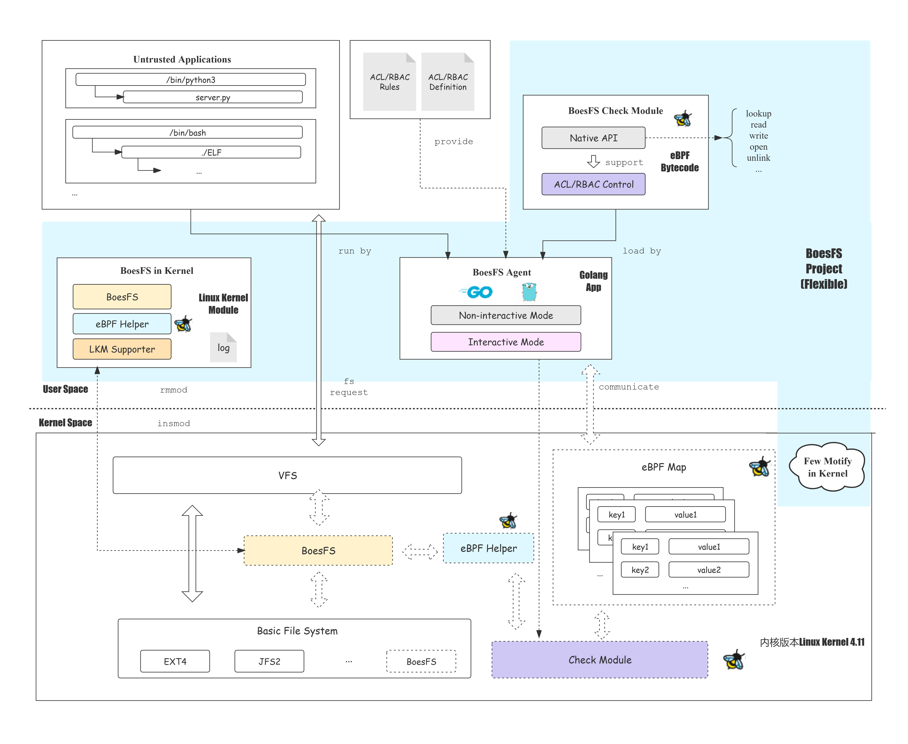

上图展示了BoesFS项目的组成结构，蓝色区域为BoesFS核心部分，主要包括：

- ①BoesFS-in-Kernel，在内核为BoesFS项目提供诸如参数采集和传递、审计日志、非法请求拦截等功能。
- ②BoesFS-Agent，基于C和Golang实现的双语言版本的BoesFS客户端，负责加载字节码，形成BoesFS沙盒环境、进程管理、用户交互等诸多功能。
- ③BoesFS-Check-Module，提供基本的API导出和ACL的实现，是安全检查规则的主要逻辑。
- ④Few-Motify-in-Kernel，为了能够实现BoesFS项目所需的eBPF功能，对原生Linux内核所做的必要的修改。

  具体详细的架构设计参考[架构设计文档](./Records/Docs/Develop/BoesFS项目架构和设计.md)。

#### 2.5 BoesFS-FaaS架构简述

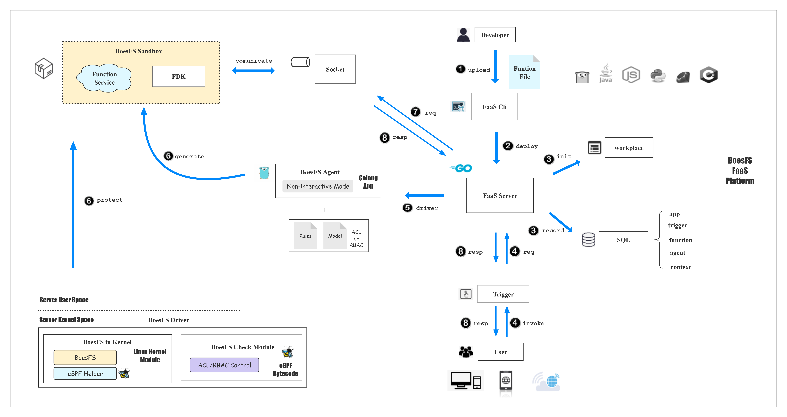

上图展示了BoesFS-FaaS的核心组件，主要包括：

- **BoesFS-Agent**。为接入主流的FaaS平台，我们对BoesFS-Agent进行了Golang语言移植和重构（BoesFS-Agent具备双语言，Golang和C）
- **BoesFS-Driver**。这是BoesFS项目位于内核的驱动部分，包括BoesFS-in-Kernel和BoesFS-Check-Module两个模块。BoesFS-Driver为BoesFS-FaaS的沙盒层提供文件保护的支持。
- **FaaS Cli**。FaaS Cli是BoesFS-FaaS的命令行触发部分。FaaS Cli提供了创建和部署函数服务的若干接口，用于和FaaS Server进行实时的交互。
- **FaaS Server**。FaaS Server是BoesFS-FaaS Platform的核心服务端，负责和其他组件进行交互，如SQL，FaaS Cli，Socket套接字文件，FDK与Function Service，BoesFS-Agent以及http事件等等。
- **FDK 和 Function Service**。Function Service是BoesFS-FaaS Platform运行的函数实例，FDK是为挂载该函数实例提供的语言工具集。形成的函数实例位于BoesFS Sandbox沙盒层，受到BoesFS Driver的保护和限制；同时通过Socket套接字和FaaS Server进行通信，接收函数请求和返回函数计算结果。

具体详细的BoesFS-FaaS设计请参考[BoesFS-FaaS开发文档](./Records/Docs/Develop/BoesFS-FaaS开发文档.md)。

### 三、项目目标

#### 3.1 基本目标

- [X] 目标1：使用 eBPF 技术实现 serverless场景的文件系统沙盒
- [X] 目标2：提供 fine-grained 的访问控制
- [X] 目标3：允许动态 (programmatic) 的自定义安全检查
- [X] 目标4：具备低性能开销
- [X] 目标5：安全且高性能的FaaS环境

#### 3.2 实现内容

项目小组基于对赛题的解读，相关背景知识的调研，和校内导师和项目导师充分交流后，确定项目的行动项包括：

- [X] **行动项1：开发环境编译**。在4.11内核版本，Debian 9发行版上编译内核，对内核做特定的定制，搭建BoesFS项目开发环境。
- [X] **行动项2：BoesFS文件系统的设计与实现**。基于内核文件系统，实现可结合eBPF技术的内核驱动层BoesFS-in-Kernel，采集VFS API参数，允许模块化等。
- [X] **行动项3：BoesFS代理端的设计与实现**。**初赛**采用熟悉的C语言快速实现用户代理层BoesFS-Agent(C)，向用户提供自定义检查的客户端。**决赛**采用Go语言进行重构BoesFS-Agent(Go)。
- [X] **行动项4：BoesFS的eBPF支持的设计与实现**。结合eBPF技术到BoesFS文件系统，定制BoesFS项目的eBPF字节码类型和帮助函数。
- [X] **行动项5：BoesFS的eBPF字节码的设计与实现**。结合eBPF的限制和特性，设计**eBPF字节码**，实现ACL和RBAC两种访问控制模型，支持20个VFS API，支持API参数匹配，为自定义安全规则提供支持。设计**eBPF Map**，根据上述需求以及优化逻辑，设计内核字节码BoesFS-Check-Module和BoesFS-Agent的交互数据结构eBPF Maps。
- [X] **行动项6：更优秀的安全审计系统实现**。增强BoesFS-in-Kernel层，添加文件请求数据采集输出，达到一定拒绝次数关闭程序的功能实现。增加Boes-Agent，实现进程运行时动态替换安全检查规则，优秀的动态性。
- [X] **行动项7：BoesFS项目测试**。对BoesFS进行文件系统角度的文件请求测试，对BoesFS沙盒的性能测试，对BoesFS沙盒进行访问能力控制测试。
- [X] **行动项8：BoesFS应用实现，BoesFS-FaaS Platform的设计与实现**。提供支持BoesFS沙盒环境的FaaS平台，满足自定义安全规则，高并发，高密集等FaaS需求。
- [X] **行动项9：BoesFS-FaaS项目测试**。对BoesFS-FaaS从FaaS服务的相关指标进行测试，并和业内和原生性能指标进行对比。

#### 3.3 初赛内容

* [X] 在4.11内核版本，Debian 9发行版上搭建BoesFS(Flexible)项目开发环境
* [X] 实现4.11支持BoesFS项目模块化的实现
* [X] 实现内核驱动层BoesFS的7个API的参数采集
* [X] BoesFS的eBPF类型注册和帮助函数实现
* [X] BoesFS-Agent的C语言版本快速实现
* [X] 安全检查模块Check Module的实现，访问控制模型ACL的简单实现
* [X] eBPF Map的设计
* [X] BoesFS简单的文件系统性能测试
* [X] BoesFS简单的访问控制能力测试

#### 3.4 决赛内容

* [X] **覆盖所有文件请求的BoesFS沙盒实现**。在BoesFS-in-Kernel，调研Linux内核全部VFS API，确定并实现内核驱动层BoesFS的20个API的参数采集。对应的，对BoesFS-Agent做了拓展和支持。初赛仅支持7个
* [X] **完整实现BoesFS-Check-Module访问控制模型**。完善初赛的简单ACL，实现参数匹配功能，实现RBAC访问控制模型。根据上述需求，设计eBPF Map，并实现了eBPF字节码。初赛仅实现简单的ACL。
* [X] **BoesFS-Agent双语言实践**。BoesFS-Agent(C)的Golang版本移植BoesFS-Agent(Go)的实现，Go语言便于进程管理优秀，简洁且便于后续维护，容易接入FaaS。初赛使用C语言快速开发。
* [X] **更优秀的安全审计系统实现，动态，日志，终止**。增加Boes-Agent，实现进程运行时动态替换安全检查规则，优秀的动态性。增强BoesFS-in-Kernel层，添加文件请求数据采集输出，达到一定拒绝次数关闭程序的功能实现。初赛没有实现类似功能，或者功能实现的demo有误。
* [X] **BoesFS系统性能优化**。使用perf定位分析系统瓶颈，BoesFS-in-Kernel的优化实现，BoesFS-Check-Module的字节码查询优化实现。初赛的性能开销为24%左右，决赛的性能开销为5%-7%左右。
* [X] **BoesFS应用实现，BoesFS-FaaS Platform的设计与实现**。提供支持BoesFS沙盒环境的FaaS平台，满足自定义安全规则，高并发，高密集等FaaS需求。
* [X] **BoesFS项目测试**。实现对BoesFS进行文件系统角度的文件请求测试，对BoesFS沙盒的性能测试，对BoesFS沙盒进行访问能力控制测试。初赛仅基于filebench做简单的一次测试，决赛基于多种方法filebench，内核源码压缩解压编译（extfuse和sandfs论文方法），top性能监测等多个维度展示了BoesFS项目性能。初赛功能测试仅对初赛的实现点测试，决赛的功能测试涵盖项目全部实现点。
* [X] **BoesFS-FaaS项目测试**。对BoesFS-FaaS从FaaS服务的相关指标进行测试，并和业内和原生性能指标进行对比。
* [ ] **更多使用方向和应用场景的探索的进行时**。在探索未来展望，比如有在开展网络和设备保护的调研和学习。

#### 3.5 未来展望

* [ ] 展望1：将BoesFS(Flexible)移植到Debian 11发行版，内核5.10上，实现BoesFS(Normal)，跨平台移植。
* [ ] 展望2：接入更多的实际运用场景，包括但不限于：1.安全检测功能。2.复杂场景下的智能IO请求控制。3.网络和文件设备保护的深入探索。4.构建文件请求的数据集，提供异常检测算法。
* [ ] 展望3：面向Serverless，探索更多和容器融合的方式，或许不是取代容器，相辅相成，实现更安全的容器。

### 四、完成情况

项目实现目标上的完成情况如下：

| 实现内容 | 完成情况 | 说明                                                                                                                                                                                                  |
| -------- | -------- | ----------------------------------------------------------------------------------------------------------------------------------------------------------------------------------------------------- |
| 目标1    | 全部完成 | ①结合eBPF技术和可堆叠文件系统，实现了覆盖全部Linux VFS的函数请求（20个API）的沙盒文件系统，BoesFS-in-Kernel。                                                                                        |
| 目标2    | 全部完成 | ①主体上，该文件系统沙盒能实现进程级别的细粒度访问控制。<br />②客体上，实现在VFS最底层对象(dentry等)级别的细粒度上对文件请求进行访问控制。                                                           |
| 目标3    | 全部完成 | ①支持三种自定义模式：原生字节码、ACL模式、RBAC模式。（均支持参数匹配）<br />②支持两种代理模式：提供交互和非交互两种模式。<br />③支持完全动态性。即使沙盒程序正在运行，也能进行安全检查规则的切换。 |
| 目标4    | 全部完成 | ①对BoesFS进行多维度的性能测试，BoesFS的性能开销仅在5%-7%以内。                                                                                                                                       |
| 目标5    | 全部完成 | ① 实现了以BoesFS沙盒为函数运行环境的BoesFS-FaaS，支持自定义安全规则。<br />②对BoesFS-FaaS进行并发测试，满足高性能，高并发，高密部署的FaaS需求。                                                     |

项目实现内容上，

| 实现内容 | 完成情况 | 说明                                                                                                                  |
| -------- | -------- | --------------------------------------------------------------------------------------------------------------------- |
| 行动项1  | 完成     | 项目开发环境的搭建，难点在于BoesFS对应的内核定制与编译。                                                              |
| 行动项2  | 完成     | 设计好了整个驱动层，阅读和调研了VFS所有API，确定和实现了20个VFS API的沙盒，覆盖全部VFS接口。                          |
| 行动项3  | 完成     | 实现了两语言版本的BoesFS-Agent，并将BoesFS-Agent（Go）成功接入FaaS。                                                  |
| 行动项4  | 完成     | 注册了新类型的eBPF字节码，实现项目字节码需求。                                                                        |
| 行动项5  | 完成     | 实现支持ACL、RBAC、参数匹配的eBPF字节码，设计了model map，dir map，file map，args map四种eBPF Map。                   |
| 行动项6  | 完成     | 实现完全动态，数据采集输出，关闭异常进程功能。                                                                        |
| 行动项7  | 完成     | 对BoesFS进行了多维度的性能测试，filebench文件系统测试，实际场景下的性能测试。对BoesFS完成功能测试、访问能力控制测试。 |
| 行动项8  | 完成     | 实现了基于BoesFS沙盒的FaaS平台。                                                                                      |
| 行动项9  | 完成     | 根据FaaS场景的需求，对BoesFS-FaaS平台进行了多维度测试。                                                               |

### 五、测试结果

#### 5.1 BoesFS功能测试

BoesFS沙盒功能测试的主要测试点如下：

- 正确拦截VFS所有文件请求
- ACL模式自定义安全规则
- RBAC模式自定义安全规则
- 支持参数匹配
- 支持运行时动态替换规则

我们针对不同的测试点，编写了系列测试用例，对BoesFS预期实现的访问控制功能进行了测试，测试结果如下：

| 测试用例     | 主要测试点                 | 通过情况 |
| ------------ | -------------------------- | -------- |
| 基础测试     | ACL模式和VFS操作拦截正确性 | PASS     |
| 动态替换测试 | 动态替换规则的正确性       | PASS     |
| 参数测试     | 拦截设定的参数正确性       | PASS     |
| RBAC基础测试 | 主体RBAC模式正确性         | PASS     |
| RBAC参数测试 | 客体及参数RBAC模式正确性   | PASS     |

BoesFS实现了项目目标预期的全部功能。关于BoesFS功能测试的测试样例和更详细的测试结果请参考：[BoesFS功能测试文档](./Records/Docs/Develop/BoesFS功能测试文档.md)

#### 5.2 BoesFS文件系统测试

对比native(EXT4)和BoesFS环境，基于filebench分别进行了文件系统测试，得到如下测试结果。

##### 5.2.1 不同文件请求分析

比较每种文件请求的每秒流操作数的差异，对于不同的文件请求，BoesFS的开销均在5%附近。

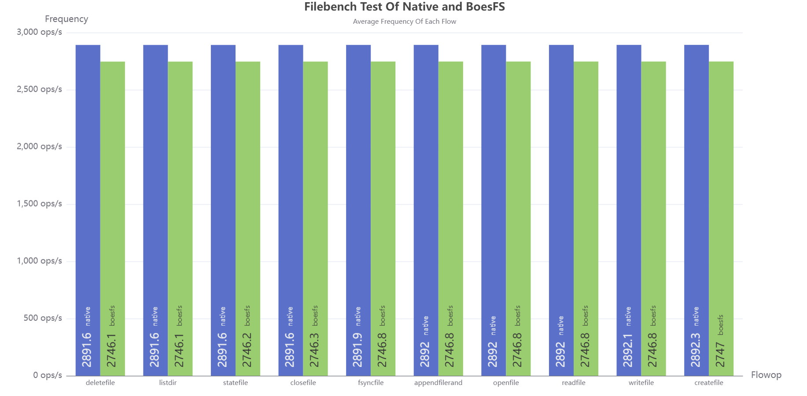

| flowop         | native (ops/s) | boesfs(ops/s) | compare |
| -------------- | -------------- | ------------- | ------- |
| deletefile     | 2891.6         | 2746.1        | 5.03%   |
| listdir        | 2891.6         | 2746.1        | 5.03%   |
| statfile       | 2891.6         | 2746.2        | 5.02%   |
| fsyncfile      | 2891.6         | 2746.3        | 5.02%   |
| appendfilerand | 2891.9         | 2746.8        | 5.01%   |
| openfile       | 2892           | 2746.8        | 5.02%   |
| closefile      | 2892           | 2746.8        | 5.02%   |
| readfile       | 2892           | 2746.8        | 5.02%   |
| writefile      | 2892.1         | 2746.8        | 5.02%   |
| createfile     | 2892.3         | 2747          | 5.02%   |

##### 5.2.2 总体平均指标分析

在性能指标的选择上，我们考虑如下三个性能测试指标：

| 性能指标                | 选择原因                                                     |
| ----------------------- | ------------------------------------------------------------ |
| 每秒流操作数（ops/s）   | 流操作执行速度体现文件系统请求和处理文件请求的能力           |
| IO总带宽（mb/s）        | IO总带宽体现文件系统和底层设备交互和文件系统请求处理上的能力 |
| 流操作响应时间（ms/op） | 流操作响应时间体现文件系统响应文件请求的能力                 |

**① 总体平均每秒流操作数**

分别对Native和BoesFS进行10次filebench测试，得到总体平均每秒流操作数的数据如下图所示。

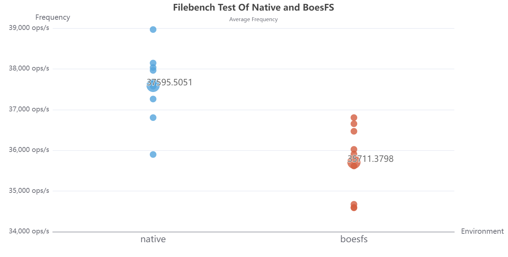

|                        |   native   |   boesfs   | 开销 |
| :---------------------: | :--------: | :--------: | :---: |
| 平均每秒流操作数(ops/s) | 37595.5051 | 35711.3798 | 5.01% |

native平均每秒流操作数为 37595.5051 ops/s，boesfs的为35711.3798 ops/s，10次测量结果均在均值上下小范围的正常波动。BoesFS的开销约在5.01%。

**② 总体平均IO带宽**

分别对Native和BoesFS进行10次filebench测试，得到总体平均平均IO带宽的数据如下图所示。

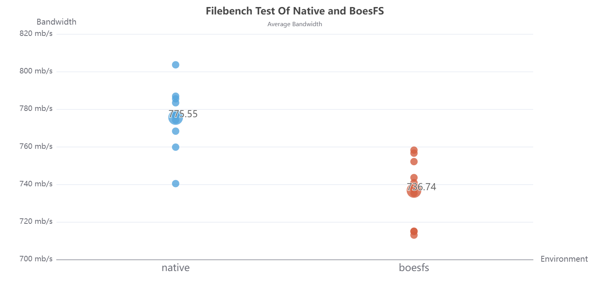

|                  | native | boesfs | 开销 |
| :--------------: | :----: | :----: | :---: |
| 平均IO带宽(mb/s) | 775.55 | 736.74 | 5.01% |

native平均IO带宽为775.55mb/s，boesfs的为736.74mb/s。BoesFS的开销约在5.01%。

**③ 总体流操作响应时间**

分别对Native和BoesFS进行10次filebench测试，得到总体平均平均IO带宽的数据如下图所示。

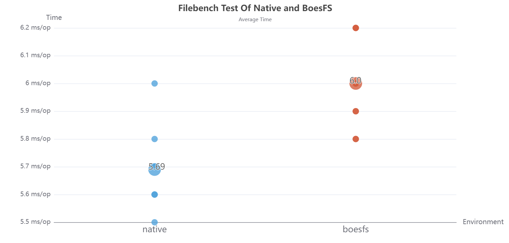

|                            | native | boesfs | 开销 |
| :------------------------: | :----: | :----: | :---: |
| 平均流操作响应时间(ms/ops) |  5.69  |   6   | 5.48% |

native平均流操作响应时间为5.69ms/ops，boesfs为6ms/ops。BoesFS的开销约在5.48%。

**④ 总结**

总结上述总体平均指标，得到如下表格：

| I/O Summary                | native     | boesfs     | compare |
| -------------------------- | ---------- | ---------- | ------- |
| 平均流操作响应时间(ms/ops) | 5.69       | 6.00       | 5.48%   |
| 平均带宽(mb/s)             | 775.55     | 736.74     | 5.01%   |
| 平均每秒流操作数 (ops/s)   | 37595.5051 | 35711.3798 | 5.01%   |

平均流操作响应时间、平均每秒流操作数、平均IO带宽3个指标，损耗均为5%上下。

#### 5.3 BoesFS性能测试

对比native(EXT4)和BoesFS环境，基于Linux 4.19内核源码的压缩、解压、编译（tiny）的三种实际大IO量的场景下，分别进行了性能测试，得到如下测试结果。

**① 压缩内核源码测试**

通过对boesfs环境和native环境连续进行10次压缩测试，得到的散点图如下：


|              | native | boesfs | 开销 |
| :-----------: | :----: | :----: | :---: |
| 平均耗时(sec) | 82.31 | 87.23 | 5.98% |

native环境的平均耗时为82.31s，boesfs环境的平均耗时为87.23s，两者的耗时均值均值上下有较小的波动，计算得到的开销为5.98%。

**② 解压缩内核源码测试**

通过对boesfs环境和native环境连续进行10次解压缩测试，得到的散点图如下：

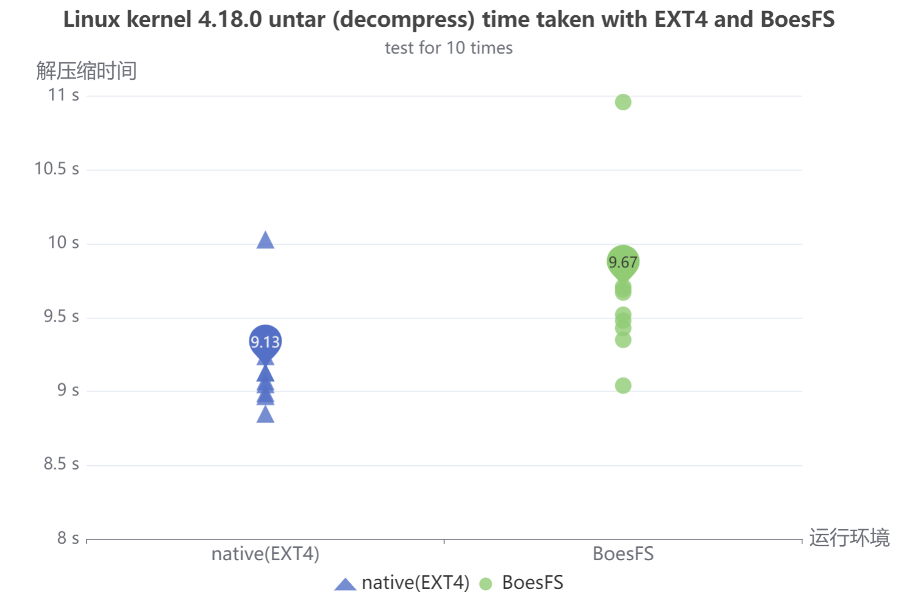

|              | native | boesfs | 开销 |
| :-----------: | :----: | :----: | :---: |
| 平均耗时(sec) |  9.13  |  9.67  | 5.91% |

native环境的平均耗时为9.13s，boesfs环境的平均耗时为9.67s，两者的耗时均值均值上下有较小的波动，计算得到的开销为5.91%。

**③ 编译内核源码测试**

通过对boesfs环境和native环境连续进行10次编译测试，得到的散点图如下：

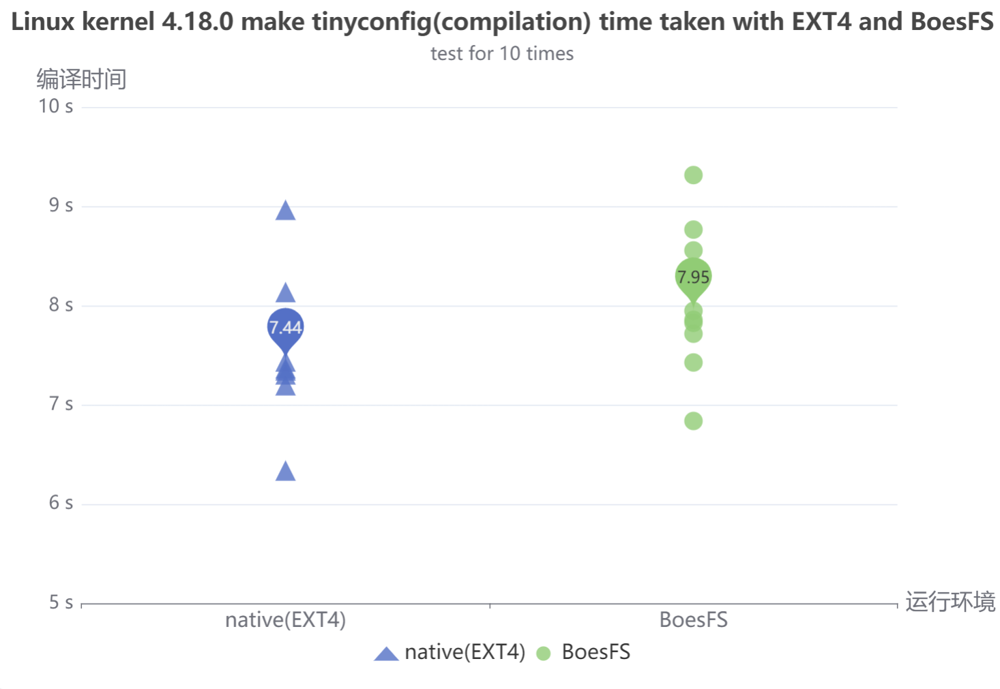

|              | native | boesfs | 开销 |
| :-----------: | :----: | :----: | :---: |
| 平均耗时(sec) |  7.44  |  7.95  | 6.85% |

native环境的平均耗时为7.44s，boesfs环境的平均耗时为7.95s，两者的耗时均值均值上下有较小的波动，计算得到的开销为6.85%。

**④ 总结**

总体的测试结果如下图所示：


|                    | native | boesfs | 开销 |
| :-----------------: | :----: | :----: | :---: |
|  压缩平均耗时(sec)  | 82.31 | 87.23 | 5.98% |
| 解压缩平均耗时(sec) |  9.13  |  9.67  | 5.91% |
|  编译平均耗时(sec)  |  7.44  |  7.95  | 6.85% |

在boesfs环境下，对Linux内核4.19.280源码的操作效率略慢于native环境。在压缩、解压、编译的三种场景下，boesfs环境均只比native环境增加了不到7%的开销，也就是说，BoesFS对文件操作的处理效率仅比EXT4的处理速率慢了不到7%。

与一些其他传统的安全访问控制方法的开销进行对比，以①SCI（基于PTRACE），②用户态沙盒（基于FUSE）为例，可以看到基于eBPF和WrapFS内核态文件系统的方式有很好的性能优势。

| 安全访问控制方式 | 基于的方式                 | 性能开销 |
| ---------------- | -------------------------- | -------- |
| SCI              | PTRACE                     | <50%     |
| 用户态沙盒       | FUSE用户态文件系统         | <80%     |
| BoesFS           | eBPF、WrapFS内核态文件系统 | 5%-7%    |

关于BoesFS文件系统测试和BoesFS性能测试的更详细内容请参考：[BoesFS性能测试文档](./Records/Docs/Develop/BoesFS性能测试文档-决赛.md)

#### 5.4 BoesFS-FaaS响应与性能测试

FaaS场景下通常需要满足如下需求：

**高速**。FaaS创建函数服务，运行并得到结果的速度要快，满足客户的快速响应需求。

**高频**。当负载集中爆发，FaaS平台需要支持高并发，同时处理多个全部请求。

**高密**。一个计算节点上的FaaS平台应当部署尽可能多的函数，以达到资源的最大化利用。

我们选取了如下指标进行测试：

① 单个函数部署的时间

② 单个函数服务响应的时间

③ 高并发条件下的资源消耗

##### 5.4.1 单个函数部署的时间

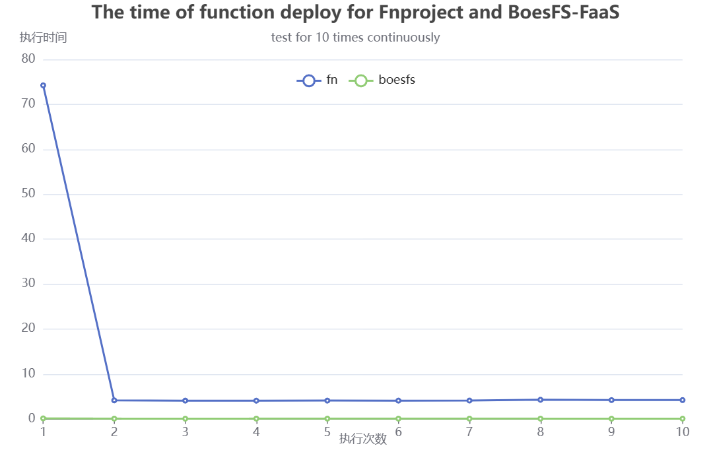

可以看到基于docker的fnproject在第一次部署时，必须拉取和构建docker镜像，耗时很高，为74.223s。后续第二次部署时，也要4.136s。而boesfs-faas无需docker镜像，只需动态安装boesfs内核模块，能实现实时交付。

##### 5.4.2 单个函数服务响应的时间

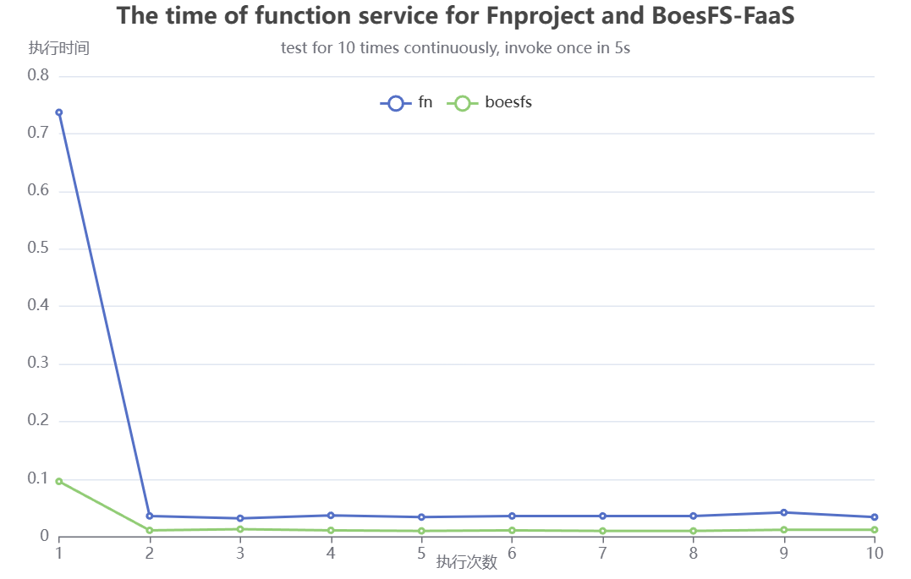

|                     | boesfs-faas | fnproject | 时间开销降低 |
| ------------------- | ----------- | --------- | ------------ |
| 冷启动耗时(sec)     | 0.096       | 0.737     | 87.0%        |
| 热启动平均耗时(sec) | 0.011s      | 0.034     | 67.6%        |
| 平均耗时(sec)       | 0.0196s     | 0.106s    | 81.5%        |

当触发间隔为5s时，第一次均为冷启动，后续均为热启动。冷启动boesfs-faas只需0.096s，fnproject需要0.737s，降低87.0%。从第二次往后均为热启动，平均热启动boesfs-faas只需0.011s，fnproject需要0.034s，降低67.6%。总体上，10次平均响应时间，boesfs为0.0196s，fnproject为0.106s，降低81.5%。

总体上，触发时间为5s时，第一次冷启动，后续热启动，boesfs-faas的响应速度均快于fnproject。

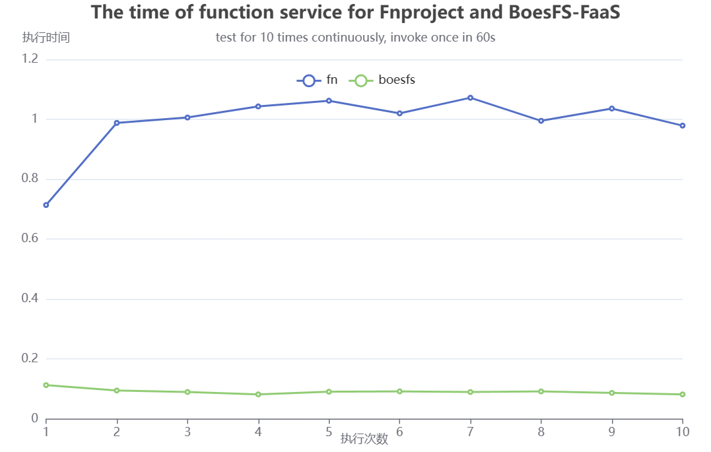

|                     | boesfs-faas | fnproject | 时间开销降低 |
| ------------------- | ----------- | --------- | ------------ |
| 冷启动平均耗时(sec) | 0.091       | 0.991     | 90.8%        |

当触发间隔为60s时，fnproject和boesfs-faas均处于冷启动状态。总体上，触发间隔为60s时，只考虑冷启动，boesfs-faas的响应速度快于fnproject。时间平均开销降低90.8%。

##### 5.4.3 高并发条件下的资源消耗

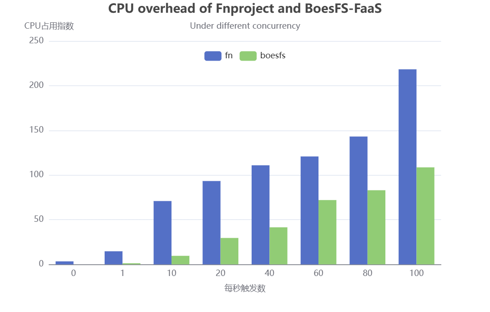

随着每秒触发数的增加，两者的CPU开销均增加，但BoesFS-FaaS的CPU开销始终低于Fnproject。

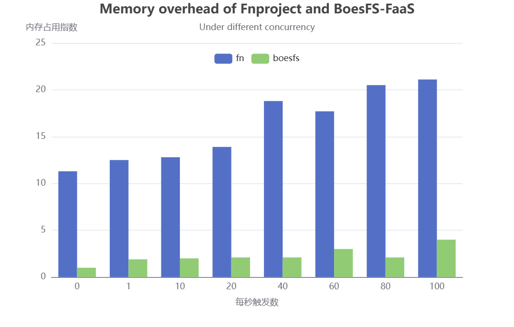

根据上图，不同的每秒触发数下，BoesFS-FaaS的内存开销始终低于Fnproject。

关于BoesFS-FaaS响应和性能测试的更详细内容请参考：[BoesFS-FaaS性能测试文档](./Records/Docs/Develop/BoesFS-FaaS测试文档.md)

#### 5.5 BoesFS访问能力控制测试

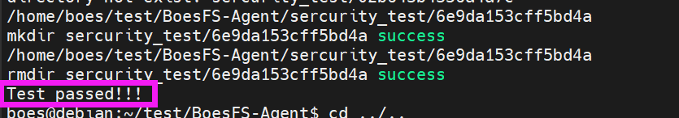

在访问控制测试中，在随机生成的目录树下，根据随机生成的ACL规则，所有生成文件访问请求都被正确的按照ACL的逻辑进行了放行或者拦截，准确率为100%，访问控制测试全部通过。初赛阶段的BoesFS已经能够正确的实现进程级别的访问控制粒度的文件请求的ACL的逻辑，拦截ACL所不允许的所有非法文件请求，具备优秀的访问控制能力，达到预期的初赛访问控制能力的要求。

访问控制测试详细内容请参考：[BoesFS访问控制测试文档](./Records/Docs/Develop/BoesFS访问控制测试文档.md)

#### 5.6 字节码优化的perf分析

 由于字节码中用于查询父目录规则的函数boesfs_acl_dfs_path，是调用频率较高， 并且用于实现ACL的核心函数；而鉴于初赛时实现的较为简易，故决赛我们对其进行分析和优化。

我们主要基于perf工具进行分析，perf是Linux下的一款性能分析工具，能够进行函数级与指令级的热点查找。分析结果如下：

##### 5.6.1 开销占比分析

优化前：

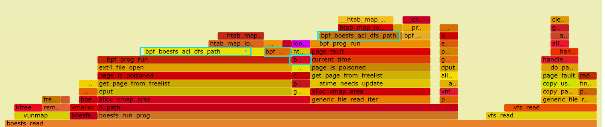

可以看到boesfs_read的一大半时间都在boesfs_run_prog运行字节码，而其中 占 比 较 大 的 就 是 我 们 实 现 的 bpf_boesfs_acl_dfs_path ， 可 以 看 到 此 时 boesfs_run_prog占据boesfs_read的占比约有 : 0.34/0.55=61.8%。

优化后：

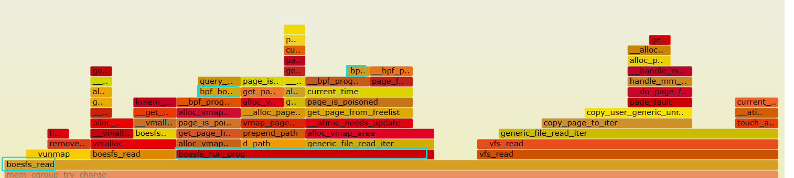

可以看到实现之后，字节码运行(boesfs_run_prog)占据boesfs_read的时间占 比减小，从图中可以看出其中主要是因为bpf_boesfs_acl_dfs_path占比明显减小。 此时字节码运行时间(boesfs_run_prog)占据boesfs_read的 0.10/0.31 = 32.3%。

##### 5.6.2 运行时间分析

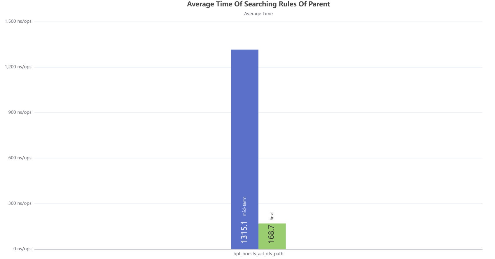

| API                          | 初赛   | 决赛  | 开销  |
| ---------------------------- | ------ | ----- | ----- |
| boesfs_acl_dfs_path (ns/ops) | 1315.1 | 168.7 | 87.2% |

可以看到实现之后，字节码运行(boesfs_run_prog)占据boesfs_read的时间占 比减小，从图中可以看出其中主要是因为bpf_boesfs_acl_dfs_path占比明显减小。 此时字节码运行时间(boesfs_run_prog)占据boesfs_read的 0.10/0.31 = 32.3%

### 六、功能展示


[演示视频链接](https://pan.baidu.com/s/1mEBAM9TMiAO5cH79-8mK-A?pwd=pzwj)

### 七、项目文档 / BoesFS Pages

#### 决赛文档PDF

[BoesFS设计开发文档（决赛）](./BoesFS设计开发文档（决赛）.pdf)

#### BoesFS Pages

- 1 项目索引

  - [1.1 BoesFS项目代码](./Code)
  - [1.2 BoesFS项目测试代码](./Code/test)
  - [1.3 项目问题寻求帮助](./Records/QA)
  - [1.4 项目每周会议纪要](./Records/Meeting-Minutes)
  - 1.5 BoesFS项目维护仓库
    - [1.5.1 BoesFS · GitLab 比赛验收仓库](https://gitlab.eduxiji.net/202318123111316/project1466467-176078)
    - [1.5.2 BoesFS · Gitee 日常开发仓库](https://gitee.com/yang-darong/boesfs)
- [2 项目内容](./Records/Docs/Task)

  - [2.1 项目介绍](./Records/Docs/Task/项目介绍.md)
  - [2.2 项目分工情况](./Records/Docs/Task/项目分工.md)
  - [2.3 项目进度同步](./Records/Docs/Task/进度同步.md)
- [3 项目过程中资料调研和学习](./Records/Docs/Note)

  - [3.1 ebpf技术调研学习](./Records/Docs/Note/ebpf.md)
  - [3.2 Wrapfs文件系统代码分析](./Records/Docs/Note/wrapfs.md)
  - [3.3 Sandfs文件系统分析](./Records/Docs/Note/sandfs.md)
  - [3.4 Linux内核相关内容学习](./Records/Docs/Note/kernel.md)
  - [3.5 serverless和Faas场景相关内容](./Records/Docs/Note/serverless.md)
  - [3.6 文件系统测试相关内容学习](./Records/Docs/Note/testbench.md)
  - [3.7 perf性能分析学习](./Records/Docs/Note/perf.md)
  - [3.8 FaaS测试相关内容学习](./Records/Docs/Note/RunD.md)
  - [3.9 传统安全手段secccomp学习](./Records/Docs/Note/seccomp-bpf.md)
  - [3.10 设备和网络文件保护调研学习](./Records/Docs/Note/file.md)
  - [3.11 核心调研概要总结](./Records/Docs/Develop/BoesFS调研概要.md)
- [4 BoesFS项目开发和设计](./Records/Docs/Develop/)

  - [4.1 BoesFS项目架构与设计](./Records/Docs/Develop/BoesFS项目架构和设计.md)
  - [4.2 BoesFS项目环境搭建](./Records/Docs/Develop/BoesFS项目环境搭建.md)
  - 4.3 BoesFS模块设计与实现
    - [4.3.1 BoesFS-Agent模块设计开发文档](./Records/Docs/Develop/BoesFS-Agent开发文档.md)
    - [4.3.2 BoesFS-in-Kernel模块设计开发文档](./Records/Docs/Develop/BoesFS-in-Kernel开发文档.md)
    - [4.3.3 BoesFS-Check-Module模块设计开发文档](./Records/Docs/Develop/BoesFS-Check-Module开发文档.md)
    - [4.3.4 Few-Motify-in-Kernel模块设计和开发文档](./Records/Docs/Develop/Few-Motify-in-Kernel开发文档.md)
    - [4.3.5 BoesFS-FaaS模块设计和开发文档](./Records/Docs/Develop/BoesFS-FaaS开发文档.md)
- 5 BoesFS项目测试

  - [5.1 BoesFS功能测试文档](./Records/Docs/Develop/BoesFS功能测试文档.md)
  - [5.2 BoesFS性能测试文档](./Records/Docs/Develop/BoesFS性能测试文档-决赛.md)
  - [5.3 BoesFS-FaaS测试文档](./Records/Docs/Develop/BoesFS-FaaS测试文档.md)
  - [5.4 BoesFS-perf分析文档](./Records/Docs/Develop/BoesFS-perf优化分析文档.md)
  - [5.5 BoesFS访问控制测试文档](./Records/Docs/Develop/BoesFS访问控制测试文档.md)
  - [5.6 BoesFS规则能力分析文档](./Records/Docs/Develop/BoesFS规则能力分析文档.md)
- [6 BoesFS使用手册](./Records/Docs/Develop/BoesFS使用手册.md)
- [7 BoesFS项目开发过程遇到的困难](./Records/Docs/Develop/BoesFS项目开发遇到的困难.md)

### 八、目录索引

```shell
.
├── Code # 项目代码
│   ├── BoesFS-Agent # BoesFS客户端C语言代码
│   ├── BoesFS-Check-Module # BoesFS安全检查规则代码
│   ├── BoesFS-in-Kernel # BoesFS内核模块代码
│   ├── Few-Motify-in-Kernel # BoesFS修改内核文件的少量代码
│   ├── BoesFS-FaaS # BoesFS的FaaS功能代码
│   └── test # 测试代码
├── LICENSE
├── README.md
├── Records # 比赛过程中的所有记录文件
│   ├── Docs # 开发文档、项目管理文档、笔记和总结
│   │   ├── images
│   │   ├── Develop # 开发文档
│   │   ├── Note # 项目笔记和总结
│   │   ├── Task # 项目管理文档
│   │   └── README.md
│   ├── Meeting-Minutes # 会议纪要
│   ├── QA # 问题和回答
│   ├── README.md
│   ├── Reference # 参考资料
│   └── Report # 项目汇报文件
└── images
```
