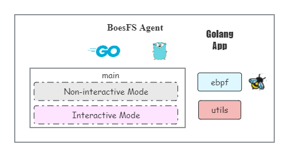
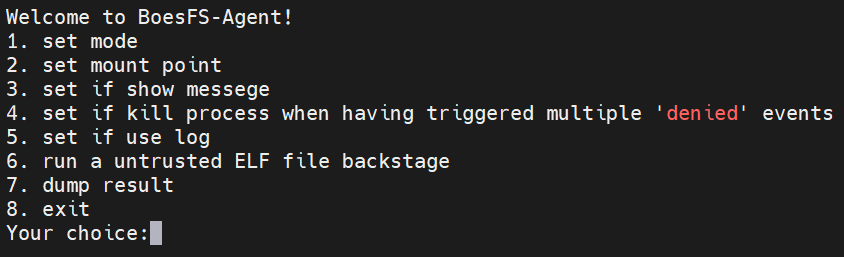
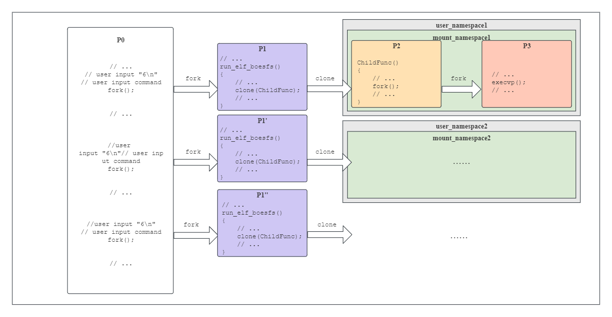

# BoesFS-Agent开发文档

## 概述


BoesFS-Agent是BoesFS项目的用户态程序部分，由C/go编写而成，最终编译为一个二进制可执行文件。BoesFS-Agent为BoesFS项目提供了包括如下支持：

- **提供可视化的交互页面**。BoesFS-Agent为用户提供了交互模式和非交互模式，其中交互模式拥有可视化的交互页面，包括菜单，用户输入行等内容，方便用户能够随时变更参数。
- **提供便捷的非交互模式**。BoesFS-Agent的非交互模式允许用户在命令行指定参数，只要用户指定的参数满足BoesFS-Agent的设定，就能够便捷地在命令行查看不可信二进制程序的运行情况。
- **可在后台运行不可信二进制程序**。BoesFS-Agent的交互模式支持在运行不可信二进制程序前，创建一个与主进程并行的进程来运行不可信二进制程序，并修改该进程的输出流，从而是不可信二进制程序在后台运行。
- **任意用户可加载BoesFS-Check-Module**。BoesFS-Agent实现了能够根据BoesFS-Check-Module中的SEC("boesfs")识别出新加入的BPF_PROG_TYPE_BOESFS类型的的功能，并支持任意用户能够使用该功能。
- **acl模式规则载入**。BoesFS-Agent支持ACL模式，能够根据BoesFS-Check-Module提供的接口，将用户自定义的ACL模型和策略存入BoesFS-Check-Module对应的bpf map中，从而进行安全访问控制；在决赛的开发中，BoesFS-Agent还提供了动态替换ACL规则的功能，即在不可信二进制程序运行的过程中，能够替换新的ACL规则。
- **rbac模式规则载入**。该模式在决赛开发中加入，BoesFS-Agent支持RBAC模式，能够根据BoesFS-Check-Module提供的接口，将用户自定义的RBAC模型和策略经过解析，根据当前环境转换为ACL模型和策略，并存入BoesFS-Check-Module对应的bpf map中，从而进行安全访问控制；该模式同样被设计了重新载入的功能。
- **提供隔离的挂载环境**。BoesFS-Agent在运行不可信二进制程序前，能够通过Linux的namespace机制创建一个隔离的环境，使boesfs文件系统的挂载与卸载不会影响到环境以外，同时多个运行不可信二进制程序的进程也相互隔离。
- **提供和BoesFS-in-Kernel交互的接口**。BoesFS-Agent在挂载boesfs文件系统，通过mount操作创建一个文件系统沙盒层时，向BoesFS-in-Kernel传递操作参数选项，从而完成BoesFS-in-Kernel的初次设置。
- **控制运行不可信二进制程序进程的能力**。BoesFS-Agent在创建运行不可信二进制程序的进程后，会修改该进程的capability，控制该进程的能力，进一步对它安全控制。
- **bpf map用户态控制封装**。BoesFS-Agent使用结构体去维护生成的bpf prog文件和bpf map文件的文件描述符，因此也封装了控制bpf map的函数。

## 安装方法

安装命令：在BoesFS-Agent下执行

```shell
make
```

即可自动编译安装整个BoesFS-Agent

## 设计思路

在初赛中，整个BoesFS-Agent的设计主要集中在3个方面，分别是如何载入bpf prog程序、如何读取ACL文件到bpf map中以及非特权用户如何隔离地将沙盒文件系统挂载到指定的目录下，其他方面都是对BoesFS-Agent功能的完善（比如输出交互模式菜单，交互模式获取输入等）。而读取ACL文件到bpf map中虽然比较繁琐，但逻辑简单，只需通过BoesFS-Check-Module的需求将文件中相应的内容通过字符串匹配来解析填入bpf map中即可，因此本部分主要介绍如何解决另外两个问题。

**如何载入bpf prog程序**。在Linux源码中，samples/bpf目录下存在一个名为bpf_load.c的函数，其提供了 `load_bpf_file()`等接口以供载入bpf prog程序。但是由于BoesFS的PROG TYPE原本在内核中是不存在的，因此需要对该bpf_load.c文件做出修改，使编译过后的bpf_load中的函数能够根据bpf prog程序中的SEC("boesfs")识别出新加入的BPF_PROG_TYPE_BOESFS类型，从而将bpf prog程序载入到ebpf虚拟机中。

**非特权用户如何隔离地将沙盒文件系统挂载到指定的目录下**。为了让任意用户均可运行BoesFS，BoesFS必须被设计成允许任意用户完成BoesFS-Agent的所有功能。然而非特权用户是没有权限对文件系统进行挂载和卸载的，也没有权限对自己的capability进行管理。同时我们需要创建一个隔离的环境，使运行不可信二进制文件时，该进程的挂载目录下的文件操作会被进行检查，而环境以外的进程不受影响。BoesFS采用的解决办法是采用user namespace里创建mount namespace的策略：在创建user namespace后，进程立刻拥有了全部capability，同时也拥有了创建mount namespace和挂载卸载文件系统的权限；此时让进程创建一个mount namespace再进入其中挂载文件系统boesfs，就能够与该环境以外的进程隔离开来，并能够进行安全检查。

在决赛中，整个BoesFS-Agent的设计主要有2个方面，分别是如何动态替换acl/rbac规则和怎样把rbac规则转换为acl规则，其他的设计都是对初赛中设计的小修改（比如实现新的目录查找逻辑等）。

**动态替换acl/rbac规则**。动态替换的功能仅设计在交互模式中，因为非交互模式被设计成更多地用于执行需要输入的不可信二进制程序，无法动态替换acl/rbac规则。由于bpf map中的索引并不统一，并且若记录下所有的键，会占用太多的存储空间。因此Boesfs-Agent为了将bpf map清空，在替换acl规则前直接将bpf map释放；而bpf map是在加载bpf prog的时候分配的，因此Boesfs-Agent需要卸载boesfs文件系统，从而释放bpf prog。为了防止在卸载boesfs文件系统和重新挂载回去的时间段内不可信二进制程序出现文件操作，在卸载前，Boesfs-Agent将停止所有在沙盒下正在运行的进程。在重新加载acl规则后，Boesfs-Agent才会唤醒刚刚停止的进程。

**把rbac规则转换为acl规则**。出于若bpf prog过大，就会无法在ebpf栈中分配空间的考虑，Boesfs-Agent被设计承担把rbac规则转换为等价的acl规则的功能，从而让BoesFS-Check-Module能够在只实现ACL模式的情况下运行。出于时间关系，Boesfs-Agent只用较为简陋的方法进行设计，只设计了不可信二进制程序名作为角色和文件操作的类型和参数作为角色的rbac模式。当以不可信二进制程序名作为角色时，Boesfs-Agent将根据当前要执行的不可信二进制程序名来匹配角色，并将所有匹配到的角色的规则作为ACL规则；当以文件操作的类型和参数作为角色时，Boesfs-Agent将每条要写入的ACL规则中的角色，拆分成多条该角色对应的所有文件操作的类型和参数的规则，并将它们所有写入bpf map中。

## 主程序

该部分对应架构图中的main部分，该部分使用BoesFS-Agent其他部分实现的功能有：①**提供可视化的交互页面**；②**提供便捷的非交互模式**。

BoesFS-Agent会从main部分启动，BoesFS-Agent通过解析用户输入的命令来区分用户使用哪种模式:

* 在带参数的情况下，程序将进入非交互模式（non-interactive mode），在该模式下，程序只会根据用户提供的参数运行并挂载一个boesfs文件系统到用户指定的目录，并执行用户指定的二进制程序直到运行完毕或用户取消操作，具体情况将在非交互模式中叙述。
* 在不带参数的情况下，程序将进入交互模式（interactive mode），在该模式下，程序会展示一个带有菜单栏的交互界面，方便用户根据选项来设置运行二进制程序时的各种参数，并且让二进制程序于后台运行，当用户想要得到二进制程序的执行情况时，可以在交互界面读取保存了函数执行情况的文件，具体情况将在交互模式中叙述。

## 工具函数集

该部分对应架构图中的utils部分，该部分实现的功能为**控制运行不可信二进制程序进程的能力**；同时该部分为以下功能提供了工具函数作为支持：①**提供可视化的交互页面**；②**提供便捷的非交互模式**；③**提供隔离的挂载环境**；④**acl模式规则载入**；⑤**rbac模式规则载入**。

实现**控制运行不可信二进制程序进程的能力**时，BoesFS-Agent采取的策略是直接修改进程对应的capability结构体。在设计上，为了隔离的挂载环境，运行不可信二进制程序的进程继承了其父进程的capability，而其父进程又是对应的user namespace的第一个进程，这导致这对父子进程都拥有这个user namespace的全部capability。为了确保安全，BoesFS-Agent需要将该进程的capability清空，而正好该进程拥有全部的capability，包括设置capability的能力，因此在工具函数集部分定义了一个设置当前进程的结构体的函数，以供interact和non_interact进程调用。

| 函数名                | 作用                         | 参数 | 返回值 |
| --------------------- | ---------------------------- | ---- | ------ |
| void reset_caps(void) | 设置当前进程的capability为空 | 无   | 无     |

为**提供可视化的交互页面**提供支持。由于可视化的交互页面需要的输入输出较多，为了更加清晰地编写和检查主逻辑。utils定义了一系列获取输入的函数和用于输出的函数，设计的输入输出定义如下：

| 函数名                                          | 作用                                       | 参数                                                    | 返回值                              |
| ----------------------------------------------- | ------------------------------------------ | ------------------------------------------------------- | ----------------------------------- |
| int create_file(char *path)                     | 在指定的路径下创建文件                     | path：要创建的文件的路径名                              | 成功：0；失败：1                    |
| void info(const char *str)                      | 向标准输出流打印一条字符串                 | str：要打印的字符串                                     | 无                                  |
| void get_command(char *dst)                     | 从标准输入流获取一条用户输入的命令         | dst：用于存放用户输入的命令                             | 无                                  |
| int get_filename(char *command, char *filename) | 从命令中提取要运行的文件名                 | command：被提取的源命令；filename：用于存放得到的文件名 | 成功：0；失败：1                    |
| void get_path(const char *str, char *path)      | 从标准输入流读取一条路径并检查是否能够访问 | str：提示用户输出的字符串；path：用于存放得到的路径     | 无                                  |
| void dump_file(char *file)                      | 向标准输出流打印整个文件里的内容           | file：文件的路径                                        | 无                                  |
| int get_num(const char* str)                    | 从标准输入流获取用户输入的数字（仅0~9999） | str：提示用户输出的字符串                               | 用户输入的实际数字                  |
| int get_yn(const char* str)                     | 从标准输入流获取用户的yes或no选择          | str：提示用户输出的字符串                               | 用户输入y/Y/回车：1；用户输入n/N：0 |
| int get_choice(void)                            | 从标准输入流获取用户的菜单选择（仅1-9）    | 无                                                      | 用户输入的一位数                    |
| void menu(void)                                 | 向标准输出流打印交互界面的菜单             | 无                                                      | 无                                  |
| void check_access(char *dir)                    | 检查路径是否能够被访问                     | dir：要检查的路径                                       | 无                                  |

在决赛的开发过程中，由于加入了动态替换acl/rbac规则的功能，修改了相应的函数 `menu()`和 `get_choice()`

为**提供便捷的非交互模式**提供支持。非交互模式不需要用户在运行BoesFS-Agent后进行输入，却仍有较多的输出，因此在工具函数集中也为非交互模式提供了函数，设计的输出定义如下：

| 函数名                             | 作用                                 | 参数                  | 返回值 |
| ---------------------------------- | ------------------------------------ | --------------------- | ------ |
| void usage(char *pname)            | 打印BoesFS-Agent非交互模式的使用方法 | pname：要显示的文件名 | 无     |
| void display_creds_and_caps(void)  | 向标准输出流打印当前进程的capability | 无                    | 无     |
| void print_mount_points(void)      | 向标准输出流打印当前系统的所有挂载点 | 无                    | 无     |
| void print_status(const char *msg) | 向标准输出流打印当前状态下的进程信息 | msg：要打印的信息标题 | 无     |

在**提供隔离的挂载环境**时，由于在创建user namespace后，BoesFS-Agent需要通过修改相关文件的方式去修改进程在user namespace的映射，因此工具函数集在修改文件的方面定义了几个工具函数以供使用，文件操作函数的定义如下：

| 函数名                                                       | 作用                                              | 参数                                                                                           | 返回值            |
| ------------------------------------------------------------ | ------------------------------------------------- | ---------------------------------------------------------------------------------------------- | ----------------- |
| int setgroups_control(pid_t pid, int action)                 | 修改/proc/pid/setgroups的内容为设定的值           | pid：要修改的文件对应的进程号；action：要修改的值                                              | 成功：0；失败：-1 |
| int update_map(char *mapping, char *map_file)                | 修改/proc/pid/map_file的内容为设定的值            | mapping：要修改的值；map_file：要修改的map文件路径                                             | 成功：0；失败：-1 |
| int update_uid_map(pid_t pid, int inside_id, int outside_id) | 修改/proc/pid/uid_map，使进程的uid被映射到外部uid | pid：要修改的文件对应的进程号；inside_id：要被映射的内部uid号；outside_id：要映射到的外部uid号 | 成功：0；失败：-1 |
| int update_gid_map(pid_t pid, int inside_id, int outside_id) | 修改/proc/pid/gid_map，使进程的gid被映射到外部gid | pid：要修改的文件对应的进程号；inside_id：要被映射的内部gid号；outside_id：要映射到的外部gid号 | 成功：0；失败：-1 |

在决赛的开发过程中，为了配合Boesfs-FaaS的接入，修改了相应的函数 `update_uid_map()`和 `update_gid_map()`

**acl模式规则载入**和**rbac模式规则载入**需要对用户的文件内容进行处理，为了不让读取函数过于冗长和方便后续hook的函数api的添加，工具函数集中提供了两个函数以供acl模式规则载入使用，函数如下：

| 函数名                     | 作用                         | 参数                | 返回值                       |
| -------------------------- | ---------------------------- | ------------------- | ---------------------------- |
| int check_op(char *str)    | 根据传入的字符串读取操作类型 | str：要识别的字符串 | 成功：操作类型的值；失败：-1 |
| void str_handle(char *str) | 将字符串的空格去掉并去掉回车 | str：要处理的字符串 | 无                           |

在决赛的开发过程中，由于扩充了Boesfs文件系统检查的api，修改了相应的函数 `check_op()`

## 交互模式（interactive mode）


该部分对应架构图中的interact部分，该部分实现的功能包括：①**提供可视化的交互页面**；②**可在后台运行不可信二进制程序**；③**提供隔离的挂载环境**；④**提供BoesFS-in-Kernel交互的接口**。
该部分使用BoesFS-Agent其他部分实现的功能有：①**任意用户可加载BoesFS-Check-Module**；②**acl模式规则载入**；③**控制运行不可信二进制程序进程的能力**；④**bpf map用户态控制封装**；⑤**rbac模式规则载入**。

#### 启动命令

启动交互模式的命令非常简单，它需要用户不指定各种参数来运行安装后生成boesfs二进制程序，启动命令如下：

```shell
./boesfs
```

#### 运行逻辑实现

**BoesFS-Agent程序信息的储存与维护**。为了方便使用各种信息，BoesFS-Agent在交互的循环外维护了一个静态的结构体，用于记录用户设置的各个参数，包括是否为ACL模型控制模式，ebpf prog程序路径等。在程序运行前，结构体成员有它们的默认值，这些默认值在后面会讲述到。结构体的成员变量如下：

| 成员                       | 类型 | 含义                                       |
| -------------------------- | ---- | ------------------------------------------ |
| is_ACL                     | int  | 是否为ACL模型控制模式                      |
| prog[PATH_MAX_SUPP]        | char | 要加载的ebpf prog程序路径                  |
| mount_dir[PATH_MAX_SUPP]   | char | BoesFS的挂载目录                           |
| verbose                    | int  | 是否打印运行前的进程信息                   |
| kill                       | int  | 杀死子进程时触发警告数量的阈值             |
| result_file[PATH_MAX_SUPP] | char | 运行的二进制程序的结果输出文件路径         |
| has_log                    | int  | 是否使用日志记录功能                       |
| log_file[PATH_MAX_SUPP]    | char | 运行的二进制程序的的日志文件路径（不完整） |

除此之外，决赛中为了实现动态调整acl/rbac规则的功能，使用了链表结构记录下所有的进程，其中链表节点的成员变量如下：

| 成员     | 类型              | 含义                                                |
| -------- | ----------------- | --------------------------------------------------- |
| pid      | pid_t             | 该进程的pid（即执行不可信二进制程序的进程的父进程） |
| exec_pid | pid_t             | 该进程的子进程pid（即执行不可信二进制程序的进程）   |
| fd       | int               | 能与该进程通信的文件描述符                          |
| next     | struct pid_list * | 指向下一个进程，若没有下一个进程，则为NULL          |

**BoesFS-Agent交互模式启动**。用户在运行启动命令后，程序会先进行初始化工作。在决赛开发过程中，我们决定使用相对固定路径——`~/.boesfs`作为工作目录。在初始化时会将工作目录记录下来，便于后续方便生成结果输出文件和日志文件，并检查工作目录下是否有result和log两个文件夹。这两个文件夹用于存放运行的二进制程序的结果输出文件和日志文件，如果文件夹不存在，程序会自动创建。

初始化结束后，程序将进入永久循环，并在命令行会显示出交互页面的菜单。程序逻辑如下：

```c
void interactive(void)
{
    // 定义变量
    home = getenv("HOME");
    snprintf(work_dir, 256, "%s/.boesfs", home);
    if(stat(work_dir, &ststat) || !S_ISDIR(ststat.st_mode))
        mkdir(work_dir, 0774);
    snprintf(path, PATH_MAX_SUPP, "%s/result", work_dir);
    if(stat(path, &ststat) || !S_ISDIR(ststat.st_mode))
        mkdir(path, 0774);
    snprintf(path, PATH_MAX_SUPP, "%s/log", work_dir);
    if(stat(path, &ststat) || !S_ISDIR(ststat.st_mode))
        mkdir(path, 0774);
    snprintf(status.prog, PATH_MAX_SUPP, "%s/acl/prog/acl_prog.o", work_dir);
    snprintf(acl_model, PATH_MAX_SUPP, "%s/acl/model/model.txt", work_dir);
    snprintf(acl_policy, PATH_MAX_SUPP, "%s/acl/model/policy.txt", work_dir);
    head = (pid_list *)malloc(sizeof(pid_list));
    head->next = NULL;
}
```

菜单如下所示：



初赛在菜单中共设置了8个功能，决赛时添加了动态调整acl/rbac规则的功能，该9个功能排列如下
1）设置ebpf prog程序的使用模式
2）设置运行不可信二进制程序时BoesFS的挂载目录
3）设置是否打印准备运行不可信二进制程序前的准备工作信息
4）设置是否开启触发安全警报过多时杀死子进程的功能
5）设置是否启用日志
6）在后台运行不可信二进制程序
7）打印运行的不可信二进制程序的输出信息
8）重新加载所有正在运行的进程的acl/rbac规则
9）退出程序

**设置ebpf prog程序的使用模式**分为用户自定义模式和ACL/RBAC模型控制模式，程序启动时默认使用ACL模型控制模式（status结构体中的is_ACL为1）。在选择用户自定义模式时，BoesFS-Agent会开启一个新的进程，将prog目录下的user_prog.c文件编译而成user_prog.o，并将主程序的ebpf prog程序的路径改为prog/user_prog.o，因此用户在选择该模式前，应该在prog目录下自行编写好user_prog.c（BoesFS-Check-Module中已提供一个默认的user_prog.c文件）。在选择ACL/RBAC模型控制模式时，BoesFS-Agent会将主程序的ebpf prog程序的路径改为acl/prog/acl_prog.o，该acl_prog.o在BoesFS-Agent安装时就会默认由prog目录下的acl_prog.c编译而成。用户自定义模式的程序逻辑如下：

```c
int make_prog_u() {
    pid_t child_pid = fork();
    // ....
    if(child_pid == 0)
    {
        snprintf(buf, PATH_MAX_SUPP, "%s/prog/", work_dir);
        chdir(buf);
        char *command = "make";
        char *argument_list[] = {"make", NULL};
        setenv("LLC", "llc", 1);
        setenv("CLANG", "clang", 1);
        int status = execvp(command, argument_list);
        // ....
    }
    // ....
}
void interact() {
    // ....
    snprintf(status.prog, PATH_MAX_SUPP, "%s/prog/user_prog.o", work_dir);
    // ....
    int err = make_prog_u();
    // ....
}
```

**设置运行不可信二进制程序时BoesFS的挂载目录**需要用户输入BoesFS这个文件系统的挂载点的路径，程序启动时默认是根目录。该挂载路径会在在后台运行二进制程序前使用，限定了运行二进制程序时检查的范围（详细信息见**在后台运行不可信二进制程序**）。设置该参数的程序逻辑为：

```c
    // ....
    get_path("Please input the new mount point:", status.mount_dir);
```

**设置是否打印准备运行不可信二进制程序前的准备工作信息**。在运行二进制程序前，用户要经过创建存放结果的文件，打开管道，装载ebpf prog，向bpf map中添加信息等各种操作，选择打印信息时BoesFS-Agent会将运行不可信二进制程序前的准备工作的情况打印出来，方便用户在使用时看到设定的变量和准备工作进行到什么地方（详细信息见**在后台运行不可信二进制程序**）。设置该参数的程序逻辑为：

```c
    yes = get_yn("Display verbose messages?[Y/n]");
    if(!yes) status.verbose = 0;
    else status.verbose = 1;
```

**设置是否开启触发安全警报过多时杀死子进程的功能**。在运行不可信二进制程序时，如果二进制程序触发了过多的安全警报，那么该二进制程序可能具有较高的危险性，因此BoesFS-Agent提供了一个提前关闭运行该二进制程序的进程的方法以供用户使用。若用户选择开启这一功能，那么用户可以设置一个阈值，当二进制程序触发的安全警报超过这个阈值时（目前阈值的设置不能超过9999），BoesFS-in-Kernel会发送一个信号给运行该二进制程序的进程来杀死它，从而停止该程序的运行（详细信息见**BoesFS-in-Kernel开发文档**）；若用户选择不使用该功能，则BoesFS-Agent将设置阈值为0，此时内核模块不会杀死进程。设置该参数的程序逻辑如下：

```c
    yes = get_yn("Kill the process when it has triggered multiple 'denied' events?[Y/n]");
    if(!yes) status.kill = 0;
    else {
        status.kill = get_num("Please input the number of 'denied' events before kill the process[0~9999]:");
    }
```

**设置是否启用日志**。为了让用户能更清晰地看到不可信二进制程序进行了哪些文件操作，BoesFS-in-Kernel对挂载整个boesfs沙盒文件系统后程序的文件操作进行了记载。若用户选择开启这一功能，BoesFS-in-Kernel会将记载的文件操作信息输出到当前目录的log目录下的文件中，得到的log文件名为“当前运行的不可信二进制程序名_进程pid.txt”，但是开启此功能对性能有一定程度上的影响（详细信息见**BoesFS-in-Kernel开发文档**），因此不建议用户开启此功能。设置该参数的程序逻辑如下：

```c
    info("Use Log (default no)?");
    yes = get_yn("(Warning:Using logs may significantly reduce performance)[Y/n]:");
    if(!yes) status.has_log = 0;
    else status.has_log = 1;
```

**打印运行的不可信二进制程序的输出信息**。由于交互模式下运行不可信二进制程序都是在后台，为了保留二进制程序的输出信息，BoesFS-Agent在当前目录的result目录下，会新建一个叫“运行的不可信二进制程序名.txt”，并将二进制程序的输出和错误信息都重定向入结果文件中（详细信息见**在后台运行不可信二进制程序**，再次运行相同的程序会覆盖原结果文件）。而该功能则是将最新运行的不可信二进制程序的输出结果打印在屏幕上（如果要查看此前运行的程序的输出，用户可以自己从result文件夹中寻找）。程序逻辑如下：

```c
void dump_file(char *file) {
	char buf[512];
	FILE *f = fopen(file,"r");
	// ....
	while(1) {
		fgets(buf, 511, (FILE*)f);
		if(feof(f)) break;
		printf("%s", buf);
	}
	fclose(f);
	return;
}
void interact() {
    // ....
    dump_file(status.result_file);
    // ....
}
```

**在后台运行不可信二进制程序**是交互模式的核心。在实际运行二进制程序的过程中，可能会出现二进制程序较长、陷入等待响应等使程序较长时间内难以停止的情况。在交互模式中，BoesFS-Agent额外创建一个进程，并在设置完该进程的运行环境后对将该进程和BoesFS-Agent并行运行，用户可继续操作BoesFS-Agent，从而让不可信二进制程序在后台运行。进程之间的关系图如下：



在决赛的开发中，为了实现动态替换acl/rbac规则的功能，BoesFS-Agent采用了链表的方式记录所有沙盒下的进程。在进行运行不可信二进制程序的准备工作时，新产生的进程P1将P2和P3的pid发回给主进程P0，在得到pid后，主进程将链表节点创建好后，再继续运行。除此之外，P0生成两个管道，其中一个用于P1发送pid给P0，另一个用于P0通知P2重新加载acl/rbac规则。并行运行的逻辑如下：

```c
    get_command(command);
    // 获取文件名
    // ...
    // 生成结果文件路径和日志文件路径
    // ...
    // 使用管道在子父进程间交换信息
    pipe(pipe_fd);
    pipe(reload_fd);
    pid_t pid = fork();
    if(pid == 0) {
        close(pipe_fd[0]);
        close(reload_fd[1]);
        // 运行该命令的逻辑
        run_elf_boesfs(command, pipe_fd[1]);
    }
    else {
        pid_list *list;
        close(pipe_fd[1]);
        close(reload_fd[0]);
        list = (pid_list *)malloc(sizeof(pid_list));
        if(read(pipe_fd[0], buf, 20) != 0) {
            list->exec_pid = atoi(buf);
        }
        if(read(pipe_fd[0], &list->pid, 20) == 0) {
            free(list);
        }
        list->fd = reload_fd[1];
        list->next = head->next;
        head->next = list;
        // 在获取两个子进程的pid后，则父进程继续运行，不等待子进程，从而并行
        close(pipe_fd[0]);
    }
```

由于总是在子进程P1设置完运行环境（包括改变标准输出流等）之后父进程P0才开始继续运行，在这个过程中父进程没有修改其静态结构体status中的数据的时机，确保了P1在设置运行环境的时候对该结构体中数据的引用不会发生混淆。而为了达到这一目的，P1在P2设置完环境前都不会通过管道将pid写回给P0，使P0一直处于read的阻塞状态。P0继续运行后，用户不再能知道P1及其子进程的运行情况，其输出会被重定向至P1创建的结果文件中。P1调用的 `run_elf_boesfs()`函数会创建一个隔离的环境去运行用户输入的命令（运行不可信二进制程序的命令）。

`run_elf_boesfs()`在P1中，其要输出到屏幕上的信息全部通过管道传输给P0，这通过传入的管道文件描述符实现。P1初期会创建结果文件（文件名从status结构体中获取），解析传入的命令并将其存入argv数组中，并分配与P2通信与同步的管道。然后P1通过从status获取的bpf prog二进制程序路径，调用 `ebpf_init()`（具体流程见ebpf相关接口）将相应模式下的bpf prog二进制程序加载到ebpf虚拟机中，并根据当前用户所处的模式对bpf prog中的map进行填写。如果用户当前的模式是用户自定义bpf prog模式，用户使用Agent时需要相应地修改此处的代码来填入用户想要填入bpf map中的内容；如果用户当前的模式是ACL/RBAC模式，P1将调用 `read_acl_rbac()`根据工作下的model.txt和policy.txt将检查规则写入bpf map。具体逻辑大致如下：

```c
    // 解析传入的命令并将其存入argv数组
    create_file(status.result_file);
    pipe(new_pipe);
    pipe(wait_pipe);
    ctx = ebpf_init(status.prog, 0);
    // ...
    if(status.is_ACL) read_acl_rbac(ctx, acl_model, acl_policy/*...*/);
    else // user-defined code
```

在经过上面的步骤后，P1已经完成了需要向P2传递的参数的创建（argv数组，描述bpf prog的结构体ctx，两条管道）。为了有权限挂载文件系统，BoesFS使用了 `clone()`来创建子进程P2，flags设置为SIGCHLD | CLONE_NEWUSER，这使得P2在创建的时候同时创建了一个user namespace。根据user namespace的机制，P2在这个user namespace中拥有全部的capability，因此P2才能够创建mount namespace以及挂载文件系统boesfs，同时，P1会成为创建user namespace的父进程。然而，由于c语言直接调用 `clone()`生成的user namespace是没有提供用户映射的，导致P2的uid和gid会默认映射为overflowuid和overflowgid（即65534和65534），也就是nobody用户和nobody用户组。在此uid和gid下，进程创建文件或创建目录等功能都是会令操作系统出现异常而无法进行的。为了让P2变回正常的进程，在P2进行创建mount namespace等操作前，BoesFS-Agent需要向P2的pid对应的uid_map和gid_map文件中写入映射（决赛中为了协调Boesfs-FaaS的开发，统一将user namespace的用户映射为合外部的当前用户一致）。而这一操作只有该user namespace的父系进程有权限，即P0和P1，同时Linux 3.9.0后非特权用户在写入gid_map前必须先设置进程对应的setgroups文件。因此最终的逻辑为：①创建P2；②P2阻塞；③P1修改P2的setgroups文件；④P1修改P2的uid_map和gid_map文件；⑤P1通知P2继续运行。clone传递的结构体参数和代码逻辑大致如下：

| 成员          | 类型             | 含义                                         |
| ------------- | ---------------- | -------------------------------------------- |
| argv          | char **          | 要运行的命令解析成的参数数组                 |
| ctx           | ebpf_ctxtext_t * | 指向进程需要用到的bpf prog的信息的结构体指针 |
| wait_pipe_fd  | int *            | 用于P1告知P2完成映射的管道                   |
| pipe_fd       | int *            | 用于P2给P1传递信息的管道                     |
| reload_fd     | int              | 用于P2给P0传递pid的管道                      |
| filename[256] | char             | 不可信二进制程序名，用于重新加载acl规则      |

```c
    // ....
    int flags = SIGCHLD | CLONE_NEWUSER;
    // ....
    struct clone_args args = {argv, ctx, wait_pipe, new_pipe, reload_fd, ""};
    if(get_filename(argv[0], args.filename))
    {
        perror("failed to get filename");
        close(pipe_fd);
        close(reload_fd);
        goto error;
    }
    pid_t child_pid = clone(childFunc, child_stack + STACK_SIZE, flags, &args);
    // 关闭同步管道的读端口
    close(wait_pipe[0]);
    // 更行子进程的uid和gid映射
    setgroups_control(child_pid, SETGROUPS_DENY);
    update_uid_map(child_pid, geteuid(), geteuid());
	update_gid_map(child_pid, getegid(), getegid());
    close(wait_pipe[1]);
```

在关闭同步管道后，P1的准备工作基本完成，然后等待P2传递过来P3的pid。此时P2的准备工作也基本完成，P1就将P2和P3的pid传递给P0后，关闭所有管道，并关闭自己对bpf prog和bpf map的引用，等待P2结束。具体逻辑大致如下：

```c
    close(new_pipe[1]);
    while (read(new_pipe[0], buf, PATH_MAX_SUPP) != 0)
        if(!memcmp("mypid", buf, 5))
            write(pipe_fd, buf + 5, 20);
    close(new_pipe[0]);
    write(pipe_fd, &child_pid, 20);
    close(pipe_fd);
    close(reload_fd);
    ebpf_fini(ctx);
    waitpid(child_pid, NULL, 0);
```

P2的逻辑在 `childFunc()`中，在等待P1修改完它的uid_map和gid_map后，它才开始运行有用的逻辑。首先为了保证挂载的隔离性，P2调用了 `unshare()`创建一个新的mount namespace，并且整个进程进入其中，然后将根目录设置为从属挂载。在这一步过后，该mount namespace的挂载和卸载事件都不会传播出去，从而起到了挂载隔离的效果，后续挂载boesfs文件系统时不会影响到该mount namespace之外的进程。具体逻辑大致如下：

```c
    // 等待P1关闭同步管道
    unshare(CLONE_NEWNS);
    pipe(elf_pipe);
    mount("none", "/", NULL, MS_REC|MS_SLAVE, "");
```

由于若用户要向文件系统传递参数，只能在调用 `mount()`的时候传递。而为了一次传递所有BoesFS-in-Kernel需要的所有参数，BoesFS-Agent做了如下设计：①要让BoesFS-in-Kernel能对不可信二进制程序在挂载点下的文件操作进行检查，boesfs文件系统本身需要对bpf prog字节码的使用，因此传递的参数包括该bpf prog的文件描述符；②为了实现BoesFS-in-Kernel能够通过判断触发安全警报次数的功能杀死子进程的功能，boesfs文件系统需要得到设定的触发阈值和进程pid，因此这两项也加入参数中；③若用户要启用日志功能，那么也要告知BoesFS-in-Kernel是否使用日志功能，以及日志文件的地址（为了不使地址过长导致内核的过大开销，BoesFS限定log文件路径长度不超过64字节），因此参数中还包含以上两个参数；④由于acl模式下可能bpf prog需要使用不可信二进制程序的名字，因此也将其传递给BoesFS-in-Kernel。最终得到的参数列表如下：

| 字段    | 类型   | 含义                                      |
| ------- | ------ | ----------------------------------------- |
| fd      | int    | 加载的bpf prog的文件描述符                |
| pid     | pid_t  | 运行不可信二进制程序的进程的pid           |
| kill    | int    | 触发安全警报次数的阈值（0为不开启该功能） |
| log     | int    | 是否使用日志功能（0为不开启，1为开启）    |
| logpath | char * | 要写入的日志文件路径                      |
| elfpath | char * | 不可信二进制程序名                        |

而由于要使用 `execvp()`执行用户指定的不可信二进制程序，整个进程会被execvp()接管，因此运行完不可信二进制程序后的进程不具备卸载boesfs文件系统的能力。又因为boesfs文件系统引用了bpf prog字节码，而字节码在内存中划出了一段空间用于存放bpf map，如果程序结束后不卸载boesfs文件系统，它将持续引用该prog文件，从而无法释放bpf map造成资源持续占用，最终导致用户使用的资源达到上限。综上所述，BoesFS-Agent采用的解决方法是让P2再使用一次 `fork()`创建一个新的进程P3，由P2自己负责挂载和卸载boesfs文件系统，P3负责运行不可信二进制程序。因为P3是P2的子进程，它们同处于一个user namespace和mount namespace下，因此保持了隔离和安全检查两项功能。P2和P3之间也使用管道进行进程同步，使P3在P2挂载完boesfs文件系统再开始运行。具体逻辑大致如下：

```c
    elf_pid = fork();
    if(elf_pid == 0) {
        // 使用管道等待P2
        // ....
    }
    else {
        close(elf_pipe[0]);
        // 生成传递给文件系统的参数
        mount(status.mount_dir, status.mount_dir, "boesfs", MS_NOSUID|MS_NODEV, buf);
        close(elf_pipe[1]);
	    close(args->pipe_fd[1]);
        // 等待重新加载acl规则的命令
        snprintf(buf, 256, "%s", status.mount_dir);
        int index = 1;
        while (read(args->reload_fd, &ch, 1) != 0)
        {
            reload_acl(elf_pid, buf, mount_str, args->filename, index);
            index++;
        }
    }
```

P2完成挂载并通知P3，并关闭与P1通信的管道后使用read，通过读取传递重新加载acl规则命令的管道的方式进入阻塞状态，此时还有P3与P1通信的管道引用未被关闭。P3在运行不可信二进制程序前，还需要四个步骤：限制进程能力、更改进程的标准输出流和标准错误流、关闭与P1通信的管道和刷新目录读取的缓存。①限制进程能力：由于P3继承了P2的capability，而其P2又是对应的user namespace的第一个进程，这导致这对P2和P3都拥有这个user namespace的全部capability。为了确保安全，BoesFS-Agent需要将P3的capability清空，这里使用工具函数集提供的api即可。②更改P3的标准输出流和标准错误流：由于BoesFS-Agent需要提供后台运行不可信二进制程序的功能，因此P3应该将标准输出流和标准错误流重定向到其他位置，BoesFS-Agent采用的是使用一个结果文件，并使用dup2将标准输出流和标准错误流改变；③刷新目录读取缓存：由于P3本身存在一个工作环境，该工作环境下目录中的所有信息已被加载入缓存中，而文件操作lookup会优先从文件缓存中查找，不经过boesfs文件系统从而绕过安全检查，因此BoesFS-Agent设计的策略是在运行不可信二进制文件之前应该切换目录到挂载点，再切换回来从而刷新缓存；④关闭与P1通信的管道：由于P0一直在等待P1关闭管道，而P1一直在等待P2和P3关闭管道，因此P3关闭管道后，P0才能与P3并行运行。在完成上述工作后，再运行不可信二进制文件即可。具体逻辑大致如下：

```c
        reset_caps();
        int fd = open(status.result_file, O_WRONLY);
        dup2(fd, STDERR_FILENO);
        dup2(fd, STDOUT_FILENO);
        int dir = open(".", O_RDONLY);
        chdir(status.mount_dir);
        fchdir(dir);
        close(dir);
        close(args->pipe_fd[1]);
        execvp(args->argv[0], args->argv);

```

**重新加载所有正在运行的进程的acl规则**。（该部分在决赛开发阶段中完成）只有P2和P3能够在自己的mount namespace重新挂载boesfs文件系统而不影响外部的文件系统，而P3在 `execvp()`后也无法接收P0的信息，则通过让P0向P2发送信号，让P2完成卸载boesfs文件系统，装载新的acl/rbac规则，重新挂载boesfs文件系统的方式进行替换。

P0的发送信号由 `reload_list()`完成。首先判断是否为ACL/RBAC模式，如果不是则直接返回。然后获取保存进程信息链表，从头遍历每一个节点。每遍历到一个节点，Boesfs-Agent使用 `kill()`对不可信二进制程序的进程发送空信号；如果发送成功，说明程序还在运行，则P0通过对应的管道发送命令给对应的P2；若发送失败，说明程序已经运行完，此时无需重新加载规则，只需要通过关闭对应的管道使P2正常退出即可。大致逻辑如下：

```c
    // 检查是否为ACL模式
    pid_list *prev_tmp, *tmp;
    tmp = head;
    while (tmp->next) {
        prev_tmp = tmp;
        tmp = tmp->next;
        if(kill(tmp->exec_pid, 0) < 0) {
            close(tmp->fd);
            prev_tmp->next = tmp->next;
            free(tmp);
        }
        else
            write(tmp->fd, "r", 1);
    }
```

P2如果从管道中读取到信息，就会调用 `reload_acl()`开始重新加载acl/rbac规则。其中P2需要传递足够的信息，以供 `reload_acl()`能构造重新挂载boesfs文件系统时需要用到的字符串。`reload_acl()`中，首先使用 `kill()`向P3发送 `SIGSTOP`信号将它暂停，此时再卸载boesfs文件系统，P3就不会进行文件操作，防止了程序的崩溃和错过部分文件操作的安全检查。卸载boesfs文件系统后，bpf prog和bpf map的所有引用都被释放，从而从ebpf栈中释放空间。然后和一开始的准备工作一样，`reload_acl()`重新加载ebpf，并生成挂载需要的字符串，再挂载boesfs文件系统。在释放对新bpf prog和bpf map的引用后，`reload_acl()`使用 `kill()`向P3发送 `SIGCONT`信号使其继续进行。

```c
static void reload_acl(pid_t pid, char *mount_dir, char *mount_str, char* filename, int index) {
	// ...
    kill(pid, SIGSTOP); // 使用sigstop停止执行二进制文件的进程
    umount(mount_dir);
    ctx = ebpf_init(status.prog, index);
    read_acl_rbac(ctx, acl_model, acl_policy, buf, filename);
    //...
    /* 重新生成挂载时的字符串*/
    //...
    mount(mount_dir, mount_dir, "boesfs", MS_NOSUID|MS_NODEV, buf);
    ebpf_fini(ctx);
    kill(pid, SIGCONT); // 使用SIGCONT恢复进程
}
static int childFunc(void *arg) {
    //...
    elf_pid = fork();
    if(elf_pid == 0) { /*...*/ }
    else {
        while (read(args->reload_fd, &ch, 1) != 0) {
            reload_acl(elf_pid, buf, mount_str, args->filename, index);
            index++;
        }
    }
    // 退出
}
```

**退出程序**。与初赛不同，决赛开发过程中，因为P2在其他功能里只有在重新载入acl/rbac规则的时候回收，因此Boesfs-Agent不能简单地通过 `exit(0)`退出。在退出之前，Boesfs-Agent调用 `release_list()`函数对正在运行的进程进行回收，然后再调用 `exit(0)`。

`release_list()`与 `reload_acl()`类似，都是遍历链表，在遍历每个节点时，检查P3是否已经结束，若未结束，则使用 `kill()`发送 `SIGHUP`信号；然后通过关闭对应的管道使P2正常退出。

```c
    pid_list *prev_tmp, *tmp;
    tmp = head;
    while (tmp->next) {
        prev_tmp = tmp;
        tmp = tmp->next;
        if(kill(tmp->exec_pid, 0) >= 0)
            kill(tmp->exec_pid, SIGHUP);
        close(tmp->fd);
        prev_tmp->next = tmp->next;
        free(tmp);
    }
```

## 非交互模式（non-interactive mode）


该部分对应架构图中的non_interact部分，该部分实现的功能包括：①**提供便捷的非交互页面**；②**可在后台运行不可信二进制程序**；③**提供隔离的挂载环境**；④**提供BoesFS-in-Kernel交互的接口**。
该部分使用BoesFS-Agent其他部分实现的功能有：①**任意用户可加载BoesFS-Check-Module**；②**acl模式规则载入**；③**控制运行不可信二进制程序进程的能力**；④**bpf map用户态控制封装**；⑤**rbac模式规则载入**。

### 启动命令

BoesFS-Agent支持用户提前指定参数，但要求用户指定的参数必须能够支持BoesFS-Agent能完整运行一次，运行命令格式如下：

```shell
./boesfs -d 挂载目录 [-u<bpfprog路径> | -l | -v] -k 数字 运行二进制程序的命令
```

* **-d**为必选参数，需要用户指定boesfs文件系统要挂载到的目录，后续bpf prog对参数的检查只会针对该目录下的路径进行检查。
* **-u**为可选参数，选择该参数后，BoesFS-Agent将进入用户自定义bpf prog模式，需要用户指定bpf prog二进制程序的**绝对**路径（注意不能用空格隔开），在开始运行二进制程序时，BoesFS-Agent将会以该bpf程序作为检查规则对二进制程序的文件操作行为进行检查；若不选择该参数，BoesFS-Agent将进入acl模型控制模式，BoesFS-Agent将直接读取工作目录下的model.txt和policy.txt文件，解析文件中定义的ACL模型和策略作为检查规则，并读取prog目录下的acl_prog.o作为bpf prog二进制文件对二进制程序的文件操作行为进行检查
* **-v**为可选参数，在加上该参数时，BoesFS-Agent将在运行二进制程序前在命令行界面中打印出文件系统挂载、进程uid、进程capability等信息。
* **-l**为可选参数，在加上该参数时，BoesFS-Agent将在运行二进制程序时通知boesfs文件系统对二进制程序的所有文件操作进行记录。
* **-k**为必选参数，需要用户在该参数后指定数字，在加上该参数时，BoesFS-Agent将在运行二进制程序时通知boesfs文件系统对每次二进制程序的非法访问进行计数，当非法访问达到用户设定的数量时，boesfs文件系统会将子进程杀死以停止二进制程序的运行。
* **运行二进制程序的命令**必须指定，以供BoesFS-Agent在设定好沙盒环境后执行用户要运行的二进制程序。

若以上的必选参数和运行二进制程序的命令没有完全给出或出现错误，BoesFS-Agent将在命令行中打印出BoesFS-Agent的非交互界面用法以供用户查看（此部分使用工具函数集的api即可）。

### 运行逻辑实现

从非交互模式的架构图可以看出，非交互模式实际上是交互模式的简化模式，旨在让用户使用了一条命令就能使用BoesFS-Agent，同时也能够运行需要根据实际情况不断交互的不可信二进制文件。

**BoesFS-Agent程序信息的储存与维护**。由于非交互模式只限制一个不可信二进制程序的运行，因此不需要维护那么多信息。因此BoesFS直接维护一个P0将信息传递给P1的静态结构体，该结构体中与非交互模式中P1将信息传递给P2的结构体相似，结构体如下：

| 成员      | 类型             | 含义                                         |
| --------- | ---------------- | -------------------------------------------- |
| argv      | char **          | 要运行的命令解析成的参数数组                 |
| ctx       | ebpf_ctxtext_t * | 指向进程需要用到的bpf prog的信息的结构体指针 |
| pipe_fd   | int *            | 用于P2给P1传递信息的管道                     |
| mount_dir | char *           | 用户指定的挂载路径                           |

**BoesFS-Agent非交互模式启动**。和交互模式类似，用户在运行启动命令后，程序会先进行初始化工作：保存工作目录（`~/.boesfs`）的路径名，并检查工作目录下是否有log文件夹，如果文件夹不存在，程序会自动创建。初始化结束后，程序将解析用户在命令行输入的参数。程序逻辑如下：

```c
void non_interactive(int argc, char *argv[])
{
    info("Welcome to BoesFS-Agent!\n");
    home = getenv("HOME");
    snprintf(work_dir, 256, "%s/.boesfs", home);
    snprintf(buf, PATH_MAX_SUPP, "%s/log", work_dir);
    if(stat(buf, &ststat) || !S_ISDIR(ststat.st_mode))
        mkdir(buf, 0774);
    while ((opt = getopt(argc, argv, "+d:u::vk:l")) != -1){
        switch (opt)
        {
            //...
        default: usage(argv[0]);
        }
    }
    // ....
}
```

**运行不可信二进制程序**。BoesFS-Agent先检测用户指定的是用户自定义bpf prog模式还是ACL/RBAC模式，如果是ACL/RBAC模式，P0会生成需要使用的文件路径。然后P0通过bpf prog二进制程序路径，调用 `ebpf_init()`（具体流程见ebpf相关接口）将相应模式下的bpf prog二进制程序加载到ebpf虚拟机中，并根据当前用户所处的模式对bpf prog中的map进行填写，填写方式和交互模式中的相同。具体逻辑大致如下：

```c
    if(is_acl)
    {
        snprintf(prog, PATH_MAX_SUPP, "%s/acl/prog/acl_prog.o", work_dir);
        snprintf(model_file, PATH_MAX_SUPP, "%s/acl/model/model.txt", work_dir);
        snprintf(policy_file, PATH_MAX_SUPP, "%s/acl/model/policy.txt", work_dir);
        check_access(model_file);
        check_access(policy_file);
    }
    ctx = ebpf_init(prog, 0);
    // ...
    if(is_ACL) read_acl_rbac(ctx, model_file, policy_file,/*...*/);
    else // user-defined code
```

此后的设计与交互模式的**在后台运行不可信二进制程序**的流程基本一致，只是P1不再循环读取管道，而是调用 `waitpid()`等待P2运行结束

## ebpf相关接口

该部分对应架构图中的ebpf部分，该部分实现的功能包括：①**任意用户可加载BoesFS-Check-Module**；②**acl模式规则载入**；③**bpf map用户态控制封装**；④**rbac模式规则载入**。

### BoesFS-Check-Module的加载与卸载

BoesFS-Agent维护一个结构体ebpf_ctxtext_t来方便用户态来使用bpf prog和bpf map，该结构体如下：

| 字段              | 类型 | 含义                       |
| ----------------- | ---- | -------------------------- |
| ctrl_fd           | int  | 加载的bpf prog的文件描述符 |
| date_fd[MAX_MAPS] | int  | 加载的bpf map的文件描述符  |

BoesFS-Agent分别封装了各一个函数用于加载和卸载BoesFS-Check-Module，其中 `ebpf_init()`用于加载BoesFS-Check-Module。

加载bpf prog的过程比较复杂，而内核的sample中正好提供了示例文件bpf_load.c定义了能够加载bpf prog的函数，在稍作修改使其能够识别boesfs类型后，调用 `load_bpf_file()`即可。`ebpf_init()`先根据传入的路径使用 `load_bpf_file()`将BoesFS-Check-Module加载进去，然后根据bpf_load.c中的数组prog_fd []和map_fd []判断是否加载成功。由于在BoesFS-Check-Module的设计中，bpf prog一定会使用使用bpf map，因此 `ebpf_init()`会同时检查bpf prog和bpf map是否都至少拥有1个文件描述符。检查成功后，`ebpf_init()`会将文件描述符存入结构体ebpf_ctxtext_t中，并返回该结构体。

卸载BoesFS-Check-Module较为简单，只要关闭了对各个文件描述符的引用，进程结束后就会自动释放空间。因此 `ebpf_fini()`直接将传入的ebpf_ctxtext_t结构体中的所有文件描述符关闭，即卸载了BoesFS-Check-Module。

### bpf map用户态控制封装

由于BoesFS-Agent采用了ebpf_ctxtext_t结构体来维护bpf prog和bpf map，因此重新封装了内核提供的用户态操作bpf map的函数，函数如下：

| 函数名                                                                                      | 作用                           | 参数                                                                                                                                                        | 返回值            |
| ------------------------------------------------------------------------------------------- | ------------------------------ | ----------------------------------------------------------------------------------------------------------------------------------------------------------- | ----------------- |
| int ebpf_data_next(ebpf_ctxtext_t *ctxtext, void *key, void *next, int idx)                 | 获取bpf map的下一个key         | ctxtext：指向维护bpf prog和bpf map的结构体指针，key：指向map中key的指针，next：获取的下一个key存入的地址，idx：选择的map号                                  | 成功：0；失败：-1 |
| int ebpf_data_lookup(ebpf_ctxtext_t *ctxtext, void *key, void *val, int idx)                | 根据key在bpf map中查找对应的值 | ctxtext：指向维护bpf prog和bpf map的结构体指针，key：指向map中key的指针，val：获取的值存入的地址，idx：选择的map号                                          | 成功：0；失败：-1 |
| int ebpf_data_update(ebpf_ctxtext_t *ctxtext, void *key, void *val, int idx, int overwrite) | 根据key在bpf map中更新对应的值 | ctxtext：指向维护bpf prog和bpf map的结构体指针，key：指向map中key的指针，val：指向要更新的值的地址，idx：选择的map号，overwrite：是覆盖写还是非覆盖写的标志 | 成功：0；失败：-1 |
| int ebpf_data_delete(ebpf_ctxtext_t *ctxtext, void *key, int idx)                           | 根据key在bpf map中查找对应的值 | ctxtext：指向维护bpf prog和bpf map的结构体指针，key：指向map中key的指针，idx：选择的map号                                                                   | 成功：0；失败：-1 |

### acl/rbac模式规则载入

BoesFS实现了以acl/rbac模式为基础的安全访问控制，其中BoesFS-Agent中需要使用到用户提供的acl模型文件和策略文件，它们的路径分别为“~/.boesfs/acl/model/model.txt”和“~/.boesfs/acl/model/policy.txt”。该部分编写了函数 `read_acl_rbac()`对这两个文件进行读取和解析。

model.txt是acl/rbac模型文件，它内部需要定义检查字段，规则类型和比较字段，一个model.txt的acl模型格式如下

```txt
[request_definition]
r = {检查字段}

[policy_definition]
p = {检查字段}

[policy_effect]
e = {规则类型}

[matchers]
m = {比较字段}
```

一个model.txt的rbac模型格式如下

```txt
[request_definition]
r = {检查字段}

[policy_definition]
p = {检查字段}

[policy_definition]
{rbac规则}
{rbac规则}

[policy_effect]
e = {规则类型}

[matchers]
m = {比较类型}
```

注意文件不能有多余的回车、注释等，{}中的部分可以任意使用除回车外的空白符。
此外，在rbac模型中，rbac规则可以有0~2项，每项规则占据1行，没有填写规则时退化为acl模型（每项规则占一行，有n条规则时，`[policy_definition]`和 `[policy_effect]`之间有n+1行）。

rbac规则只实现了两类，分别为"g=_,_"和"a=_,_;_,_"。其中"g=_,_"表示比较字段中可以对主体实现rbac检查，"a=_,_;_,_"表示比较字段中可以对文件操作和参数实现rbac检查

检查字段可写入4个字段，分别为"sub"、"obj"、"act"和"args"，中间用","隔开，至少写入两个字段，字段不能重复，例如

```txt
sub, act
```

规则类型分为两种：黑名单规则和白名单规则，其中黑名单规则对应的字符串为"e=!some(where(p.eft\==deny))"，白名单对应的字符串为"e=some(where(p.eft\==allow))"。

比较类型由比较字段之间通过 `&&`连接而成。比较字段分为6类，对应的字符串和比较规则如下所示：

| 字符串                       | 比较规则                                                 |
| ---------------------------- | -------------------------------------------------------- |
| r.sub\==p.sub                | ①二进制文件名对应相等                                   |
| g(r.sub,p.sub)               | ②二进制文件名对应的角色符合条件，与①不能同时使用       |
| r.obj\==p.obj                | ③路径对应相等                                           |
| r.act\==p.act                | ④文件操作对应相等                                       |
| r.args\==p.args              | ⑤文件操作的参数对应相等                                 |
| a(r.act,p.act;r.args,p.args) | ⑥文件操作和参数对应的角色符合条件，与④或⑤不能同时使用 |

事实上只有六种比较字段的组合的一部分能形成比较类型，具体可参考使用手册。

以上的识别结果将被存入到acl_prog.o中的model map中，acl_prog.o将根据该结果得到安全检查的规则（**详情见BoesFS-Check-Module开发文档**）

policy.txt是acl/rbac模型文件，在不使用rbac模式时，它内部只需要定义检查规则，其中一行定义一条检查规则，每条规则的格式如下：

```txt
p, {不可信二进制程序名,} {路径名, } {文件操作, } {(参数,···), } [file/dir] , [allow/deny] 
```

在"p,"后面首先应该写检查字段。如果在模型文件的检查字段中定义了sub，则规则中必须有{不可信二进制程序名,}；同理，如果在模型文件的检查字段中定义了obj，则规则中必须有{路径名, }；如果在模型文件的检查字段中定义了act，则规则中必须有{文件操作, }；如果在模型文件的检查字段中定义了args，则规则中必须有{(参数,···), }，而()中的参数数量，具体可参考BoesFS-in-Kernel开发文档（与文件操作类型相关）。

字段[file/dir]必须添加，它关系到用户填入的该路径是用于限制这个路径本身还是这个路径下的所有子目录和子文件。如果是"file"，则对路径的限制仅限于该路径本身，如果是"dir"，则对该路径的限制仅限于该路径（不包括自身）以下的所有子目录和子文件。

字段[allow/deny]必须添加，若使用allow字段，则仅当使用白名单规则时，该规则生效，若使用deny字段，则仅当使用黑名单规则时，该规则生效。

如果定义了"g=_,_"，policy.txt中可以定义主体角色分配规则
主体角色分配规则的格式如下：

```txt
g, 不可信二进制程序名, 主体角色名
```

此时检查规则中的 `{不可信二进制程序名,}`应改为 `{主体角色名,}`。

如果定义了"a=_,_;_,_"，policy.txt中可以定义操作角色分配规则和检查规则
主体角色分配规则的格式如下：

```txt
a, 操作角色名, 文件操作, (参数,···)
```

此时检查规则中的 `{文件操作, } {(参数,···), }`应改为 `{操作角色名,}`。

### acl规则解析逻辑

目前BoesFS-Agent对acl规则解析大致如下：每次读取规则时，若需要检查二进制程序名，则先判断二进制程序名是否符合，不符合则跳过该规则；然后将路径和识别到的文件操作形成键值对，其中识别到的文件操作以bitmap的形式表示，使用白名单规则则写入allow map中，使用黑名单规则则写入deny map中；最后从对应的bpf map中读取是否已有该路径，若有，则合并bitmap并更新相应的bpf map，否则直接更新bpf map。如果在规则文件中定义了参数匹配，则以二进制程序名和文件操作类型的哈希为键，以高29位为所有参数的哈希，后3位为参数有效bitmap的32位数为值，写入特定的args bpf map中（**详情见BoesFS-Check-Module开发文档**）

### rbac规则解析逻辑

目前BoesFS-Agent对rbac规则解析与acl规则解析的差别在于：如果每次读取规则时，先读取角色分配规则。BoesFS-Agent会在读取主体角色分配规则时，记录下要执行的不可信二进制程序名拥有的所有角色名；在后续读取检查规则时，只会选择在主体角色名被记录的规则进行解析。在读取操作角色分配规则时，BoesFS-Agent会记录下所有操作角色名及其对应的文件操作和参数；在后续读取检查规则时，若一条规则的操作角色名被记录，BoesFS-Agent会将这条规则根据该操作角色名对应的文件操作和参数数量解析成多条acl规则。BoesFS-Agent通过这两种方式来完成rbac到acl的转换。
