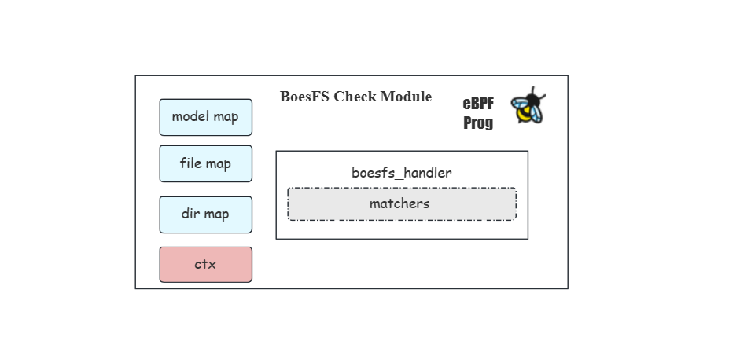
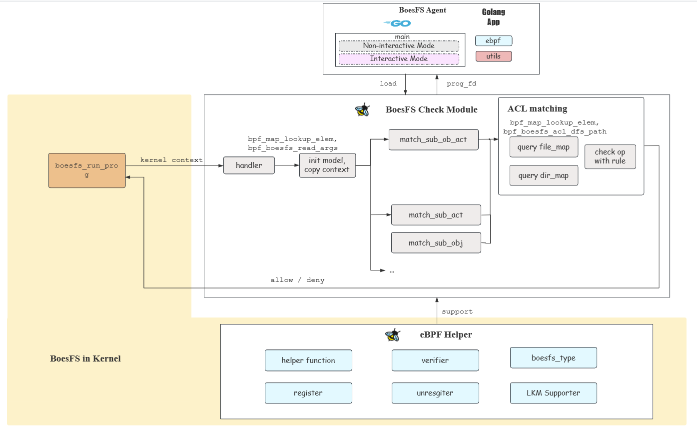
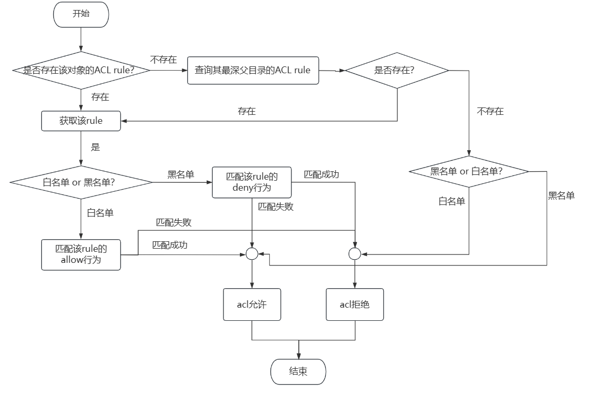
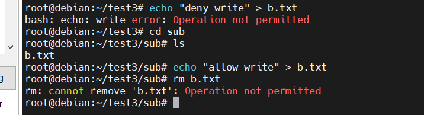
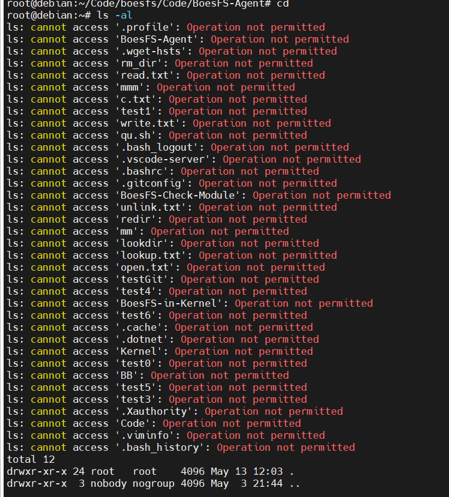
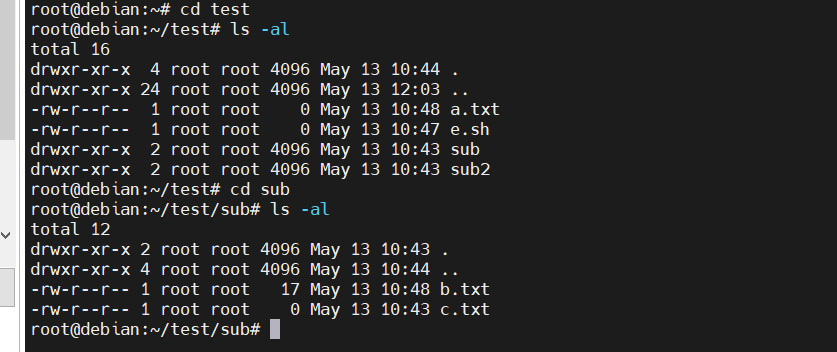
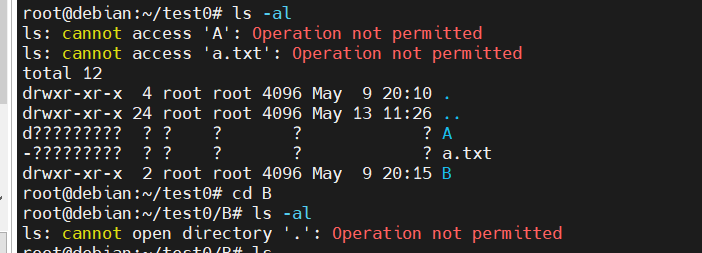

# ACL eBPF prog

相关的文件结构如下
acl_kern.c : 字节码程序
acl_kern.h : 常用头文件
acl_public.h : acl中，字节码程序和用户程序都会用到的结构体。
bpf_helpers.h : helper function原型
ebpf_helper.h : Boesfs-in-Kernel 的 hook function 类型及 上下文结构体等
ebpf_helper.c : 定义eBPF prog , 支持boesfs类型的eBPF prog编写

## 架构图

整体流程如图




具体的ACL匹配机制见下文流程图

## **规则存储**

目前实现的acl架构下，用户态需要读取用户填写的model文件和policy文件，model文件中保存规则类型如白名单还是黑名单，采用的比较字段有哪些；policy文件中保存具体规则，如某个被沙盒程序可对某个object做出某种操作。
model和policy文件的信息经用户态处理后，被分别存储于各自的map中，下面对其结构和设计进行介绍

**存储model文件信息 : model_map**

鉴于model文件解析出的信息的数量及格式较为固定，且无需有特殊含义的字段作为key，故我们选取BPF_MAP_TYPE_ARRAY作为 model_map的类型，定义如下。其中key为unsigned int，value 为 line_t结构体，用于存储不定参数，成员为nums及args数组。

```c
  //  acl_prog.c
  struct bpf_map_def SEC("maps") model_map = {
    .type = BPF_MAP_TYPE_ARRAY,
    .key_size = sizeof(__u32),
    .value_size = sizeof(line_t),
    .max_entries = 5,
  };

  //  acl_public.h  
  //  对于model map中每个entry的索引
  typedef enum model_map_idx{
  	REQ_DEF_IDX,
  	POL_DEF_IDX,
  	POL_EFF_IDX,
  	MATCHER_IDX,
  	DIR_ENTRY_IDX,          //  number of dir rules filled in dir map
  	SUB_ACT_RULE_IDX,       //  only for model matcher_sub_act. value : args[0] is allow bitmap ; args[1] is deny bitmap
  	MAX_MODEL_IDX,
  }model_map_idx_t;
```

| entry                       | key | value    | instruction                   |
| --------------------------- | --- | -------- | ----------------------------- |
| request_definition 请求格式 | 0   | bitmap   | 每一bit对应于一种字段是否存在 |
| policy_definition 规则格式  | 1   | bitmap   | 每一bit对应于一种字段是否存在 |
| policy_effect 黑名单/白名单 | 2   | [0,1]    | 0为白名单,1为黑名单           |
| matcher 匹配定义            | 3   | [0,3]    | 具体见下                      |
| permission 进程权限         | 4   | 2 bitmap | 仅在matcher为特定情况下才生效 |

具体来说，目前来讲，matcher的不同值及对应含义如下

0 : 主体、客体以及行为均需参与匹配

1 : 只需匹主体及客体配

2 : 只需匹配主题和行为

3 : 只需匹配客体和行为

这些值在acl_public.h中通过enum进行命名，若后续acl规则部分有丰富matcher的需求，只需在这里规定新的matcher即可。

```c
//  matchers类型
typedef enum matcher{
    SUB_OBJ_ACT,        //  r.sub == p.sub && r.obj == p.obj && r.act == p.act
    SUB_OBJ,            //  r.sub == p.sub && r.obj == p.obj
    SUB_ACT,            //  r.sub == p.sub && r.act == p.act
    OBJ_ACT,            //  r.obj == p.obj && r.act == p.act
    SUB_OBJ_ACT_ARGS,   //  r.sub == p.sub && r.obj == p.obj && r.act == p.act && r.args == p.args
    // SUB_ACT_ARGS, 暂时不支持, 有ARGS一定要有OBJ和ACT
    OBJ_ACT_ARGS        //  r.obj == p.obj && r.act == p.act && r.args == p.args
}matcher_t;
```

对于不同的matcher，acl eBPF prog会采用不同的匹配策。见下文。

对于policy effect，0代表白名单，即用户在policy文件中定义的权限为allow的权限；1代表黑名单，即用户在policy文件中定义的权限均为deny的权限。

```c
//  policy_effect类型
typedef enum policy_effect{
    EFFECT_ALLOW,       //  e = some(where (p.eft == allow))
    EFFECT_DENY         //  e = !some(where (p.eft == deny))
}policy_effect_t;
```

对于 permission，只有在matcher = SUB_ACT才会生效，其val存储该进程的操作权限，方式同下文。

**存储policy文件信息 : file map和dir map**

为了字节码可以获取用户在policy文件中设定的对于subject的权限，我们同样需要map来对其进行存储。

不过我们对其区分了file map和directory map：即对于subject对象，用户究竟是将其视为一个file本身去定义权限，还是将其视为一个目录，去定义其下的子目录和子文件的权限。若是前者，则将权限规则填入 file map；若是后者，则将权限规则填入dir map。

设想一种场景：用户希望被沙盒程序不可改变A目录本身的名称，但用户允许被沙盒程序改变A目录之下的子文件和子目录的名称（通过定义rename权限来实现）。那么用户此刻在定义权限时就有必要区分文件和目录：采用黑名单策略，用户将A视为文件本身，定义其rename的deny权限，即可实现目标；反之，则是用户需要将A视为目录，定义其下的子文件和子目录的rename的deny权限。
所以，只有一种map是满足不了我们的需求的。

用户在policy文件中 通过 file/dir 字段，来区分要填入file map 还是 directory map.

同时，为了尽可能的节约空间，我们通过bitmap来存储权限规则，每一个bit代表了一种操作类型如lookup/read/open/...。对于每一个subject，其有两个bitmap，一个是allow bitmap；一个是deny bitmap。分别代表其被允许和拦截的行为。

综上，我们选用BPF_MAP_TYPE_HASH作为file_map和dir_map的类型，定义如下：key为path，value为policy_t结构体，其中有两个int成员，分别作为allow和deny的bitmap。易知int为32bit，完全可以满足我们的需求。

由于kernel实现的规则查找方式发生变化，故这里对应的dir_map类型也发生了变化，由哈希变成数组. (BPF_MAP_TYPE_HASH -> BPF_MAP_TYPE_ARRAY)
```c
struct bpf_map_def SEC("maps") file_map = {
	.type = BPF_MAP_TYPE_HASH,
	.key_size = PATH_MAX_SUPP,
	.value_size = sizeof(policy_t),
	.max_entries = 32,
};

struct bpf_map_def SEC("maps") dir_map = {
  .type = BPF_MAP_TYPE_ARRAY,
  .key_size = sizeof(uint32_t),
  .value_size = sizeof(dir_entry_t),
  .max_entries = TOTAL_RULE,
};

//  value of dir map
//  user , kernel 都会使用
typedef struct dir_entry{     
  char path[PATH_MAX_SUPP];
  policy_t rule;
}dir_entry_t; 


typedef struct policy{
  //  agent需要将valid置为1. ( 你置为1我能省点事 ; 你不管这个valid,当它没有,也无所谓.) 
  int valid;                 //  1 : 该节点存储的规则有效 ; 0 : 该节点存储的规则无效.  
  uint32_t allow;            //  allow bitmap
  uint32_t deny;             //  deny bitmap
}policy_t;
```

| entry    | key  | value                 |
| -------- | ---- | --------------------- |
| 规则定义 | path | allow and deny bitmap |

位图中每一比特和操作类型的对应关系如下表

| idx | type   | idx    | type   | idx    | type   |
| --- | ------ | ------ | ------ | ------ | ------ |
| 2   | read   | 11     | link   |20      | statfs  |
| 3   | write  | 12    | symlink| 21      | fsync   |
| 4   | lookup | 13    | rename |
| 5   | open   | 14    | setattr |
| 6   | mkdir  | 15    | getattr |
| 7   | unlink | 16    | llseek  |
| 8   | rmdir  | 17    | iterate |
| 9   | mknod  | 18    | mmap |
| 10   | create | 19    | lookup2 | 


当检测的时候通过查询map来获取path对应的权限，进行比较。

## **匹配机制**



Boesfs-in-Kernel 采集的参数 和 ACL Policy规则 进行匹配后会得到两种结果：“命中”和“未命中”。命中即ACL policy中存在可用于判断该对象行为的ACL rule；未命中即ACL policy中不存在可用于判断该对象行为是否合法的ACL rule

行为是被拦截还是放行，最终是由Boesfs-in-Kernel部分决定的，字节码根据acl规则返回允许还是拒绝，Boesfs-in-Kernel根据字节码的返回结果做出下一步动作。

**匹配顺序**

**如何处理规则冲突**，如上图所示，当allow和deny的位图发生冲突时，最终规则取得的效果取决于用户自己填写的policy_effect，即用户选择使用的是白名单策略还是黑名单策略。白名单则是allow bitmap生效，黑名单则是deny bitmap生效

```c
	if(effect_model == EFFECT_ALLOW) {
		if(ISVALID(p->allow,op)){
			DBG("%d is allowed\n",op);
			return 0;
		} else {
			DBG("%d is denied\n",op);
			return -1;
		}
	} else {
		if(ISVALID(p->deny,op)) {
			DBG("%d is denied\n",op);
			return -1;
		} else {
			DBG("%d is allowed\n",op);
			return 0;
		}
	}
```

**深度优先原则**

如上述流程图所示，目前，eBPF prog支持的匹配顺序为深度优先原则：将规则按照 精确度/严格程序 赋予优先级；排序时优先级高的规则在前；且遵循 一旦命中就停止匹配。

eBPF prog 查找对于object的规则的时候，先查找file map中是否存在object的ACL rule。

如果存在，则命中，直接按照查找到的规则判断；

若不存在，再查找dir_tree中是否存在object的父目录的ACL rule，返回最深的父目录规则

若存在，则命中，按照该父目录规则对该object的行为进行判断

若不存在，则未命中，进行判断。

如下为深度优先的code核心逻辑

```c
static int matcher_sub_obj_act_args(boesfs_op_t op, char *obj_name, policy_effect_t effect_model,struct boesfs_args *ctx, int model)
{
  // ...
	if(effect_model == EFFECT_ALLOW || effect_model == EFFECT_DENY) {
		policy_t *p = bpf_map_lookup_elem(&file_map,obj_name);
		if(p != NULL) {
      // ...
			return result_hit(p,op,effect_model);
		} else {
			p = bpf_boesfs_acl_dfs_path(&dir_map,obj_name);
      // ...
			return result_missed(effect_model) or return result_hit(&rule, op, effect_model);
    }
  }
  // ...
}
```

**效果**

基于上述逻辑，目前所实现的acl检测，遵循深度优先原则 并且

遵循posix acl中所述的 默认 ACL 权限：

如果给父目录设定了默认 ACL 权限，那么父目录中所有新建的子文件都会继承父目录的 ACL 权限。

特别的，目前来讲，对于lookup，由于kernel的缓存机制，被沙盒程序可以天然的lookup到自己创建的文件，而不受权限控制，其他操作受权限控制。

下面是一些例子

**例子**

根据上述匹配机制，我们如何做到下列需求：

例如 不允许 write 和 unlink /home/boes/test 目录下的子文件和子目录，但是特别的，允许write /home/boes/test/sub/b.txt

对此，我们采用黑名单策略，
将b.txt的 unlink deny 填写进file map中；同时，在dir map中添写test目录下的unlink 和 write deny。

```c
p, /bin/bash, /home/boes/test3/sub/b.txt , unlink , file, deny
p, /bin/bash, /home/boes/test3, write,  dir, deny
p, /bin/bash, /home/boes/test3, unlink,  dir, deny
```

由上述匹配机制可知，当访问test目录下的子文件/目录时，会命中到dir map中对于/home/boes/test的ACL rule；但是访问其下的sub/b.txt时，会命中到file map中的ACL rule。故遵循实现的深度优先原则，可以实现上述需求。效果图如下



例如 允许 /home/boes/test 及其之下的所有子目录和子文件 均可 被找到。

对此，我们采用白名单策略，将/home/boes的open，/home/boes/test的 lookup 以及 open allow 填入file map；同时，在dir map中填写/home/boes/test 的 lookup 以及 open 的 allow 权限即可。其中 file map中对于对boes的open权限是为了能够打开/home/boes目录，对test的lookup权限是为了能够找到test目录；而dir map中的权限均是对于子目录和子文件的限制。

```c
p, /bin/bash, /home/boes , open , file, allow
p, /bin/bash, /home/boes/test , lookup , file, allow
p, /bin/bash, /home/boes/test , open , file, allow
p, /bin/bash, /home/boes/test , lookup , dir, allow
p, /bin/bash, /home/boes/test , open , dir, allow
```

由上述匹配机制可知，当访问/home/boes/test下的子文件和子目录时，最终会命中到dir map中的/home/boes/test ACL rule，实现
需求。效果图如下




例如 /home/boes/test0/A及其下子目录/文件不可见；/home/boes/test0/B 可见，B下的子目录子文件不可见；/home/boes/test0/a.txt不可见

对此，我们采用黑名单策略，file map中填写/home/boes/test0/A lookup 和 /home/boes/test0/a.txt lookup的deny权限，同时，dir map中填写/home/boes/test0/B的lookup的deny权限。注意这里在dir map而非file map中定义B的lookup deny，是因为需求中要求了B目录可见。

```c
p, /bin/bash, /home/boes/test0/A , lookup, file, deny
p, /bin/bash, /home/boes/test0/a.txt , lookup,  file, deny
p, /bin/bash, /home/boes/test0/B, open,  file, deny
```

由上述匹配机制知，当尝试访问A目录和a.txt时，会由于对其本身的lookup deny而失败；当访问B目录时，由于file map中不存在该限制，会成功看见B目录信息；但是当访问子文件时会命中到dir map中的ACL rule，拦截。效果图如下



特别的，由于vfs以及boesfs沙盒层的特性，每一次操作都会经历eBPF prog的检验。
所以在使用lookup的白名单策略时，对用户有较高的要求，因为linux每次访问某个文件，首先要做的就是lookup到该文件。故要在白名单下限制文件访问，用户填写的规则需要保证其父目录可以被正确的open和lookup。其填写方式应当如上述的第一个例子

## 匹配项

目前为止，boesfs 规则使用的匹配项为

subject name , object name , op  , file/dir , args , allow/deny


## 参数匹配

### 模型和策略拓展

#### model.txt

**格式：**

```shell
[request_definition]
r = sub, obj, act, args

[policy_definition]
p = sub, obj, act, args

[policy_effect]
e = some(where (p.eft == allow))

[matchers]
m =  r.sub == p.sub && r.obj == p.obj && r.act == p.act && r.args == p.args # 参数匹配
m =  r.sub == p.sub && r.obj == p.obj && r.act == p.act # 不参数匹配
```

**说明：**

- 通过新增args成员来判断是否需要进行参数匹配
- 有act的匹配基础上，才有args的匹配。否则为非法。

#### policy.txt

**格式：**

```shell
p, /bin/bash, /home/boes, open, (除了obj路径的其余参数列表), file, allow
```

**说明：**

- args以(...)进行包装，以,进行区分，注意格式
- BoesFS仅支持等值匹配
- 每个策略中参数的表示的含义如下表

| 参数   | 描述                                           |
| ------ | ---------------------------------------------- |
| *      | 该参数不参与参数匹配，该参数任意值该规则都成立 |
| 某个值 | 表示该api该参数的值为此值，该规则才成立        |

**举例：**

```shell
p, /bin/bash, /home/boes/test, lookup, (*), file, allow
p, /bin/bash, /home/boes/test, lookup, (1), dir, allow
p, /bin/bash, /home/boes/test/test.txt, read, (20,*), dir, allow
p, /bin/bash, /home/boes/test/test.txt, read, (*,*), dir, allow
p, /bin/bash, /home/boes/test/test.txt, read, (20,5), dir, allow
```

### eBPF Map拓展

**args_map**

key是unsigned long，hash(api，程序名)（64位）
value是unsigned long，hash(参与匹配的参数)（前61位） + 后3位是参数匹配位图

**解释：**

1. 后3位是参数匹配位图，因为除掉obj的参数最多只有3个。
   eg: 如果是只有第一个参数参与匹配，则位图为1 0 0。如果是只有第一个参数参与匹配，则位图为1 1 1。
2. agent读取规则时，同时按照上述格式填args_map。
   字节码来一条请求时，如果找dir_map和file_map命中，会hash(api,程序名)得到key，去args_map找到参数匹配信息。
   如果满足，该规则生效。否则不生效。

## 流程

下面简单介绍一下运行流程 : 根据boesfs-in-kernel传入的选项，进行相应操作
以下操作中所调用的helper function均在boesfs-in-kernel中进行了说明，下面只是简要阐述

- mount后第一次运行字节码时，进入BOESFS_INIT分支，进行初始化操作。
  ```c
  if(op == BOESFS_INIT) {
    return init_dir_tree(ctx);
  } 

  init_dir_tree(ctx) {
    ...
    //  获取元信息
    bpf_map_lookup_elem(&model_map,(void*)&idx); 
    //  构建目录树
    bpf_boesfs_build_dir_tree(ctx,dir_tree_meta);
    ...
  }
  ```

- umount时，运行最后一次字节码，进入BOESFS_DESTORY分支，进行收尾的销毁操作
  ```c
  else if (op == BOESFS_DESTROY) {
    return destory_dir_tree(ctx);		
      |-> bpf_boesfs_destroy_dir_tree(ctx)
  } 
  ```

- 正常运行时
  - 首先需要获取到model文件信息，由上文知存储在model_map中
  ```c
    if(init_args(ctx,&match_model,&effect_model) == -1){
      return -1;
    }
  ```
  - 读取**上下文结构体**
    - 具体的结构体类型说明在Boesfs-in-Kernel文档中。这里只是介绍使用。
    - acl_prog 获取到的Boesfs-in-Kernel传递来的结构体，op存储操作类型，union_agrs存储采集的参数，针对不同操作有不同类型的结构体，但对于不同的结构体，其都采集了一个公共参数：访问对象path。
  ```c
    typedef struct boesfs_args {
      int op;									            //  op
      union_args_t	args;					        //  op args
      struct dir_node *dir_tree_root;			//  dir_tree_root
      char elfpath[PATH_MAX_SUPP];			  //  for expansion
    } boesfs_args_t;

    //  union统一起来. 便于is_valid_access检测内存访问越界.
    typedef union args {
      lookup_boesfs_args_t 	lookup_args;
    	unlink_boesfs_args_t 	unlink_args;
      read_boesfs_args_t   	read_args;
      open_boesfs_args_t   	open_args;
      write_boesfs_args_t  	write_args;
      mkdir_boesfs_args_t 	mkdir_args;
      ...
      fsync_boesfs_args_t 	fsync_args;
    } union_args_t;
  ```
  - 由于我们这里会使用到path，故采用struct open_boesfs_args来接收args。由于path需要作为map查询的key，则key又必须位于ebpf stack上，故我们通过ebpf_helper模块提供的helper function : 来读取path.
  ```c
  bpf_boesfs_read_args(BOESFS_OPEN,&arg,ctx);
  ```
  - 然后根据用户通过model.txt定义的match_model进入不同分支
  ```c
      switch (match_model)
      {
        case OBJ_ACT:
        case SUB_OBJ_ACT:
        case OBJ_ACT_ARGS:
        case SUB_OBJ_ACT_ARGS:
          return matcher_sub_obj_act_args(op, arg.path, effect_model, ctx, match_model);
        case SUB_OBJ:
          return matcher_sub_obj(op, arg.path, effect_model,ctx);
        case SUB_ACT:
          return matcher_sub_act(op, effect_model,ctx);
        default:
          return -1;
      }
  ```
  - 在不同分支中都会按照上文所述的匹配机制以及流程图进行匹配。
  - 一般都会依赖于 bpf_map_lookup_elem 和 bpf_boesfs_acl_dfs_path 以及 bpf_boesfs_args_hash 这3个helper function。主要原因：字节码禁止loop，以及对上下文进行write操作，故需要将和loop相关的操作转移到helper function中。
  - 比如进入 matcher_sub_obj_act_args ： 除开深度优先原则之外，首先会根据action以及object检查参数是否匹配，如果不匹配，则直接return result_missed()；如果匹配，则继续按照上述的深度优先逻辑进行查找.
  ```c
  static int matcher_sub_obj_act_args(boesfs_op_t op, char *obj_name, policy_effect_t effect_model,struct boesfs_args *ctx, int model)
  {
    ...
    // args verify model
    if(model == OBJ_ACT_ARGS || model == SUB_OBJ_ACT_ARGS)
      arg_check = boesfs_args_verify(op, obj_name, ctx); 
    ...
    if(参数匹配没通过) 
      return result_missed(effect_model);    
    else
      if (effect_model == EFFECT_ALLOW || effect_model == EFFECT_DENY)
        //  search file map
        policy_t *p = bpf_map_lookup_elem(&file_map, obj_name);
        if (p != NULL)
          return result_hit(p, op, effect_model); 
        //  search dir tree
        else
          ... policy_t rule init ...			        //  must on ebpf stack
          //  get rule
          bpf_boesfs_acl_dfs_path(ctx, obj_name, &rule, 0);
          if (rule not found or found but not valid)  
            return result_missed(effect_model);
          else
            return result_hit(&rule, op, effect_model);
    ...
    err:
      return -1;
    }	
  }
  ```
  - 同理，其他matcher情况下也是如此。比如matcher_sub_act。这条分支直接利用操作类型op进行判断即可，无需考虑object。由上述可知，subject的权限bitmap被存于model_map中
  ```c
  static int matcher_sub_act(boesfs_op_t op, int effect_model)
  {
    int idx = EXTRA_IDX;
    struct line *p = bpf_map_lookup_elem(&model_map, &idx);
    if (p == NULL){
      return effect_model == EFFECT_DENY ? 0 : -1;
    } else {
      if (effect_model == EFFECT_ALLOW) {
        if (ISVALID(p->args[0], op))
          return 0;
        else
          return -1;
      } else {
        if (ISVALID(p->args[1], op))
          return -1;
        else
          return 0;
      }
    }
  }
  ```

- 当用户定义的matcher不存在时，默认拦截，return -1 给 boesfs-in-kernel

## 示例

下面给出几个使用示例

- （1）例如 不允许 write 和 unlink /home/boes/test 目录下的子文件和子目录，但是特别的，允许write /home/boes/test/sub/b.txt

  - 对此，我们model.txt采用黑名单策略，
  - 将b.txt的 unlink deny 填写进file map中；同时，在dir map中添写test目录下的unlink 和 write deny。
    
    
  - 由上述匹配机制可知，当访问test目录下的子文件/目录时，会命中到dir map中对于/home/boes/test的ACL rule；但是访问其下的sub/b.txt时，会命中到file map中的ACL rule。故遵循实现的深度优先原则，可以实现上述需求。
  - 效果图如下，符合预期，实现需求
    
- （2）例如 需要仅允许 /home/boes/test 及其之下的所有子目录和子文件 均可 被找到。

  - 对此，我们采用白名单策略。
  - 将/home/boes的open，/home/boes/test的 lookup 以及 open allow 填入file map；同时，在dir map中填写/home/boes/test 的 lookup 以及 open 的 allow 权限即可。
  - 其中 file map中对于对boes的open权限是为了能够打开/home/boes目录，对test的lookup权限是为了能够找到test目录；而dir map中的权限均是对于子目录和子文件的限制。
    
    
  - 由上述匹配机制可知，当访问/home/boes/test下的子文件和子目录时，最终会命中到dir map中的/home/boes/test ACL rule，实现需求。
  - 效果图如下，符合预期，实现需求
    
    
- （3）例如 /home/boes/test0/A及其下子目录/文件不可见；/home/boes/test0/B 可见，B下的子目录子文件不可见；/home/boes/test0/a.txt不可见

  - 对此，我们采用黑名单策略. model文件同（1）
  - file map中填写/home/boes/test0/A lookup 和 /home/boes/test0/a.txt lookup的deny权限，同时，dir map中填写/home/boes/test0/B的lookup的deny权限。
  - 注意这里在dir map而非file map中定义B的lookup deny，是因为需求中要求了B目录可见。
    
  - 由上述匹配机制知，当尝试访问A目录和a.txt时，会由于对其本身的lookup deny而失败；当访问B目录时，由于file map中不存在该限制，会成功看见B目录信息；但是当访问子文件时会命中到dir map中的ACL rule，拦截。
  - 效果图如下，符合预期，实现需求。
    
  - 特别的，由于vfs以及boesfs沙盒层的特性，每一次操作都会经历eBPF prog的检验。所以在使用lookup的白名单策略时，对用户有较高的要求，因为linux每次访问某个文件，首先要做的就是lookup到该文件。故要在白名单下限制文件访问，用户填写的规则需要保证其父目录可以被正确的open和lookup。其填写方式应当如上述的第一个例子
- （4）例如要实现被 挂载目录(/home/boes)下所有目录和文件均只有可见权限，但是不可读也不可写也不可删除等；且特别的，其下的某一目录/home/boes/test不可见；特别的，/home/boes/test1下的文件以及子目录，均可读可写。

  - 对此，我们采用白名单策略。model文件同（2）
  - file_map中填写/home/boes的open权限，/home/boes/test的default权限。在dir_map中填写/home/boes的open和lookup权限，/home/boes/test1的read、write、open、lookup权限。
  - 其中，file_map中，对boes的open权限是为了打开boes，对/home/boes/test的default，是为了禁止lookup权限；dir_map中，对test1的read，write，open，和lookup权限，是为了对test1下的子目录以的子文件及子文件进行读写.
    
  - 由上述匹配机制知，当想要查看boes下的目录和文件时，会最终命中到boes的ACL，Rule。特别的对于test的子文件/目录，会命中test的ACL Rule。同理，对于test1的子文件/目录，会命中到test1的ACL Rule。
  - 效果图如下，符合预期，实现需求。
  - 可以查看到boes下的除test之外的文件，但不可读写
    
    
  - 可以对test1下的，进行读写，但不可进行其他操作，如删除等
    
    
- （5）例如要实现，禁止/bin/bash对test文件夹，以及lookup.txt的任何访问，则有如下。

  - 采用黑名单策略，且无需填写行为字段，也即无需填写read/write/unlink……
    
    
  - 最终效果如图，符合预期
    
- （6）想要实现，只允许 /bin/bash 对于任何文件进行lookup，read，open操作，其余操作全部禁止。则有如下

  - 采用白名单策略，无需填写object字段，也即无需填写path
    
    
  - 结果如下图，符合预期，实现需求。
    
- （7）想要实现，任何程序，对于test/a.txt的权限都仅限于read，则有如下

  - 采用黑名单策略，无需填写subject字段，也即无需填写要沙盒的程序名。
    
    
  - 效果如图，符合预期
    
- （8）相应的，对于上述的操作，Boesfs-in-Kernel会记录下所有被拦截的操作，写入日志中。如下。每次运行被沙盒程序，就会有一个对应的日志文件来记录。
  
