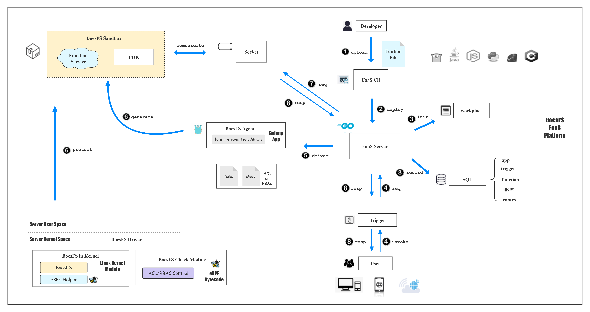
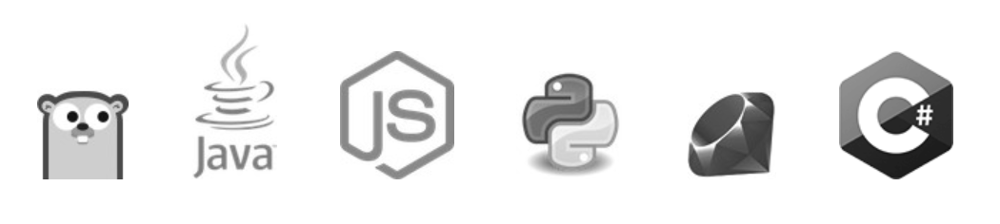
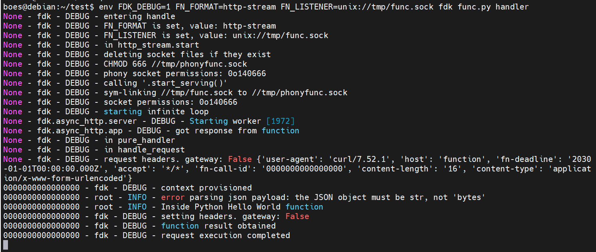
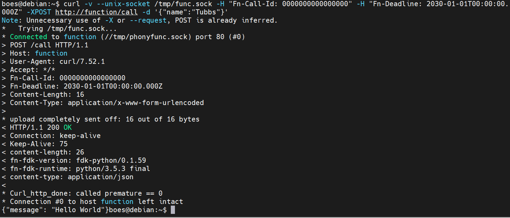

# BoesFS-FaaS开发文档

## 1 BoesFS-FaaS总体介绍

### 1.1 FaaS简介

FaaS，Function as a Service，是新一代的无服务器架构模式，面向函数即服务。开发者无需关注服务器细节，而是将业务函数托管到FaaS平台，由托管的FaaS平台负责实时创建和销毁函数实例，从按需为客户提供业务服务。

### 1.2 BoesFS-FaaS简介

BoesFS-FaaS Platform是一个接入BoesFS沙盒的轻量级FaaS平台，是BoesFS沙盒和Serverless模式结合形成的拓展衍生应用之一。BoesFS-FaaS满足FaaS场景的如下需求：

- 高并发
- 高密部署
- 可信文件系统沙盒环境
- 细粒度访问控制
- 自定义的动态安全检查
- 低的性能开销

BoesFS-FaaS Platform基于Oracle支持的开源项目fnproject进行完全重构和BoesFS沙盒层的接入，并取得了优于一般的基于容器的FaaS Platform的高并发、高密部署、高性能、按需自定义自定义检查的优势。

### 1.3 BoesFS-FaaS架构图

BoesFS-FaaS Platform的总体架构图和总体工作原理如下图。



### 1.4 BoesFS-FaaS核心组件

BoesFS-FaaS的核心组件主要包括（参考架构图组件）：

- **BoesFS-Agent**。为接入主流的FaaS平台，我们对BoesFS-Agent进行了Golang语言移植和重构（BoesFS-Agent具备双语言，Golang和C）
- **BoesFS-Driver**。这是BoesFS项目位于内核的驱动部分，包括BoesFS-in-Kernel和BoesFS-Check-Module两个模块。BoesFS-Driver为BoesFS-FaaS的沙盒层提供文件保护的支持。
- **FaaS Cli**。FaaS Cli是BoesFS-FaaS的命令行触发部分。FaaS Cli提供了创建和部署函数服务的若干接口，用于和FaaS Server进行实时的交互。
- **FaaS Server**。FaaS Server是BoesFS-FaaS Platform的核心服务端，负责和其他组件进行交互，如SQL，FaaS Cli，Socket套接字文件，FDK与Function Service，BoesFS-Agent以及http事件等等。
- **FDK 和 Function Service**。Function Service是BoesFS-FaaS Platform运行的函数实例，FDK是为挂载该函数实例提供的语言工具集。形成的函数实例位于BoesFS Sandbox沙盒层，受到BoesFS Driver的保护和限制；同时通过Socket套接字和FaaS Server进行通信，接收函数请求和返回函数计算结果。

### 1.5 BoesFS-FaaS主要工作流程

BoesFS-FaaS Platform的主要工作流程如下（参考架构图标号）：

① 允许开发者上传多语言版本（Golang，Java，Js，Python，Ruby，C#）的函数文件到BoesFS-FaaS Platform。

② FaaS Cli通过deploy接口向FaaS Server发送函数的部署命令，将该函数文件部署到指定的app中。

③ FaaS Server收到部署命令，会将函数文件初始化到工作空间（~/.boesfs-faas），同时会在SQL中记录该函数的信息。

经过上述简单的三步，开发者就可以成功在BoesFS-FaaS Platform部署业务函数，然后剩下的函数实例化自动创建和销毁全部交给托管平台BoesFS-FaaS Platform完成。

④ 当有客户通过post等方式触发预期的url，触发器会根据条件进行触发，向FaaS Server发送req请求。

⑤ FaaS Server接收到对应的req，会缓存req，同时调用BoesFS-Agent，通过BoesFS-Agent来完成后续的创建工作。

⑥ BoesFS-Agent会根据自定义设置的ACL/RBAC形式的安全检查规则文件，加载eBPF 字节码，在BoesFS Driver的保护下形成runtime运行时的BoesFS Sandbox沙盒，并在沙盒层中通过FDK启动Function Service。

⑦ 当函数实例动态创建后，FaaS Server会将缓存的req发往约定的套接字文件Socket。

⑧ 函数实例接收req请求后，进行函数计算，最后将计算结果逐步返回给待服务的用户，完成本次FaaS服务，函数计算完成后，函数实例会动态销毁。

### 1.6 BoesFS-FaaS的主要对象

此外，BoesFS-FaaS Platform的包括如下一些重要的抽象对象：

- **context**。context是BoesFS-FaaS Platform的运行环境和配置。
- **app**。app是Boes-FaaS Platform用于管理function函数的对象，可以创建和销毁，函数可以部署于某个app中。
- **function**。function是Boes-FaaS Platform对来自开发者Developer提供的函数文件进行部署得到的函数对象，可以创建和销毁。
- **trigger**。trigger是Boes-FaaS Platform用于接收到invoke后，何时或以何种方式运行函数，可以创建和销毁。
- **server**。server是BoesFS-FaaS管理FaaS Server而引入的抽象对象。
- **agent**。agent是Boes-FaaS Platform中负责启动BoesFS-Agent沙盒，并动态实例化函数实例，并自动销毁的抽象对象。

## 2 BoesFS Agent (Go)

BoesFS Agent(Go)是在BoesFS Agent(C)的基础上，使用进行Golang语言进行重构和优化的BoesFS代理端，是为了接入主流的开源FaaS平台和便于拓展和维护而进行的BoesFS项目的双语言实践。

下表是主流的开源FaaS平台：

|                                                     | 开发语言 | 创建时间 | 支持厂商         | 运行平台          |
| :-------------------------------------------------- | :------- | :------- | :--------------- | :---------------- |
| [openwhisk](http://openwhisk.incubator.apache.org/) | Scala    | 2016-2   | Apache/IBM       | Docker            |
| [fnproject](http://fnproject.io/)                   | Go       | 2012-12* | Oracle           | Docker            |
| [funktion](https://funktion.fabric8.io/)            | Go       | 2016-12  | Redhat*          | Kubernetes        |
| [fission](http://fission.io/)                       | Go       | 2016-8   | Platform9        | Kubernetes        |
| [kubeless](http://kubeless.io/)                     | Go       | 2016-11  | Bitnami          | Kubernetes        |
| [openfaas](https://github.com/openfaas/faas)        | Go       | 2016-11  | 个人(Alex Ellis) | Docker/Kubernetes |

BoesFS Agent(Go)相对于BoesFS Agent(C)有如下优势：

- 主流开源FaaS项目大多基于Golang开发，BoesFS Agent(Go)提供了基于Go的简单方便的对外接口，能接入各种FaaS项目以提供沙盒支持

- Golang支持的优秀的并发支持，协程和通道
- 不仅保持较高的性能，同时对BoesFS Agent(C)的很多处理逻辑进行了优化
- 代码简洁和清晰，便于维护和拓展

### 2.1 设计思路

#### 2.1.1 与BoesFS-Agent(C)的区别

BoesFS-Agent(Go)主要的设计思路方面在 BoesFS-Agent(C)方面已经阐述较为完善，这里主要阐述与BoesFS-Agent(C)有所区别的部分。

首先是程序间交互的功能，这部分相较于C语言有较大的改进，我们尽可能地发挥了go语言在高并发方面的优势。在程序间通讯方面，在某些地方使用了go语言提供的channel，与此同时也使用了goroutine来启动子程序和监听父进程的交互信息，相较于C语言中的进程间管道和线程监听，go中的channel与goroutine具有更好的性能，更加轻量级，更加方便，更加高效的优势，使得本项目接入的Fn主程序可以十分方便地并行多个沙盒程序，实现冷热启动，并且可以通过channel传递信息，主动中断程序执行。

BoesFS-Agent(Go)使用`github.com/cilium/ebpf`库来与ebpf进行交互，该库可以实现很好的交互效果。但是该库在Linux较低版本和非发行版的支持并不是很好，故BoesFS-Agent(Go)在这个库的基础上，额外引入了C部分的代码作为动态链接库，使程序在较低版本的Linux版本和非发行版上依旧可以顺利运行。

在数据处理等方面，也充分发挥go语言相对于C语言的优势，引入一些系统自带的，或者一些第三方库来更加简洁、高效地完成各项任务。例如在字符串处理方面使用正则表达式，可以更加通用地匹配到字符串。也引入了zap库，用来记录程序的日志，并且可以输出到日志文件，能更好地记录程序的运行情况，对可能发生的错误有着更强大的复盘及恢复能力。

#### 2.1.2 进程关系的设计

BoesFS-Agent(Go)是进程间关系与BoesFS-Agent(C)也基本保持了一致。C语言部分的非交互模式为三个进程，交互模式为四个进程，BoesFS-Agent(Go)部分因为没有实现交互模式，故只有三个进程。在go语言中，很难进行fork操作，故这三个进程与C Agent最大的不同是，这三个进程互相之间是基本上独立的，这其中就涉及到了很多不便因素。

- 第一个是变量的问题。

在C语言中，fork之后的变量虽然与父进程的变量已经分离，但是其变量值仍然保持，这就使得两个程序之间不需要传递过多的信息，简化了编程难度。与此同时，进程的文件描述符表也不会复制，而子进程需要使用到父进程加载的ebpf程序文件描述符，这就导致了go进程必须将一些文件描述符复制给子进程。

- 其次是路径问题。

由于不能fork，所以启动子进程的代码就和正常运行一个命令行命令是基本一样的，这就导致程序必须知道子进程对应的可执行文件所在的路径，特别是在项目build之后，主进程的可执行文件需要四处移动，使用路径寻找子进程的可执行文件便成了一件比较麻烦的事情。

虽然go语言提供了协程goroutine，但go语言的协程goroutine是基于线程的，而线程是在进程内部的，所以协程之间的通信是基于共享内存的，而这个项目的一些要求和相关的操作决定了我们不能使用同一个进程完成所有的任务，故这里必须使用多进程。

下面介绍具体有哪些操作使得我们必须使用多个进程来执行不同的任务。

- 创建namespace

新的namespace需要一个新的进程作为这部分的初始特权进程，其拥有管理该namespace的一些特权，而这个新的进程是不能用线程或goroutine实现的，所以需要新建一个进程，在BoesFS-Agent(Go)中称之为cloneMain进程。

- 在新的namespace中运行目标用户程序

我们还需要一个新的进程，这是因为boesfs文件系统在挂载时需要向其传递一些参数，参数中便包括了使用该文件系统的进程pid，而我们不能允许用户进程在我们挂载boesfs文件系统之前就开始运行，所以需要一个新的进程，BoesFS-Agent(Go)中称之为cloneChild进程，在启动用户程序之前进行阻塞，使父进程读取自己的pid并传给boesfs文件系统，并且需要调用`reset_caps`函数解除cloneMain进程的特权，并设置用户进程的pgid与自身一致，使boesfs文件系统在用户进程触发多次规则后，即使杀死用户进程。

### 2.2 模块实现

#### 2.2.1 概述

本项目的模块主要分为四部分：

1. 项目主函数：`main.go`。提供了项目运行的示例代码，解析命令行参数并调用项目主体函数。可以编译成可执行文件，实现与C语言部分基本一致的效果，同时也将项目调用的代码和主体代码分离，使得本项目既可以独立运行，完成目标任务，也使得主体代码可以作为模块被其他项目调用，增强了项目的灵活性。
2. 项目主体：`gofs`包。包含了在物理机内需要执行的各种函数，该包提供了沙盒创建、ACL规则读取、bpf加载与交互，以及日志记录等一系列工具集。其中NonInteract函数作为对外的接口，其他包可以调用这个函数来创建沙盒环境并运行目标程序。
3. 沙盒管理进程：`cloneMain.go`。作为新namespace的第一个进程，管理着其所在的namespace，并运行一个新的监控进程，让监控进程重置父进程的各种特权，并运行用户指定的目标函数。同时与项目主体代码保持沟通，接收外部传来的各种命令。
4. 代码转换器：`generator`文件夹。将Boesfs项目C部分的各种头文件中所需要的结构体、宏定义、枚举类等转化为go语言，并提供一些字符串到枚举类的转换函数，大大提高了项目的可维护性。

#### 2.2.2 main.go

main.go使本模块可以被独立编译成一个可执行文件，实现与C Agent基本一样的运行效果。main函数沿用C的逻辑，根据参数数量选择接下来要执行的模式，没有参数则进入交互模式，有参数则进入非交互模式。而我们这里深入分析了go Agent的应用场景，认为并不需要实现交互模式，故精简了代码逻辑。main函数负责解析各项命令行参数，并将这些参数传递给NonInteract函数，实现项目功能。

#### 2.2.3 nonInteractive.go

##### NonInteract函数

NonInteract函数为项目主体逻辑的入口函数。将解析过的各个参数传递进来即可运行项目。程序首先分析传入参数的合法性，将各项参数输出到日志，未设置必选参数的直接报错。随后调用Clone函数，在新的namespace中启动子进程，给子进程传入一系列所需的参数，构造沙盒环境，运行目标程序。此函数原本还兼具加载bpf字节码和设置bpf map的任务，后来将该任务移至cloneMain函数中，详情见cloneMain函数部分。

以下为NonInteract函数的各项参数说明

```go
// @param	interrupt_c		chan int	接收父进程的通知, 传入任何数据或直接关闭管道均可直接中断运行的程序
// @param	arg_mountDir	string		挂载目录
// @param	arg_userProg	string		用户程序路径
// @param	arg_killNum		int			阈值
// @param	arg_reload		bool		是否reload
// @param	arg_model		string		模型文件路径
// @param	arg_policy		string		策略文件路径
// @param	arg_log			string		日志文件路径
// @param	args			[]string	目标程序参数
```

此外，我们还深度调研了Fn的使用场景，发现用户的目标程序可能会是一个网络服务器，一直在监听连接处阻塞，其实内核部分也有直接终止函数执行的逻辑，但是需要程序触发规则，而在这种场景下，可能是用户主动要求中断程序执行，故这里使用go语言的管道，实现了一个中断程序执行的功能，传入一个`interrupt_c`管道，用来通知程序直接中断运行，程序会关闭其与新namespace内主控程序的进程间管道，通知子进程尽快结束执行。

这里使用了goroutine来处理管道传递的消息，很好地发挥了goroutine轻量级线程的优势，使主程序不需要阻塞来接收通知，并且消耗很少的系统资源。如果收到消息，或者管道关闭，主程序会尝试给子程序发送kill信号，使程序中断运行。这里设置了一个互斥锁，用来防止主程序与接受通知的goroutine在childPipe逻辑上发生错误，goroutine先判断`childPipe == nil`，然后主程序成功clone子进程，这就会导致子进程不会收到kill信号，而此时管道已经关闭，与上级调用代码的沟通渠道终止，这样会使程序进入不可控状态，而通过这一个锁，在goroutine中，收到消息便锁住，在主程序中，如果已经锁住，则直接选择不启动子程序，我们就可以避免进入这样的危险状态。

```go
	mutex := sync.Mutex{}
	go func() {
		<-interrupt_c
		mutex.Lock()
		// 如果收到消息, 或者channel关闭, 则给子程序发送kill信号, 并中断运行
		if childPipe == nil {
			logger.Info("child is not running")
		} else {
			childPipe.Close()
			logger.Info("send kill signal to child")
		}
		// 不管怎样, 此程序都应该结束, 没有特别需要执行的defer
	}()

	...

	// 如果已经收到中断信号, 则不再执行
	if !mutex.TryLock() {
		return
	}
	var cmd *exec.Cmd
	cmd, childPipe, _ = Clone(ParseHome("~/.boesfs/boesfs1"), 1, append(cloneArgs, args...))
	mutex.Unlock()
```

##### Clone函数

Clone函数的主要功能为创建新namespace，启动沙盒管理者程序，传入参数和返回值在下文阐述。该函数的核心功能为构造exec.Cmd结构体，用于启动新namespace及子程序。为了实现构造新namespace的功能，这里需要构造`syscall.SysProcAttr`结构体，设置clone的各项flags，并且设置新namespace中的uid、gid映射，这里我们采用和C一样的操作，将当前用户映射为新namespace中的root用户，虽然名义上是root，但是实际运行时与当前用户的权限是一致的。

```go
// @param	newGoName	string		新namespace管理程序的路径, 可直接传入go源码路径或可执行程序路径
// @param	fd			int			ebpf program的文件描述符, 子程序用于传递给内核
// @param	args		[]string	运行用户程序的参数
// @return	cmd			*exec.Cmd	启动新进程的结构体
// @return 	stdinPipe	io.WriteCloser	新进程的stdin管道, 用来传递消息
```

此外，此函数还对传入的子程序名称进行了处理，利用文件后缀名称判断传入的是go源码路径还是可执行文件的路径。如果传入的是go源码路径，则程序会查找go可执行文件的路径，并用`go run`命令直接运行go源码，如果传入的是可执行文件路径，则直接运行可执行文件。

```go
	if strings.HasSuffix(newGoName, ".go") {
		// 使用go run运行目标程序

		// go可执行文件的路径
		goPath, err := exec.LookPath("go")
		if err != nil {
			...
		}

		cmd = &exec.Cmd{
			Path: goPath,
			Args: append([]string{goPath, "run", newGoName}, args...),
			...
		}
	} else {
		// 直接运行编译后的目标程序
		cmd = &exec.Cmd{
			Path: newGoName,
			Args: append([]string{newGoName}, args...),
			...
		}
	}
```

#### 2.2.4 bpf.go

主要负责与ebpf文件的交互部分，以及对调用动态链接库的代码的操作进行封装。

##### ebpf_context结构体

```go
type ebpf_context struct {
	CtrlFd int
	maps   [max_entries]*ebpf.Map
}

func (e ebpf_context) Close() (err error)
```

效仿C部分的ebpf_context结构体，原本只是存储文件描述符，而这里对结构体进行了优化，使用 cilium ebpf 第三方库的`ebpf.Map`结构体对文件描述符进行包装，使得与 ebpf map 交互的过程更加简单便捷。并且针对这个结构体定义了Close方法，在函数中循环关闭相关的文件描述符，配合go的defer关键字，即可更加简单有效地释放系统资源，

##### 加载bpf字节码相关函数

```go
func LoadProgGo(filePath string) (*ebpf_context, error)
func LoadProgC(filePath string) (*ebpf_context, error)
```

提供了使用C语言和使用go语言两种不同的bpf字节码加载方式，均为传入bpf字节码路径，返回`ebpf_context`结构体指针。

`LoadProgGo`函数使用 cilium ebpf 库加载ebpf文件，使用`ebpf.LoadCollectionSpec`和`spec.LoadAndAssign`两个函数即可将bpf文件加载到内核中，缺点是对低版本和非发行版的Linux内核支持不完善。

`LoadProgC`函数调用动态链接库加载ebpf文件，C语言的代码与内核提供的库一起编译，可以更好地适配当前Linux系统，具有更佳的通用性，在内核加载完毕之后，将获取到的C语言ebpf_context结构体转化为go语言的结构体，方便后续调用map交互函数。

#### 2.2.5 bpfMap.go

主要负责与ebpf map交互的部分，其中也包含了解析ACL规则的部分。其核心函数为ReadAclAndSetMapValue函数，负责读取ACL规则文件，解析其中的规则，将规则写入ebpf map中。

##### ReadAclAndSetMapValue函数

负责读取ACL规则文件，包括model和policy文件，解析其中的规则，并将规则写入ebpf map中。由于此段代码较为复杂，故在从C迁移到go时，对代码进行了一定程度的重构，将一些逻辑拆分成为函数，提高了代码的可读性与可维护性。代码的主体逻辑仍然和C保持一致，首先读取model文件，根据model文件中的规则，设置ebpf map中与模型基本配置相关的部分。随后读取policy文件中的每一个规则，根据model的类型，选用不同的处理逻辑进行处理，并将规则写入对应的ebpf map中。

与C部分有很大不同的是，这里的字符串解析逻辑大量使用了正则表达式，不仅使得代码更加简洁高效，还提高了程序的通用性，可以适应更多的字符串格式，使用户可以更加自由地编写model与policy文件。此外，根据现有的使用场景，规则文件并不会很大，故这里在函数开始时直接将文件内容全部一次性读入内存，使用正则表达式进行解析，而不是像C部分一样，一行一行地读取文件，这样可以减少系统调用的次数，提高程序的运行效率。

##### C相关结构体的处理

在C部分中，agent与ebpf约定了很多结构体，用来在ebpf map中装载数据，其定义在几个相关的`.h`头文件中，由于cgo会将C语言中的类型转化为cgo模块中的类型，故如果使用cgo直接识别头文件中的结构体，会造成相似的变量类型在go与C之间反复转换，并且cilium ebpf库较难识别这样的结构体，从ebpf map中读取之后较难进行识别，导致不必要的麻烦。故这里我们将两个重要的结构体`policy_t`和`dir_entry_t`改写到go语言中，并且为其创造了对应的unmarshal函数，从ebpf map中读取数据时直接使用字节切片存放数据，之后在unmarshal函数中使用`unsafe.Pointer`将其转化到对应的结构体中，使得程序可以更好地读取这些结构体。

```go
// 从acl_public.h中复制, 如果更改, 则需要同步更改下面的unmarshal函数
type policy_t struct {
	valid uint32
	allow uint32
	deny  uint32
}

const PATH_LEN int = 256

type dir_entry_t struct {
	path [PATH_LEN]byte
	rule policy_t
}

func unmarshal_polict_t(data []byte) (policy_t, error) {
	if len(data) != 12 {
		return policy_t{}, fmt.Errorf("invalid policy_t length")
	}
	return policy_t{
		valid: *(*uint32)(unsafe.Pointer(&data[0])),
		allow: *(*uint32)(unsafe.Pointer(&data[4])),
		deny:  *(*uint32)(unsafe.Pointer(&data[8])),
	}, nil
}

func unmarshal_dir_entry_t(data []byte) (dir_entry_t, error) {
	if len(data) != PATH_LEN+12 {
		return dir_entry_t{}, fmt.Errorf("invalid dir_entry_t length")
	}
	var path [PATH_LEN]byte
	copy(path[:], data[:PATH_LEN])
	rule, err := unmarshal_polict_t(data[PATH_LEN:])
	if err != nil {
		return dir_entry_t{}, fmt.Errorf("unmarshal dir_entry_t failed: %v", err)
	}
	return dir_entry_t{
		path: path,
		rule: rule,
	}, nil
}
```

#### 2.2.6 代码转换器与c_headers.go

代码转换器位于`generator`文件夹内，核心代码为`generate.go`，其主要功能为将C部分的头文件中的结构体、宏定义、枚举类等转化为go语言，并提供一些字符串到枚举类的转换函数，生成的代码放到了`c_headers.go`内，便于项目主体代码调用。如果boesfs项目主体添加了新的功能，用到了新的结构体或对原有的结构体、宏定义进行了修改，只需要重新运行`go generate`，便可以很快进行对接，大大提高了项目的可维护性和可拓展性。

`generate.go`主要使用正则表达式和go语言内置的`text/template`代码模板包来完成代码生成工作，未来也可能使用c2go活stringer这类工具来完成，目前的代码量较少，用这些也可以较好地完成任务。

##### generateCheckOp函数

主要负责生成`checkOp`函数，该函数用于判断用户在policy文件规则中给定的vfs操作是否是支持的操作类型，并将操作类型字符串转化为对应的操作码。这些操作码在C部分的头文件中以宏定义的形式定义，有着比较明显的规则，即`#define BOESFS_操作类型 对应操作码`，故这里使用正则表达式匹配这些宏定义，将操作类型和操作码部分提取出来，将前者的字母全部改为小写之后，放入Switch的case部分，对应的操作码在对应case中作为返回值返回，利用template包即可快速生成代码

```go
	type caseStruct struct {
		Name  string // case的选项, 即操作类型字符串
		Value string // case内函数的返回值, 即对应的操作码
	}
	var caseList []caseStruct
	for _, match := range matches {
		name := match[1]
		value := match[2]
		// constMap["BOESFS_"+name] = value
		caseList = append(caseList, caseStruct{Name: strings.ToLower(name), Value: value})
	}
	const templateCode = `
// 反正我自己也不用宏定义, 所以这里直接将宏定义展开写死
// 要是改了 直接重新 go generate
func checkOp(s string) int {
	switch s {
{{- range .}}
	case "{{.Name}}":
		return {{.Value}}
{{- end}}
	default:
		return -1
	}
}
`
	// 解析模板
	tmpl := template.Must(template.New("opCode").Parse(templateCode))

	// 将数值插入模板中，并添加到文件
	if err != nil {
		log.Fatal(err)
	}
```

##### generateEnums函数

主要负责生成各类枚举类。由于go语言中没有直接的枚举类，故这里选用const+iota的方式来实现C语言中枚举类的功能。使用正则表达式匹配C语言中的`typedef enum`即可将枚举类的名称和内容提取出来，内容部分也不需要做过多的处理，只需要将第一个逗号改为`= iota`，其余的逗号直接移除即可。这里由于有较多的枚举类，故需要一个for循环。

```go
	// 定义模板
	const templateCode = `
// {{.Name}}
const (
	{{- .Value -}}
)
`
	...

	type enumStruct struct {
		Name  string
		Value string
	}
	// 依次按照模板生成到文件中
	for _, match := range matches {
		enumName := match[1]
		content := match[2]
		content = strings.Replace(content, ",", " = iota", 1)
		content = strings.ReplaceAll(content, ",", "")
		err = tmpl.Execute(file, enumStruct{Name: "enum " + enumName, Value: content})
		if err != nil {
			log.Fatal(err)
		}
	}
```

#### 2.2.7 utils.go

一些简单的工具函数，逻辑并不复杂，这里简单介绍。

OpenAndReadAllContent函数：打开文件，读取全部内容并返回一个字符串。

InitLogger函数：初始化日志记录器，传入logPath参数，可以实现将日志同时输出到指定的文件和命令行中，如果该参数为空则只输出到命令行。并且，这个函数不需要将日志管理器返回，此函数设置了全局的日志管理器，随后的每个函数中，只需要调用`zap.L()`，即可获取到全局的日志管理器，进行日志记录，这样可以有效减少各函数的参数数量（不用每次都传logger），大大方便了各模块间的参数传递。在开发过程中，日志记录器的模式设置为DEBUG模式，可以更多地打印程序运行的详细信息，方便调试。而在发行版中，可以将日志记录器的模式设置为INFO模式，只记录程序运行的关键信息，减少日志文件的大小，同时源码中的各项DEBUG输出代码也无需删除，很大程度上方便了程序员的编写与代码的发行。

ParseHome函数：为家目录解析提供支持。代表当前用户家目录的`~`符号通常只会由命令行解释器解释，而编程语言对此却很少有支持。这里提供这个函数，用来解析路径中的`~`符号，将其替换为用户的家目录，方便用户使用。

#### 2.2.8 cloneMain.go

新namespace内的两个进程均在其中。cloneMain为沙盒内的管理进程，负责与外部主控程序通讯，并设置沙盒内的环境。cloneChild为cloneMain的子进程，主要负责清空父进程的特权，并运行用户指定的目标程序。为了方便编译和主程序运行，将这两个进程的代码均放在了这一个文件中，main函数负责解析命令行参数，如果运行的命令行参数中设置了`-c`（child）参数，则运行cloneChild函数，否则将其他的参数传递给cloneMain函数并运行。

##### cloneMain函数

cloneMain函数为新namespace的第一个进程，拥有其中几乎所有的权限。该函数（进程）负责设置namespace环境，包括加载bpf字节码并设置bpf map、设置从站挂载点、挂载boesfs文件系统、运行cloneChild子进程、卸载文件系统这几项基本功能，与此同时还包括了接收父进程通知的功能，父进程可以通过管道向子进程发送消息，子进程接收到消息后，可以根据消息内容进行相应的操作，目前实现了中断程序执行和reload两项功能。

以下为cloneMain函数的各项参数说明，与NonInteract函数基本一致，缺少了一个`interrupt_c`参数，因为父子程序之间并不是一个进程，故不能通过go语言中的管道传输，而是需要通过进程间的管道，这里使用的是子程序的stdin管道，因为go Agent的使用场景不需要使用stdin作为输入（一般可以采用socket）。

```go
// @param	arg_mountDir	string		挂载目录
// @param	arg_userProg	string		用户程序路径
// @param	arg_killNum		int			阈值
// @param	arg_reload		bool		是否reload
// @param	arg_model		string		模型文件路径
// @param	arg_policy		string		策略文件路径
// @param	arg_log			string		日志文件路径
// @param	args			[]string	目标程序参数
```

接收父进程信号与主进程基本保持一致，都需要在一个goroutine中进行，这里使用了`sync.Mutex`来保证主程序构建Command结构体与goroutine判断Command结构体的线程安全性，防止goroutine内判断cmd为nil后，主程序启动子进程，造成子程序变为僵尸进程。在子程序接收到信号后将同步锁锁住，而主程序在构建Command结构体时，会尝试获取同步锁，如果获取不到，则说明子程序已经接收到了信号，此时主程序直接退出即可。如果获取到了同步锁，则说明子程序还没有接收到信号，此时主程序可以继续运行，构建Command结构体，启动子程序，而goroutine内需要等待子程序启动后，`cmd.Process.Pid`有效，才开始其中的逻辑（直接杀死子进程）。

```go
	// 接收父进程的信号
	go func() {
		for {
			// 通过stdin输入
			var buffer [16]byte
			cnt, err := os.Stdin.Read(buffer[:])
			mutex.Lock()
			if err != nil || cnt == 0 {
				if err != io.EOF {
					println("read failed")
				} else if cmd != nil {
					// 管道关闭, 直接杀死子进程, 后续的wait和unmount由主逻辑完成
					err := syscall.Kill(-cmd.Process.Pid, syscall.SIGKILL)
					// iferr
				}
				logger.Info("stdin closed")
				break
			}

			// 解析收到的消息
			msg := string(buffer[:])
			logger.Info("receive msg", zap.String("msg", msg))
			if cmd == nil {
				logger.Error("user process is not running")
			} else if arg_reload && reloadData != "" {
				// 父进程通知可以开始reload
				// reload
			}
		}
	}()

	// 运行目标程序
	if !mutex.TryLock() {
		// 如果已经锁住, 就可以直接退了
		err = syscall.Unmount(arg_mountDir, 0)
		if err != nil {
			logger.Fatal("syscall.Unmount", zap.Error(err))
		}
		return
	}
	
	// 构造cmd结构体...
	
	err = cmd.Start()
	mutex.Unlock() // 从此刻开始, cmd的pid才有了意义
```

cloneMain函数调用`LoadProgC`函数加载bpf字节码，ACL模式调用`ReadAclAndSetMapValue`函数读取model和policy文件，User模式则根据用户自定义操作进行设置。这部分原本是在主进程中的，但后续考虑到主进程需要接入fn项目，那么如果选择在cloneMain函数中执行此操作，其一可以减少主进程（fn）的文件描述符数目，防止程序出现问题之后，文件描述符未正常关闭导致程序出现问题，这类问题通常难以排查，问题出现时间也较为靠后，这里做好提前的预防。其二是reload模式时，仍然是在cloneMain中加载字节码，将类似的代码放在同一个文件中，有利于后续的维护。其三是在cloneMain中加载字节码，主进程便不再需要给子进程复制文件描述符，简化了代码逻辑，同时也提升了clone的性能。

```go
	// 加载bpf程序并设置map
	ctx, _ := gofs.LoadProgC(gofs.ParseHome("~/.boesfs/acl/prog/acl_prog.o"))
	gofs.ReadAclAndSetMapValue(ctx, args[0], arg_model, arg_policy)
```

cloneMain函数需要将当前namespace内的根目录设置为从站挂载点，其他用户出现的挂载或卸载事件会传播到该用户，而该用户出现的挂载或卸载事件不会传播到其他用户。这样做是因为单纯的 mount namespace 并不能做到挂载隔离作用，具体参考了https://zhuanlan.zhihu.com/p/166393945，这里不再赘述。

```go
	err := syscall.Mount("none", "/", "", syscall.MS_REC|syscall.MS_SLAVE, "")
	if err != nil {
		logger.Fatal("mount slave failed", zap.Error(err))
	}
```

随后需要启动cloneChild子进程，由于这两个进程的逻辑都放在了这个文件里，编译成了同一个可执行程序，故这里只需要使用`os.Executable()`函数获取当前可执行程序的路径，将其作为Command结构体的执行程序路径即可。这种做法不仅减少了可执行文件的数量，方便了项目文件管理，也使cloneMain不需要再一次通过文件路径来寻找子程序，降低了项目的管理难度。

子程序启动后，会尝试接收stdin的输入，并在此阻塞，这样设计是由于boesfs文件系统需要在挂载时将子程序的pid作为数据进行传递，而我们需要在boesfs文件系统挂载之后再启动子程序，故这里使用了这种阻塞的方式。运行`cmd.Start()`启动子程序后，`cmd.Process.Pid`便有了意义，此时便可以将各种数据组成字符串，作为数据传递给挂载的boesfs文件系统，文件系统挂载完成后，再向子进程的stdin管道中输入数据，提示子程序启动用户目标程序。

使用`cmd.Wait()`等待子程序结束，这里可能是子程序自己退出，也可能是goroutine收到了父进程的信号，强行kill了子进程，不论怎样，都需要将boesfs文件系统卸载，这里使用了`syscall.Unmount`函数，先尝试普通的卸载方法，但是由于kill信号发送给子进程组到子进程组中的每个进程彻底结束需要一定的时间，而这里的卸载操作是在wait子进程后立即进行的，故用户程序可能会正在使用挂载目录内的文件，此时会出现卸载失败的情况，这时候需要使用`syscall.MNT_DETACH`标志，进行lazy unmount，这样可以保证卸载的成功，因为我们已经向整个子进程组发送了SIGKILL信号，故不会出现lazy unmount后用户程序仍然一直占用的问题。

```go
	err = cmd.Wait()
	if err != nil {
		logger.Error("cmd.Wait()", zap.Error(err))
	}

	err = syscall.Unmount(arg_mountDir, 0) // 这样能更直观地看到卸载的效果
	if err != nil {
		logger.Error("syscall.Unmount", zap.Error(err))
		logger.Info("lazy unmount", zap.Error(syscall.Unmount(arg_mountDir, syscall.MNT_DETACH)))
	}
	logger.Info("cloneMain.go exited")
```

##### reload函数

reload隶属于是cloneMain进程的函数，用来重新加载model与policy规则。由于ebpf并没有给用户态提供一个简单方便的清空map的方法，故这里选择重新加载bpf字节码。首先像子进程组发送SIGSTOP信号，使其暂停运行，然后调用unmount卸载boesfs文件系统，接着重新加载bpf字节码, 并设置map的值，最后重新挂载boesfs文件系统，向子进程组发送SIGCONT信号，使其恢复运行。重新加载的过程与第一次加载基本一致，只是多了向子进程组发送了两次信号，并unmount了一次boesfs文件系统，故这里不再赘述。

##### cloneChild函数

cloneChild函数是cloneMain函数启动的子进程，用来等待父进程通知, 并启动用户目标程序。它主要有两大作用，其一是调用`reset_caps`函数，将cloneMain进程作为新namespace中第一个进程的特权清空，使其成为一个普通用户，这里的清空特权函数是调用C语言动态链接库的函数，这是由于go语言并没有支持相关的系统调用，故只能采取这种方法。其二是阻塞等待运行用户目标程序，因为父进程需要子进程的pid才能挂载boesfs文件系统，故需要子进程进行阻塞，等待父进程完成挂载后再启动子进程，为了方便父进程kill子进程，cloneChild函数启动的用户程序需要设置为与cloneChild的进程组一致，通过设置Command结构体中的SysProcAttr结构体即可完成。

```go
	// 这里寻找一下用户程序的路径, 防止某些像python之类可执行文件的无法找到的情况
	cmdPath, err := exec.LookPath(args[0])
	if err != nil {
		println("exec.LookPath")
		os.Exit(1)
	}
	cmd := &exec.Cmd{
		Path:   cmdPath,
		Args:   args,
		Dir:    workDir,
		Env:    os.Environ(),
		Stdin:  os.Stdin,
		Stdout: os.Stdout,
		Stderr: os.Stderr,
		// 如果沙盒内需要多次启动子程序，可以考虑将这里的Setpgid放到cloneMain中
		SysProcAttr: &syscall.SysProcAttr{Setpgid: true, Pgid: os.Getpid()},
	}
```

## 3 FaaS Server

FaaS Server基于Oracle支持的开源项目fnproject的fn子项目进行完全重构和BoesFS沙盒层的接入实现。以fnproject在内的主流开源FaaS Platform均是基于容器（如docker）的强耦合实现。BoesFS-FaaS的FaaS Server选取了fnproject的fn仓库作为蓝板，对其进行了项目的完全解构和重构，替换底层的driver为本项目BoesFS沙盒，为BoesFS-FaaS提供平台管理和维护的支持。

### 3.1 工作目录维护

FaaS Server端和FaaS Cli端约定以`~/.boesfs-faas`作为BoesFS-FaaS Platform的工作目录。BoesFS-FaaS Platform的项目文件存储在工作目录下，以维护BoesFS-FaaS Platform的正常运行。在工作目录下，BoesFS-FaaS Platform存储了数据库文件，函数工作目录与函数文件，FDK通信套接字文件等相关内容。

#### 3.1.1 数据库维护

BoesFS-FaaS Platform使用SQLite3数据库来管理已经在平台部署的全部app、function以及trigger等相关信息。FaaS Server在运行时会自动初始化或者连接SQLite3数据库，通过查询数据库获取BoesFS-FaaS Platform当前平台的状态。BoesFS-FaaS Platform数据库的默认路径是`~/.boesfs-faas/data/fn.db`。

```go
func NewFromEnv(ctx context.Context, opts ...Option) *Server {
	homeDir, _ := os.UserHomeDir()
	workDir := homeDir + "/.boesfs-faas"
	...
	defaultDB = fmt.Sprintf("sqlite3://%s/data/fn.db", workDir)
	...
}
```

以部署新函数为例，当有新的函数需要部署时，会向数据库插入一条记录来记录新部署函数的信息。

```go
func (s *Server) handleFnCreate(c *gin.Context) {
	...
    fnCreated, err := s.datastore.InsertFn(ctx, fn)
    ...
}
```

#### 3.1.2 函数目录维护

每个被部署到BoesFS-FaaS Platform的函数都会维护有一个工作目录。函数的工作目录用于存储函数文件和FDK套接字文件。

函数在BoesFS-FaaS Platform部署后，会关联一个FUNC ID，每个函数的工作目录以FUNC ID进行命名。在函数成功部署后，FaaS Cli会根据FUNC ID初始化函数工作目录并备份最新的函数文件。

```go
    ...
    // 部署函数工作路径
    funcDirName := filepath.Dir(fpath)
	homeDir, _ := os.UserHomeDir()
	workDirName := homeDir + "/.boesfs-faas/" + fn.ID
    if _, err := os.Stat(workDirName); err == nil {
        err = os.RemoveAll(workDirName)
        ...
    }
	err = os.Mkdir(workDirName, 0755)
    ...
```

在函数从BoesFS-FaaS Platform进行销毁和删除后，会对该函数目录进行清理。

```go
func (s *Server) handleFnDelete(c *gin.Context) {
    ...
    	homeDir, _ := os.UserHomeDir()

	// 清理工作
	workDirName := homeDir+"/.boesfs-faas/" + fnID
	// 如果文件夹存在 则先删除
	if _, err := os.Stat(workDirName); err == nil {
		err = os.RemoveAll(workDirName) // 删除文件夹及其内容
		if err != nil {
			fmt.Println("Fail to remove dir", workDirName, err)
			return
		}
	}
}
```

#### 3.1.3 套接字维护

如果只考虑函数冷启动，每次函数触发，都会重新创建一个BoesFS沙盒并重新运行FDK，每次函数触发都会生成一个新的套接字文件。在BoesFS-FaaS中，每个调用都会维护一个CALL ID。因此BoesFS-FaaS Platform约定套接字文件位于对应函数的工作目录下，并且以函数调用的CALL ID来进行命名，`~/.boesfs-faas/<FUNC ID>/<CALL ID>.sock`。

在考虑函数热启动情况下，后续的函数触发可能会沿用当前可用的套接字文件来和FDK进行通信和交互。

套接字文件会通过FDK进行自动创建，FaaS Server负责在FDK关闭时清理套接字文件。FaaS Cli也会对残留的套接字文件进行清理工作（见FaaS Cli部分）。

```go
func boesfsRunFDK(call *call, wg *sync.WaitGroup, respDone <-chan bool) error{
    ...
    
    filename := homeDir+"/.boesfs-faas/"+call.FnID+"/"+call.ID+".sock"
	filename2 := homeDir+"/.boesfs-faas/"+call.FnID+"/"+"phony"+call.ID+".sock"
    
    ...
    
    // 执行完成，删除文件
	err = os.Remove(filename)
	if err != nil {
		fmt.Println("清理套接字时出错:", err)
		return err
	}
	err = os.Remove(filename2)
	if err != nil {
		fmt.Println("清理套接字时出错:", err)
		return err
	}
}
```

### 3.2 函数触发

#### 3.2.1 触发监听

FaaS-Server为每一个成功部署的函数分配一个用于触发的url，`http://localhost:8080/invoke/<FUNC ID>`，为想使用该函数服务的客户提供一个访问接口。客户通过向该接口发送POST请求，即可收到包含该函数计算结果的http报文。

```go
func (s *Server) bindHandlers(ctx context.Context) {
    ...
	if !s.noFnInvokeEndpoint {
			lbFnInvokeGroup := engine.Group("/invoke")
			lbFnInvokeGroup.POST("/:fn_id", s.handleFnInvokeCall)
		}
    ...
}
```

触发调用函数handleFnInvokeCall，最终调用到fnInvoke函数，然后最终交付给agent端负责整个函数计算实例的处理操作。

```go
func (s *Server) fnInvoke(resp http.ResponseWriter, req *http.Request, app *models.App, fn *models.Fn, trig *models.Trigger) error {
    ...
    err = s.agent.Submit(call)
    ...
}
```

#### 3.2.2 函数冷启动

agent端是FaaS-Server中负责函数计算实例的核心端，agent端直接和BoesFS-Agent交互，并通过套接字间接和沙盒层的FDK进行交互，最后运行函数实例，获取函数的返回结果。

agent端的submit()函数最终调用到boesfsExec()，从开始这里开始BoesFS层函数实例化的主要执行工作。

```go
func (a *agent) submit(ctx context.Context, call *call) error {
	...
	boesfsExec(timeCtx, call, &a.cfg)
	...
}
```

不考虑热启动，BoesFS-FaaS运行的函数都需要经过冷启动过程，通过boesfsRunFDK()进行函数实例的冷启动。

```go
func boesfsExec(ctx context.Context, call *call, cfg *Config) error{
    ...
    var wg sync.WaitGroup
	wg.Add(1)
    ...
    // 如果没成功 自己生成一个fdk来跑
	go boesfsRunFDK(call, &wg, respDone)
	wg.Wait()
    
    // 后续处理逻辑 请求交互
    err = boesfsDispatch(ctx, call, cfg, respDone, "")
    ...
}
```

FaaS-Server运行需要FDK运行环境，FaaS-Server会检查系统中的fdk环境和boesfs环境。

```go
func boesfsRunFDK(call *call, wg *sync.WaitGroup, respDone <-chan bool) error{
	...
	// 检查 fdk boesfs 环境
	_, err = exec.LookPath("fdk")
	if err != nil {
		fmt.Printf("fdk %s not found\n", "fdk")
		return CommandNotFoundError{"fdk"}
	} else {
		fmt.Printf("fdk %s found\n", "fdk")
	}

	var boesfsHave bool
	_, err = exec.LookPath("boesfs")
	if err != nil {
		fmt.Printf("boesfs %s not found\n", "boesfs")
		boesfsHave = false
	} else {
		fmt.Printf("boesfs %s found\n", "boesfs")
		boesfsHave = true
	}
	...
}
```

FaaS-Server确定运行环境后，会设置BoesFS-Agent和FDK运行所需要的环境变量。BoesFS-Agent需要设置共享库路径的环境变量，FDK则需要设置消息类型FN_FORMAT和套接字文件FN_LISTENER。

```gO
func boesfsRunFDK(call *call, wg *sync.WaitGroup, respDone <-chan bool) error{
	...
	// 设置环境变量
	homeDir, _ := os.UserHomeDir()
	os.Setenv("LD_LIBRARY_PATH", homeDir+"/.boesfs/acl/library")

	fdkEnv := "env FDK_DEBUG=1 FN_FORMAT=http-stream " + "FN_LISTENER=unix:/"+homeDir+"/.boesfs-faas/"+call.FnID+"/"+call.ID+".sock "
	...
}
```

FaaS-Server运行起一个套接字文件的监听线程，来判断套接字文件是否建立。该线程创建后会阻塞，直到被通知FDK开始启动后才开始监听套接字文件，每10ms轮询一次，超时时间为1s。一旦获取预期套接字文件创建成功，则向done管道发送信号，通知等待套接字创建完成的线程。

```go
func boesfsRunFDK(call *call, wg *sync.WaitGroup, respDone <-chan bool) error{
	...
	timeout := 1 * time.Second // 设置超时时间为1秒

	// 监听套接字文件是否建立
	go func() {
		startTime := time.Now()
		<- fdkUp // 等待fdk启动
	
		for {
			_, err = os.Stat(filename)
			if err == nil {
				done <- true
				return
			}
	
			if time.Since(startTime) >= timeout {
				return
			}
	
			time.Sleep( 10 * time.Millisecond) // 每10ms检查一次文件是否生成
		}
	}()
    ...
}
```

为了兼容C版本的BoesFS-Agent，BoesFS-FaaS允许通过系统命令的方式来运行起BoesFS-Agent，通过BoesFS-Agent创建沙盒环境，运行FDK。FaaS Server通过exec运行起BoesFS-Agent二进制程序boesfs，设置BoesFS-Agent运行的环境变量，同时将boesfs所有的衍生子进程都打包在一个进程组中，方便后续统一销毁。启动FDK后，会向fdkUp发送true信号，通知其他线程FDK已经启动。

```go
func boesfsRunFDK(call *call, wg *sync.WaitGroup, respDone <-chan bool) error{
	...
    if boesfsHave {
        args := []string{"-d", "/", "-k", "0", "bash", "-c", fdkEnv + "fdk " + homeDir + "/.boesfs-faas/" + call.FnID + "/func.py " + "handler"}
        
        cmd := exec.CommandContext(funcCtx, "boesfs", args...) // 设置运行命令
		cmd.SysProcAttr = &syscall.SysProcAttr{Setpgid: true} // 打包在一个进程组

		cmd.Env = os.Environ() // 设置环境变量
		cmd.Stdout = os.Stdout
		cmd.Stderr = os.Stderr

		err = cmd.Start()
		if err != nil {
			fmt.Println("启动fdk失败:", err)
			return err
		}

		fmt.Println("fdk已启动")
		fdkUp <- true
    }
    ...
}
```
如果没有boesfs命令，FaaS Server会在同程序内调用BoesFS-FaaS项目内的BoesFS-Agent端(BoesFS-Agent Go) 提供的API接口NonInteract来进行沙盒层的创建。FaaS Server可以通过传入的管道fdkDown，来通知BoesFS-Agent端适时关闭。

```go
func boesfsRunFDK(call *call, wg *sync.WaitGroup, respDone <-chan bool) error{
	...
    if boesfsHave {
        ...
    } else {
        fdkDown := make(chan int)

		args := []string{"bash", "-c", fdkEnv + "fdk " + homeDir+"/.boesfs-faas/" + call.FnID + "/func.py " + "handler"}
		go func() {
			gofs.NonInteract(fdkDown, "/", "", 0, false, "~/.boesfs/acl/model/model.txt", "~/.boesfs/acl/model/policy.txt", "~/log.txt", args)
			fmt.Println("函数运行结束，fdk关闭")
		}()
		fdkUp <- true
    }
    ...
}
```

在沙盒层启动了FDK后，FaaS Server的冷启动函数会向父函数发送套接字完成信号，使得同步组可以继续往下走，进而执行请求交互部分的逻辑。

```go
func boesfsRunFDK(call *call, wg *sync.WaitGroup, respDone <-chan bool) error{
	...
    if boesfsHave {
        ...
        select {
		case <-done:
			fmt.Println("套接字文件已生成")
			wg.Done() // 同步组完成
		case <-time.After(timeout):
			fmt.Println("超时，文件未生成")
			return err
		}
        ...
    } else {
		...
        select {
		case <-done:
			fmt.Println("套接字文件已生成")
			wg.Done() // 同步组完成
		case <-time.After(timeout):
			fmt.Println("超时，文件未生成")
			return err
		}
        ...
    }
    ...
}
```

FaaS Server会等待此沙盒层由请求交互函数发出的第一次函数计算请求的完成信号respDone，然后动态的销毁运行函数实例的沙盒层。BoesFS FaaS为了实现热启动，采取的策略是等待60s再关闭FDK沙盒层。对于二进制运行的BoesFS-Agent，采用关闭进程组的方式关闭整个沙盒层。对于调用函数接口的BoesFS-Agent，采用传递fdkDown管道信号的方式，由BoesFS-Agent端自行完成退出工作。

```go
func boesfsRunFDK(call *call, wg *sync.WaitGroup, respDone <-chan bool) error{
	...
    if boesfsHave {
        ...
        // 函数运行结束后动态关闭fdk
		go func() {
			<- respDone
			// TODO 这里可以设置延缓几秒再关闭
			time.Sleep(60 * time.Second)
			cancel()
		}()
        ...
        // 等待fdk执行完成
		err = cmd.Wait()

		// 检查命令是否被取消
		if funcCtx.Err() == context.Canceled {
			fmt.Println("函数运行结束，fdk关闭")
			err = syscall.Kill(-cmd.Process.Pid, syscall.SIGINT)
			if err != nil {
				fmt.Println("failed to Kill")
			}
		} else if err != nil {
			fmt.Println("fdk执行出错:", err)
		} else {
			fmt.Println("fdk自动退出")
		}
        
    } else {
		...
        <- respDone
		time.Sleep(60 * time.Second)
		fdkDown <- 1
    }
    ...
}
```

FaaS Server在沙盒层的函数实例关闭之后，会进行套接字的清理工作和环境变量的清除工作。

```go
func boesfsRunFDK(call *call, wg *sync.WaitGroup, respDone <-chan bool) error{	
    ...
    
	// 执行完成，删除文件
	err = os.Remove(filename)
	if err != nil {
		fmt.Println("清理套接字时出错:", err)
		return err
	}
	err = os.Remove(filename2)
	if err != nil {
		fmt.Println("清理套接字时出错:", err)
		return err
	}

	// 清除环境变量
	os.Unsetenv("LD_LIBRARY_PATH")
    ...
}
```

#### 3.2.3 函数热启动

事实上，函数触发往往具有时间局限性，无需每次函数触发都进行一遍冷启动生成沙盒层和FDK运行环境。因此BoesFS-FaaS采取的策略是每个沙盒层自创建开始停留60s，可供后续相同函数触发的请求无需冷启动重新生成沙盒层和FDK运行环境，从而提高函数响应的速度。

```go
func boesfsRunFDK(call *call, wg *sync.WaitGroup, respDone <-chan bool) error{	
    ...
	<- respDone
	time.Sleep(60 * time.Second)
	fdkDown <- 1
    ...
}
```

在热启动中，函数无需生成新的沙盒层，而是直接尝试寻找函数工作目录中现有的套接字文件，如果存在则直接用来和FDK进行交互，从而直接触发函数，绕过冷启动的过程。

```go
func boesfsExec(ctx context.Context, call *call, cfg *Config) error{
    ...
    // 正则
	regex := regexp.MustCompile(`phony.*\.sock`)

	homeDir, _ := os.UserHomeDir()

	files, err0 := os.ReadDir(homeDir+"/.boesfs-faas/"+call.FnID)
	if err0 != nil{
		fmt.Println("读取函数工作目录失败\n")
		return err0
	}

	sockFile := ""

	for _, file := range files{
		fmt.Println(file.Name())
		if regex.MatchString(file.Name()) {
			sockFile = homeDir+"/.boesfs-faas/"+call.FnID+ "/" + file.Name()
			fmt.Println(sockFile)
		}
	}

	var err error

	if sockFile != ""{
		// 直接调用 已存在的fdk sock
		err = boesfsDispatch(ctx, call, cfg, respDone, sockFile)
		// 如果成功万事大吉
		if err == nil {
			return err
		}
	}
    ...
}
```

#### 3.3.4 请求交互

已经确认能和FDK套接字正常交互后，会进入请求交互的阶段。FaaS-Server向套接字发起请求，获取函数计算结果应答，并将结果写回给最初请求端，完成函数计算服务。

FaaS-Server的agent端会利用同步组，等待套接字文件的成功创建。只有在被通知套接字文件成功创建后，确认能和FDK交互，才会进行请求交互。

```go
func boesfsExec(ctx context.Context, call *call, cfg *Config) error{
    ...
    var wg sync.WaitGroup
	wg.Add(1)
    ...
    // 如果没成功 自己生成一个fdk来跑
	go boesfsRunFDK(call, &wg, respDone)
	wg.Wait()
    
    // 后续处理逻辑 请求交互
    err = boesfsDispatch(ctx, call, cfg, respDone, "")
    ...
}
```

FaaS-Server的agent端首先根据缓存在call中的请求信息，创建一个发往FDK套接字的请求req。

```go
func boesfsDispatch(ctx context.Context, call *call, cfg *Config, respDone chan<- bool, nowSockFile string) error {
    ...
	req := createUDSRequest(ctx, call)
	req = req.WithContext(ctx)
    ...
}
```

FaaS-Server的agent端接着设置http client，绑定底层的传输为对应的套接字文件。

```go
func boesfsDispatch(ctx context.Context, call *call, cfg *Config, respDone chan<- bool, nowSockFile string) error {
    ...
	baseTransport := &http.Transport{
		MaxIdleConns:           1,
		MaxIdleConnsPerHost:    1,
		MaxResponseHeaderBytes: int64(cfg.MaxHdrResponseSize),
		IdleConnTimeout:        1 * time.Second, 
		DialContext: func(ctx context.Context, _, _ string) (net.Conn, error) {
			var d net.Dialer
			return d.DialContext(ctx, "unix", sockFile) // 套接字
		},
	}

	udsClient := http.Client{
		Transport: &ochttp.Transport{
			NewClientTrace: ochttp.NewSpanAnnotatingClientTrace,
			Propagation:    noopOCHTTPFormat{},
			Base:           baseTransport, // 传输方式
		},
	}
    ...
}
```

http client向FDK套接字文件发起请求，获取包含函数计算结果的应答报文。获取到请求后，函数计算服务完成，会通过respDone管道向BoesFS-Agent发送信号，允许BoesFS-Agent根据respDone信号进行后续的决策。agent端得到resp函数计算结果报文后，会读取该应答报文的内容并返回到最初请求端。

```go
func boesfsDispatch(ctx context.Context, call *call, cfg *Config, respDone chan<- bool, nowSockFile string) error {
    ...
	var resp *http.Response
	var err2 error
	{ 
		resp, err2 = udsClient.Do(req) // 发送请求
		if err2 != nil {
			// 套接字错误
			fmt.Println("\n--- err2:\n", err2, "\n")
			return err2
		}
		// 自己创建的 自己通知 借用的则不通知
		if nowSockFile == "" {
			respDone <- true
		}
	}

	defer resp.Body.Close()

	ioErrChan := make(chan error, 1)
	go func() {
        // 返回结果到最初的请求端
		ioErrChan <- boesfsWriteResp(ctx, cfg.MaxResponseSize, resp, call.respWriter)
	}()
	...
}
```


### 3.3 容器替换

BoesFS-FaaS不依赖于容器实现，对fnproject有关容器的部分进行了重构和替换工作。

这些重构工作基于对fnproject项目的完全解构后，重要的修改工作包括：

- 修改FaaS Cli启动FaaS Server的逻辑，不使用容器
- 修改FaaS Cli部署函数命令delpoy的逻辑，无需构建和拉取容器
- 修改启动FaaS Server的主函数的registerViews()，删除与docker和container相关的View创建
- 近似于完全重写了agent端，agent端和容器直接耦合，替换为执行BoesFS-Agent的流程
- 重构了包括type agent struct{...}、type Call struct {...}、type call struct {...}等等在内的一些结构体，进行driver的替换
- 删除无关函数和包，重构包的引用

修改的代码和篇幅过于冗长，此处不做一一赘述。

## 4 FaaS Cli

FaaS Cli基于Oracle支持的开源项目fnproject的cli子项目进行完全重构和BoesFS沙盒层的接入实现。以fnproject在内的主流开源FaaS Platform均是基于容器（如docker）的强耦合实现。BoesFS-FaaS的FaaS Cli选取了fnproject的cli作为蓝板，对其进行了项目的完全解构和重构，替换底层的driver为本项目BoesFS沙盒，为BoesFS-FaaS提供交互工具。

### 4.1 FaaS启动

FaaS Cli通过"urfave/cli"来构建命令，并以start命令来启动BoesFS-FaaS Platform。在start命令中，FaaS Cli首先会负责初始化BoesFS-FaaS Platform的工作目录"~/.boesfs-faas"。

```c
func start(c *cli.Context) error {
	...
	workDir := homeDir+"/.boesfs-faas"
	if _, err := os.Stat(workDir); os.IsNotExist(err) {
		// 文件夹不存在，创建它
		err := os.Mkdir(workDir, 0755)
		...
	}
    ...
}
```

因为错误导致上次BoesFS-FaaS退出而残留的套接字文件会影响这次BoesFS-FaaS的函数响应性能，FaaS Cli会遍历工作目录的全部函数目录检查残留的套接字文件进行清理工作。

```go
 func start(c *cli.Context) error {
	...
	sockErr := filepath.Walk(workDir, func(path string, info os.FileInfo, err error) error {
		regex := regexp.MustCompile(`.*\.sock$`)
		if regex.MatchString(path) {
			err := os.Remove(path)
			...
			}
    })
     ...
 }
```

通过FaaS-Server因接入BoesFS-Agent而所需的环境变量，然后本地启动FaaS-Server，此处对原来fnproject通过容器启动fnserver的逻辑做了重构。

```go
func start(c *cli.Context) error {
    ...
	os.Setenv("LD_LIBRARY_PATH", homeDir+"/.boesfs/acl/library")
    cmd := exec.Command("fnserver")
    cmd.Env = os.Environ()
    err := cmd.Start()
    ...
}
```

### 4.2 函数部署

FaaS Cli通过"urfave/cli"来构建命令，并以deploy命令来部署函数和添加函数到BoesFS-FaaS Platform。部署函数的主要逻辑是：

第一步，加载开发者提供的函数文件，对函数文件进行解析，找到待部署的app。

```go
func (p *deploycmd) deploy(c *cli.Context) error {

	appName := ""
    // 部署函数项目路径
	dir := common.GetDir(c)
    
    // 加载函数文件
	appf, err := common.LoadAppfile(dir)
	
    ...
    // 需要提供对应app并对app进行相关操作
    app, err := apps.GetAppByName(p.clientV2, appName)
    ...
	// 部署函数
	...
	return p.deploySingle(c, app)
}
```

第二步，bump函数版本，同时完成对runtime进行检查。

```go
func (p *deploycmd) deploySingle(c *cli.Context, app *models.App) error {
	...
    // 判断目录

    // 函数文件解析
	fpath, ff, err := common.FindAndParseFuncFileV20180708(dir)
	...
    // 调用部署函数
	return p.deployFuncV20180708(c, app, fpath, ff)
}

func (p *deploycmd) deployFuncV20180708(c *cli.Context, app *models.App, funcfilePath string, funcfile *common.FuncFileV20180708) error {
    ...
    	if !p.noBump {
            funcfile2, err := common.BumpItV20180708(funcfilePath, common.Patch)
            ...
        }
    ...
    return p.updateFunction(c, app.ID, funcfile, funcfilePath)
}

```

第三步，是更新函数版本，向FaaS Server发送函数部署请求，向FaaS Server获取函数ID用于生成函数工作路径，同时部署新的函数文件到BoesFS-FaaS工作目录下的函数工作目录下，同时设置触发器。

```go
func (p *deploycmd) updateFunction(c *cli.Context, appID string, ff *common.FuncFileV20180708, fpath string) error {
	...
    
    // 向FaaS Server发送函数创建请求
    fn, err = function.CreateFn(p.clientV2, appID, fn)
    ...
    
    // 向FaaS Server获取函数ID生成工作路径
	if _, ok := err.(function.NameNotFoundError); ok {
		fmt.Println("yes\n")
		fnRes, err = function.GetFnByName(p.clientV2, appID, ff.Name)
		if err != nil {
			// probably service is down or something...
			return err
		}
	}
    ...
    
    // 部署函数工作路径
    funcDirName := filepath.Dir(fpath)
	homeDir, _ := os.UserHomeDir()
	workDirName := homeDir + "/.boesfs-faas/" + fn.ID
    if _, err := os.Stat(workDirName); err == nil {
        err = os.RemoveAll(workDirName)
        ...
    }
	err = os.Mkdir(workDirName, 0755)
    ...
    
    // 部署函数文件到函数工作路径 以runtime为py为例
    err = CopyFile(funcDirName+"/func.py", workDirName+"/func.py")
    err = CopyFile(funcDirName+"/func.yaml", workDirName+"/func.yaml")
    err = CopyFile(funcDirName+"/requirements.txt", workDirName+"/requirements.txt")
    
    // 触发器的设置
    if len(ff.Triggers) != 0 {
        for _, t := range ff.Triggers {
            ...
        }
    }
}
```

注，BoesFS-FaaS Cli的其他命令沿用fnproject的命令实现，没有较大的修改，此处不再一一赘述。

## 5 FDK and Function Service

FDK(Function Development Kit)是一组开源的函数工具集，支持包括Golang，Java，Python，Node.js等多种主流编程语言的一个开发无服务器函数的工具包。



FDK能够运行指定的函数文件，从而生成函数服务Function Service，并监听套接字文件获取触发信息。当获取到触发信息后，会调用函数服务Function Service，生成函数运行结果，并通过套接字返回。

BoesFS-FaaS的函数计算支持使用各语言版本的FDK实现。下面以python语言版本的fdk-python为例，介绍FDK在BoesFS-FaaS中的使用，以及BoesFS-FaaS如何借助FDK生成函数计算实例。

fdk-python可以通过pip3进行安装获取。

```shell
pip3 install fdk
```

安装后的fdk通常会位于~/.local/bin文件夹中，设置环境变量即可获取fdk命令。

```shell
export PATH=$PATH:~/.local/bin
# 或者
sudo echo PATH=$PATH:~/.local/bin >> /etc/profile
source /etc/profile
```

fdk通常通过如下方式，调用目标函数，生成运行的函数实例。其中function-file是用户的自定义函数文件，entrypoint是业务函数的入口地址。

```shell
fdk <function-file> [entrypoint]
```

上述方式用于在fnproject中和容器耦合使用，无法直接本地运行函数实例。在BoesFS-FaaS中函数实例运行在BoesFS沙盒层，首先需要将fdk通过和容器解耦的方式运行，并内置于BoesFS沙盒层。

通过解构fn项目，fdk的解耦运行需要指定套接字文件FN_LISTENER和消息类型FN_FORMAT，可以通过预设环境变量的方式使得fdk-python于本地运行，解耦运行命令如下。

```shell
env FDK_DEBUG=1 FN_FORMAT=http-stream FN_LISTENER=unix://tmp/func.sock fdk func.py handler
```



函数触发需要在本地执行post触发（通过BoesFS-FaaS FaaS-Server的代理后可以进行远程触发），通过访问约定的套接字文件来触发函数示例运行，并获取触发结果。触发时需要指定套接字文件`--unix-socket`，触发的URL`-XPOST`（满足`http://*/call`的格式即可），json格式的消息体`-d`。

```shell
curl -v --unix-socket /tmp/func.sock -H "Fn-Call-Id: 0000000000000000" -H "Fn-Deadline: 2030-01-01T00:00:00.000Z" -XPOST http://function/call -d '{"name":"Tubbs"}'
```




BoesFS-FaaS借助开源工具集FDK进行快速开发函数计算。FaaS Server端调用BoesFS-Agent，BoesFS-Agent负责挂起沙盒层，然后沙盒层内运行bash，通过沙盒层bash跑起FDK，从而生成函数运行实例Function Service。BoesFS-Agent会向FDK传入FaaS Server提供的部署函数文件function-file及其入口函数entrypoint，FaaS Server指定的套接字文件FN_LISTENER，和消息类型FN_FORMAT。BoesFS-Agent会等待FaaS Server的通知fdkDown（函数的冷热启动机制）适时关闭沙盒层的FDK，从而动态的销毁运行的函数实例Function Service。上述FDK调用过程均密闭在BoesFS Sandbox中，时刻受BoesFS Driver的保护。

