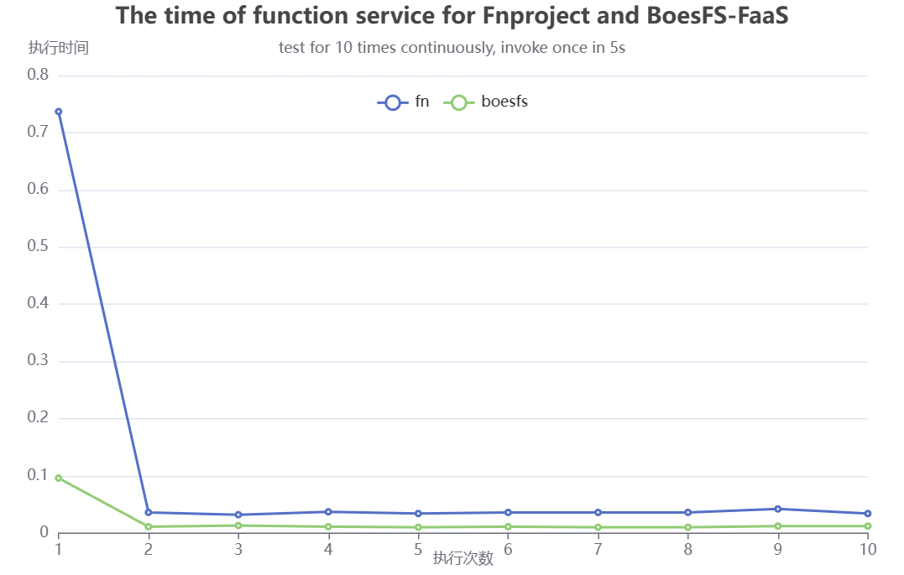
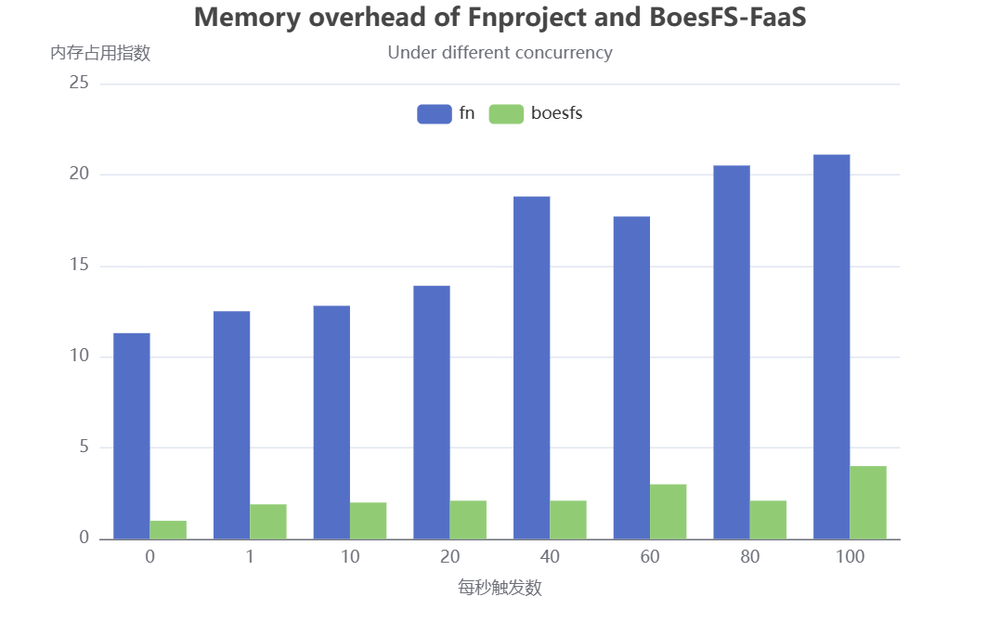

# BoesFS-FaaS测试文档

## 1 测试环境

| 环境指标     | 环境参数 |
| ------------ | -------- |
| Linux发行版  | Debian 9 |
| Linux内核    | 4.11.12  |
| 机器模式     | 虚拟机   |
| 内存大小     | 2G       |
| 硬盘大小     | 50G      |
| 处理器个数   | 2        |
| 处理器核数   | 2        |
| 处理器总核数 | 4        |

## 2 测试方法

### 2.1 FaaS场景需求

FaaS场景下通常需要满足如下需求：

**高速**。FaaS创建函数服务，运行并得到结果的速度要快，满足客户的快速响应需求。

**高频**。当负载集中爆发，FaaS平台需要支持高并发，同时处理多个全部请求。

**高密**。一个计算节点上的FaaS平台应当部署尽可能多的函数，以达到资源的最大化利用。

### 2.2 测试指标选取

对此，我们选取了如下指标进行测试：

① 单个函数部署的时间

开发者部署函数，到函数能够实际被触发运行所需要的时间，即函数被交付的时间，关系到开发者的体验

② 单个函数服务的时间

从客户触发函数，到挂起沙盒环境，再到函数被实例化运行，得到计算结果，并最终交付给客户所需要的时间

③ 高并发条件下的资源消耗

在高并发条件下，监视cpu占用情况，内存开销情况，比较高并发下的FaaS平台性能

### 2.3 测试对象

| FaaS平台    | 函数运行环境 |
| ----------- | ------------ |
| BoesFS-FaaS | BoesFS沙盒   |
| Fnproject   | Docker容器   |

### 2.4 测试方法

- 在宿主机中采用curl命令来远程访问虚拟机中搭建的FaaS平台的函数服务

```shell
curl -X "POST" -H "Content-Type: application/json" -d '{"name":"Felix"}' http://<虚拟机 IP>:8080/invoke/<FUNC ID>
```

- 采用time命令进行函数部署、函数触发到获取结果的时间采集

```shell
time boesfs-faas deploy --app myapp --local > /dev/null 2> /dev/null
```

```shell
time curl -X "POST" -H "Content-Type: application/json" -d '{"name":"Felix"}' http://192.168.177.203:8080/invoke/<FUNC ID>
```

- 在函数触发测试时，为充分考虑到冷热启动，改变了函数触发时间间隔依次为5s、30s、60s
- 高并发测试时，开启了n个0.1秒执行一次函数触发的线程，来模拟每秒并发数为10n的函数请求

shell脚本

```shell
// invoke_fast.sh
count=0
while [ $count -lt 300 ]; do
    time curl -X "POST" -H "Content-Type: application/json" -d '{"name":"Felix"}' http://<虚拟机 IP>:8080/invoke/$2
    count=$((count + 1))
    sleep $1
done
```

python脚本

```python
...
# 线程函数
def invoke_function(thread_name):
    print(f"Thread {thread_name} started")
    os.system("./invoke_fast.sh " + delay + " " + func_id)
    print(f"Thread {thread_name} completed")

# 创建n个线程
threads = []
for i in range(num_threads):
    thread = threading.Thread(target=invoke_function, args=(f"Thread {i}",))
    threads.append(thread)
...
```

- 用于测试部署的FaaS函数，采用python语言，采用最简单的模板，减少FaaS函数对实验结果的影响

函数主要逻辑是：获取并解析请求的输入，替换字符串，返回结果

```python
import io
import json
import logging

from fdk import response


def handler(ctx, data: io.BytesIO = None):
    name = "World"
    try:
        body = json.loads(data.getvalue())
        name = body.get("name")
    except (Exception, ValueError) as ex:
        logging.getLogger().info('error parsing json payload: ' + str(ex))

    logging.getLogger().info("Inside Python Hello World function")
    return response.Response(
        ctx, response_data=json.dumps(
            {"message": "Hello {0}".format(name)}),
        headers={"Content-Type": "application/json"}
    )
```

## 3 测试结果

### 3.1 单个函数部署的时间

下图横坐标表示单个函数的部署次数，纵坐标表示部署所需要的时间。

可以看到基于docker的fnproject在第一次部署时，必须拉取和构建docker镜像，耗时很高，为74.223s。后续第二次部署时，也要4.136s。而boesfs-faas无需docker镜像，只需动态安装boesfs内核模块，能实现实时交付。


### 3.2 单个函数服务的时间

下图横坐标表示函数触发的连续执行次数，纵坐标表示函数触发到获取结果的执行时间。

#### 3.2.1 触发间隔5s

当触发间隔为5s时，第一次均为冷启动，后续均为热启动。冷启动boesfs-faas只需0.096s，fnproject需要0.737s，降低87.0%。从第二次往后均为热启动，平均热启动boesfs-faas只需0.011s，fnproject需要0.034s，降低67.6%。总体上，10次平均响应时间，boesfs为0.0196s，fnproject为0.106s，降低81.5%。

总体上，触发时间为5s时，第一次冷启动，后续热启动，boesfs-faas的响应速度均快于fnproject。



|                 | boesfs-faas | fnproject | 时间开销降低 |
| --------------- | ----------- | --------- | ------------ |
| 冷启动(Sec)     | 0.096       | 0.737     | 87.0%        |
| 平均热启动(Sec) | 0.011       | 0.034     | 67.6%        |
| 平均响应(Sec)   | 0.0196      | 0.106     | 81.5%        |

#### 3.2.2 触发间隔30s

当触发间隔为30s时，fnproject均处于冷启动状态，且波动较大。boesfs-faas由于其冷热启动实现机制，也处于冷热启动的交替。

总体上，触发间隔为30s时，boesfs-faas的响应速度快于fnproject。


#### 3.2.3 触发间隔60s

当触发间隔为60s时，fnproject和boesfs-faas均处于冷启动状态。

总体上，触发间隔为60s时，只考虑冷启动，boesfs-faas的响应速度快于fnproject。时间平均开销降低90.8%。


|                | boesfs-faas | fnproject | 时间开销降低 |
| -------------- | ----------- | --------- | ------------ |
| 冷启动平均响应 | 0.091s      | 0.991s    | 90.8%        |

### 3.3 高并发条件下的资源消耗

下图的横坐标表示对faas平台每秒的触发数，纵坐标表示cpu的使用指数。随着每秒触发数的增加，两者的CPU开销均增加，但BoesFS-FaaS的CPU开销始终低于Fnproject。

注：当每秒请求为0时，表示没有函数请求，只有FaaS-Server运行的环境。


下图的横坐标表示对faas平台每秒的请求数，纵坐标表示内存的使用指数。不同的每秒触发数下，BoesFS-FaaS的内存开销始终低于Fnproject。


