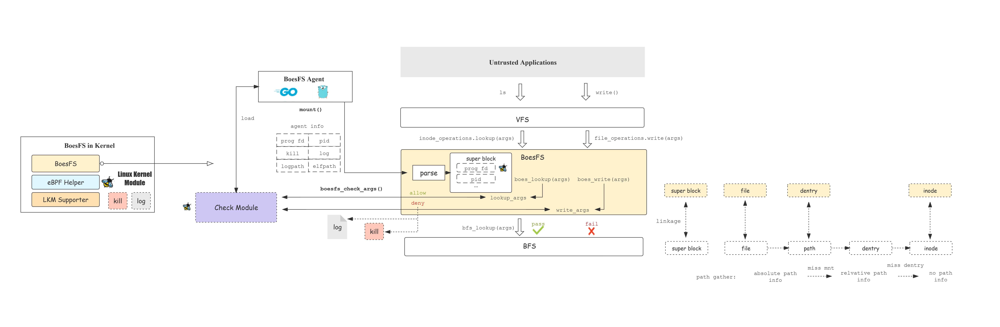
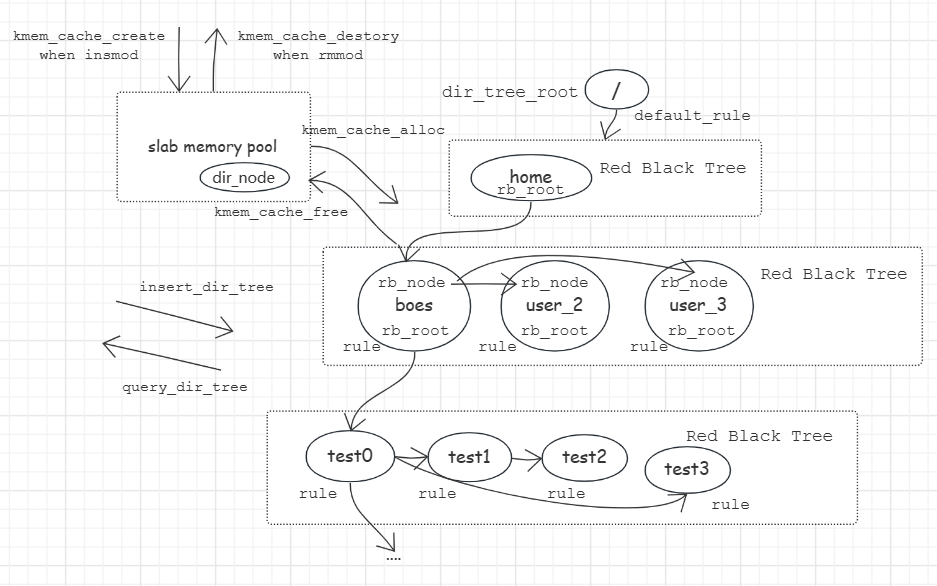

BoesFS-in-Kernel开发文档

## 1 BoesFS-in-Kernel总体介绍


BoesFS-in-Kernel是BoesFS项目的内核驱动部分，以一个可以动态插入（insmod）和卸载（rmmod）的内核模块的形式实现。BoesFS-in-Kernel为BoesFS项目提供了包括如下支持：

- **充当文件系统中间层**。BoesFS-in-Kernel注册为一个介于虚拟文件系统（VFS）到基础文件系统（BFS）的内核文件系统，充当了中间层，这使得BoesFS项目能够拦截所有VFS请求，从而来进行检查和拒绝操作。
- **提供和BoesFS-Agent交互的接口**。BoesFS-Agent通过mount系统调用来和BoesFS-in-Kernel进行交互，每次mount操作都可以创建一个新的文件系统沙盒层，mount的时候BoesFS-Agent将用户传来的操作参数选项传递给BoesFS-in-Kernel进行解析，BoesFS-in-Kernel将解析的结果存放在超级块中。
- **提供和BoesFS-Check-Module交互的接口**。BoesFS-in-Kernel约定了和BoesFS-Check-Module进行交互的参数格式，并提供运行BoesFS-Check-Module的入口函数，并向BoesFS-Check-Module传递所采集的参数，BoesFS-Check-Module会将检查结果返回给BoesFS-in-Kernel。
- **提供eBPF支持**。BoesFS-in-Kernel定义了全新的eBPF字节码类型，定义系列所需要的eBPF工具函数集、验证函数等。在插入内核模块的时候动态注册该eBPF字节码类型到内核中，在卸载内核模块的时候动态从内核中注销该eBPF字节码类型。
- **从最底层对象采集VFS接口函数的参数**。所有的用户态程序的VFS请求经过内核函数调用链，最终会来到VFS最底层的四个抽象对象（super block、file、dentry和inode）的操作方法。BoesFS-in-Kernel充当中间层，实现从虚拟文件系统（VFS）到基础文件系统（BFS）的VFS接口函数的请求转发。在转发过程中，BoesFS-in-Kernel能够按照和BoesFS-Check-Module约定的参数格式对VFS请求的参数做采集工作。
- **提供内核模块动态化插入和卸载的支持**。在Linux 4.11上，BoesFS-in-Kernel进行了可动态插入和卸载的内核模块的方式的探索。动态模块化的方式为拓展BoesFS-in-Kernel的功能提供了便利，极大方便BoesFS-in-Kernel的开发，避免每次修改带来的冗杂的内核编译，同时极大方便了用户的使用。提供的支持主要包括内核符号查找、eBPF字节码类型的动态注册等。
- **提供审计日志输出**。根据BoesFS-Agent传来的用户选项，包括：是否开启日志、输出日志的路径等，BoesFS-in-Kernel可以选择将所有被拒绝的VFS请求输出到审计日志，可供运行沙盒层的非特权用户进行查看。
- **提供终止异常进程**。根据BoesFS-Agent传来的用户选项，包括：是否开启此功能，拒绝次数的上限等，BoesFS-in-Kernel会从内核层直接向拒绝次数达到上限的程序（恶意程序）发送终止信号，停止该进程的运行。
- **提供修改用户的资源限制**。根据Linux的进程资源限制，进程默认的可锁内存区域为64KB，并且非特权用户不可以提高其上限值，BoesFS项目面向所有用户，因此在挂载BoesFS-in-Kernel项目的时候会根据挂载传入的参数，包括：用户名，可锁内存区域大小对进程资源限制进行修改。

## 2 BoesFS

### BoesFS层的设计思路

BoesFS是BoesFS-in-Kernel的第一个子模块，总体的设计架构图如上图所示，主要实现了BoesFS-in-Kernel的如下功能：①充当文件系统中间层、②提供和BoesFS-Agent交互的接口、③提供和BoesFS-Check-Module交互的接口、④提供参数采集、⑤提供审计日志输出、⑥提供终止异常进程、⑦修改用户资源限制。


如上图所示，BoesFS Agent加载检查模块进入内核后，会通过mount系统调用挂载一个BoesFS层，同时会把检查模块的fd以及用户的其他参数（数据格式参考解析Agent传入数据实现一节）通过mount系统调用的参数传给BoesFS的解析程序parse中。parse负责对Agent的参数进行解析，并将参数解析的结果放在可以唯一标识一个BoesFS层的超级块中。每次mount都会创建一个新的BoesFS层，标识不同的BoesFS层是通过BoesFS层的超级块来实现的。


不可信的应用程序执行文件操作，考虑如下两个场景：在bash里ls命令查找文件，或者在想通过write()系统调用来写文件。所有的这些文件操作首先会经过VFS层，通过调用链，最终分别来到inode operations的lookup函数接口和file opeartions的write函数接口。根据VFS的特点，VFS会调用某个具体的底层文件系统的实现。而BoesFS则充当了这个缓冲层，在VFS和底层文件系统的函数间做了简单的抽象和封装。这允许我们在 BoesFS层获取到VFS所有文件请求的全部参数，从而开展参数的检查和拒绝或允许访问的操作。


如上图中所示，在BoesFS中，各个抽象对象都和底层BFS建立了映射和联系。BoesFS的超级块和BFS的超级块耦合，BoesFS的file对象和BFS的file对象耦合，BoesFS的dentry对象和BFS的path对象耦合、BoesFS的inode对象和BFS的inode对象耦合。相互耦合的对象之间的接口函数的实现也会类似对应。根据Linux fs对这些抽象对象的实现，我们能够通过这个映射关系，从在BoesFS层的VFS文件请求的参数，例如file对象、dentry对象获取到被访问对象的绝对路径名，这也项目参数采集部分的一个重点和难点。


收集到的参数lookup_args和write_args，会被传入到字节码检查模块，根据预先设定的规则进行访问控制的判断。如果lookup合法，字节码检查模块会返回一个allow给BoesFS层，BoesFS层会将lookup操作放行，调用BFS对应实现的方法来实现该文件lookup操作。如果write非法，字节码检查模块会返回一个deny给BoesFS层，BoesFS层会将write操作终止，不会调用BFS对应实现的write方法，不会到达底层文件系统层。显然这些操作都是在内核完成的，所有的结果都是对用户或者说对BoesFS-Agent是透明的。BoesFS为此提供了审计功能，允许BoesFS-Agent传入指定选项，并根据用户指定的选项，选择是否终止该不可信程序或者是否输出审计日志，莱使用户更好的感知具体发生的检查情况。

### 解析Agent传入的数据实现

目前BoesFS-Agent和BoesFS-in-Kernel**所约定的传递参数的格式和字段含义**，如下表所示：

| 字段    | 类型       | 含义                                                                              |
| ------- | ---------- | --------------------------------------------------------------------------------- |
| fd      | 无符号整型 | BoesFS-Agent加载到内核的eBPF字节码的用户态fd指针                                  |
| pid     | 无符号整型 | 运行起的被沙盒程序的进程pid                                                       |
| kill    | 无符号整型 | 是否开启终止异常进程，kill如果为0则不开启，否则开启，并且kill的值为拒绝次数最大值 |
| log     | 布尔类型   | log为0表示不写日志，log为1表示写日志                                              |
| logpath | 字符串     | 审计日志文件的文件名                                                              |
| elfpath | 字符串     | 不可信程序的程序名                                                                |

**mount系统调用及其raw_data参数是BoesFS-Agent和BoesFS交互的桥梁**。文件系统类型（file_system_type）的mount接口原型的参数raw_data，为mount系统调用提供了挂载时向mount接口函数传递数据的方式。BoesFS-Agent向BoesFS-in-Kernel传递数据就是通过raw_data参数完成，以约定格式的字符串形式传递。

**BoesFS的parse模块负责参数解析与合法性检验**。BoesFS读取该数据后，会按照预定的格式，在内核对字符串做匹配解析操作（parse.c），在解析同时会根据字段的类型进行合法性的验证。约定的格式为：①通过"="来指明参数的值，例如"fd=xxx"；②通过","来区分不同的字段，例如"fd=xxx,kill=xxx"。

**解析后的参数存放在每个BoesFS层的超级块中**。根据BoesFS-in-Kernel的结构设计，BoesFS-Agent可以运行多个BoesFS层来同时支持并发对多个不可信进程的沙盒执行。每个BoesFS层存在一份对应的检查规则和定义参数，超级块能够唯一标识每一个BoesFS层，因此BoesFS-in-Kernel会将这些解析后的参数存放于每一个BoesFS层的超级块中。想使用这些参数的时候，当某个文件请求到达BoesFS层，需要通过文件请求的参数（如file、path、dentry或者inode对象）获取所对应的超级块，然后再根据超级块获取附加在其上的参数来使用。

下面展示了BoesFS超级块附加信息的数据结构。

维护dir_tree_root原因：受eBPF机制限制，字节码不能访问全局变量，故只能由沙盒层维护起来，每次调用时传入.
```c
struct boesfs_sb_info {
	struct super_block *lower_sb; // BFS的超级块指针
	struct bpf_prog *prog_pos; // prog的指针
	int pid; // 被沙盒的进程pid
	int kill; // 是否开启终止选项
	int deny; // 拒绝次数
	int log; // 是否开启日志选项
	struct dir_node* dir_tree_root;	//  dir tree 根节点
	char logpath[SINGLE_PATH_MAX];  // 日志文件路径
	char elfpath[SINGLE_PATH_MAX];  // 被沙盒的进程名
};
```

实现这解析BoesFS-Agent参数的这部分逻辑的代码主要在Code/BoesFS-in-Kernel/parse.c中实现。

### BoesFS的eBPF支持实现

**第一，介绍BoesFS的动态eBPF prog类型注册和注销**。BoesFS在内核中新增了自定义的eBPF hook点，需要在内核中注册一个新的eBPF字节码类型。在Linux 4.11及其以下的版本，注册新的eBPF字节码类型可以在内核模块中动态的完成，在更高的Linux内核版本上，注册新的eBPF字节码类型只能在修改内核源代码的基础上完成。我们在Linux 4.11上探索和实现了eBPF动态注册的内核模块化实现（具体实现参考eBPF Helper一节）。在内核模块安装（insmod）的时候，会调用eBPF Helper封装好的注册方法进行eBPF新的类型进行注册。在内核模块卸载（rmmod）的时候，也会调用对应的方法进行类型的取消注册。具体参考Code/BoesFS-in-Kernel/main.c中的实现。

```c
//main.c

static int __init init_boesfs_fs(void){
    ...
    err = boesfs_register_prog_type(); // 注册BoesFS prog 类型
    ...
}

static void __exit exit_boesfs_fs(void)
{
    ...
	boesfs_unregister_prog_type(); // 取消注册
	...
}
```

**第二，介绍解析prog fd和运行字节码的实现**。在解析Agent传入数据实现的一部分已经提到，解析后得到了BoesFS-Agent传来的prog fd。prog fd是用户态程序加载安全检查规则字节码后，能够使用的字节码fd。BoesFS内核层根据prog fd需要找到BoesFS-Agent进程fd表中的prog fd所对应的prog结构体的指针（该指针会存放在超级块中），并能够在指定的位置（hook点）运行该prog指针对应的字节码。实现获取和运行字节码的这部分逻辑的代码主要在Code/BoesFS-in-Kernel/prog.c中实现。

**第三，介绍BoesFS挂载时填充超级块的逻辑**。BoesFS层将其对应的参数挂载在其超级块附加信息中。每个mount()函数都要实现一个填充超级块的回调函数，两者传递的参数只有一个指针域。因此定义一个数据结构`boesfs_mount_data`管理传来的挂载目录`dev_name`和agent传递来的参数`agent_info`。通过传递该结构体的指针给填充超级块的回调函数，完成后续超级块的填充工作。

```c
// boesfs.h

struct boesfs_mount_data {
	void *dev_name;
	char *agent_info; // Agent data
};
```

```c
struct dentry *boesfs_mount(struct file_system_type *fs_type, int flags,
			    const char *dev_name, void *raw_data)
{
	struct boesfs_mount_data mount_data;
	mount_data.dev_name = (void *)dev_name;
	mount_data.agent_info = (char *)raw_data;
	return mount_nodev(fs_type, flags, (void *)&mount_data,
			   boesfs_read_super);
}
```

超级块填充函数拿到挂载路径和agent端传来的参数以后，会借助BoesFS封装的工具函数获取prog_fd，并通过prog.c中的实现的boesfs_set_prog_pos由prog_fd获取eBPF字节码并绑定到BoesFS的超级块中，如果获取失败会直接退出。然后再逐个解析agent传来的数据，并一一绑定到超级块中。

```c
// main.c

static int boesfs_read_super(struct super_block *sb, void *raw_data, int silent)
{
	...
  
	struct boesfs_mount_data * mount_data = (boesfs_mount_data * raw_data);
	char *dev_name = mount_data->dev_name;
	char * prog_info = mount_data->prog_info;
	int prog_fd;
  
	...
  
	boesfs_get_data_value(agent_info, 0, &prog_fd);// 从prog_info得到prog_fd
	...
        
	if (boesfs_set_prog_pos(sb, prog_fd))
		printk("Error: Set prog pos failed\n");
   
    
	boesfs_get_data_value(agent_info, 1, &(BOESFS_SB(sb)->pid));
	boesfs_get_data_value(agent_info, 2, &(BOESFS_SB(sb)->kill));
	boesfs_get_data_value(agent_info, 3, &(BOESFS_SB(sb)->log));
	boesfs_get_data_value(agent_info, 4, BOESFS_SB(sb)->logpath);
	boesfs_get_data_value(agent_info, 5, BOESFS_SB(sb)->elfpath);
    ...
}
```

**第四，介绍BoesFS实现获取字节码和运行字节码的函数**。BoesFS和字节码获取和运行有关的函数封装在prog.c文件中。由于是位于系统调用mount触发进入的内核，通过内核函数bpf_prog_get_type会在发起mount系统调用的进程文件描述符表中查找prog_fd对应的表项，并验证字节码类型，如果通过则获取到字节码的指针，并绑定在超级块的附加域中。

```c
int boesfs_set_prog_pos(struct super_block *sb, uint32_t prog_fd){
	...
	new_prog = bpf_prog_get_type(prog_fd, BPF_PROG_TYPE_BOESFS);

    if (IS_ERR(new_prog)){
        printk("ERROR: get prog from fd fail!\n");
        return ERR;
    }

    old_prog = sb_info->prog_pos;
    sb_info->prog_pos = new_prog;
    
    if (old_prog)
		bpf_prog_put(old_prog);
    
    ...
    }
```

运行字节码时， 我们从超级块的附加域中获取字节码，同时向其传递上下文，然后通过字节码触发函数运行字节码。

```c
int boesfs_run_prog(struct bpf_prog * prog_pos, struct boesfs_args * check_args)
{
    struct bpf_prog * run_prog;
    int ret;

	...

    // run_prog = prog_pos;
    run_prog = READ_ONCE(prog_pos); // 一定要READ ONCE?

    rcu_read_lock(); 
    ret = BPF_PROG_RUN(run_prog, check_args);
    rcu_read_unlock();

	...
}
```

**第五，介绍BoesFS取消挂载时清空超级块的逻辑**。在umount时，必须实现eBPF字节码的释放工作，不然会一直占用着memlock资源，使得后续的字节码无法被加载。

```c
void boesfs_shutdown_super(struct super_block *sb)
{
	//  destroy something when the prog exit , such as dir tree ...
	struct boesfs_args exit_ebpf_args;
	exit_ebpf_args.op = BOESFS_DESTROY;
	exit_ebpf_args.dir_tree_root = BOESFS_SB(sb)->dir_tree_root;
	boesfs_run_prog(BOESFS_SB(sb)->prog_pos,&exit_ebpf_args);

	bpf_prog_put(BOESFS_SB(sb)->prog_pos); // 释放掉超级块对prog的引用
	/* 后续看情况还要不要新增别的内容 */
	return generic_shutdown_super(sb);
}
```

**第六，介绍注册BoesFS文件系统和eBPF的类型**。根据实现的填充超级块函数和释放超级块函数声明BoesFS文件系统。为了满足普适所有用户的理念，同时面向非特权挂载，设置fs_flags为FS_USERNS_MOUNT。

```c
static struct file_system_type boesfs_fs_type = {
	.owner		= THIS_MODULE,
	.name		= BOESFS_NAME,
	.mount		= boesfs_mount, // 我们填充超级块的逻辑
	.kill_sb	= boesfs_shutdown_super, // 我们释放超级块的逻辑
	.fs_flags	= FS_USERNS_MOUNT, // 面向非特权用户
};
```

在内核模块初始化的时候，依次完成内核符号获取，文件系统注册，eBPF字节码注册的工作。

```c
static int __init init_boesfs_fs(void)
{
	int err;
	int i;

	pr_info("Registering boesfs " BOESFS_VERSION "\n");

	get_all_symbol_addr();
	
    ...
	err = register_filesystem(&boesfs_fs_type);

	err = boesfs_register_prog_type(); // 注册BoesFS prog 类型

	...
}
```


### BoesFS参数采集和传递给eBPF字节码的实现

#### BoesFS hooked VFS operations

BoesFS的采集能力介绍

- VFS四大抽象对象的全部覆盖(file、inode、dentry、super block)
- 面向User Space使用的VFS API全部覆盖（read、...、mmap、statfs）
- 从最底层接口出发，具备防劫持能力，且最细粒度控制能力
- 在上述基础上，能覆盖所有文件相关的系统调用，以及系统调用之外的函数接口。
- 极其优秀的文件系统沙盒能力和检测能力

目前boesfs拟支持的API（VFS operations）（共20个）拟包括：

- [X] read
- [X] write
- [X] lookup
- [X] open
- [X] unlink
- [X] mkdir
- [X] rmdir
- [X] mknod
- [X] create
- [X] link
- [X] symlink
- [X] rename
- [X] setattr
- [X] getattr
- [X] llseek
- [X] iterate
- [X] mmap
- [X] d_revalidate(lookup2)
- [X] statfs
- [X] fsync

目前boesfs拟支持的对象包括：

- [X] file
- [X] inode
- [X] dentry
- [X] super block

其中，BoesFS导出的API和VFS对象对应关系如下表：

| VFS对象     | BoesFS导出的API                                                                      |
| ----------- | ------------------------------------------------------------------------------------ |
| file        | read、write、open、llseek、iterate、mmap、fsync                                      |
| inode       | lookup、unlink、mkdir、rmdir、create、mknod、rename、setattr、getattr、link、symlink |
| dentry      | d_revalidate(lookup2)                                                                |
| super block | statfs                                                                               |

BoesFS项目hook的函数及其采集的原因和场景分析，如下表所示：

| 编号 | API函数               | 对应的操作对象 | hook原因描述                                                                              |
| ---- | --------------------- | -------------- | ----------------------------------------------------------------------------------------- |
| 1    | read                  | file           | 读取一个文件需要通过read函数。                                                            |
| 2    | write                 | file           | 往一个文件里写需要通过write函数。                                                         |
| 3    | lookup                | inode          | 访问一个文件需要都要通过lookup函数。例如，可以实现隐私文件对不可信应用的完全隐藏。        |
| 4    | open                  | file           | 打开一个文件需要经过open函数。                                                            |
| 5    | mkdir                 | inode          | 创建一个文件夹需要通过mkdir函数。比如允许在哪个位置下创建文件夹，是否允许创建隐藏文件夹。 |
| 6    | unlink                | inode          | 删除一个文件需要都要通过unlink函数。                                                      |
| 7    | rmdir                 | inode          | 采集理由同unlink。不同之处在于删除一个文件夹。                                            |
| 8    | mknod                 | inode          | 创建一个特殊文件需要通过mknod函数。                                                       |
| 9    | create                | inode          | 创建一个普通文件需要通过create函数。                                                      |
| 10   | link                  | inode          | 创建一个硬链接需要通过link函数。                                                          |
| 11   | symlink               | inode          | 创建一个符号链接需要通过link函数。                                                        |
| 12   | rename                | inode          | 重命令一个文件需要通过rename函数。                                                        |
| 13   | setattr               | inode          | 设置可执行权限chmod或者修改所属用户和用户chown组需要通过setattr函数。                     |
| 14   | getattr               | inode          | 获取一个文件的元信息需要通过getattr函数。                                                 |
| 15   | llseek                | file           | 定位文件偏移量需要通过llseek函数。                                                        |
| 16   | iterate               | file           | 遍历一个目录文件需要通过iterate函数。                                                     |
| 17   | mmap                  | file           | 将文件映射到内存需要通过mmap函数。                                                        |
| 18   | d_revalidate(lookup2) | dentry         | 访问一个文件还可能通过d_revalidate函数。                                                  |
| 19   | statfs                | super          | 查看一个文件系统的信息需要通过statfs函数。                                                |
| 20   | fsync                 | file           | 强行进行文件的磁盘同步需要通过fsync函数。                                                 |

BoesFS项目hook的函数的采集参数，如下表所示：

| 编号 | API函数               | 检查参数个数 | arg1                                          | arg2                                            | arg3                                          | arg4                  |
| ---- | --------------------- | ------------ | --------------------------------------------- | ----------------------------------------------- | --------------------------------------------- | --------------------- |
| 1    | read                  | 3            | char path[PATH_MAX]，文件完整路径名           | int len，读取数据的长度                         | int offset，读取的偏移指针                    |                       |
| 2    | write                 | 3            | char path[PATH_MAX]，文件完整路径名           | int len，读取数据的长度                         | int offset，写入的偏移指针                    |                       |
| 3    | lookup                | 2            | char path[PATH_MAX]，文件完整路径名           | int flags，lookup标志位                         |                                               |                       |
| 4    | open                  | 1            | char path[PATH_MAX]，文件完整路径名           |                                                 |                                               |                       |
| 5    | mkdir                 | 2            | char path[PATH_MAX]，文件完整路径名           | int mode，创建的模式                            |                                               |                       |
| 6    | unlink                | 1            | char path[PATH_MAX]，文件完整路径名           |                                                 |                                               |                       |
| 7    | rmdir                 | 1            | char path[PATH_MAX]，文件完整路径名           |                                                 |                                               |                       |
| 8    | mknod                 | 3            | char path[PATH_MAX]，文件完整路径名           | int mode，创建的模式                            | int dev，设备类型                             |                       |
| 9    | create                | 2            | char path[PATH_MAX]，文件完整路径名           | int mode，创建的模式                            |                                               |                       |
| 10   | link                  | 2            | char path[PATH_MAX]，被链接文件完整路径名     | char linkpath[PATH_MAX]，链接文件完整路径名     |                                               |                       |
| 11   | symlink               | 2            | char path[PATH_MAX]，被链接文件完整路径名     | char linkpath[PATH_MAX]，链接文件完整路径名     |                                               |                       |
| 12   | rename                | 2            | char path[PATH_MAX]，文件旧的完整路径名       | char newpath[PATH_MAX]，文件新的完整路径名      |                                               |                       |
| 13   | setattr               | 4            | char path[PATH_MAX]，文件完整路径名           | int mode，模式                                  | int uid，所属用户                             | int gid，所属的用户组 |
| 14   | getattr               | 1            | char path[PATH_MAX]，文件完整路径名           |                                                 |                                               |                       |
| 15   | llseek                | 3            | char path[PATH_MAX]，文件完整路径名           | int offset，相对于基地址的偏移                  | int whence，llseek的偏移基地址类型            |                       |
| 16   | iterate               | 1            | char path[PATH_MAX]，待遍历的目录路径名       |                                                 |                                               |                       |
| 17   | mmap                  | 3            | char path[PATH_MAX]，文件完整路径名           | void* startaddr，映射到的连续内存区域的起始地址 | void* endaddr，映射到的连续内存区域的起始地址 |                       |
| 18   | d_revalidate(lookup2) | 2            | char path[PATH_MAX]，文件完整路径名           | int flags，lookup标志位                         |                                               |                       |
| 19   | statfs                | 1            | char path[PATH_MAX]，用于查看文件系统的路径名 |                                                 |                                               |                       |
| 20   | fsync                 | 2            | char path[PATH_MAX]，待刷文件完整路径名       | int len，同步数据大小                           |                                               |                       |

#### 采集参数的格式定义

- 参数统一定义

BoesFS所有API（如read、write等）采集的参数由boesfs_args_t结构体统一表示。这个统一的结构体是BoesFS和eBPF Helper字节码进行交互的上下文结构体ctx。

boesfs_args_t结构体包含三个成员：

| 成员                        | 描述                         |
| --------------------------- | ---------------------------- |
| int op                      | 参数类型（如read、write等）  |
| union_args_t	args           | 不同类型的参数，用联合体表示 |
| char elfpath[PATH_MAX_SUPP] | 发起文件请求的程序名         |

```c
typedef struct boesfs_args{
    int op;
	union_args_t	args;
	char elfpath[PATH_MAX_SUPP];
}boesfs_args_t;
```

- 参数类型的宏

不同的参数类型通过宏定义进行表示。

```c
#define BOESFS_READ 	0
#define BOESFS_WRITE 	1
#define BOESFS_LOOKUP	2
#define BOESFS_OPEN		3
#define BOESFS_MKDIR	4
#define BOESFS_UNLINK	5
#define BOESFS_RMDIR	6
...
```

- 不同类型的参数的结构体

不同的参数类型会对应不同的参数成员，对于每种操作(vfs_function),采集的参数都有一个结构体对应。以read和lookup为例，对应的参数类型定义如下：

read

```c
typedef struct read_boesfs_args{
	char path[PATH_MAX_SUPP];
	int len;
	int offset;
}read_boesfs_args_t;
```

lookup

```c
typedef struct lookup_boesfs_args{
	char path[PATH_MAX_SUPP];
	int flags;
}lookup_boesfs_args_t;
```

其他API的参数类型类似上述两种参数类型的表示，通过查阅BoesFS支持的参数列表和源码ebpf_helper.h了解更详细内容。

- 不同类型的参数的联合体

由于eBPF的字节码检查机制，其中字节码的访问地址越界检查是通过检测字节码访存范围是否超过上下文的大小来确定的，这个检查是加载字节码时静态确定的。因此，每次传入的上下文的大小应该是固定的。但是不同类型的参数的结构体大小不一，这可能会带来越界访问的问题。

因此我们采用的解决方案是，使用一个不同类型的参数的联合体union_args_t来统一表示所有的参数。

```c
typedef union args{
	lookup_boesfs_args_t 	lookup_args;
	unlink_boesfs_args_t 	unlink_args;
	read_boesfs_args_t   	read_args;
	open_boesfs_args_t   	open_args;
	write_boesfs_args_t  	write_args;
	mkdir_boesfs_args_t 	mkdir_args;
	rmdir_boesfs_args_t 	rmdir_args;
    ...
} union_args_t;
```

#### 从VFS对象实现绝对路径解析

在VFS API的参数采集中，一个难点是采集参数中绝对路径的获取。VFS API的参数通常是VFS对象，如path对象等。要想实现参数采集，首先要对VFS对象进行解析操作从而获取对应的绝对路径。

为了实现绝对路径解析，BoesFS封装了从path对象、file对象、dentry对象获取对应的绝对路径的方法，三种VFS对象对应的解析方法和解析原理如下：

- path对象

path对象包含了 <mnt, dentry>，mnt为挂载点路径信息，dentry包含相对于挂载点的路径信息。由path对象，内核提供了d_path()的API来获取path对象对应的绝对路径。

这里的path对象，可以是：①BoesFS的path对象、②Basic FS的path对象。

| 函数名                             | 描述                                                  | 参数1         | 描述                              | 参数2  | 描述                             | 返回值 | 描述             |
| ---------------------------------- | ----------------------------------------------------- | ------------- | --------------------------------- | ------ | -------------------------------- | ------ | ---------------- |
| get_absolute_path_from_path_struct | 从path结构（boesfs 和 bfs均可）中得到对应的绝对路径名 | struct path * | 目标的path结构（boesfs 和 bfs均可 | void * | 一个可用的缓冲区，大小为PATH_MAX | char*  | 得到的绝对路径名 |

```c
char * get_absolute_path_from_path_struct(struct path * target_path, void *path_buf){
	...
	// path对象维护了挂载点路径和相对于挂载点的路径
	// 通过d_path直接获取绝对路径
    char * ab_path = d_path(target_path, (char *)path_buf, PATH_MAX);
	... //略
    return ab_path;
}

```

- file对象

file对象会关联一个path对象。内核提供了file_path()的API来获取file对象对应的绝对路径。

这里的file对象，可以是：①BoesFS的file对象、②Basic FS的file对象。

| 函数名                             | 描述                                                  | 参数1         | 描述                                  | 参数2  | 描述                             | 返回值 | 描述             |
| ---------------------------------- | ----------------------------------------------------- | ------------- | ------------------------------------- | ------ | -------------------------------- | ------ | ---------------- |
| get_absolute_path_from_file_struct | 从file对象（boesfs 和 bfs均可）得到其对应的绝对路径名 | struct file * | 目标文件file对象（boesfs 和 bfs均可） | void * | 一个可用的缓冲区，大小为PATH_MAX | char*  | 得到的绝对路径名 |

```c
char * get_absolute_path_from_file_struct(struct file * target_file, void *path_buf){
	... //略
	// file对象对应一个path对象
	// 通过file_path直接获取绝对路径
	char * ab_path = file_path(target_file, (char *)path_buf, PATH_MAX);
	... //略
    return ab_path;
}
```

- dentry对象

在dentry对象中，相对于path对象，dentry对象缺失了挂载点mnt信息，仅仅维护了相对于挂载点的相对路径信息。从VFS的dentry对象已经无法获取对应的绝对路径。

在BoesFS中设计中，BoesFS的dentry对象和Basic FS的path对象进行了绑定。通过boesfs_get_lower_path()和boesfs_put_lower_path()可以引用获取和释放BoesFS的dentry对象对应的Basic FS的path对象。再通过上述path对象获取绝对路径的方法，即可完成绝对路径的解析。

这里的dentry对象，只可以是BoesFS的dentry对象。

| 函数名                               | 描述                                         | 参数1           | 描述                           | 参数2  | 描述                             | 返回值 | 描述             |
| ------------------------------------ | -------------------------------------------- | --------------- | ------------------------------ | ------ | -------------------------------- | ------ | ---------------- |
| get_absolute_path_from_dentry_struct | 从dentry对象（boesfs）得到其对应的绝对路径名 | struct dentry * | 目标dentry对象（只能是boesfs） | void * | 一个可用的缓冲区，大小为PATH_MAX | char*  | 得到的绝对路径名 |

```c
char * get_absolute_path_from_dentry_struct(struct dentry * target_boesfs_dentry, void *path_buf){
	// 主要思路有两个
	// 1. boesfs dentry -> get lower path
	... //略 
	// 获取底层path对象
	boesfs_get_lower_path(target_boesfs_dentry, &lower_path);
	// 借助path对象的方法
	ab_path = get_absolute_path_from_path_struct(&lower_path, path_buf);
	// 对应做释放，否则会一直引用
	boesfs_put_lower_path(target_boesfs_dentry, &lower_path);
	... //略 
	return ab_path;
}
```

注：在Linux设计中，inode对象已经完全缺失了路径信息。BoesFS不考虑从inode对象进行绝对路径的解析操作。

#### API采集参数的实现

参数的采集主要基于VFS API的参数实现，通过参数列表得到采集列表。采集到不同API所需的参数后会封装到统一的boesfs的参数结构体 `boesfs_args`，并通过 `boesfs_run_prog`传递给eBPF字节码进行检查。如果检查不通过，则直接返回，不会执行真正的VFS API逻辑。

以 `read`的参数采集为例，其采集逻辑如下图所示：

```c
// file.c

static ssize_t boesfs_read(struct file *file, char __user *buf,
			   size_t count, loff_t *ppos)
{
    ...

	// boesfs args
	struct boesfs_args args;
	args.op = BOESFS_READ;
	memcpy(args.elfpath, BOESFS_SB(file->f_inode->i_sb)->elfpath, SINGLE_PATH_MAX);
	// read args
	args.args.read_args.len = (int)count;
	args.args.read_args.offset = (int)*ppos;

	memcpy(args.args.read_args.path, file_path, strlen(file_path) + 1);
	err = boesfs_run_prog(BOESFS_SB(file->f_inode->i_sb)->prog_pos, &args);
   
    ...
   
    if (err < 0)
		return err;
  
    ...
}
```

### 审计日志输出实现

完整的沙盒应具备审计的功能，包括所有被拒绝文件请求的记录，甚至是所有文件请求的记录。作为一款优秀的沙盒文件系统，BoesFS提供审计日志的可选功能，可以记录所有被拒绝的文件请求，将其输出到审计文件中。管理者可以通过日志来审计每个进程发起的不符合规则的文件请求操作。

BoesFS项目的审计日志在BoesFS-in-Kernel实现。BoesFS-in-Kernel会最先获取到有关文件请求的接受或者拒绝结果，并直接在内核进行写文件操作，能最快速和高效的实现审计日志输出的逻辑。

BoesFS-in-Kernel审计日志的实现逻辑主要如下：

首先，是**日志信息结构体设计**。内核写文件的函数需要封装为线程函数（后面介绍原因），线程函数传入的参数统一为缓冲区指针 `void *`。BoesFS为了方便起见，封装待写入的日志文件路径（保存在每个BoesFS沙盒层的超级块中）和待写入的一条格式化文件请求消息为一个结构体log_info中。然后每次调用内核写文件函数，就将该结构体指针传入即可。

| 成员                       | 描述                           |
| -------------------------- | ------------------------------ |
| char message[MESSAGE_MAX]; | 待写入的一条格式化文件请求消息 |
| char logfile[PATH_MAX]     | 待写入的日志文件路径           |

```c
// boesfs.h
/* log struct */
typedef struct log_info{
    char message[MESSAGE_MAX];
	char logfile[PATH_MAX];
}log_info;
```

其次，是**内核写文件逻辑的实现**。① 在内核模块进行写文件操作，需要通过内核提供的函数 `filp_open`和 `filp_close`来实现文件的打开和关闭操作，通过vfs函数接口 `vfs_write`来实现文件的写操作。②`vfs_write`参数的地址默认来自用户态，不允许来自内核态。使用set_fs(KERNEL_DS)能将 `vfs_write`参数的地址范围扩大到内核态。

| 函数名   | 描述                     | 参数1      | 描述         | 返回值 | 描述                  |
| -------- | ------------------------ | ---------- | ------------ | ------ | --------------------- |
| log_func | 日志记录写文件的线程函数 | void* data | 日志结构信息 | int    | 0表示成功，-1表示失败 |

```c
int log_func(void * data){
    struct log_info *log = (struct log_info*)data; 
	... //略
    memcpy(message, log->message, strlen(log->message) + 1);
    memcpy(logfile, log->logfile, strlen(log->logfile) + 1);
	... //略
    file = filp_open(logfile, O_RDWR|O_APPEND|O_CREAT,0644);
	... //略
    fs_bak = get_fs(); 
    set_fs(KERNEL_DS);

    pos = file->f_pos;
    vfs_write(file, message, len, &pos);

    filp_close(file,NULL);
    set_fs(fs_bak);
	... //略
}
```

然后，是**通过内核线程的方式来写文件**。每次通过开启一个内核线程来往指定文件输出一条日志信息。在实际通过内核模块写文件时，遇到了写阻塞的问题（参考遇到的困难6），这是内核设计上的问题。最终BoesFS采取了开内核线程的方式解决上述问题。

```c
static struct task_struct *log_write_kthread = NULL;


int boesfs_log(struct boesfs_args * args, char * logfile){
    struct log_info * log;
    log = (log_info *)kmalloc(sizeof(log_info),GFP_KERNEL);
	... //略
    char message[MESSAGE_MAX];

    memset(message, 0, MESSAGE_MAX);

    int ret = args_to_string(args, (char *)message);
	... //略
    memcpy(log->message, message, strlen(message) + 1);
    memcpy(log->logfile, logfile, strlen(logfile) + 1);

    log_write_kthread = kthread_run(log_func, log, "kthread-boesfs-log"); 

    ... //略
}
```

最后，是**格式化不同类型的参数为输出信息**的函数。该函数实现的逻辑主要是通过参数的类型来对参数进行处理，得到输出到审计日志中的最终信息。下面以 `BOESFS_READ`类型来举例，根据read类型的参数格式，格式化排列read的采集的所有的参数的值，得到格式化后的输出信息message。

| 函数名         | 描述                                            | 参数1                     | 描述                 | 参数2          | 描述             | 返回值 | 描述                  |
| -------------- | ----------------------------------------------- | ------------------------- | -------------------- | -------------- | ---------------- | ------ | --------------------- |
| args_to_string | 输入一个boesfs_args结构体，格式化得到字符串信息 | struct boesfs_args * args | 待格式化的参数结构体 | char * message | 返回的格式化结果 | int    | 0表示成功，-1表示失败 |

```c
int args_to_string(struct boesfs_args * args, char * message){
  
    ... //略
  
    switch (type)
    {
    case BOESFS_READ:
        memcpy(&message[pos], "read,", strlen("read,")+1);
        pos += strlen("read,");
        len = strlen(args->args.read_args.path) > LOG_PATH_MAX-1 ? LOG_PATH_MAX-1 : strlen(args->args.read_args.path);
        memcpy(log_path, args->args.read_args.path, len+1);
        log_path[len] = '\0';
        sprintf(&message[pos],"%s,",log_path);
        pos += len+1;
        sprintf(log_other,"%d,%d",args->args.read_args.len, args->args.read_args.offset);
        len = strlen(log_other);
        memcpy(&message[pos], log_other, len);
        pos += len;
        message[pos] = '\n';
        pos += 1;
        message[pos] = '\0';
        break;
   ... //略
}
```

### 终止进程的实现

考虑到包括但是不限于如下场景：①某些进程在文件请求受限后，可能会影响其正常逻辑功能，此时需要直接终止该进程。②某些进程是恶意进程，会发生大批量的恶意文件请求操作，当恶意文件请求操作达到一定的上限时，就判定其恶意行为，直接终止进程，避免大批量的“检查”-“拒绝”操作带来的性能开销。

BoesFS提供了终止进程的功能，即允许运行者设置进程文件请求被拒绝次数的上限值。如果该进程文件请求被拒绝次数超过该上限值，那么BoesFS可以直接终止该进程的运行。例如，对于上述的场景1，直接设置上限值为1即可；对于场景2，设置一个合理的上限值，如100等。终止进程的实现能体现BoesFS的灵活的安全审计和控制能力。

具体实现上，BoesFS-Agent在挂载沙盒层的时候，会将运行的子进程的pid和用户设置的上限值传入给BoesFS-in-Kernel。BoesFS-in-Kernel会将该pid和上限值维护在超级块中（见解析Agent传入的数据实现）。此外每个沙盒层还会在超级块维护当前进程文件请求所拒绝的次数。

```c
struct boesfs_sb_info {
	...
	int pid; // 被沙盒的进程pid
	int kill; // 是否开启终止选项
	int deny; // 拒绝次数
	...
};
```

考虑到在沙盒环境下，运行的进程可能会创建新的子进程，如果直接采用SIGKILL信号终止pid对应的进程，该进程衍生的子进程还会照样运行，同时会变为孤儿进程，无法达到正确的终止逻辑。

BoesFS的实现方案为：根据超级块维护的子进程pid，使用内核提供的 `__kill_pgrep_info`函数，向pid对应的进程组发送信号。发送的信号为SIGHUP，该信号会终止从pid对应的进程组开始的所有的衍生进程。

每当一个文件请求被拒绝，BoesFS都会检查拒绝次数是否达到上限，如果达到上限，则会执行上述的终止逻辑。

```c
// kill.c
int boesfs_kill(pid_t pid){

	...

	info.si_signo = SIGHUP;
	info.si_errno = 0;
	info.si_code = SI_KERNEL;
	info.si_pid = task_tgid_vnr(current);
	info.si_uid = from_kuid_munged(current_user_ns(), current_uid());

    if(pid>0){
        read_lock(k_tasklist_lock);
		ret = k___kill_pgrp_info(SIGHUP, &info, find_vpid(pid));
	    read_unlock(k_tasklist_lock); 
        return ret;
    }

    ...
}
```

```c
// eg: lookup.c
		...
  
        // 记录拒绝次数
		if(err < 0)
			BOESFS_SB(file->f_inode->i_sb)->deny += 1;
  
		// kill
		if(err < 0 && BOESFS_SB(dentry->d_sb)->kill!=0){
			// 比较kill 和 deny并杀死进程
			if(BOESFS_SB(dentry->d_sb)->deny > BOESFS_SB(dentry->d_sb)->kill)
				boesfs_kill((pid_t)BOESFS_SB(dentry->d_sb)->pid);
		}
		...
```

### 修改用户资源限制的实现

在Linux的设计上，会对进程的使用资源进行限制（resource limit，即rlimit）。rlimit又包括soft limit和hard limit，且满足soft limit <= hard limit。只有特权进程才能提高自身的hard limit值。其他普通进程只能降低hard limit值。

| rlimit类型 | 描述                     |
| ---------- | ------------------------ |
| soft limit | 警告设定，超过有警告信息 |
| hard limit | 严格设定，无法超过该值   |

在这些限制的资源中，锁定内存区域memlock就是其中一项。在eBPF的设计上，eBPF Map和eBPF Prog是一种特殊的文件，需要存放于memlock中，避免被换入和换出。因此在加载字节码的时候需要预先申请到预定大小的memlock，如果申请失败则无法加载字节码。

对于某个用户的所有进程的资源限制，Linux的安全模块允许通过配置文件 `/etc/security/limits.conf`来进行修改。如下面的修改，即允许boes用户的全部进程对于memlock的hard rlimit和soft rlimit的资源限制均为512KB。

```shell
# /etc/security/limits.conf
boes	hard	memlock		512
boes    soft    memlock     512
```

BoesFS提供代理修改上述配置文件的功能。当特权用户在挂载内核模块的时候可以通过类似如下的方式对系列用户的资源限制值进行修改。

```shell
sudo insmod boesfs.ko user=xxx,xxx limit=xxx,xxx
# 例如上述例子中，使用如下挂载命令
sudo insmod boesfs.ko user=xxx,xxx limit=xxx,xxx
```

BoesFS实现修改用户资源限制的逻辑主要是：

首先，是解析内核模块的参数。通过内核模块传参的方式获取需要修改的用户和对应的资源限制值。

```c
// main.c

#define USER_MAX 10

/* 内核模块参数 */
static char *user[USER_MAX] = {"", "", "", "", "", "", "", "", "", ""};
static int limit[USER_MAX] = {0, 0, 0, 0, 0, 0, 0, 0, 0, 0};
static int user_num = 0;
static int limit_num = 0;
 
/* 传参声明 */
module_param_array(user , charp , &user_num , S_IRUGO);
module_param_array(limit , int , &limit_num , S_IRUGO);
```

其次，是内核写文件方式写配置文件。类似于审计日志的实现，通过内核线程的方式来写配置文件 `/etc/security/limits.conf`。

| 函数名          | 描述                                        | 参数1       | 描述   | 参数2     | 描述                | 返回值 | 描述                 |
| --------------- | ------------------------------------------- | ----------- | ------ | --------- | ------------------- | ------ | -------------------- |
| set_user_limits | 内核写资源限制配置文件，修改memlock资源限制 | void * user | 用户名 | int limit | memlock资源限制大小 | int    | 0表示成功,-1表示失败 |

```c
int set_user_limits(void * user, int limit){
	...

    if(limit > RLIMIT_MAX)
        return ERR;

    if((strlen(user) + strlen("hard") + strlen("memlock") + strlen("4096") + 3*strlen("\t") + strlen("\n")) 
        > LIMIT_INFO_MAX)
        return ERR;

    info1 = (char *)kmalloc(LIMIT_INFO_MAX,GFP_KERNEL);
    info2 = (char *)kmalloc(LIMIT_INFO_MAX,GFP_KERNEL);

    sprintf(info1, "%s\thard\tmemlock\t%d\n", user, limit);

    limit_write_kthread1 = kthread_run(write_func, info1, "kthread-boesfs-rlimit1"); 

    sprintf(info2, "%s\tsoft\tmemlock\t%d\n", user, limit);

    limit_write_kthread2 = kthread_run(write_func, info2, "kthread-boesfs-rlimit2"); 

	...
}
```

最后，是在模块初始化修改配置文件。在内核模块初始化的时候，如果传入了对应的参数，那么就会修改rlimit配置文件，实现修改用户资源限制的功能。

```c
// main.c
static int __init init_boesfs_fs(void)
{
    ...
    /* 修改rlimit配置文件 */
    if(user_num != limit_num)
        printk("ERROR: user num != limit num");
    else if(user_num == limit_num && user_num != 0){
        for (i=0; i<user_num; i++){
            set_user_limits(user[i], limit[i]);
            printk("user=%s, limit=%d\n", user[i], limit[i]);
        }
  
    }
   ...
}
```

在卸载模块时，会删除之前添加的memlock限制
```c
static void __exit exit_boesfs_fs(void)
{
    ...
	reset_user_limits();
	...
    pr_info("Completed boesfs module unload\n");
}


/**
 * @brief 重置boesfs添加的memlock限制
 * 
 * @return int 0表示成功,-1表示失败
 */
int reset_user_limits(void){
    printk("reset!\n");
    limit_trunc_kthread = kthread_run(trunc_func, NULL,"kthread-boesfs-rlimit3"); 
    if (!limit_trunc_kthread) {
		printk("limit_trunc_kthread fail");
		return ERR;
	}
    return 0;
}
```


## **3 eBPF Helper**

- 架构图
  

### **与eBPF prog和Boesfs-Kernel接口**

- **ebpf_helper.h**
  - 对于每一种操作，也即每一种vfs_function，都有自己采集参数的结构体. 对eBPF prog编写者更加友好,避免编写者需要考虑每个位置存放什么参数.
    - 由于eBPF的verifier机制，而其中必定会对字节码访问kernel context的范围进行限制与判定，为了方便判定，我们使用union将这些args结构体统一起来
        - 这样即便越界了struct args，也只会在union的范围内访问到脏数据，而绝对不会对kernel本身造成影响
  - struct boesfs_args即为传递给eBPF prog的kernel context;
  - 采集参数结构体
  ```c
    //   BoesFS采集参数表示
    //  对于每种操作(vfs_function),采集的参数都有一个结构体对应
    typedef struct read_boesfs_args{
        char	path[PATH_MAX_SUPP];
        int		len;
        int		offset;
    }read_boesfs_args_t;
  
      ...
    //  union统一起来. 便于is_valid_access检测内存访问越界.
    typedef union args{
        lookup_boesfs_args lookup_args;
        unlink_boesfs_args unlink_args;
        read_boesfs_args   read_args;
        open_boesfs_args   open_args;
        write_boesfs_args  write_args;
        ...
    } union_args;
  ```
  - 上下文结构体
    - 关于dir_tree_root：由于字节码禁止访问全局生命周期的变量，故字节码只能将dir_tree_root初始化后交由沙盒层维护（存于boesfs_info结构体中），然后每次再传进来使用.
    ```c
    //  传递给bpf prog的上下文结构体
    typedef struct boesfs_args {
        int op;									//  op
        union_args_t	args;					//  op args
        struct dir_node *dir_tree_root;			//  dir_tree_root
        char elfpath[PATH_MAX_SUPP];			//  useless
    } boesfs_args_t;
    ```

### **helper function**

- **ebpf_helper.c**
- 如何新定义eBPF prog type，并且提供eBPF Helper function ?

  - Flexible: 放在beosfs下，进行模块化编译. 将eBPF prog type和eBPF Helper function作为内核模块插入到kernel中.
  - Normal : 放在kernel/fs下，将eBPF prog type 和 eBPF Helper function放入kernel编译.
  - 关于是否可以模块化的讨论在下文.
- **提供helper func**:

  - 提供方式：
    - 对于新定义的helper function，将定义写在ebpf_helper.c中；
    - 对于kernel中已经存在的helper function，通过LKM Supporter获取函数指针即可.
- **bpf_boesfs_read_args** : 根据需求，正确的将union_args拷贝到eBPF prog stack上.
  - 为避免给eBPF prog的编写带来负担：编写者需要知道哪个位置存放什么参数，再一个一个拷贝参数
  - 由上述知已经对每种vfs定义了一种参数结构体. 这里将对应类型的结构体拷贝到eBPF prog的stack上。然后编写者只需要知道结构体类型，就可以引用各个变量。
  - 相较于初赛新增了类型结构体：lookup2、symlink、getattr、iterate、statfs、create、rename、setattr、llseek、fsync
  ```c
    /**
    * @brief 根据type，将上下文src拷贝到bpf prog的栈上(dst)
    * @param type
    * @param dst
    * @param src
    */
    BPF_CALL_3(bpf_boesfs_read_args, int, type , void * , dst , void * , src)
    {
        int ret = -EINVAL;
        int sz = sizeof (union_args_t);
        void *args = &(((boesfs_args_t*)src)->args);
        
        if(type == BOESFS_READ || type == BOESFS_WRITE){
            struct read_boesfs_args *p_dst = dst;
            struct read_boesfs_args *p_src = args;
            ret = probe_kernel_read(p_dst->path, p_src->path,strlen(p_src->path)+1);
            if(unlikely(ret < 0))
                goto err;	
            ret = probe_kernel_read(&(p_dst->len),&(p_src->len),sizeof(int));
            if(unlikely(ret < 0))
                goto err;
            ret = probe_kernel_read(&(p_dst->offset),&(p_src->offset),sizeof(int));
            if(unlikely(ret < 0))
                goto err;
        } else if(type == BOESFS_LINK || type == BOESFS_SYMLINK) {
            ...
        } else if(type == BOESFS_LOOKUP || type == BOESFS_LOOKUP2) {
            ...
        } else if(type == BOESFS_MKDIR || type == BOESFS_CREATE) {
            ...
        } else if(type == BOESFS_OPEN || type == BOESFS_UNLINK || type == BOESFS_RMDIR 
                || type == BOESFS_GETATTR || type == BOESFS_ITERATE || type == BOESFS_STATFS) {
            ...
        } else if(type == BOESFS_MKNOD) {
            ...
        } else if(type == BOESFS_RENAME) {
            ...
        } else if(type == BOESFS_SETATTR) {
            ...
        } else if(type == BOESFS_LLSEEK) {
            ...
        } else if(type == BOESFS_FSYNC) {
            ...
        } else {
            ...
        }
  
        return ret;
  
        err:
            memset(dst,0,sz);
            return ret;
    }
    static const struct bpf_func_proto bpf_boesfs_read_args_proto = {
      .func		= bpf_boesfs_read_args,
      .gpl_only	= true,
      .ret_type	= RET_INTEGER,      //  function returns integer
      .arg1_type	= ARG_ANYTHING,
      .arg2_type	= ARG_PTR_TO_MEM,   //  pointer to valid memory (stack, packet, map value)
      .arg3_type  = ARG_PTR_TO_CTX,   //  pointer to context
  };
  
  ```

- 在初赛的实现中，字节码查询父目录规则时，所采用的实现方式是：重复将path作为key去查询map，一级一级，直到切割为空，确定map（map类型为hash_table）中不存在规则。由于key较大（至少256 bytes），故会将较长时间耗费在分割字符串以及查询map的哈希计算中，因此导致查询父目录规则占据了字节码较长时间。故，我们修改了维护父目录规则的方式，以类似于trie树的形式，维护了一个目录树结构，具体见下文。
    - 使用起来分为**3个helper function API**.
        - bpf_boesfs_build_dir_tree : 第一次运行时接收用户填充在map中的信息，构建目录树
        - bpf_boesfs_destroy_dir_tree : 用户umount时，销毁目录树
        - bpf_boesfs_acl_dfs_path : 查询目录树，搜索最深父目录
    - 对于目录树，具有一次插入，多次查询的特点，因此我们只需要在构建时查询一轮dir_map即可；除非发生替换规则（字节码的替换），会需要再次构建，查询dir_map.


- **bpf_boesfs_build_dir_tree** : ACL模式中，读取用户进程填充的dir_map信息，进而构建目录树，并记录根节点.
    - return 0 : 构建成功.
        - 会将根目录保存在ctx->dir_tree_root中，进而返回给沙盒层的super_block.
    - return < 0 : 构建失败 -> 返回给上层即mount失败
        - ctx->dir_tree_root = NULL.
    ```c
    /**
    * @brief : 构建目录树
    * @param ctx : kernel上下文
    * @param dir_tree_meta : 对于dir_tree元信息的描述
    * @param p_dir_map : 用户设置的目录规则集合
    **/
    BPF_CALL_3(bpf_boesfs_build_dir_tree,struct boesfs_args *, ctx,struct line* ,dir_tree_meta,void *,p_dir_map)
    {
        //  ... check whether args invalid...
        struct dir_node * root = init_dir_tree_root();
        //  保存根节点. 稍后由字节码返回给boesfs沙盒层 保存在本prog mount的沙盒层的superblock下.
        ctx->dir_tree_root = root;
        //  build dir tree
        for(cond){
            struct dir_entry *d = k_bpf_map_lookup_elem_proto->func((void*)p_dir_map,(void*)(&i),0,0,0);
            insert_dir_tree(root,d->path,d->rule)
        }
        //  ... check ...
        return ret
    }
    
    static const struct bpf_func_proto bpf_boesfs_build_dir_tree_proto = {
        .func		= bpf_boesfs_build_dir_tree,
        .gpl_only	= true,
        .ret_type	= RET_INTEGER,							
        .arg1_type  = ARG_PTR_TO_CTX,						//  pointer to context	
        .arg2_type 	= ARG_PTR_TO_MEM,						//  pointer to valid memory (stack, packet, map value).  
        .arg3_type  = ARG_CONST_MAP_PTR						//  const argument used as pointer to bpf_map
    };
    ```

- **bpf_boesfs_destroy_dir_tree** : ACL模式下，当用户umount退出沙盒时，字节码调用该函数来销毁目录树
    - return 0 : 销毁成功
    - return < 0 : 销毁失败
    ```c
    /**
    * @brief 销毁dir tree
    * @param ctx : kernel上下文
    **/
    BPF_CALL_1(bpf_boesfs_destroy_dir_tree,struct boesfs_args *, ctx) 
    {
        struct dir_node *root = ctx->dir_tree_root;
        int ret = 0;
        if(destroy_dir_tree(root) == FALSE){
            ret = -EINVAL;
        }
        return ret;
    }
    
    static const struct bpf_func_proto bpf_boesfs_destroy_dir_tree_proto = {
        .func		= bpf_boesfs_destroy_dir_tree,
        .gpl_only	= true,
        .ret_type	= RET_INTEGER,							
        .arg1_type  = ARG_PTR_TO_CTX,						//  pointer to context	
    };
    ```

- **bpf_boesfs_acl_dfs_path** : ACL模式中，用于查询path的最深父目录规则.
  - 遵循深度优先原则，由深至浅查询父目录.
  - return 0 : 未发生错误. 继续查看是否查找到规则.
    - dst = NULL / dst->valid == 0 : 则规则不存在或者无效.
    - dst != NULL : 查找到规则.
  - return < 0 : error.
  - 维护规则的方式：维护一个类似于trie树的目录树结构，具体见下文.
  ```c
    /**
    * @brief 返回一个指向path的最深父目录的规则policy_t的指针
    * @param ctx : kernel上下文
    * @param paths : 要搜索的path
    * @param dst : 获取到的规则. dst = NULL，用户未设置的父目录acl规则
    * @param constant : user是否不允许path改变. constant = 1 , 则path指向的内容不会被改变 ; constant = 0 , 则path指向的内容会被改变（去除最后一级目录）
    **/
    BPF_CALL_4(bpf_boesfs_acl_dfs_path,struct boesfs_args *, ctx,void *,path,struct policy *, dst,int,constant)
    {
        //  init and check        
            ...
        //  make copy of path according to 'constant'
            ...
        //  find the depest parent directory
        query_dir_tree(root,parent);
            ...
        //  copy rule from kernel mem to ebpf stack
        probe_kernel_read(dst,&(dfs_parent->rule),sizeof(struct policy));
            ...
        //  check and so on
            ...
        return ret;
    } 
  
    static const struct bpf_func_proto bpf_boesfs_acl_dfs_path_proto = {
        .func		= bpf_boesfs_acl_dfs_path,
        .gpl_only	= true,
        .ret_type	= RET_INTEGER,						
        .arg1_type  = ARG_PTR_TO_CTX,					//  pointer to context	
        .arg2_type 	= ARG_PTR_TO_MEM,					//  pointer to stack
        .arg3_type  = ARG_PTR_TO_MEM,					//  pointer to stack
        .arg4_type  = ARG_ANYTHING						//  int
    };
  ```


### **dir tree**

- 然后下面简要介绍一下具体的dir tree相关的主要结构
    - dir_node_t : 每个节点
    - policy_t : 存储的规则
    - rb_node and rb_root: 红黑树节点 and 根节点. 用于维护同层的关系.
    ```c
    //  for kernel
    typedef struct dir_node{
        char val[MAX_NODE_SIZE];         //  val后面需要置为'\0'
        int val_len;                     //  name len.
        policy_t rule;                   //  rule
        struct rb_root sub_root;         //  指向子树的根节点 root = RB_ROOT. dir_node 自身并不是子红黑树的根节点，只是有一个子红黑树根节点的指针（入口）; 其实就像定义成C++的map一样，这里是指向map的入口，供该节点进去查找，而非map中的红黑树本身的根节点。这个sub_root就指向子树的rb_node conn. sub root 和 子红黑树保持联系
        struct rb_node conn;             //  作为父节点的孩子, 与父目录保持连接, 使得父目录可以索引到该节点. conn 与父目录和同级的兄弟保持联系.
    }dir_node_t;
    
    //  both for user and kernel
    typedef struct policy{
        int valid;                 //  1 : 该节点存储的规则有效 ; 0 : 该节点存储的规则无效.         用户使用的policy_t定义不变.
        uint32_t allow;            //  allow bitmap
        uint32_t deny;             //  deny bitmap
    }policy_t;
    
    //  dir_tree的实现借助于kernel提供的红黑树接口
    //  include/linux/rbtree.h
    struct rb_node{
        unsigned long  __rb_parent_color;   //  父节点地址 and 本节点颜色   
        struct rb_node *rb_right;
        struct rb_node *rb_left;
    }__attribute__((aligned(sizeof(long))));
    
    struct rb_root {
    	struct rb_node *rb_node;
    };
    ```
- **主要结构如图**:
    

- 再简要介绍一下helper function中调用的dir_tree相关函数. 首先声明，由于不同程序挂起的沙盒层之间的super_block是独立的，因此他们的dir tree也是独立的，故我们的实现不需要考虑data race的情况，也即不需要加锁.
    - 初始化 init_dir_tree_root : 从slab内存池dir_node_cache中，分配一个dir_node作为根节点并返回.
        ```c
        struct dir_node * init_dir_tree_root(void)
        {
            dir_tree_root = kmem_cache_alloc(dir_node_cache,GFP_KERNEL);
            ... init ...
            return dir_tree_root;
        }
        ```
    - 插入 insert_dir_tree :  在dir tree中插入新目录规则的node. 并再插入的过程中构造不存在的中间节点. 
        ```c
        /**
        * @brief 进行插入. return 0 则代表插入成功
        * @param dir_tree_root : dir tree root
        * @param path : 要插入的路径
        * @param rule : 存储的规则
        **/
        int insert_dir_tree(struct dir_node* dir_tree_root,const char *path , policy_t rule)
        {
            ...
            while(not end) {
                ...
                cur = rb_find(cur,tmp_name,tmp_len);
                ...
                bool last = is the target_node we want to insert ? 
                ...
                if(not found) {
                    kmem_cache_alloc(dir_node_cache,GFP_KERNEL);                    //  slab
                    ... init node according to last ...;
                    //  insert
                    rb_insert(parent,node,tmp_len);
                    cur = node
                } else {
                    ... record rules into node ...;
                }
            }
            ...
            return TRUE;
        }
        ```
    - 查询 query_dir_tree : 返回dir_node; 没有查询到，则返回dir tree root.
        ```c
        /**
        * @brief 返回一个指向path的最深的dir_node的指针
        * @param dir_tree_root : dir tree root
        * @param path : 要查询的路径
        **/
        struct dir_node *query_dir_tree(struct dir_node* dir_tree_root,const char *path)
        {
            ...
            //  由于rb_find不会查询node节点本身，只会查询其下子节点. 故root作为第一个节点并没有被查询
            while(tmp_name && (*tmp_name)!='\0')                    //  假设n轮. 
            {
                tmp_name = divide_name(tmp_name,&tmp_len);          //  n轮加在一起 最坏遍历256个字符
                last = cur;                                         //  record the prev node
                cur = rb_find(cur,tmp_name,tmp_len);                //  复杂度最坏 O(m*logm).
                tmp_name += tmp_len;
                ...
            }
            ...
            last = cur;
            return last;                                         
        }
        ```
    - 销毁 distroy_dir_tree : 由于在每一层都会涉及到红黑树的旋转等操作，故通过dfs删除会引起不必要的麻烦，故通过层序遍历来进行销毁.
        ```c
        int destroy_dir_tree(struct dir_node* dir_tree_root)
        {
            //  corner case judge
            ...
            //  动态申请kfifo
            kfifo_alloc(&bf.queue,sizeof(struct bkfifo_node)*BF_FIFO_ELEMENT_MAX,GFP_KERNEL);
            ...
            //  根节点入队
            kfifo_in(&bf.queue,&kn_root,sizeof(struct bkfifo_node));
            //  bfs 销毁dir_tree
            while(!kfifo_is_empty(&bf.queue))
            {
                ...
                //  取出队头
                kfifo_out(&bf.queue,&top_bkn,sizeof(struct bkfifo_node));
                for (...)   //  遍历本层的RBTree
                {
                    ...
                    kfifo_in(&bf.queue,&t_bkn,sizeof(struct bkfifo_node));    
                }
                //  释放dir_tree节点
                kmem_cache_free(dir_node_cache,top_bkn.dn);
            }
            //  释放kfifo
            kfifo_free(&bf.queue);
            return TRUE;
        }
        ```
    - 关于Red Black Tree的部分，Linux的RBTree已经对速度进行了优化（更好的利用了局部性原理）。并且kernel已经提供了RBTree的旋转和平衡操作。故我们只需要将rb_node结构体嵌入在自己的目录树中。然后借助Kernel提供的接口，编写自己的搜索和插入函数即可。
        - rb_find : 本质上就是二分搜索. 通过strcnmp进行比较，代码不做赘述.
            ```c
            /**
            * @brief 寻找node的指向的红黑树的名为tmp_name的子节点, 没有则返回NULL. name_len : tmp_name长度. 不包含 '\0'. 
            * @param dir_tree_root : dir tree root
            * @param path : 要查询的路径
            **/
            static struct dir_node* rb_find(struct dir_node *node,const char *tmp_name,int name_len)
            ```
        - rb_insert : 借助kernel提供的rb_link_node和rb_insert_color实现,代码不做赘述.
            ```c
            /**
            * @brief 将data插入node下的子红黑树中. (data->conn 节点 插入到 node->sub_root.rb_bode) . 可以处理node为dummy root 和 node为有效node的情况
            * @param node : 要成为谁的孩子
            * @param data : 要插入的node
            * @param tmp_len : path val长度
            **/
            static int rb_insert(struct dir_node *node, struct dir_node *data , int tmp_len)
            ```


- **截取初赛和决赛的对比**，在未开启其他功能（如决赛实现的参数匹配等）下，可以看到花费于搜索查询的时间比例有较为明显的减少. 
    - 由于字节码中的函数及本身的指令交由bpf虚拟机翻译运行，没有内核符号，故图中观察不到，只能看到调用的helper function
    - 初赛
    
    - 决赛
    


### **verifier of boesfs**

- struct **bpf_verifier_ops boesfs_verifier_ops** :
  - 对于每一种eBPF prog类型，都有一个自定义的verifier，自定义的时候至少需要完成以下两种功能
    - get_func_proto ：自定义helper function set 以及 检测参数
    - is_valid_access：自定义部分指令合法性检验（限制对于struct context_bpf的读写）.
    ```c
    const struct bpf_verifier_ops boesfs_verifier_ops = {
        .get_func_proto = beosfs_prog_func_proto,
        //  return eBPF function prototype for verification
        .is_valid_access = beosfs_is_valid_access,
        //  return true if 'size' wide access at offset 'off' within bpf_context * with 'type' (read or write) is allowed
    };
    ```
- **beosfs_prog_func_proto** , 作用如下

  - 自定义helper function set :

    - 当bpf_kern prog经CLANG和LLVM编译成字节码成为bpf_kern.o后，其调用的helper function实际上没有被编译成真正的函数地址，而是一个function id。会在bpf_user进行load_bpf_file时，被core.c中的fixup_bpf_calls()进行修正
    - 依赖于beosfs_prog_func_proto，根据function id 获取正确的helper function
    - core.c : fixup_bpf_calls()
    ```c
    static int fixup_bpf_calls(){
        ...
        //  根据 func id 获取到正确的 bpf_func_proto , 进而获取到正确的 func 地址
            fn = prog->aux->ops->get_func_proto(insn->imm);
            ...
        //  insn->imm修正为BPF_CALL(func)地址 - base地址
            insn->imm = fn->func - __bpf_call_base;
        ...
    }
    ```
  - 检测参数合法：

    - 根据获取到proto，检测eBPF prog调用时使用的参数是否正确
    - kernel/bpf/verifier.c

    ```c
    static int check_call(struct bpf_verifier_env *env, int func_id)
    {
        fn = env->prog->aux->ops->get_func_proto(func_id);
        ...
        /* check args */
        err = check_func_arg(env, BPF_REG_1, fn->arg1_type, &meta);
        if (err)
            return err;
        err = check_func_arg(env, BPF_REG_2, fn->arg2_type, &meta);
        ...
    ```
  - **beosfs_prog_func_proto实现**

    ```c
    static const struct bpf_func_proto *
    boesfs_prog_func_proto(enum bpf_func_id func_id,const struct bpf_prog *prog)
    {
        switch (func_id) {
        case BPF_FUNC_map_lookup_elem:
            return k_bpf_map_lookup_elem_proto;
        // ...
        case BPF_FUNC_boesfs_args_hash:
    		return &bpf_boesfs_args_hash_proto;
        case BPF_FUNC_boesfs_destroy_dir_tree:
    		return &bpf_boesfs_destroy_dir_tree_proto;
        case BPF_FUNC_boesfs_build_dir_tree:
		    return &bpf_boesfs_build_dir_tree_proto;
        case BPF_FUNC_boesfs_acl_dfs_path:
    		return &bpf_boesfs_acl_dfs_path_proto;
        case BPF_FUNC_boesfs_read_args:
            return &bpf_boesfs_read_args_proto;
        default:
            return NULL;
        }
    }
    ```
- **beosfs_is_valid_access**:

  - verifier of boesfs 限制eBPF prog对于kernel传入的struct bpf_context 的访问行为，防止破坏或者越界访问kernel内存.
    - 只读，且对齐访问
    - 访问范围不超过struct boesfs_args范围
  - 关于更多的eBPF prog合法性检测相关，**补充在eBPF.md**。
  - 简言之，在verifier检测程序合法性时，如果操作的是**PTR_TO_CTX**类型，那么**verifier通过is_valid_access()进行判断操作是否合法**，若is_valid_access不允许则会拒绝该prog
  - kernel中相关代码见下:/kernel/bpf/verifier.c

  ```c
  /* check access to 'struct bpf_context' fields */
  static int check_ctx_access(struct bpf_verifier_env *env, int off, int size,
                  enum bpf_access_type t, enum bpf_reg_type *reg_type)
  {
      ...
      if (env->prog->aux->ops->is_valid_access &&
          env->prog->aux->ops->is_valid_access(off, size, t, reg_type)) {
          /* remember the offset of last byte accessed in ctx */
          if (env->prog->aux->max_ctx_offset < off + size)
              env->prog->aux->max_ctx_offset = off + size;
          return 0;
      }
      ...
      verbose("invalid bpf_context access off=%d size=%d\n", off, size);
      return -EACCES;
  }
  ```

  - beosfs_is_valid_access实现

  ```c
  static bool boesfs_prog_is_valid_access(int off, int size, enum bpf_access_type type,enum bpf_reg_type *reg_type)
  {
      if (off < 0 || off >= sizeof(boesfs_args))
          return false;
      //  只读
      if (type != BPF_READ)
          return false;
      //  对齐
      if (off % size != 0)
          return false;
      //  bpf prog对于传入的ctx的访问范围不能超过struct boesfs_args
      if (off + size > sizeof(boesfs_args))
          return false;
      return true;
  }
  ```

### **在kernel中注册BPF_PROG_TYPE_BOESFS类型**

#### **思路**

- 4.11.12及以下的kernel版本中，所有 eBPF prog type 以双向链表的形式组织在一起，且链表的头节点为bpf_prog_types。我们先将该链表称之为 eBPF prog list

  ```c
  syscall.c
  static LIST_HEAD(bpf_prog_types);
  ```
- 所以我们的**思路**就是定义一个Boesfs eBPF prog类型的节点，如下，然后将其挂到eBPF prog list。遵循kernel中已有类型的命名风格，我们将该要插入的节点称之为 boesfs_type

  - insmod时将 boesfs_type 挂到链表上。insmod时会调用到我们的boesfs_register_prog_type()
  - rmmod时将 boesfs_type 从链表上摘下来。rmmod时会调用到我们的boesfs_unregister_prog_type()

  ```c
  //  BPF_PROG_TYPE_BOESFS节点
  static struct bpf_prog_type_list boesfs_type = {
      .ops	= &boesfs_prog_ops,
      .type	= BPF_PROG_TYPE_BOESFS,
  };
  ```

#### **版本差异分析**

- 然而关于如何挂载bpf_prog_type_list节点，在4.10及以下 和 4.11中的操作方式是不同的，**关键原因在于 bpf_prog_type_list节点是否是__ro_after_init**。 具体阐述如下。

##### **4.10 实现**

- **在4.10及以下中，bpf_prog_type_list节点 类型均为__read_mostly**，例子如下。

  - __read_mostly语义：将修饰的变量放在.data.read_mostly section中，这样Linux Kernel被加载时，该数据将被存放在Cache中，提高效率。

  ```c
  /net/core/filter.c
  static struct bpf_prog_type_list xdp_type __read_mostly = {
      .ops	= &xdp_ops,
      .type	= BPF_PROG_TYPE_XDP,
  };
  ...
  static int __init register_sk_filter_ops(void)
  {
      ...
      bpf_register_prog_type(&xdp_type);
      ...
      return 0;
  }
  ```
- 也即这个双向链表上的所有**eBPF prog节点的指针是可修改的**，不是read only的；也即我们可以直接利用kernel已有的**list_add和list_del API，对该双向链表进行普通的头插和删除**

  - list_add : 双向链表的头插法
    ```c
    static inline void __list_add(struct list_head *new, struct list_head *prev, struct list_head *next)
    {
        next->prev = new;
        new->next = next;
        new->prev = prev;
        prev->next = new;
    }
    ```
  - list_del : 双向链表的删除节点
    ```c
    static inline void __list_del(struct list_head * prev, struct list_head * next)
    {
        next->prev = prev;
        WRITE_ONCE(prev->next, next);
    }
    ```
- 综上分析，我们插入和删除 boesfs_type 的代码如下

  - **插入** : k_bpf_register_prog_type 会调用到 list_add
    ```c
    int __init boesfs_register_prog_type(void)
    {
        k_bpf_register_prog_type(&boesfs_type);   
    }
    ```
  - **移除** : 从双向链表上摘下 boesfs_type
    ```c
    int __exit boesfs_unregister_prog_type(void)
    {
        list_del(&(boesfs_type.list_node));
    }
    ```
- 最后，我们得到的eBPF prog list如图
  

#### **4.11 实现**

- **在4.11中，bpf_prog_type_list节点 类型均为__ro_after_init**，例子如下

  - __ro_after_init语义：kernel在初始化过程中会写入一些内容，但在**初始化之后这部分内容确定为只读**。

  ```c
  /net/core/filter.c
  static struct bpf_prog_type_list xdp_type __ro_after_init = {
      .ops	= &xdp_ops,
      .type	= BPF_PROG_TYPE_XDP,
  };
  static int __init register_sk_filter_ops(void)
  {
      ...
      bpf_register_prog_type(&xdp_type);
      ...
      return 0;
  }
  ```
- 故**由于__ro_after_init**，当我们想把 boesfs_type 挂到链表上时，我们不可以对这个双向链表上的已经存在的节点做出修改，也即我们不可改变已存在节点的prev pointer，倘若对其进行操作会触发unable to handle kernel paging request at [0xaddr]的kernel bug。所以我们不能正常的进行双向链表的操作。综上，我们实现的插入和删除操作如下:

  - 插入时 只改变 要插入的节点 以及 头节点的指向
  - 删除时 只改变 前方节点 的指针的指向。
  - **头插**

  ```c
  int __init boesfs_register_prog_type(void) 
  {
      //  头插法
      struct list_head *new = &(boesfs_type.list_node);
      // on Linux 4.11
      new->next = k_bpf_prog_head->next;
      new->prev = k_bpf_prog_head;
      k_bpf_prog_head->next = new;
      return 0;
  }
  ```

  - **移除**

  ```c
  int __exit boesfs_unregister_prog_type(void)
  {
      struct list_head *del = &(boesfs_type.list_node);
      struct list_head *prev = del->prev;
      WRITE_ONCE(prev->next,del->next);
      del->next = LIST_POISON1;
      del->prev = LIST_POISON2;
      return 0;
  }
  ```
- 最后，我们得到的eBPF prog list如图
  
- **正确性：**
- **4.10** 版本中的 做法 正确性显然。
- **4.11** 版本中的 做法 依旧正确，讨论如下：在我们插入之后，该双向链表结构如上图，描述如下

  - 从头节点向后正序遍历该链表，可以遍历到所有的eBPF prog节点（包括我们新插入的boesfs_type）
  - 从任意节点向前倒序遍历该链表，可以遍历到所有kernel中原本就有的eBPF prog节点，但不会遍历到我们新插入的boesfs_type
  - 在我们插入之后，仍可以再次头插（当然，用户也应该基本没这个需求再去插入eBPF prog节点）；
  - 在我们插入之后，新插入的boesfs_type节点 以及 原本就存在的节点 仍然可以正常摘下。
  - 然后kernel使用eBPF prog list，都是通过macro list_for_each_entry，从头节点bpf_prog_types开始向后遍历的来寻找eBPF prog节点的，**故我们的操作是正确的**。如下是kernel使用eBPF prog list的例子
  - eBPF prog list何时在kernel中起作用：在用户态调用bpf syscall加载字节码时，最终会调用到kernel的syscall.c中的bpf_prog_load函数，该函数中会通过遍历list，来判断kernel是否支持该类型的eBPF progs：支持则获取其verifier；不支持则返回失败。代码见下
    ```c
    syscall.c
    static int bpf_prog_load(union bpf_attr *attr)
    {
        enum bpf_prog_type type = attr->prog_type;
        struct bpf_prog *prog;
        ...
        err = find_prog_type(type, prog);
        if (err < 0)
            goto free_prog;
        ...
    }
    
    static int find_prog_type(enum bpf_prog_type type, struct bpf_prog *prog)
    {
        struct bpf_prog_type_list *tl;
    
        list_for_each_entry(tl, &bpf_prog_types, list_node) {
            if (tl->type == type) {
                prog->aux->ops = tl->ops;
                prog->type = type;
                return 0;
            }
        }
    
        return -EINVAL;
    }
    ```

### **关于是否可以模块化eBPF helper**

- **关于eBPF helper 是否可以作为内核模块插入**

  - 4.11及以下可以，之上不行
  - 经验证，4.11版本内核的可以将bpf.c作为模块化进行编译，且可以正确的注册新的程序类型，并且被bpf prog调用到helper func，然而高版本(>4.11)不行。原因如下
    - 高版本内核不再支持bpf_prog_type_list，而是一开始就静态写死成一个数组，导致不能通过bpf_register_prog_type (list_add)来向kernel注册新的bpf程序类型
    - 都是因为这个[patch](https://www.mail-archive.com/netdev@vger.kernel.org/msg162502.html)
    - 所以目前如果要在5.x版本注册新的bpf prog type，则必须将boesfs的bpf相关全部放入kernel，无法模块化插入。
  - linux kernel code : 4.1x. syscall.c

  ```c
  //  syscall.c
  void bpf_register_prog_type(struct bpf_prog_type_list *tl)
  {
      list_add(&tl->list_node, &bpf_prog_types);
  }
  //  bpf_trace.c
  //  各个类型的prog通过该func注册自己的bpf_prog_types,如
  static int __init register_kprobe_prog_ops(void)
  {
      bpf_register_prog_type(&kprobe_tl);
      bpf_register_prog_type(&tracepoint_tl);
      bpf_register_prog_type(&perf_event_tl);
      return 0;
  }
  ```

  - linux kernel code : > 4.11. linux bpf_types.h. 注册方式改变，变成写死的静态数组

  ```c
  BPF_PROG_TYPE(BPF_PROG_TYPE_SOCKET_FILTER, sk_filter_prog_ops)
  BPF_PROG_TYPE(BPF_PROG_TYPE_SCHED_CLS, tc_cls_act_prog_ops)
  BPF_PROG_TYPE(BPF_PROG_TYPE_SCHED_ACT, tc_cls_act_prog_ops)
  BPF_PROG_TYPE(BPF_PROG_TYPE_XDP, xdp_prog_ops)
  BPF_PROG_TYPE(BPF_PROG_TYPE_CGROUP_SKB, cg_skb_prog_ops)
  //  sycall.c
  static const struct bpf_verifier_ops * const            bpf_prog_types[] = {
  #define BPF_PROG_TYPE(_id, _ops) \
      [_id] = &_ops,
  #define BPF_MAP_TYPE(_id, _ops)
  #include <linux/bpf_types.h>
  #undef BPF_PROG_TYPE
  #undef BPF_MAP_TYPE
  };
  ```

### 表格

一些字节码可能会用到helper function列表

| 编号 | API函数                                                                                     | 作用                                                                                                                                                                                                                           | 参数                                                     | 返回值                                      | 场景                                                                                                         |  |  |  |  |
| ---- | ------------------------------------------------------------------------------------------- | ------------------------------------------------------------------------------------------------------------------------------------------------------------------------------------------------------------------------------ | -------------------------------------------------------- | ------------------------------------------- | ------------------------------------------------------------------------------------------------------------ | - | - | - | - |
| 1    | int bpf_boesfs_read_args(boesfs_op_t type , void *dst , void *src)                          | 根据type，从ctx中拷贝上下文到eBPF prog stack                                                                                                                                                                                   | type是操作类型，dst是eBPF prog stack上的缓冲区，src是ctx | success return 0                            | eBPF prog需要将ctx中的信息作为map操作的key                                                                   |  |  |  |  |
| 2    | u64 bpf_get_current_pid_tgid(void)                                                          | 获取pid和tgid                                                                                                                                                                                                                  |                                                          | current_task->tgid << 32\|current_task->pid | eBPF prog 统计是哪个process尝试进行非法操作                                                                  |  |  |  |  |
| 3    | long bpf_get_current_comm(void *buf, u32 size_of_buf)                                       | 获取当前进程的进程名                                                                                                                                                                                                           | buf缓冲区                                                | 当前进程名存在buf中. success : return 0     | eBPF prog统计是哪个process尝试进行非法操作                                                                   |  |  |  |  |
| 4    | long bpf_trace_printk(const char *fmt, u32 fmt_size, ...)                                   | 打印字符串到/sys/kernel/debug/tracing/trace                                                                                                                                                                                    |                                                          | 写入字节数                                  | 性能低，应当仅用于debug                                                                                      |  |  |  |  |
| 5    | void *bpf_map_lookup_elem(struct bpf_map *map, const void *key)                             | 在map中读取k-v                                                                                                                                                                                                                 |                                                          | found : value / not found : NULL            | eBPF prog 查询path是否在控制访问列表中                                                                       |  |  |  |  |
| 6    | long bpf_map_update_elem(struct bpf_map *map, const void *key,const void *value, u64 flags) | 依据flags,将map中key对应得v更新为value                                                                                                                                                                                         |                                                          | success: 0                                  | eBPF prog统计非法操作次数                                                                                    |  |  |  |  |
| 7    | long bpf_map_delete_elem(struct bpf_map *map, const void *key)                              | map中删除key                                                                                                                                                                                                                   |                                                          | success: 0                                  | eBPF prog删除规则/删除访问记录                                                                               |  |  |  |  |
| 8    | long bpf_probe_read(void *dst, u32 size, const void *unsafe_ptr)                            | 从kernel的unsafe_ptr拷贝到dst                                                                                                                                                                                                  |                                                          | success: 0                                  | 如果用户不想使用BOESFS提供的read_args helper func，想自己单独拷贝某个ctx中的成员，可以使用该函数             |  |  |  |  |
| 9    | long bpf_probe_read_str(void *dst, u32 size, const void *unsafe_ptr)                        | 从kernel的unsafe_ptr拷贝str到dst                                                                                                                                                                                               |                                                          | success: 0                                  | 如果用户不想使用BOESFS提供的read_args helper func，想自己单独拷贝某个ctx中的字符串成员，可以使用该函数       |  |  |  |  |
| 10   | u64 bpf_ktime_get_ns(void)                                                                  | 获取时间                                                                                                                                                                                                                       |                                                          | Current ktime                               | eBPF prog 统计发生非法操作时间                                                                               |  |  |  |  |
| 11   | long bpf_perf_event_output(void *ctx, struct bpf_map *map, u64 flags, void *data, u64 size) | 与BPF_MAP_TYPE_PERF_EVENT_ARRAY类型的map以及poll配合使用，实现user态程序监听字节码程序中的map。（在高版本的libbpf中有较好的封装，然而4.11没有；使用方法详细可见trace_output_user/kern.c，关于该函数的详细介绍可以看linux文档） | ctx易知; map类型为BPF_MAP_TYPE_PERF_EVENT_ARRAY类型      | success: 0                                  | 用户态程序需要poll监听字节码程序阻拦了哪些进程 / 哪些违规操作(字节码通过bpf_perf_event_output告知user态程序) |  |  |  |  |
| 12   | u64 bpf_tail_call(u64 ctx, u64 r2, u64 index, u64 r4, u64 r5)                               | 进行尾调用，调用另外一个 eBPF 程序                                                                                                                                                                                             |                                                          | success: 0                                  | 可能有用，但还未知.                                                                                          |  |  |  |  |

## 4 LKM Supporter


出于设计理念（参考架构设计），BeosFS项目希望将BoesFS in Kernel以内核模块的方式实现以支持动态的插入内核，而不是在编译内核的时候静态的编入内核中。BeosFS in Kernel除了BoesFS文件系统以外，还结合了eBPF Helper模块。很不幸的是，这个思路面临一些技术挑战。

①eBPF Helper模块（eBPF帮助函数集、BoesFS的eBPF prog类型注册等）无法在内核进行多次注册。内核仅提供了注册eBPF prog类型的API，但并没有提供注销eBPF prog类型的API。

②内核模块和静态编译到内核不同，内核模块只能受限的使用内核中的变量和函数，即导出符号。对于非导出的符号，内核模块无法直接使用。

以尝试将sandfs模块化编译为例，如果没有LKM Supporter的支持，将会面临如下的问题：


### 获取内核符号地址的支持

#### 内核符号和内核符号表

内核符号是Linux内核（包括动态插入的内核模块）中定义的变量或者函数名的总称。内核符号表维护了全部内核符号的：①位于内核中的线性地址、②符号类型、③符号名称、④符号所属的内核模块。因此内核符号表通常的格式如下表所示。内核符号表通常位于于 `System.map-$(uname-r)`和 `/proc/kallsyms`两个文件中。前一个文件在内核编译时静态产生，固定不变。后一个文件在内核运行时动态更新。

| 线性地址         | 符号类型 | 符号名称       | 所属模块 |
| ---------------- | -------- | -------------- | -------- |
| ffffffffc07c165c | t        | cleanup_module | [sample] |
| ...              | ...      | ...            | ...      |

#### 导出符号和非导出符号

Linux内核2.6之后，引入了导出符号机制。再不是全部的内核符号都可以直接被内核模块调用了，只有通过EXPORT_SYMBOL或 EXPORT_SYMBOL_GPL导出的符号才能被内核模块直接调用。

因此内核模块是受限的使用内核中的函数，不是所有的内核函数都能被内核模块使用，这和直接静态编译在内核中的模块一个很大的区别。这也是BoesFS项目要直接面对的一个问题。

#### 常用获取内核符号地址的方式

如果想使用某个内核符号，需要获取其对应的地址/指针。通过调研，常被用于获取内核符号地址的方式有以下4种：

①root权限读取/boot/System.map-$(uname-r)文件

②root权限读取/proc/kallsyms文件

③使用内核函数kallsyms_lookup_name()/kallsyms_on_each_symbol()方式

④使用kprobe的方式注册探点方式

值得注意的是，Linux内核5.7版本以后，内核函数kallsyms_lookup_name()/kallsyms_on_each_symbol()不再支持导出。

#### BoesFS LKM Supporter实现

**基本思想**

综合考虑BoesFS运行环境和以上常用4种获取内核符号地址的方式，BoesFS LKM Supporter最终采用kprobe + kallsyms_lookup_name()结合的方式来获取任意内核符号的地址。

##### 具体实现

LKM Supporter主要在supporter.c和supporter.h两个文件中进行实现。

**第一，定义好需要获取的内核符号的函数指针，添加上述函数指针的声明并extern导出**。这个指针将用于承接内核符号的地址。

定义内核符号指针的时候，如果存在某个内核头文件，声明了该内核符号的原型，直接include这个头文件，并使用typeof的方式即可。否则需要查阅对应的内核源码，获取对应内核符号的原型或类型来定义。

```c
// supporter.h
typedef const struct bpf_func_proto * bpf_ktime_get_ns_proto_t; // 变量型
typedef void (*perf_event_output_t)(struct perf_event *event, struct perf_sample_data *data,struct pt_regs *regs); // 函数型
#include <linux/bpf.h>
typedef typeof(bpf_get_trace_printk_proto) * bpf_get_trace_printk_proto_t; // 存在原型型
...
```

```c
// suppoter.c
bpf_ktime_get_ns_proto_t k_bpf_ktime_get_ns_proto = NULL;
perf_event_output_t k_perf_event_output = NULL;
bpf_get_trace_printk_proto_t k_bpf_get_trace_printk_proto = NULL;
...
```

```c
// supporter.h
extern bpf_ktime_get_ns_proto_t k_bpf_ktime_get_ns_proto;
extern bpf_get_trace_printk_proto_t k_bpf_get_trace_printk_proto;
extern perf_event_output_t k_perf_event_output;
```

**第二，使用kprobe的方式封装获取内核符号kallsyms_lookup_name的地址。**

```c
// suppoter.c

#include <linux/kallsyms.h>
#include <linux/kprobes.h> /* kprobe */
#include "supporter.h"

static struct kprobe kp; // 声明一个kprobe 结构体
typedef unsigned long (*kallsyms_lookup_name_t)(const char *name);

static kallsyms_lookup_name_t k_kallsyms_lookup_name = NULL;
unsigned long my_kallsyms_lookup(const char *name){
    if(k_kallsyms_lookup_name == NULL){ // 如果直接获取失败，则用kprobe方式
        kp.symbol_name = "kallsyms_lookup_name"; // 传入内核符号名
        if(!register_kprobe(&kp)){ // 如果返回0，注册成功
            k_kallsyms_lookup_name = (kallsyms_lookup_name_t)kp.addr; // 获取kallsmy_lookup_name函数地址
            unregister_kprobe(&kp); // 取消探测点
        }
    }
    // 调用orig_kallsyms_lookup_name
    return k_kallsyms_lookup_name ? k_kallsyms_lookup_name(name) : 0;
}
```

**第三，使用封装好的kallsyms_lookup_name函数获取所需全部内核符号地址。**

```c
// suppoter.c
void get_all_symbol_addr(void){
    k_bpf_ktime_get_ns_proto = (bpf_ktime_get_ns_proto_t)my_kallsyms_lookup("bpf_ktime_get_ns_proto");
    k_bpf_get_trace_printk_proto = (bpf_get_trace_printk_proto_t)my_kallsyms_lookup("bpf_get_trace_printk_proto");
	k_perf_event_output = (perf_event_output_t)my_kallsyms_lookup("perf_event_output");
    ...
}
```

**第四，和BeosFS和eBPF Helper对接，提供对应内核符号支持。**

BoesFS在初始化内核模块的时候，调用LKM Supporter提供的帮助方法。

```c
// main.c

#include "supporter.h"

static int __init init_boesfs_fs(void)
{
    ...
    get_all_symbol_addr();
    ...
}
```

在eBPF Helper中使用LKM Supporter提供的内核符号。

```c
// bpf.c

#include "supporter.h"

static
const struct bpf_func_proto *sandfs_prog_func_proto(enum bpf_func_id func_id)
{
	switch (func_id) {
	case BPF_FUNC_ktime_get_ns:
		return k_bpf_ktime_get_ns_proto;
    ...
    }
}
```

修改Makefile

```makefile
# Makefile
obj-m += sandfs.o
sandfs-objs := dentry.o file.o inode.o supporter.o bpf.o main.o super.o lookup.o mmap.o
...
# 注意链接顺序
```

### eBPF Helper模块化实现的支持

取消注册eBPF prog类型。内核原来只有注册eBPF 类型的函数。没有取消注册eBPF 类型的函数。

## 5 VFS API分析

### BoesFS相关的VFS operations原型和调用分析

以下的分析均基于内核源码4.11.12

#### file_operations

##### read

**原型：**

```c
ssize_t read(struct file *file, char __user *buf, size_t count, loff_t *ppos)
```

**参数：**

| 参数  | 解释                                                   |
| ----- | ------------------------------------------------------ |
| filp  | 待读取的文件对象                                       |
| buf   | 用户态指针，要读取到的地方。如果是内核态的指针会报错。 |
| count | 读取数据长度                                           |
| pos   | 读取偏移指针，从哪里开始读                             |

**作用：**读取指定文件的内容到用户空间的内存区域。

**相关调用链：**read/pread64系统调用 -> vfs_read -> read

##### write

**原型：**

```c
ssize_t write(struct file *file, const char __user *buf, size_t count, loff_t *ppos)
```

**参数：**

| 参数  | 解释                                                   |
| ----- | ------------------------------------------------------ |
| filp  | 待读取的文件对象                                       |
| buf   | 用户态指针，要读取到的地方。如果是内核态的指针会报错。 |
| count | 读取数据长度                                           |
| pos   | 读取偏移指针，从哪里开始读                             |

**作用：**将用户空间的内存区域的指定内容写入到指定文件。

**相关调用链：**write/pwrite64系统调用 -> vfs_write -> write

##### open

**原型：**

```c
int open(struct inode *inode, struct file *file)
```

**参数：**

| 参数  | 解释                               |
| ----- | ---------------------------------- |
| inode | 想打开文件的路径对应的inode        |
| file  | 为想打开文件创建的一个空的file对象 |

**作用：**在Linux内核源码中，到此步，文件打开（file和inode的绑定）已经完成。因此这个函数只是做异常处理，没有打开文件的作用。参考下面的generic_file_open。

**相关调用链：**open/openat系统调用 -> do_sys_open -> do_filp_open -> path_openat -> do_o_path -> vfs_open -> do_dentry_open -> open

Linux打开一个文件的流程，打开一个文件就是：创建一个path对应的file对象，并将path对应的inode和file绑定，并得到file的文件描述符fd即可。do_sys_open已经获取了当前进程最小的文件描述符fd。do_filp_open根据文件路径名和文件描述符得到nameidata。do_o_path获取nameidata对应的文件路径名对应的path对象。vfs_open得到path对象对应的inode对象。do_dentry_open创建一个新的file对象，并绑定inode，设置mode等。其实到open这步，文件已经打开完成了，inode和file已经被绑定，通常open是用来判断异常，直接return 0或-1。例如下面是通用的open实现：

```c
int generic_file_open(struct inode * inode, struct file * filp)
{
	if (!(filp->f_flags & O_LARGEFILE) && i_size_read(inode) > MAX_NON_LFS)
		return -EOVERFLOW;
	return 0;
}
```

##### llseek

**原型：**

```c
loff_t boesfs_file_llseek(struct file *file, loff_t offset, int whence)
```

**参数：**

| 参数   | 描述                   |
| ------ | ---------------------- |
| file   | 用于定位的文件         |
| offset | 相对于基地址的偏移     |
| whence | llseek的偏移基地址类型 |

**作用：**

根据基偏移whence和偏移量offset获取文件file的偏移量并返回

**相关调用链：**

lseek/llseek系统调用 -> vfs_llseek -> llseek

**补充：**

lseek系统调用：

[系统调用之lseek (taodudu.cc)](http://www.taodudu.cc/news/show-1854594.html?action=onClick)

[lseek系统调用 - wsw_seu - 博客园 (cnblogs.com)](https://www.cnblogs.com/wsw-seu/p/8280566.html)

whence类型：

| 类型     | 描述                 |
| -------- | -------------------- |
| SEEK_SET | 文件头开始偏移       |
| SEEK_CUR | 当前指针位置开始偏移 |
| SEEK_END | 文件尾开始偏移       |

```c
// 通用的llseek实现
loff_t generic_file_llseek(struct file *file, loff_t offset, int whence)
{
	struct inode *inode = file->f_mapping->host;

	return generic_file_llseek_size(file, offset, whence,
					inode->i_sb->s_maxbytes,
					i_size_read(inode));
}

loff_t
generic_file_llseek_size(struct file *file, loff_t offset, int whence,
		loff_t maxsize, loff_t eof)
{
	switch (whence) {
    // case SEEK_SET: 默认直接返回offset，不改变file的pos
	case SEEK_END:
		offset += eof; // 不改变file的pos
		break;
	case SEEK_CUR: // 改变file的pos
		if (offset == 0)
			return file->f_pos;
  
		spin_lock(&file->f_lock);
		offset = vfs_setpos(file, file->f_pos + offset, maxsize);
		spin_unlock(&file->f_lock);
		return offset;
        ... 
    }
}
```

##### iterate

**原型：**

```c
int boesfs_readdir(struct file *file, struct dir_context *ctx)
```

**参数：**

| 参数 | 描述                                     |
| ---- | ---------------------------------------- |
| file | 待遍历的目录file                         |
| ctx  | 一个遍历上下文（填充函数，读取到的偏移） |

**作用：**

根据传入的上下文（填充函数，偏移），在待遍历的目录file中读取指定的目录项 `dirent`结构体，并借助填充函数填充到用户的缓冲区中。

**相关调用链：** getdents/getdents64/old_readdir -> iterate_dir -> iterate

**补充：**

有关上下文 `dir_context`结构体：

| 成员  | 描述           |
| ----- | -------------- |
| actor | 一个函数指针？ |
| pos   | 读取的偏移？   |

```c
struct dir_context;
typedef int (*filldir_t)(struct dir_context *, const char *, int, loff_t, u64,
			 unsigned);

struct dir_context {
	const filldir_t actor;
	loff_t pos;
};
```

有关检索目录项 `dirent`结构体：

| 成员      | 描述         |
| --------- | ------------ |
| inode     | inode编号    |
| rec_len   | 目录项的长度 |
| name_len  | 文件名的长度 |
| file_type | 文件类型     |
| name      | 文件名       |

```c
// linux统一dirent
struct linux_dirent {
	unsigned long	d_ino;
	unsigned long	d_off;
	unsigned short	d_reclen;
	char		d_name[1];
};

// ext2中目录项
struct ext2_dir_entry {
	__le32	inode;			/* Inode number */
	__le16	rec_len;		/* Directory entry length */
	__le16	name_len;		/* Name length */
	char	name[];			/* File name, up to EXT2_NAME_LEN */
};

// ext2中dirent结构体
struct ext2_dir_entry_2 {
	__le32	inode;			/* Inode number */
	__le16	rec_len;		/* Directory entry length */
	__u8	name_len;		/* Name length */
	__u8	file_type;
	char	name[];			/* File name, up to EXT2_NAME_LEN */
};
typedef struct ext2_dir_entry_2 ext2_dirent;
```

[GETDENTS - Linux手册页-之路教程 (onitroad.com)](https://www.onitroad.com/jc/linux/man-pages/linux/man2/getdents64.2.html)

[信息安全课程15：rootkit(3) - 知乎 (zhihu.com)](https://zhuanlan.zhihu.com/p/62188061)

##### mmap

**原型：**

```c
int boesfs_mmap(struct file *file, struct vm_area_struct *vma)
```

**参数：**

| 参数 | 描述                 |
| ---- | -------------------- |
| file | 待映射的文件         |
| vma  | 映射到的连续内存区域 |

**作用：**

文件内存映射

**相关调用链：** mmap_pgoff系统调用 -> vm_mmap_pgoff -> do_mmap_pgoff -> do_mmap -> mmap_region -> call_mmap -> mmap

**补充：**

通用的mmap实现：

```c
int generic_file_mmap(struct file * file, struct vm_area_struct * vma)
{
	struct address_space *mapping = file->f_mapping;

	if (!mapping->a_ops->readpage)
		return -ENOEXEC;
	file_accessed(file);
	vma->vm_ops = &generic_file_vm_ops;
	return 0;
}
```

[【Linux内存管理】细说mmap系统调用 - 知乎 (zhihu.com)](https://zhuanlan.zhihu.com/p/527532465)

[Linux mmap完全剖析 - 知乎 (zhihu.com)](https://zhuanlan.zhihu.com/p/348586130#:~:text=mmap () 系统调用介绍 1 start：指定要映射的内存地址，一般设置为 NULL 让操作系统自动选择合适的内存地址。 2,参数作为开始地址，如果失败不进行修正），其中，MAP_SHARED %2C MAP_PRIVATE必选其一，而 MAP_FIXED 则不推荐使用。 5 fd：表示要映射的文件句柄。 更多项目)

[Linux的mmap 源码分析_mmap源码_jackingzheng的博客-CSDN博客](https://blog.csdn.net/jackingzheng/article/details/111594648)

##### fsync

**原型：**

```c
int boesfs_fsync(struct file *file, loff_t start, loff_t end, int datasync)
```

**参数：**

| 参数     | 描述         |
| -------- | ------------ |
| file     | 待刷的文件   |
| start    | 开始界限     |
| end      | 最大界限     |
| datasync | 同步数据大小 |

**作用：**

将file从开始（start默认为0）大小为datasync立马写回磁盘

使用相关函数的时候，可以强行刷盘

**相关调用链：**

fsync/fdatasync系统调用 -> do_fsync -> vfs_fsync -> vfs_fsync_range -> call_fsync -> fsync

**补充：**

[Linux命令-fsync_akka_rz的博客-CSDN博客](https://blog.csdn.net/weixin_28906733/article/details/102984873)

[Linux I/O操作fsync后数据就安全了么(fsync、fwrite、fflush、mmap、write barriers详解)_程序员Daddy的博客-CSDN博客](https://blog.csdn.net/hilaryfrank/article/details/112200420)

#### inode_operations

##### lookup

**原型：**

```c
struct dentry *lookup(struct inode *dir, struct dentry *dentry, unsigned int flags)
```

**参数：**

| 参数   | 解释                                     |
| ------ | ---------------------------------------- |
| dir    | 想要在哪个父目录查询                     |
| dentry | 想要查询的条目dentry（带有文件的文件名） |
| flags  | 查询时传入的标志（可能用来处理异常）     |

**作用：** 用于在目录下查询一个inode。根据传入dentry的文件名d_name，在父目录下找到对应的inode。如果找到绑定到dentry。如果没找到就插入NULL。只有目录类型的inode才有此方法。

**相关调用链：** vfs_path_lookup -> filename_lookup -> path_lookupat -> link_path_walk -> walk_component -> lookup_slow -> lookup

**补充：**

其中vfs_path_lookup的原型解释如下：

```c
int vfs_path_lookup(struct dentry *dentry, struct vfsmount *mnt,
		    const char *name, unsigned int flags,
		    struct path *path)
```

| 参数   | 解释                                 |
| ------ | ------------------------------------ |
| dentry | 想要在哪个父目录查询                 |
| mnt    | 父目录所处的挂载点                   |
| name   | 查询时传入的标志（可能用来处理异常） |
| flags  | 查询的标志                           |
| path   | 待填充的path结构体，返回结果         |

**函数作用是**：根据filename，<parent_dentry，mnt>（也就是parent的path对象）来在父目录下，查找filename对应的path对象，可以验证filename对应的dentry的有效性。

相关的重要结构体如下：

```c
struct vfsmount {
	struct dentry *mnt_root;	// 挂载点根目录
	struct super_block *mnt_sb;	// 指向超级块的指针
	int mnt_flags;
}; // 挂载结构 <root_dentry, sb>

struct path {
	struct vfsmount *mnt; // 路径对应的挂载点
	struct dentry *dentry; // path对应的dentry
}; // 路径结构 <mnt, dentry>
```

[(39条消息) 深入linux内核架构--虚拟文件系统VFS(mount及lookup)_vfsmount_土豆西瓜大芝麻的博客-CSDN博客](https://blog.csdn.net/jinking01/article/details/104813672/)

ext2中的ext2_looup()示例：

```c
static struct dentry *ext2_lookup(struct inode * dir, struct dentry *dentry, unsigned int flags)
{
	struct inode * inode;
	ino_t ino;
    // 注：这里就没用到传入的flags

	if (dentry->d_name.len > EXT2_NAME_LEN)
		return ERR_PTR(-ENAMETOOLONG);

	ino = ext2_inode_by_name(dir, &dentry->d_name); // 根据dentry->dname，在父目录dir查找inode对应的inode号
	inode = NULL;
	if (ino) {
		inode = ext2_iget(dir->i_sb, ino); // 在超级块下找到inode号对应的inode
		if (inode == ERR_PTR(-ESTALE)) {
			ext2_error(dir->i_sb, __func__,
					"deleted inode referenced: %lu",
					(unsigned long) ino);
			return ERR_PTR(-EIO); // 找不到返回错误指针
		}
	}
	return d_splice_alias(inode, dentry); // 否则将dentry和inode绑定并返回
}
```

##### unlink

**原型：**

```c
int unlink(struct inode *dir, struct dentry *dentry)
```

**参数：**

| 参数   | 解释                 |
| ------ | -------------------- |
| dir    | 想要在哪个父目录删除 |
| dentry | 想要删除的条目       |

**作用：** 在某个父目录的inode下删除某个条目dentry

**相关调用链：** unlink/unlinkat系统调用 -> do_unlinkat -> vfs_unlink -> unlink

##### mkdir

**原型：**

```c
int mkdir(struct inode *dir, struct dentry *dentry, umode_t mode)
```

**参数：**

| 参数   | 解释                           |
| ------ | ------------------------------ |
| dir    | 想要在哪个父目录创建           |
| dentry | 想要创建的目录条目（带有名称） |
| mode   | 创建的模式                     |

**作用：** 创建目录条目dentry对应的inode并绑定，同时将dentry添加到父目录inode中

**相关调用链：** mkdir/mkdirat系统调用 -> vfs_mkdir -> mkdir

##### rmdir

**原型：**

```c
int boesfs_rmdir(struct inode *dir, struct dentry *dentry)
```

**参数：**

| 参数   | 解释                 |
| ------ | -------------------- |
| dir    | 想要在哪个父目录删除 |
| dentry | 想要删除的目录条目   |

**作用：** 和unlink基本一致，在某个父目录的inode下删除某个目录条目dentry，只是多了dentry是不是目录的判断

**相关调用链：** unlinkat/rmdir系统调用 -> do_rmdir -> vfs_rmdir -> rmdir

##### mknod

**原型：**

```c
int boesfs_mknod(struct inode *dir, struct dentry *dentry, umode_t mode, dev_t dev)
```

**参数：**

| 参数   | 解释                         |
| ------ | ---------------------------- |
| dir    | 想要在哪个父目录创建         |
| dentry | 想要创建的目录条目，带文件名 |
| mode   | 创建的模式 √                |
| dev    | 设备类型 √                  |

**作用：**

用于创建特殊设备，为dentry对应的文件名申请一个特殊设备的inode，模式为mode，并将其绑定到父目录dir下，设备号为dev。

输入 `mknod`命令时，实际上会创建设备文件 `/dev/hello`和所对应的 `inode`，以及将主设备号和次设备号形成的设备号保存在 `inode`的 `i_rdev`中

**相关调用链：** mknod系统调用 -> mknodat系统调用 -> vfs_mknod -> mknod

**补充：**

有关 `dev_t`和 `umode_t`

```c
// include/linux/types.h
typedef __u32 __kernel_dev_t;
typedef __kernel_dev_t		dev_t;
typedef unsigned short		umode_t;
```

一些inode类型，和特殊设备类型

```c
// include/uapi/linux/stat.h
#define S_ISLNK(m)	(((m) & S_IFMT) == S_IFLNK)
#define S_ISREG(m)	(((m) & S_IFMT) == S_IFREG)
#define S_ISDIR(m)	(((m) & S_IFMT) == S_IFDIR)
#define S_ISCHR(m)	(((m) & S_IFMT) == S_IFCHR)
#define S_ISBLK(m)	(((m) & S_IFMT) == S_IFBLK)
#define S_ISFIFO(m)	(((m) & S_IFMT) == S_IFIFO)
#define S_ISSOCK(m)	(((m) & S_IFMT) == S_IFSOCK)
```

[(41条消息) Linux中mknod命令实现原理以及源码分析_Don&#39;t_Touch_Me的博客-CSDN博客](https://blog.csdn.net/assiduous_me/article/details/124895820)

##### create

**原型：**

```c
int boesfs_create(struct inode *dir, struct dentry *dentry, umode_t mode, bool want_excl)
```

**参数：**

| 参数      | 解释                                                     |
| --------- | -------------------------------------------------------- |
| dir       | 想要在哪个父目录创建                                     |
| dentry    | 想要创建的目录条目，带文件名 √                          |
| mode      | 创建的模式 √                                            |
| want_excl | 暂时不知道有什么用，ext2、ext4都没用到，内核也都置为true |

**作用：**

用于普通文件。为dentry对应的文件名申请一个inode，模式为mode，并将其绑定到父目录dir下。

**相关调用链：** open/openat系统调用 -> do_sys_open -> do_filp_open -> path_openat -> do_last -> lookup_open -> create

##### rename

**原型：**

```c
int boesfs_rename(struct inode *old_dir, struct dentry *old_dentry, struct inode *new_dir, struct dentry *new_dentry, unsigned int flags)
```

**参数：**

| 参数       | 解释                    |
| ---------- | ----------------------- |
| old_dir    | 原来节点的父目录的inode |
| old_dentry | 原来节点的dentry √     |
| new_dir    | 新节点的父目录的inode   |
| new_dentry | 新节点的dentry √       |
| flags      | rename的一些标志位      |

**作用：**

将inode进行更名操作，取消原来绑定的old_dentry，绑定new_dentry；并在old_dir删除old_dentry，在new_dir下添加new_dentry。

**相关调用链：** renameat/rename系统调用 -> renameat2系统调用 -> vfs_rename -> rename

**补充：**

有关flags：

```c
// include/uapi/linux/fs.h

#define RENAME_NOREPLACE	(1 << 0)	/* Don't overwrite target */
#define RENAME_EXCHANGE		(1 << 1)	/* Exchange source and dest */
#define RENAME_WHITEOUT		(1 << 2)	/* Whiteout source */
```

有关rename的源码分析：

[rename系统调用的实现浅析 - CobbLiu - 博客园 (cnblogs.com)](https://www.cnblogs.com/cobbliu/p/5744078.html)

[rename代码阅读（linux 3.10.104） - 爱码网 (likecs.com)](https://www.likecs.com/show-203618942.html)

##### link

**原型：**

```c
int boesfs_link(struct dentry *old_dentry, struct inode *dir, struct dentry *new_dentry)
```

**参数：**

| 参数       | 解释                      |
| ---------- | ------------------------- |
| old_dentry | 被硬链接文件的旧dentry √ |
| dir        | 被硬链接文件的父目录inode |
| new_dentry | 硬链接文件的dentry √     |

**作用：**

为一个文件（父目录inode是dir，原来的dentry是old_dentry）创建一个硬链接new_dentry。

**相关调用链：** link系统调用 -> linkat系统调用 -> vfs_link -> link

##### symlink

**原型：**

```c
int boesfs_symlink(struct inode *dir, struct dentry *dentry, const char *symname)
```

**参数：**

| 参数    | 解释                      |
| ------- | ------------------------- |
| dir     | 符号链接文件的父目录inode |
| dentry  | 符号链接文件的dentry      |
| symname | 被符号链接文件的路径名    |

**作用：**

为一个文件（路径名为symname）创建一个符号链接new_dentry（父目录inode为dir）。

**相关调用链：** symlink系统调用 -> symlinkat系统调用 -> vfs_symlink -> symlink

##### setattr

**原型：**

```c
int boesfs_setattr(struct dentry *dentry, struct iattr *ia)
```

**参数：**

| 参数   | 描述                           |
| ------ | ------------------------------ |
| dentry | 要更新元数据的文件对应的dentry |
| ia     | 要更新的元数据 √ 一些属性     |

**作用：**

为dentry对应的inode更新元数据信息为ia，更新文件属性。

**相关调用链：**

① chmod改变文件权限

chmod系统调用 -> fchmodat系统调用 -> chmod_common -> notify_change -> setattr

fchmod系统调用 -> chmod_common -> notify_change -> setattr

① chown改变文件所属组

chown/lchown系统调用 -> fchownat系统调用 -> chown_common -> notify_change -> setattr

fchown系统调用 -> fchownat系统调用 -> chown_common -> notify_change -> setattr

**补充：**

inode 属性结构体iattr源码定义如下：

```c
// include/linux/fs.h

/*
 * This is the Inode Attributes structure, used for notify_change().  It
 * uses the above definitions as flags, to know which values have changed.
 * Also, in this manner, a Filesystem can look at only the values it cares
 * about.  Basically, these are the attributes that the VFS layer can
 * request to change from the FS layer.
 *
 * Derek Atkins <warlord@MIT.EDU> 94-10-20
 */
struct iattr {
	unsigned int	ia_valid;
	umode_t		ia_mode;
	kuid_t		ia_uid;
	kgid_t		ia_gid;
	loff_t		ia_size;
	struct timespec	ia_atime;
	struct timespec	ia_mtime;
	struct timespec	ia_ctime;

	/*
	 * Not an attribute, but an auxiliary info for filesystems wanting to
	 * implement an ftruncate() like method.  NOTE: filesystem should
	 * check for (ia_valid & ATTR_FILE), and not for (ia_file != NULL).
	 */
	struct file	*ia_file;
};
```

| 属性                      | 描述                                          |
| ------------------------- | --------------------------------------------- |
| unsigned int	ia_valid;    | inode属性是否有效                             |
| umode_t		ia_mode;         | 文件类型和访问权限                            |
| kuid_t		ia_uid;           | 文件所属用户的UserID                          |
| kgid_t		ia_gid;           | 文件所属用户的组GroupID                       |
| loff_t		ia_size;          | 文件大小                                      |
| struct timespec	ia_atime; | 最近访问时间                                  |
| struct timespec	ia_mtime; | 最近数据修改时间                              |
| struct timespec	ia_ctime; | 最近元数据修改时间（chmod `，`chown等命令） |

[Linux inode 详解 - LinSenGeGe - 博客园 (cnblogs.com)](https://www.cnblogs.com/llife/p/11470668.html)

[(41条消息) 概述sysfs文件系统_sysfs_type_tanglinux的博客-CSDN博客](https://blog.csdn.net/npy_lp/article/details/78933292)

##### getattr

**原型：**

```c
int boesfs_getattr(const struct path *path, struct kstat *stat, u32 request_mask, unsigned int flags)
```

**参数：**

| 参数                    | 描述                          |
| ----------------------- | ----------------------------- |
| const struct path *path | 所查看属性的文件的path对象 √ |
| struct kstat *stat      | 用于返回属性的结构体缓冲区    |
| u32 request_mask        | 用户所需的属性的mask          |
| unsigned int flags      | 没看出来有什么用              |

**作用：**

返回path对应的文件的文件属性

**相关调用链：**

stat/stat64/newstat系统调用 -> vfs_stat -> vfs_statx -> vfs_getattr -> vfs_getattr_nosec -> getattr

lstat/lstat64/newlstat系统调用 -> vfs_lstat -> vfs_statx -> vfs_getattr -> vfs_getattr_nosec -> getattr

fstat/fstat64/newfstat系统调用 -> vfs_fstat -> vfs_statx_fd -> vfs_getattr -> vfs_getattr_nosec -> getattr

newfstatat系统调用 -> vfs_fstatat -> vfs_statx -> vfs_getattr -> vfs_getattr_nosec -> getattr

statx系统调用 -> vfs_statx -> vfs_getattr -> vfs_getattr_nosec -> getattr

**补充：**

文件属性结构体kstat：

```c
struct kstat {
	u32		result_mask;	/* What fields the user got */
	umode_t		mode;
	unsigned int	nlink;
	uint32_t	blksize;	/* Preferred I/O size */
	u64		attributes;
	u64		attributes_mask;
#define KSTAT_ATTR_FS_IOC_FLAGS				\
	(STATX_ATTR_COMPRESSED |			\
	 STATX_ATTR_IMMUTABLE |				\
	 STATX_ATTR_APPEND |				\
	 STATX_ATTR_NODUMP |				\
	 STATX_ATTR_ENCRYPTED				\
	 )/* Attrs corresponding to FS_*_FL flags */
	u64		ino;
	dev_t		dev;
	dev_t		rdev;
	kuid_t		uid;
	kgid_t		gid;
	loff_t		size;
	struct timespec	atime;
	struct timespec	mtime;
	struct timespec	ctime;
	struct timespec	btime;			/* File creation time */
	u64		blocks;
};
```

在上述描述的inode属性iattr的基础上，还额外包括如下属性：

| 属性                   | 描述                           |
| ---------------------- | ------------------------------ |
| u32		result_mask;      | 允许展示哪些属性给用户         |
| unsigned int	nlink;    | 硬链接的个数                   |
| uint32_t	blksize;      | 文件系统逻辑块大小             |
| u64		blocks;           | 所分配的块数                   |
| dev_t		dev;            | 该文件位于的设备的设备号       |
| dev_t		rdev;           | 如果是特殊文件，这个标明设备号 |
| struct timespec	btime; | 文件创建时间                   |

#### dentry_operations

##### d_revalidate

**原型：**

```c
int boesfs_d_revalidate(struct dentry *dentry, unsigned int flags)
```

**参数：**

| 参数   | 描述                       |
| ------ | -------------------------- |
| dentry | 想要判断有效性的条目dentry |
| flags  | 查询时传入的标志           |

**作用：**

判断传入的dentry在dcache中是否有效

采集为检索cache的lookup2

**相关调用链：**

vfs_path_lookup -> filename_lookup -> path_lookupat -> link_path_walk -> lookup_fast/lookup_slow -> d_revalidate -> d_revalidate

和内核函数其他耦合

**补充：**

该函数和其他内核函数耦合较多，不知道进行沙盒拒绝有没有什么问题。

#### super_operations

##### statfs

**原型：**

```c
int boesfs_statfs(struct dentry *dentry, struct kstatfs *buf)
```

**参数：**

| 参数   | 描述                 |
| ------ | -------------------- |
| dentry | 文件系统的某个目录项 |
| buf    | 文件系统的信息       |

**作用：**

通过某个目录项dentry获取对应的文件系统的信息，放在buf中

**相关调用链：**

statfs/statfs64 -> user_statfs -> vfs_statfs -> statfs_by_dentry -> statfs

fstatfs/fstatfs64 -> fd_statfs -> vfs_statfs  -> statfs_by_dentry -> statfs

ustat -> vfs_ustat -> statfs_by_dentry -> statfs

**put_super**

**原型：**

```c
void boesfs_put_super(struct super_block *sb)
```

**参数：**

| 参数 | 描述           |
| ---- | -------------- |
| sb   | 待释放的超级块 |

**作用：**

VFS释放超级块的函数，例如umount操作时。

**相关调用链：**

umount -> mntput_no_expire -> cleanup_mnt -> deactivate_super -> deactivate_locked_super -> kill_sb -> kill_block_super -> generic_shutdown_super -> put_super

**补充：**

非重点，非沙盒，可能可以提供辅助信息

不放在开发选项中

[mount系统调用(do_new_mount-&gt;do_add_mount) 终- 知乎 (zhihu.com)](https://zhuanlan.zhihu.com/p/76419740)

## 6 参考链接

[(40条消息) 浅谈linux - 模块传参_linux中param_arry_不只会拍照的程序猿的博客-CSDN博客](https://blog.csdn.net/rt201314/article/details/116470993)

[Linux驱动之模块参数——学习笔记（6） (dgrt.cn)](https://www.dgrt.cn/a/2575857.html?action=onClick)

[【粉丝问答14】如何在内核中操作某个文件？ - 知乎 (zhihu.com)](https://zhuanlan.zhihu.com/p/359338405)

**mknod与设备管理**

[Linux命令学习手册-mknod - 知乎 (zhihu.com)](https://zhuanlan.zhihu.com/p/105718781)

[Linux mknod命令|极客笔记 (deepinout.com)](https://deepinout.com/linux-cmd/linux-device-management-related-cmd/linux-cmd-mknod.html#:~:text=Linux mknod命令 功能描述 1,b：创建（有缓冲的）块设备文件。 2 c或u：创建（没有缓冲的）字符设备文件。 3 p：创建先进先出（FIFO）设备文件。)

[(41条消息) 小白学linux——主从设备号_笨鸟先走的博客-CSDN博客](https://blog.csdn.net/qq_36413391/article/details/119004626)

**文件IO相关系统调用**

[(41条消息) 【Linux文件系统调用】_6号小兔的博客-CSDN博客](https://blog.csdn.net/weixin_45931756/article/details/123596168)

[(42条消息) 系统调用（四）——文件操作函数_readlink函数_puuy的博客-CSDN博客](https://blog.csdn.net/qq_45855825/article/details/123722467)
