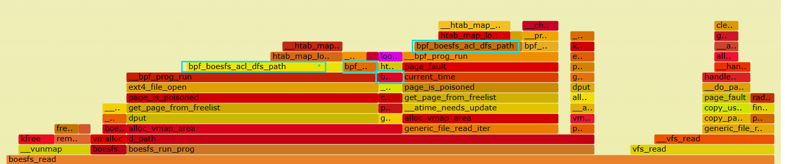
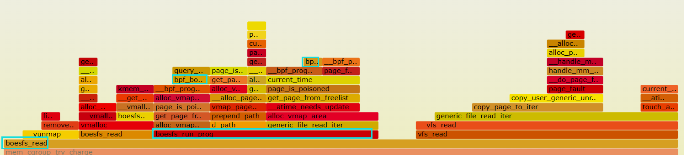

- **前言**：由于字节码中用于查询父目录规则的函数boesfs_acl_dfs_path，是调用频率较高，并且用于实现ACL的核心函数；而鉴于初赛时实现的较为简易，故，初赛后我们对其进行分析和优化

## 方法

### perf

- perf是Linux下的一款性能分析工具，能够进行函数级与指令级的热点查找。它由一个叫“Performance counters“的内核子系统实现，基于事件采样原理，以性能事件为基础，支持针对处理器相关性能指标与操作系统相关性能指标的性能剖析，可用于性能瓶颈的查找与热点代码的定位。

- 生成火焰图：
    ```c
    $ git clone https://github.com/brendangregg/FlameGraph
    $ cd FlameGraph
    $ perf script -i ./perf.data | ./stackcollapse-perf.pl --all | ./flamegraph.pl > show.svg
    ```

- 我们的使用方法：
    - 首先mount boesfs，然后通过脚本运行100000次cat指令，主要涉及到boesfs_lookup、boesfs_open以及boesfs_read函数；
    - 在另一个终端进入~/bin目录，然后sudo ./perf record -g -p pid.
    - 脚本运行结束，在当前目录下生成perf.data
    - 然后sudo ./perf report即可对perf.data进行分析. : sudo ./perf report --show-total-period --children

- 使用时遇见的问题以及解释
    - no symbols found in /bin/cat, maybe install a debug package?
        - 原因：/bin/cat 编译的时候没带 -g（因为在脚本里使用了cat）。
        - 解决：这我们没法解决也不用解决。当然也不影响我们对内核模块的分析
    - report出来的表中没有boesfs的函数符号，并且report时报出：[boesfs] with build id b0a75a79559fc8d484fe291a5976cc9be76e4d80 not found, continuing without symbol
        - 原因：编译的时候没加-g
        - 解决：
            - kernel module编译的时候带上 KBUILD_CFLAGS_MODULE += -g
            - cp boesfs.ko 到 /lib/modules/`name -r`/extra
            - 重新perf report

- 分析及结果见下文


### 小型benchmark


- 由于perf主要用于得出字节码时间比例，而为了得到该api的具体耗时，我们写了两个小型的benchmark：提取出初赛和决赛的相关实现，在相同的条件下，分别对初赛和决赛的boesfs_acl_dfs_path进行了1000000次调用。代码在 Code/test/performance_test/mid-term-benchmark以及/final-benchmark

    | 环境         | 具体参数                                               |
    | ---------------- | ------------------------------------------------------ |
    | 规则数量         | 1024                        |
    | 规则目录         | 随机生成1024个不同的目录用于插入                                                 |
    | 查询目录 | 随机生成2048个不同的目录用于查询                                               |
    | IO总线程数       | 1                                                     |
    | 调用次数       | 1000000                                                    |


- 分析及结果见下文


## 分析及结果

### perf

- 父目录规则查询函数：bpf_boesfs_acl_dfs_path
- 在初赛查询父目录规则时，采取的手段是层层切割路径，然后作为key去eBPF的hash map中查询。这样做效果不好：会重复切割路径；并且由于是C语言实现的map，其key的大小是固定的，就是我们设置的256byte，不会由于我们用'\0'截断了就使得搜索时使用的key变小，每次都要遍历256bytes；在规则库为空时也会进行查找。这些会导致字节码在查询父目录规则时消耗时间占比较大。我们通过perf观察某次boesfs_read。
    - 可以看到boesfs_read的一大半时间都在boesfs_run_prog运行字节码，而其中占比较大的就是我们实现的bpf_boesfs_acl_dfs_path，可以看到此时boesfs_run_prog占据boesfs_read的占比约有 : 0.34/0.55=61.8%
    


- 在决赛时，由于ACL通用的最深父目录查询原则，本质上就是最长前缀匹配，故我们利用kernel提供的RBTree接口，在此之上实现自己的Trie Tree结构，每个节点的val即为用户定义的rule。在mount时，首次运行字节码，读取array而非hash类型的map，申请资源，构建目录树；之后每次运行字节码时，通过trie树的查询规则进行查询；最后umount时，销毁结构，释放申请的资源。
    - 在查询时至多遍历1次字符串，当无规则时直接返回根节点作为默认规则
    - 解决了上述key比较大，且多次查询map的问题
    - 目录树结构
        
    - 可以看到实现之后，字节码运行(boesfs_run_prog)占据boesfs_read的时间占比减小，从图中可以看出其中主要是因为bpf_boesfs_acl_dfs_path占比明显减小。此时字节码运行时间(boesfs_run_prog)占据boesfs_read的 0.10/0.31 = 32.3%
    


### benchmark


- 通过上面提到的benchmark，我们可以得到初赛和决赛该api的平均运行时间。可以看到，效果比较明显，由初赛的1315.1ns到决赛的168.7ns
    

    | API         | 初赛              | 决赛     | compare | 
    | ------------| -----------------| ------- | ------- |
    | boesfs_acl_dfs_path (ns/ops)  |   1315.1     | 168.7 |  87.2%   |       


- 除此之外，对于决赛的实现，除了查询外，我们还记录bpf_boesfs_build_dir_tree (建立dir_tree) 以及 bpf_boesfs_destroy_dir_tree (销毁dir_tree)的平均耗时，由于二者必然成对调用，故我们测试出二者 平均耗时为 41082.5ns。明显大于bpf_boesfs_acl_dfs_tree查询dir_tree的时间。
- 但是由于建立dir_tree以及销毁dir_tree的频率极低，远远小于查询dir_tree的操作频率，故建立和销毁dir_tree的耗时可以忽略。
    - 因为只有在初次mount时，才会建立dir_tree；再umount时，才会销毁dir_tree。
    - 而由于vfs的特点，被沙盒程序的每一次操作，都会多次调用到
    bpf_boesfs_acl_dfs_tree。
    - 故建立和销毁dir_tree的耗时可以忽略。
     