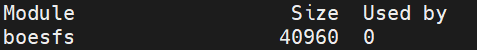
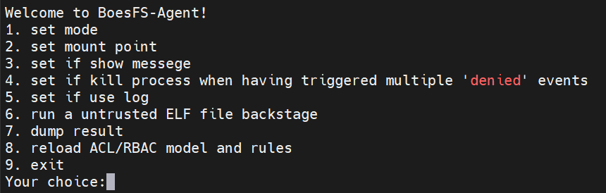
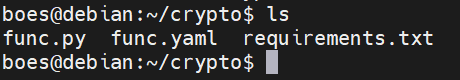

# BoesFS使用手册

## BoesFS项目安装方法

### 非FaaS部分安装

#### 源码的编译

在通过git clone下载完BoesFS项目后，进入到目录中，在目录下执行以下命令以安装整个BoesFS项目。

```shell
cd Code
./make.sh
```

在某些情况下，可能会需要重新安装某些模块（比如用户修改了BoesFS-Agent的源代码需要重新按照模块），此时可以在运行该安装脚本时带上参数，格式如下。

```shell
./make.sh [1 | 2 | 3]
```

当选择参数为1时，脚本会自动编译BoesFS-in-Kernel模块。
当选择参数为2时，脚本会自动编译BoesFS-Agent模块，并将其中的ACL/RBAC模型和规则文件复制到工作目录`~/.boesfs/`中使用。
当选择参数为3时，脚本会自动编译BoesFS-Check-Module模块，并将其中的bpf prog文件复制到工作目录`~/.boesfs/`中使用。

安装完毕后，可以在任意地方使用boesfs命令启动BoesFS-Agent

#### BoesFS-in-Kernel的安装

BoesFS-in-Kernel是以内核模块的形式运行的，因此在使用BoesFS-Agent前，应该先把BoesFS-in-Kernel装载入模块中。注意，装载内核模块需要管理员root权限，装载命令如下：

```shell
insmod ./BoesFS-in-Kernel/boesfs.ko user={用户名},limit={内存锁大小}
```

其中用户名应该填入要修改内存锁的用户名，内存锁大小是为了控制用户有足够的空间加载bpf prog，建议为128或以上。

也可以通过修改Code目录下的`install.sh`，再运行的方式来装载BoesFS-in-Kernel，装载命令为：

```shell
./install.sh
```

---

注意：使用BoesFS-Agent一定要先检查是否已经装载了BoesFS-in-Kernel，如果未装载，BoesFS-Agent无法将bpf prog加载使用，检查命令如下：

```shell
lsmod
```

如果模块中存在boesfs，如下图所示，则已装载BoesFS-in-Kernel



---

> 此外，初次装载后需要重新登陆，使内存锁的修改生效

### FaaS部分安装

> FaaS部分的运行依赖于非FaaS部分，在运行BoesFS-FaaS前必须先安装非FaaS部分

首先要进入`源码路径/Code/BoesFS-FaaS`目录下，使用`install.sh`即可一键安装，安装命令为：

```shell
./install.sh
```

安装完毕后，可以在任意地方使用boes命令对BoesFS-FaaS进行操作。

## BoesFS-Agent使用

> 使用前前先检查是否已装载BoesFS-in-Kernel

BoesFS-Agent分为交互模式和非交互模式，下面将分别列出使用方法：

### 交互模式（interactive mode）

该模式下，启动后会出现一个交互页面，可以不断与界面交互来运行并检查不可信二进制程序。

#### 启动命令

启动交互模式的命令非常简单，它需要用户不指定各种参数来运行安装后生成boesfs二进制程序，启动命令如下：

```shell
boesfs
```

#### 使用说明

启动后可以看到以下菜单


菜单中提供了9个选项，分别为：

1）设置ebpf prog程序的使用模式
2）设置运行不可信二进制程序时BoesFS的挂载目录
3）设置是否打印准备运行不可信二进制程序前的准备工作信息
4）设置是否开启触发安全警报过多时杀死子进程的功能
5）设置是否启用日志
6）在后台运行不可信二进制程序
7）打印运行的不可信二进制程序的输出信息
8）重新加载所有正在运行的进程的acl/rbac规则
9）退出程序

**1）设置ebpf prog程序的使用模式**。分为用户自定义模式和ACL模型控制模式。用户自定义模式下，BoesFS-Agent会自动重新编译~/.boesfs/prog目录下的user_prog.c，并使用生成的user_prog.o作为bpf prog；ACL模式下BoesFS-Agent会使用~/.boesfs/acl/prog/acl_prog.o，并以~/.boesfs/acl/model/model.txt作为ACL的模型文件，以~/.boesfs/acl/model/policy.txt作为ACL的策略文件。**默认值为ACL模式**

**2）设置运行不可信二进制程序时BoesFS的挂载目录**。在运行不可信二进制程序时，仅在BoesFS的挂载目录下的文件操作会被检查。**默认目录为"/"**

**3）设置是否打印准备运行不可信二进制程序前的准备工作信息**。在运行不可信二进制程序前，BoesFS-Agent会通过一系列的操作创建一个环境供其运行，该选项用于设置是否打印出准备工作的信息，方便调试。**默认值为否**

**4）设置是否开启触发安全警报过多时杀死子进程的功能**。BoesFS-Agent提供了一个提前关闭运行该二进制程序的进程的功能。若选择开启这一功能，必须设置一个阈值，当二进制程序触发的安全警报超过这个阈值时（目前阈值的设置不能超过9999），会杀死运行该二进制程序的进程，从而停止该程序的运行。**默认值为不启用**

**5）设置是否启用日志**。若选择开启该功能，BoesFS-in-Kernel会将记载的文件操作信息输出到当前目录的log目录下的文件中，得到的log文件名为“当前运行的不可信二进制程序名_进程pid.txt”，但是开启此功能对性能有一定程度上的影响，因此不建议用户开启此功能。**默认值为不启用**

**6）在后台运行不可信二进制程序**。交互模式的主要功能。选择该选项后，需要输入运行该二进制程序的命令，随后BoesFS-Agent就会根据模式，挂载目录等，创建一个环境以供不可信二进制程序运行。在交互模式下，BoesFS-Agent通过将不可信二进制程序运行在后台，达到多个不可信二进制程序并行运行的目的。

**7）打印运行的不可信二进制程序的输出信息**。交互模式下运行不可信二进制程序都是在后台，因此BoesFS-Agent在result目录下，新建了一个名为“运行的不可信二进制程序名.txt”的文件存放二进制程序的输出和错误信息（再次运行相同的程序会覆盖原结果文件）。而该选项则会将将最新生成的结果打印在屏幕上（若需要查看此前运行的程序的输出，可以从result文件夹中查找）。

**8）重新加载所有正在运行的进程的acl/rbac规则**。BoesFS-Agent提供了在进程运行时替换acl/rbac规则的功能（具体是哪种规则由当前的模型文件决定）。选择该选项后，BoesFS-Agent会将所有正在运行的进程的安全检查，替换为新的acl/rbac规则。

**9）退出程序**。选择该选项后，程序退出。

### 非交互模式（interactive mode）

该模式下，启动后不再出现一个交互页面，不可信二进制程序将在前台运行，并输出结果在命令行中。

#### 启动命令

启动交互模式的命令非常简单，它需要用户不指定各种参数来运行安装后生成boesfs二进制程序，启动命令如下：

```shell
./boesfs -d 挂载目录 [-u<bpfprog路径> | -l | -v] -k 数字 运行二进制程序的命令
```

#### 使用说明

所有可以使用的参数如下：

**-d**为必选参数，需要指定boesfs文件系统要挂载到的目录，后续bpf prog对参数的检查只会针对该目录下的路径进行检查。

**-u**为可选参数，选择该参数后，BoesFS-Agent将进入用户自定义bpf prog模式，需要指定bpf prog二进制程序的**绝对**路径在-u后，在开始运行二进制程序时，BoesFS-Agent将会以该bpf程序作为检查规则对二进制程序的文件操作行为进行检查。否则，BoesFS-Agent将进入acl/rbac模型控制模式，BoesFS-Agent将直接读取工作目录（`~/.boesfs/acl/model`）下的model.txt和policy.txt文件，解析文件中定义的ACL模型和策略作为检查规则，并读取`~/.boesfs/acl/prog`目录下的acl_prog.o作为bpf prog二进制文件。

**-v**为可选参数，在加上该参数时，BoesFS-Agent将在运行二进制程序前在命令行界面中打印出运行不可信二进制程序前的准备工作信息。

**-l**为可选参数，在加上该参数时，BoesFS-Agent将在运行二进制程序时通知boesfs文件系统对二进制程序的所有文件操作进行记录。

**-k**为必选参数，需要在-k后指定数字，在加上该参数时，BoesFS-Agent将在运行二进制程序时通知boesfs文件系统对每次二进制程序的非法访问进行计数，当非法访问达到用户设定的数量时，boesfs文件系统会将子进程杀死以停止二进制程序的运行；当用户输入0时，停用该功能。

**运行二进制程序的命令**必须指定，以供BoesFS-Agent在设定好沙盒环境后执行用户要运行的二进制程序。

若以上的必选参数和运行二进制程序的命令没有完全给出或出现错误，或者用户同时指定了两种模式时，BoesFS-Agent将在命令行中打印出BoesFS-Agent的非交互界面用法以供用户查看。

### 修改用户自定义模式的规则

如果要修改用户自定义模式的bpf prog，非交互模式下需要自己提供字节码文件（一般为.o格式），然后在-u后加上该文件的绝对路径；交互模式下需要将字节码放在~/.boesfs/prog目录下，并命名为user_prog.o，再重新选择一次用户自定义模式即可

如果要修改检查规则（即bpf prog中bpf map的内容），非交互模式下需要到non_interact.c文件第294行的if(){}中修改代码，交互模式下需要到interact.c文件第435行的else{}中修改代码；然后重新安装BoesFS-Agent，提供的bpf map操作函数如下：

| 函数名                                                                                      | 作用                           | 参数                                                                                                                                                        | 返回值            |
| ------------------------------------------------------------------------------------------- | ------------------------------ | ----------------------------------------------------------------------------------------------------------------------------------------------------------- | ----------------- |
| int ebpf_data_next(ebpf_ctxtext_t *ctxtext, void *key, void *next, int idx)                 | 获取bpf map的下一个key         | ctxtext：指向维护bpf prog和bpf map的结构体指针，key：指向map中key的指针，next：获取的下一个key存入的地址，idx：选择的map号                                  | 成功：0；失败：-1 |
| int ebpf_data_lookup(ebpf_ctxtext_t *ctxtext, void *key, void *val, int idx)                | 根据key在bpf map中查找对应的值 | ctxtext：指向维护bpf prog和bpf map的结构体指针，key：指向map中key的指针，val：获取的值存入的地址，idx：选择的map号                                          | 成功：0；失败：-1 |
| int ebpf_data_update(ebpf_ctxtext_t *ctxtext, void *key, void *val, int idx, int overwrite) | 根据key在bpf map中更新对应的值 | ctxtext：指向维护bpf prog和bpf map的结构体指针，key：指向map中key的指针，val：指向要更新的值的地址，idx：选择的map号，overwrite：是覆盖写还是非覆盖写的标志 | 成功：0；失败：-1 |
| int ebpf_data_delete(ebpf_ctxtext_t *ctxtext, void *key, int idx)                           | 根据key在bpf map中查找对应的值 | ctxtext：指向维护bpf prog和bpf map的结构体指针，key：指向map中key的指针，idx：选择的map号                                                                   | 成功：0；失败：-1 |

### 修改acl/rbac模式的规则

如果要修改acl/rbac模式下的检查规则，只需修改`~/.boesfs/acl/model/model.txt`和`~/.boesfs/acl/model/policy.txt`

---

model.txt是acl/rbac模型文件，它内部需要定义检查字段，规则类型和比较字段，一个model.txt的acl模型格式如下

```txt
[request_definition]
r = {检查字段}

[policy_definition]
p = {检查字段}

[policy_effect]
e = {规则类型}

[matchers]
m = {比较字段}
```

一个model.txt的rbac模型格式如下

```txt
[request_definition]
r = {检查字段}

[policy_definition]
p = {检查字段}

[policy_definition]
{rbac规则}
{rbac规则}

[policy_effect]
e = {规则类型}

[matchers]
m = {比较类型}
```

注意文件不能有多余的回车、注释等，{}中的部分可以任意使用除回车外的空白符。
此外，在rbac模型中，rbac规则可以有0~2项，每项规则占据1行，没有填写规则时退化为acl模型（每项规则占一行，有n条规则时，`[policy_definition]`和 `[policy_effect]`之间有n+1行）。

rbac规则只实现了两类，分别为"g=_,_"和"a=_,_;_,_"。其中"g=_,_"表示比较字段中可以对主体实现rbac检查，"a=_,_;_,_"表示比较字段中可以对文件操作和参数实现rbac检查

检查字段可写入4个字段，分别为"sub"、"obj"、"act"和"args"，中间用","隔开，至少写入两个字段，字段不能重复，例如

```txt
sub, act
```

规则类型分为两种：黑名单规则和白名单规则，其中黑名单规则对应的字符串为"e=!some(where(p.eft\==deny))"，白名单对应的字符串为"e=some(where(p.eft\==allow))"。

比较类型由比较字段之间通过 `&&`连接而成。比较字段分为6类，对应的字符串和比较规则如下所示：

| 字符串                       | 比较规则                                                 |
| ---------------------------- | -------------------------------------------------------- |
| r.sub\==p.sub                | ①二进制文件名对应相等                                   |
| g(r.sub,p.sub)               | ②二进制文件名对应的角色符合条件，与①不能同时使用       |
| r.obj\==p.obj                | ③路径对应相等                                           |
| r.act\==p.act                | ④文件操作对应相等                                       |
| r.args\==p.args              | ⑤文件操作的参数对应相等                                 |
| a(r.act,p.act;r.args,p.args) | ⑥文件操作和参数对应的角色符合条件，与④或⑤不能同时使用 |

事实上只有六种比较字段的组合的一部分能形成比较类型，分别为：①③，①④，②④，①③④，②③④，③④，①③④⑤，②③④⑤，③④⑤，①③⑥，②③⑥和③⑥

---

policy.txt是acl/rbac模型文件，在不使用rbac模式时，它内部只需要定义检查规则，其中一行定义一条检查规则，每条规则的格式如下：

```txt
p, {不可信二进制程序名,} {路径名, } {文件操作, } {(参数,···), } [file/dir] , [allow/deny] 
```

在"p,"后面首先应该写检查字段。如果在模型文件的检查字段中定义了sub，则规则中必须有{不可信二进制程序名,}；同理，如果在模型文件的检查字段中定义了obj，则规则中必须有{路径名, }；如果在模型文件的检查字段中定义了act，则规则中必须有{文件操作, }；如果在模型文件的检查字段中定义了args，则规则中必须有{(参数,···), }，而()中的参数数量，具体可参考BoesFS-in-Kernel开发文档（与文件操作类型相关）。

字段[file/dir]必须添加，它关系到用户填入的该路径是用于限制这个路径本身还是这个路径下的所有子目录和子文件。如果是"file"，则对路径的限制仅限于该路径本身，如果是"dir"，则对该路径的限制仅限于该路径（不包括自身）以下的所有子目录和子文件。

字段[allow/deny]必须添加，若使用allow字段，则仅当使用白名单规则时，该规则生效，若使用deny字段，则仅当使用黑名单规则时，该规则生效。

如果定义了"g=_,_"，policy.txt中可以定义主体角色分配规则
主体角色分配规则的格式如下：

```txt
g, 不可信二进制程序名, 主体角色名
```

此时检查规则中的 `{不可信二进制程序名,}`应改为 `{主体角色名,}`。

如果定义了"a=_,_;_,_"，policy.txt中可以定义操作角色分配规则和检查规则
主体角色分配规则的格式如下：

```txt
a, 操作角色名, 文件操作, (参数,···)
```

此时检查规则中的 `{文件操作, } {(参数,···), }`应改为 `{操作角色名,}`。

注意，路径名需要是绝对路径名，文件操作目前支持如下21个字段。

| 文件操作 |         含义         |
| :------: | :-------------------: |
|   read   |  允许或禁止read操作  |
|  lookup  | 允许或禁止lookup操作 |
|  write  |  允许或禁止write操作  |
|   open   |  允许或禁止open操作  |
|  mkdir  |  允许或禁止mkdir操作  |
|  unlink  | 允许或禁止unlink操作 |
|  rmdir  |  允许或禁止rmdir操作  |
|  mknod  |  允许或禁止mknod操作  |
|  create  | 允许或禁止create操作 |
|   link   |  允许或禁止link操作  |
| symlink | 允许或禁止symlink操作 |
|  rename  | 允许或禁止rename操作 |
| setattr | 允许或禁止setattr操作 |
| getattr | 允许或禁止getattr操作 |
|  llseek  | 允许或禁止llseek操作 |
| iterate | 允许或禁止iterate操作 |
|   mmap   |  允许或禁止mmap操作  |
| lookup2 | 允许或禁止lookup2操作 |
|  statfs  | 允许或禁止statfs操作 |
|  fsync  |  允许或禁止fsync操作  |
| default |  允许或禁止所有操作  |

## BoesFS-FaaS使用

> 使用前前先检查是否已装载BoesFS-in-Kernel，并且python3是否已安装fdk库

### 启动FaaS服务

任意用户在任意目录下均可以使用boes命令，启动命令如下：

```shell
boes start
```

启动服务后该命令行被boesserver占用

### 部署函数

在任意目录下都能初始化工作目录，初始化的命令如下：

```shell
boes init --runtime <语言> <项目名>
```

运行后会在当前目录下生成一个工作目录，目录名即项目名。目前BoesFS-FaaS实现了python函数的部署，则工作目录中初始有3个文件，分别为：



用户可以在`func.py`中编写需要自定义的函数。

在编写完函数后，还需要把函数部署到app中，否则无法被调用。创建app的命令为：

```shell
boes create app <app名>
```

要把函数部署到app中，需要在工作目录下，执行以下命令：

```shell
boes deploy --app <app名> --local
```

此时函数已部署成功

### 查看函数

想要查看app中布置的函数时，可以使用命令：

```shell
boes list functions <app名>
```

执行后命令行会显示出函数的详细信息

### 运行函数

任何能够连接到部署BoesFS-FaaS的机器都能通过curl命令运行部署的函数，运行命令为：

```shell
curl -X "POST" -H "Content-Type: application/json" [-d <参数> ] http://<机器ip>:8080/invoke/<函数ID>
```

其中`-d`指定的参数是json格式的，机器ip为部署BoesFS-FaaS的机器ip地址，函数ID可以通过查看函数得到。运行函数后，函数会返回自定义的运行结果给运行者。

## 规则示例

下面举例几个场景，并介绍满足场景的安全检查规则

### **场景1**

存在疑问

- 用黑名单，对b.txt的unlink deny了，意思就是b.txt的其他api都生效吗。不继续匹配父目录的规则了？即使父目录存在有黑名单规则满足条件，都会失效吗。假设目前是这样的。
- 对于第三条场景需求，该怎么实现呢

**场景需求**

- 不允许write和unlink目录/home/boes/test下的子文件和子目录
- 特别的，允许write但不允许unlink文件/home/boes/test/sub/b.txt
- 特别的，允许write且允许unlink文件/home/boes/test/sub/a.txt

**检查规则**

- model.txt采用黑名单策略、sub，obj，act全匹配
- 将b.txt的 unlink deny 填写进file map中；同时，在dir map中添写test目录下的unlink 和 write deny。
  
  
- 由上述匹配机制可知，当访问test目录下的子文件/目录时，会命中到dir map中对于/home/boes/test的ACL rule；但是访问其下的sub/b.txt时，会命中到file map中的ACL rule。故遵循实现的深度优先原则，可以实现上述需求。
- 效果图如下，符合预期，实现需求
  

### 场景2

**场景需求**

- 挂载环境下默认拒绝所有请求操作
- 特别的，目录/home/boes/test及其所有子目录和子文件可允许lookup访问操作，但拒绝其他文件请求操作
- 特别的，目录/home/boes/test2及其所有子目录和子文件可进行任何的文件请求操作

**检查规则**

- model.txt采用白名单策略、sub，obj，act全匹配
- 将/home/boes的open，/home/boes/test的 lookup 以及 open allow 填入file map。
- 同时，在dir map中填写/home/boes/test 的 lookup 以及 open 的 allow 权限即可。
- 其中 file map中对于对boes的open权限是为了能够打开/home/boes目录，对test的lookup权限是为了能够找到test目录；而dir map中的权限均是对于子目录和子文件的限制。
  
  

  - 由上述匹配机制可知，当访问/home/boes/test下的子文件和子目录时，最终会命中到dir map中的/home/boes/test ACL rule，实现需求。
- 效果图如下，符合预期，实现需求
  
  
- （3）例如 /home/boes/test0/A及其下子目录/文件不可见；/home/boes/test0/B 可见，B下的子目录子文件不可见；/home/boes/test0/a.txt不可见

  - 对此，我们采用黑名单策略. model文件同（1）
  - file map中填写/home/boes/test0/A lookup 和 /home/boes/test0/a.txt lookup的deny权限，同时，dir map中填写/home/boes/test0/B的lookup的deny权限。
  - 注意这里在dir map而非file map中定义B的lookup deny，是因为需求中要求了B目录可见。
    
  - 由上述匹配机制知，当尝试访问A目录和a.txt时，会由于对其本身的lookup deny而失败；当访问B目录时，由于file map中不存在该限制，会成功看见B目录信息；但是当访问子文件时会命中到dir map中的ACL rule，拦截。
  - 效果图如下，符合预期，实现需求。
    
  - 特别的，由于vfs以及boesfs沙盒层的特性，每一次操作都会经历eBPF prog的检验。所以在使用lookup的白名单策略时，对用户有较高的要求，因为linux每次访问某个文件，首先要做的就是lookup到该文件。故要在白名单下限制文件访问，用户填写的规则需要保证其父目录可以被正确的open和lookup。其填写方式应当如上述的第一个例子
- （4）例如要实现被 挂载目录(/home/boes)下所有目录和文件均只有可见权限，但是不可读也不可写也不可删除等；且特别的，其下的某一目录/home/boes/test不可见；特别的，/home/boes/test1下的文件以及子目录，均可读可写。

  - 对此，我们采用白名单策略。model文件同（2）
  - file_map中填写/home/boes的open权限，/home/boes/test的default权限。在dir_map中填写/home/boes的open和lookup权限，/home/boes/test1的read、write、open、lookup权限。
  - 其中，file_map中，对boes的open权限是为了打开boes，对/home/boes/test的default，是为了禁止lookup权限；dir_map中，对test1的read，write，open，和lookup权限，是为了对test1下的子目录以的子文件及子文件进行读写.
    
  - 由上述匹配机制知，当想要查看boes下的目录和文件时，会最终命中到boes的ACL，Rule。特别的对于test的子文件/目录，会命中test的ACL Rule。同理，对于test1的子文件/目录，会命中到test1的ACL Rule。
  - 效果图如下，符合预期，实现需求。
  - 可以查看到boes下的除test之外的文件，但不可读写
    
    
  - 可以对test1下的，进行读写，但不可进行其他操作，如删除等
    
    
- （5）例如要实现，禁止/bin/bash对test文件夹，以及lookup.txt的任何访问，则有如下。

  - 采用黑名单策略，且无需填写行为字段，也即无需填写read/write/unlink……
    
    
  - 最终效果如图，符合预期
    
- （6）想要实现，只允许 /bin/bash 对于任何文件进行lookup，read，open操作，其余操作全部禁止。则有如下

  - 采用白名单策略，无需填写object字段，也即无需填写path
    
    
  - 结果如下图，符合预期，实现需求。
    
- （7）想要实现，任何程序，对于test/a.txt的权限都仅限于read，则有如下

  - 采用黑名单策略，无需填写subject字段，也即无需填写要沙盒的程序名。
    
    
  - 效果如图，符合预期
    
- （8）相应的，对于上述的操作，Boesfs-in-Kernel会记录下所有被拦截的操作，写入日志中。如下。每次运行被沙盒程序，就会有一个对应的日志文件来记录。
  
