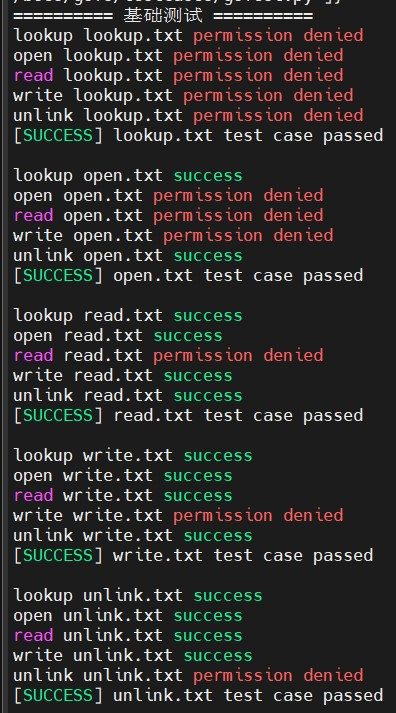
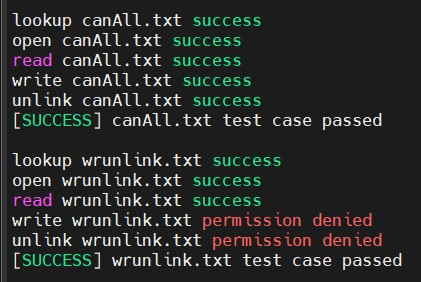
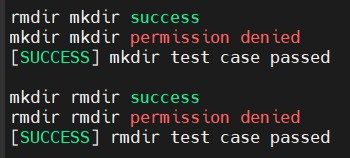
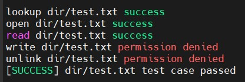
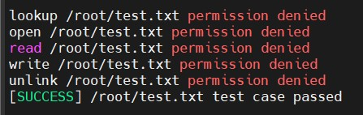
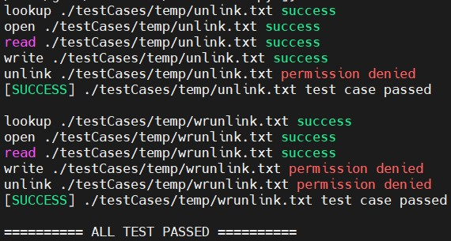
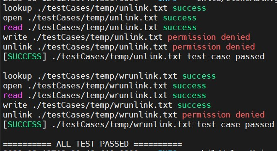
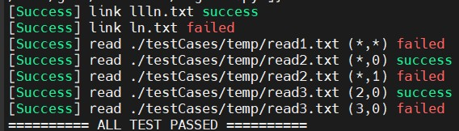
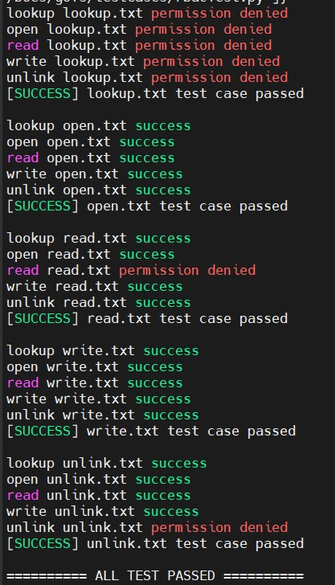
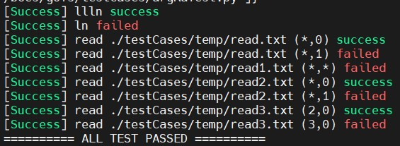

# BoesFS功能测试文档

## 1 测试概述

BoesFS沙盒功能测试的主要测试点如下：

- 正确拦截VFS所有文件请求
- ACL模式自定义安全规则
- RBAC模式自定义安全规则
- 支持参数匹配
- 支持运行时动态替换规则

我们针对不同的测试点，编写了系列测试用例，对BoesFS预期实现的访问控制功能进行了测试，测试结果如下：

| 测试用例     | 主要测试点                 | 通过情况 |
|-|-|-|
| 基础测试     | ACL模式和VFS操作拦截正确性 | PASS     |
| 动态替换测试 | 动态替换规则的正确性       | PASS     |
| 参数测试     | 拦截设定的参数正确性       | PASS     |
| RBAC基础测试 | 主体RBAC模式正确性         | PASS     |
| RBAC参数测试 | 客体及参数RBAC模式正确性   | PASS     |

BoesFS实现了项目目标预期的全部功能。

## 2 测试方法

测试脚本大致分为三个部分：具体系统调用测试函数、单文件测试函数与总体测试函数。下面分别进行叙述。

具体系统调用测试函数有统一的模板，接收一个Inode对象，里面有文件名、使用bitmap存储的文件权限等一系列内容，如果函数执行测试过程中出现了PermissionError，则判定该操作被成功拦截，如果没有Exception则说明操作执行成功，这两种情况下，需要对Inode中的文件权限进行判断，判定结果与预期结果是否一致，如果不一致则向上级代码抛出AssertionError，如果出现其他错误，则说明程序遇到其他问题，这时直接向上级代码抛出错误即可。

```python
    # 对文件进行测试
    files = {
        "lookup.txt": genMask(ACCESS_LOOKUP, ACCESS_OPEN, ACCESS_READ, ACCESS_WRITE, ACCESS_UNLINK),
        "open.txt": genMask(ACCESS_OPEN, ACCESS_READ, ACCESS_WRITE),
        "read.txt": genMask(ACCESS_READ),
        "write.txt": genMask(ACCESS_WRITE),
        "unlink.txt": genMask(ACCESS_UNLINK),
        "dir/test.txt": genMask(ACCESS_WRITE, ACCESS_UNLINK),
        "canAll.txt": 0,
        "wrunlink.txt": genMask(ACCESS_WRITE, ACCESS_UNLINK),
        "/root/test.txt": 0xFF,
    }
    for f, mask in files.items():
        success = runCases(Inode(f, mask, True), fileFuncs, logger) and success

    # 对目录进行测试
    success = runCases(Inode("mkdir", genMask(ACCESS_MKDIR), True), [assert_rmdir, assert_mkdir], logger) and success
    success = runCases(Inode("rmdir", genMask(ACCESS_RMDIR), True), [assert_mkdir, assert_rmdir], logger) and success

    # 输出测试结果
    if success:
        logger.error(f"========== ALL TEST PASSED ==========")
    else:
        logger.error(f"========== SOME TEST FAILED ==========")
```

一般来说，每一个文件都需要测试不止一个系统调用，这时就需要遍历该文件的所有测试函数，将测试结果进行输出，并对测试结果进行判断，如果报AssertionError则说明测试结果不正确。

```python
def runCases(inode: Inode, funcs: list, logger: logging.Logger):
    success = True
    for f in funcs:
        try:
            f(inode, logger)
        except AssertionError:
            success = False
            logger.error(f"----[FAILED] access {inode.name} {f.__name__}")
    if success:
        logger.error(f"[SUCCESS] {inode.name} test case passed")
    else:
        logger.error(f"[FAILED] {inode.name} test case failed")
    return success
```

总的测试脚本包括了设置文件及其权限，并对每个文件运行对应的测试脚本。这里以基础测试为例，脚本中先是将需要测试的文件都写入了一个字典中，并对应的使用genMask函数和宏定义设置文件的具体权限（使用bitmap存储），最后只需要将测试函数作为列表，与文件属性Inode一起传入runCases函数即可，最后会根据各个测试是否均成功，输出对应的测试结果

```python
def assert_write(inode: Inode, logger: logging.Logger):
    try:
        print(os.path.join(cwd, inode.name))
        f = open(os.path.join(cwd, inode.name), 'w')
        f.write('a')
        f.close()
    except PermissionError:
        assert not (inode.canAccess(ACCESS_WRITE) and inode.canAccess(ACCESS_OPEN) and inode.canAccess(ACCESS_LOOKUP))
        logger.info(f"write {inode.name} fail")
    else:
        assert inode.canAccess(ACCESS_WRITE)
        logger.info(f"write {inode.name} success")
```

## 3 测试结果

### 3.1 基础测试

基础测试主要负责测试各个基础vfs操作是否可以正确拦截，以及沙盒整体的权限是否正常。下面逐个介绍基础测试中的各个部分。

**1.对文件设置禁用规则**。测试五种基础的系统调用是否可以正确拦截，包括lookup、read、write、open、unlink。对五个文件分别设置这五种系统调用的一种，然后测试时对每个文件测试全部这五种系统调用，检查最终的文件访问权限是否与设定的一致。测试规则和测试结果如下。lookup和open由于会影响到其他系统调用的执行，故设置禁用lookup时，其他四种系统调用也会失败，设置禁用open时，会导致read与write也失败。

```text
p,  /home/boes/gofs/testCases/temp/lookup.txt, lookup, file, deny
p,  /home/boes/gofs/testCases/temp/read.txt, read, file, deny
p,  /home/boes/gofs/testCases/temp/write.txt, write, file, deny
p,  /home/boes/gofs/testCases/temp/open.txt, open, file, deny
p,  /home/boes/gofs/testCases/temp/unlink.txt, unlink, file, deny
```


**2.混合规则**。测试对同一个文件设置多种禁用规则，是否可以同时生效，这里对一个文件设置了write和unlink禁用规则，测试五种基础系统调用是否可以正确拦截。这里只拦截了这两种系统调用，其他系统调用均正确运行，说明程序可以正确设置混合禁用规则。此外，测试用例中还设置了对照组`canAll.txt`，不设置任何禁用规则，测试文件是否可以被正常使用。

```text
p,  /home/boes/gofs/testCases/temp/wrunlink.txt,write, file , deny
p,  /home/boes/gofs/testCases/temp/wrunlink.txt,unlink, file , deny
```


**3.对特定文件夹设置禁用规则**。主要设置是否可以创建文件夹与删除文件夹。这里创建了`mkdir`文件夹，禁用对其的mkdir系统调用，先尝试删除该文件夹，再尝试创建该文件夹，前者应该可以成功运行，而后者应该被禁止。此外还创建了`rmdir`文件夹禁用对其的rmdir系统调用，测试顺序与前面的相反。

```text
p, /home/boes/gofs/testCases/temp/mkdir, mkdir, file, deny
p, /home/boes/gofs/testCases/temp/rmdir, rmdir, file, deny
```


**4.对文件夹内所有文件设置禁用规则**。对测试目录中的`dir`目录设置write和unlink规则，检查文件夹内的文件操作是否可以正确禁用，这里对文件夹设置了write和unlink的禁用规则，文件夹内的文件应该均不能write与unlink。

```text
p,  /home/boes/gofs/testCases/temp/dir , write, dir,deny
p,  /home/boes/gofs/testCases/temp/dir , unlink, dir,deny
```


**5.越权样例**。因为boesfs可以直接通过普通用户进行启动，这里测试是否可以访问root用户的文件，确保此文件系统不会导致越权。



### 3.2 动态替换测试

reload测试主要负责测试重加载规则功能的正确性，并在重加载前后分别检查对应的文件权限，确保加载前后的文件权限分别与设定的两个规则文件一致。

reload之前的规则为基础测试时的规则，而reload之后的规则进行了一些修改，将一些文件的权限进行了减少，将一些文件的权限进行了增加，测试reload前后是否可以正确拦截对应的系统调用。

```text
基础规则
p,  /home/boes/gofs/testCases/temp/unlink.txt,unlink, file , deny
p,  /home/boes/gofs/testCases/temp/wrunlink.txt,write, file , deny
p,  /home/boes/gofs/testCases/temp/wrunlink.txt,unlink, file , deny

reload规则
p, /home/boes/gofs/testCases/temp/unlink.txt, unlink, file, deny
p, /home/boes/gofs/testCases/temp/unlink.txt, write, file, deny
p, /home/boes/gofs/testCases/temp/wrunlink.txt, unlink, file, deny
```
reload前：



reload后：



### 3.3 参数测试

参数测试主要负责测试拦截特定vfs操作参数的正确性。设置了link操作和read操作的测试样例，read系统调用测试多种星号与参数的组合，针对每条规则，都尽量测试拦截成功与不成功的情况，多方位测试参数匹配与不匹配情况下，boesfs是否可以正确拦截。

```text
p, /home/boes/gofs/testCases/temp/read1.txt , read, (*,*), file , deny
p, /home/boes/gofs/testCases/temp/read2.txt , read, (*,1), file , deny
p, /home/boes/gofs/testCases/temp/read3.txt , read, (3,0), file , deny
p, /home/boes/gofs/testCases/temp/read3.txt , link, (/home/boes/gofs/testCases/temp/ln.txt), file, deny
```



### 3.4 rbac测试

rbac分为主体与参数两个测试，这两个测试是在前面几个测试的基础上，改写为rbac方法，测试rbac分组的各种条件，包括一参多组、一组多参及其组合情况等多种情况，尽量做到测试的多方面覆盖。

主体测试将write与open的主体改为另一个rbac分组，测试是否可以正确分组。测试结果中，write与open对应文件的所有系统调用均被成功放行，由于这两个测试的代码逻辑有重复的地方，故这里只作简单测试，并没有测试多种条件。

参数测试中设置了一参多组、一组多参的多种情况，在read3分组中有`read, (3,0)`和link两种，而read2分组也需要被设置到了多个规则中，这里测试在分组参数匹配情况下，程序是否可以被正确拦截。

```text
rbac主体测试
p, g1, /home/boes/gofs/testCases/temp/lookup.txt , lookup , file , deny
p, g1, /home/boes/gofs/testCases/temp/read.txt , read ,  file , deny
p, g2, /home/boes/gofs/testCases/temp/write.txt, write,  file , deny
p, g2, /home/boes/gofs/testCases/temp/open.txt, open, file , deny
p, g1, /home/boes/gofs/testCases/temp/unlink.txt,unlink, file , deny

g, python3.11, g1
g, /bin/sh, g2


rbac参数测试
p, /home/boes/gofs/testCases/temp/read.txt, read2, file, deny
p, /home/boes/gofs/testCases/temp/read1.txt, read1, file, deny
p, /home/boes/gofs/testCases/temp/read2.txt, read2, file, deny
p, /home/boes/gofs/testCases/temp/read3.txt, read3, file, deny

a, read1, read, (*,*)
a, read2, read, (*,1)
a, read3, read, (3,0)
a, read3, link, (/home/boes/gofs/testCases/temp/ln.txt)
```






