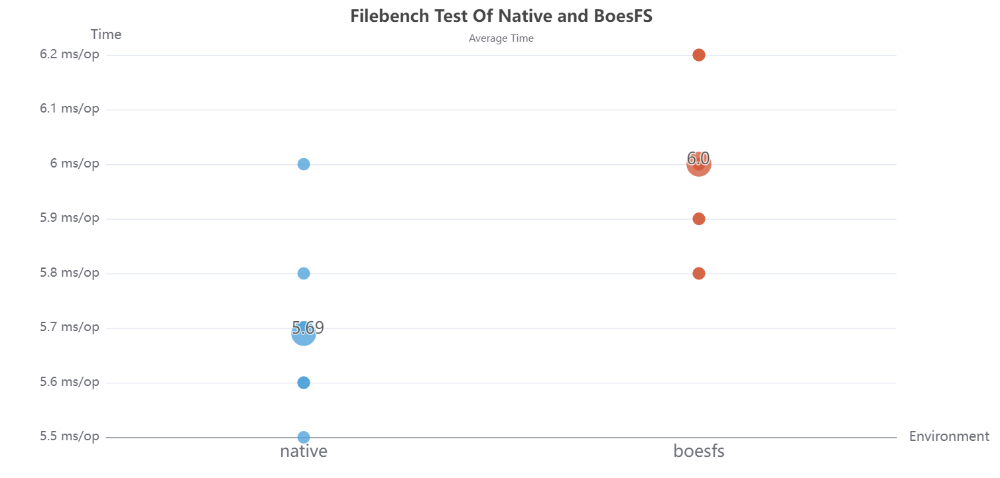
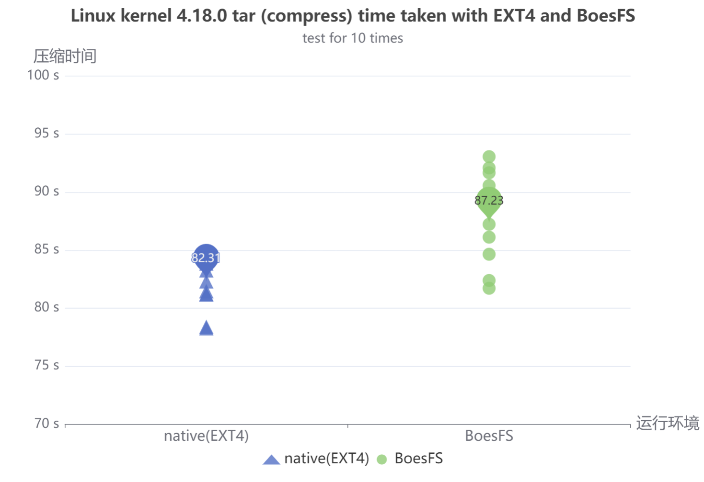
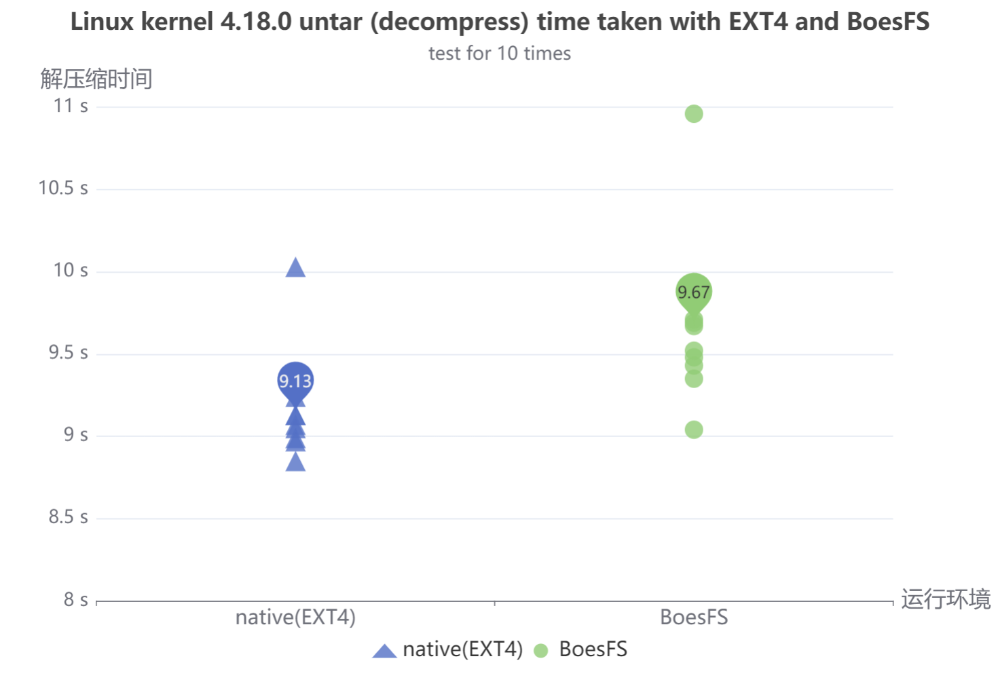
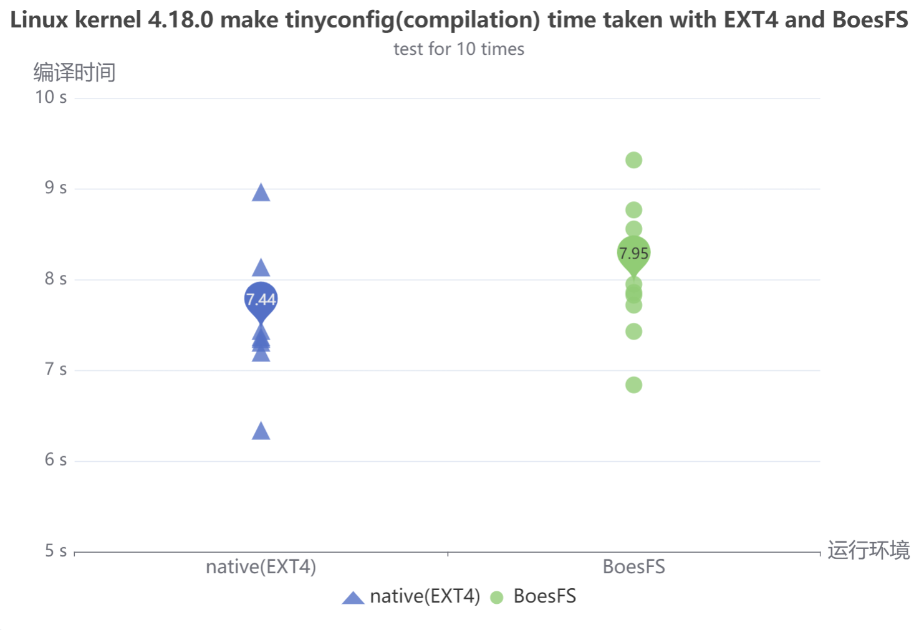
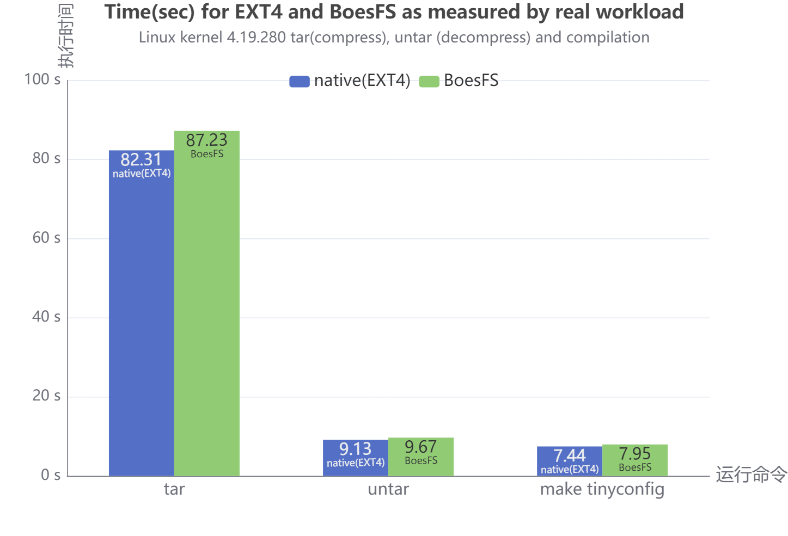

# 性能测试文档

## 测试环境

| 环境指标     | 环境参数                |
| ------------ | ----------------------- |
| Linux发行版  | Debian 9                |
| Linux内核    | 4.11.12                 |
| 机器模式     | 虚拟机                  |
| 内存大小     | 4G                      |
| 硬盘大小     | 50G                     |
| 处理器个数   | 2                       |
| 处理器核数   | 2                       |
| 处理器总核数 | 4                       |
| 机器环境     | boesfs环境 / native环境 |

注：

①native环境是没有安装BoesFS项目的原生态的操作系统环境。

②boesfs环境是安装并运行了BoesFS项目的操作系统环境。

## filebench

### 概述

filebench是一个用于文件系统测试的工具集，能够通过WML（工作负载模型语言）来生成各种场景的工作负载，具有使用灵活、设置简单、场景丰富、自定义模型、支持多线程等诸多优点。BoesFS项目的性能测试的其中一种方式是采用filebench，对比boesfs环境和native环境下的性能差异。

### 测试方法

在性能指标的选择上，我们考虑如下三个性能测试指标：

| 性能指标                | 选择原因                                                     |
| ----------------------- | ------------------------------------------------------------ |
| 每秒流操作数（ops/s）   | 流操作执行速度体现文件系统请求和处理文件请求的能力           |
| IO总带宽（mb/s）        | IO总带宽体现文件系统和底层设备交互和文件系统请求处理上的能力 |
| 流操作响应时间（ms/op） | 流操作响应时间体现文件系统响应文件请求的能力                 |

在测试模型的设计上，编写了三个WML模型：

- WML模型1 : Code/test/performance_test/workloads/fileserver1.f

  | 模型指标                           | 具体参数                                                               |
  | ---------------------------------- | ---------------------------------------------------------------------- |
  | 测试目录                           | /home/boes/Final/boesfs/Code/test/performance_test/                    |
  | 文件总数                           | 10000                                                                  |
  | 目录宽度                           | 20                                                                     |
  | 单个文件大小均值(变量遵循伽玛分布) | 131072B                                                                |
  | IO总线程数                         | 50                                                                     |
  | 线程流操作集                       | create、open、write、append、read、close、delete、stat、fsync、listdir |
  | mode                               | run 60s                                                                |


  - 该工作负载会在项目的/home/boes/Final/boesfs/Code/test/performance_test/下生成一个大文件集tmp用于性能测试，文件总数是10000，该大文件集的目录宽度设置为20，平均每个文件的大小均值是131072Byte（遵循伽马分布）。发起IO请求的模拟线程为50个，均执行相同的文件操作流，运行60s。该工作负载会模拟一个文件服务器的实际大批量工作请求，每个IO线程会完成如下文件IO操作：
    - 在测试目录中创建文件，写该文件，然后关闭该文件。
    - 打开文件，读取整个文件，然后关闭该文件。
    - 打开文件，追加文件内容，然后关闭该文件。
    - 获取所有文件状态
    - 列出目录下所有文件
    - 删除所有文件

除此之外，受制于filebench的限制，由filebench在workloads给出的示例可知，在测试flow makedir以及removedir时，需要采取set mode quit fist done模式，且经测试在将这两条flowop放入同一thread中时filebench自身会遇到问题，故区别于上述测试的run 60(mode为set mode quit timeout）。故，我们另写2个WML模型来测试makedir和removedir。工作负载如下。

- WML模型2 : Code/test/performance_test/workloads/fileserver2.f ; 

  | 模型指标     | 具体参数                                            |
  | ------------ | --------------------------------------------------- |
  | 测试目录     | /home/boes/Final/boesfs/Code/test/performance_test/ |
  | 目录总数     | 10000                                               |
  | 目录宽度     | 100                                                 |
  | IO总线程数   | 50                                                  |
  | 线程流操作集 | makedir                                             |
  | mode         | quit when first down                                |


  - 该工作负载会在项目的/home/boes/Final/boesfs/Code/test/performance_test/下生成一个大文件集tmp2用于性能测试，目录总数是10000，该大文件集的目录宽度设置为100。发起IO请求的模拟线程为50个，均执行相同的文件操作流，运行60s。
  - 该工作负载会模拟一个文件服务器的实际大批量工作请求，每个IO线程会按照上述设置，进行创建文件夹的IO操作
- WML模型3 : Code/test/performance_test/workloads/fileserver3.f

  | 模型指标     | 具体参数                                            |
  | ------------ | --------------------------------------------------- |
  | 测试目录     | /home/boes/Final/boesfs/Code/test/performance_test/ |
  | 目录总数     | 10000                                               |
  | 目录宽度     | 100                                                 |
  | IO总线程数   | 50                                                  |
  | 线程流操作集 | removedir                                           |
  | mode         | quit when first down                                |


  - 该工作负载会在项目的/home/boes/Final/boesfs/Code/test/performance_test/下生成一个大文件集tmp2用于性能测试，目录总数是10000，该大文件集的目录宽度设置为100。发起IO请求的模拟线程为50个，均执行相同的文件操作流，运行60s。
  - 该工作负载会模拟一个文件服务器的实际大批量工作请求，每个IO线程会按照上述设置，进行删除文件夹的IO操作

### 测试结果

- WML模型1：我们分别在native和boesfs环境下，根据上述模型和方法测试了10组数据，各个指标的结果如下图所示

  - 其中柱状图用于观察平均值，散点图用于观察波动情况。其中，散点图中，直径较大的点为均值点.
  - 平均流操作响应时间
    - 可以看到native平均流操作响应时间为5.69ms/op，boesfs为6ms/op
    - 且native和boesfs的耗时均在均值上下小范围的正常波动.
      

  |                            | native | boesfs | 开销 |
  | :------------------------: | :----: | :----: | :---: |
  | 平均流操作响应时间(ms/op) |  5.69  |   6   | 5.48% |


  - 平均IO带宽
    - 可以看到native平均带宽为775.55mb/s，boesfs为736.74mb/s
    - 且native和boesfs的平均带宽均在均值上下小范围的正常波动.
      

  |                  | native | boesfs | 开销 |
  | :--------------: | :----: | :----: | :---: |
  | 平均IO带宽(mb/s) | 775.55 | 736.74 | 5.01% |

  - 平均每秒流操作数
    - 可以看到native平均每秒流操作数为 37595.5051 ops/s，boesfs为35711.3798 ops/s
    - 且native和boesfs的平均每秒流操作数均在均值上下小范围的正常波动
      

  |                        |   native   |   boesfs   | 开销 |
  | :---------------------: | :--------: | :--------: | :---: |
  | 平均每秒流操作数(ops/s) | 37595.5051 | 35711.3798 | 5.01% |

  - 最后平均流操作响应时间、平均每秒流操作数、平均IO带宽3个指标总结如下表，损耗均为5%上下

  | I/O Summary                | native     | boesfs     | compare |
  | -------------------------- | ---------- | ---------- | ------- |
  | 平均流操作响应时间(ms/op) | 5.69       | 6.00       | 5.48%   |
  | 平均带宽(mb/s)             | 775.55     | 736.74     | 5.01%   |
  | 平均每秒流操作数 (ops/s)   | 37595.5051 | 35711.3798 | 5.01%   |
- 此外，对于每种文件请求的情况，我们也进行了记录。native和boesfs的10组测量的平均情况以及开销如下.

  - 下面是平均值柱状图及其表格。从中可以看出，native和boesfs，对于每一种文件请求，性能开销均在5%附近。
    
  - 每种文件请求的具体数据以及开销比总结如下表，可以看到，性能开销约为5%

  | flowop         | native (ops/s) | boesfs(ops/s) | compare |
  | -------------- | -------------- | ------------- | ------- |
  | deletefile     | 2891.6         | 2746.1        | 5.03%   |
  | listdir        | 2891.6         | 2746.1        | 5.03%   |
  | statfile       | 2891.6         | 2746.2        | 5.02%   |
  | fsyncfile      | 2891.6         | 2746.3        | 5.02%   |
  | appendfilerand | 2891.9         | 2746.8        | 5.01%   |
  | openfile       | 2892           | 2746.8        | 5.02%   |
  | closefile      | 2892           | 2746.8        | 5.02%   |
  | readfile       | 2892           | 2746.8        | 5.02%   |
  | writefile      | 2892.1         | 2746.8        | 5.02%   |
  | createfile     | 2892.3         | 2747          | 5.02%   |
- WML模型2与WML模型3：我们分别在native和boesfs环境下，根据上述模型和方法测试了10组数据，mkdir flow 和 rmdir flow的结果如下图所示

  - 由于这两个测试的filebench的mode以及fileset的设置相同，故我们将结果数据展示在一张表中. 从该图中可以看到，对于mkdir操作，native为9989.2ops/s，boesfs为9987.9ops/s；对于rmdir操作，native为9984ops/s，boesfs为9982.2ops/。性能开销均低于%1.
  - 

  | flowop            | native | boesfs | compare |
  | ----------------- | ------ | ------ | ------- |
  | makedir (ops/s)   | 9989.2 | 9987.9 | < 1%    |
  | removedir (ops/s) | 9984   | 9982.2 | < 1%    |

## 内核源码压缩、解压、编译

### 概述

BoesFS项目的性能测试采用了内核源码压缩、解压、编译的方式进行了真实工作负载测试。内核源码压缩、解压、编译是一种常见的性能测试方法，通过在不同环境下对内核源码进行操作所需要的时间进行对比，得到不同环境之下的性能差异。BoesFS项目的性能测试的另一种方式是对Linux内核4.19.280源码进行压缩、解压、编译，对比boesfs环境和native环境下的性能差异。

### 测试方法

- 测试数据

测试数据采用本项目拟采用的Linux内核4.19.280源码。这也是调研得到目前比较主流的FaaS服务器内核版本。

- 测试场景

测试场景考虑三种大批量的文件处理操作，以衡量沙盒文件系统的性能，包括如下三种场景：

①测试压缩Linux内核4.19.280源码

对应的系统命令是：

```shell
tar -zcvf linux-4.19.280-image.tar.gz linux-4.19.280-image
```

②测试解压Linux内核4.19.280源码压缩包

对应的系统命令是：

```shell
tar -zxvf linux-4.19.280-image.tar.gz
```

③测试tinyconfig编译Linux内核4.19.280

对应的系统命令是：

```shell
make tinyconfig
```

- 测试方法

测试方法上，我们采用运行上面系统命令，并测量执行上述系统命令所需要的时间来实现，测试命令执行的时间采用times命令实现。具体如下：

```shell
time -p tar -zcvf linux-4.19.280-image.tar.gz linux-4.19.280-image
time -p tar -zxvf linux-4.19.280-image.tar.gz
time -p make tinyconfig
```

times输出的格式如下所示，我们选择real作为实际执行的时间。

```shell
real 1.00
user 0.80
sys 0.20
```

考虑cache等因素带来的误差，我们在测试时，每次运行系统命令得到实际执行时间后，都使用root用户执行 `echo 3 > /proc/sys/vm/drop_caches`来丢弃cache中的内容，并在使用虚拟机对同一种场景进行测试时，两台机器启动测试的时间尽可能相近。

### 测试结果

#### 压缩测试结果

通过对boesfs环境和native环境连续进行10次压缩测试，得到的散点图如下：



|              | native | boesfs | 开销 |
| :-----------: | :----: | :----: | :---: |
| 平均耗时(sec) | 82.31 | 87.23 | 5.98% |

native环境的平均耗时为82.31s，boesfs环境的平均耗时为87.23s，两者的耗时均值均值上下有较小的波动，计算得到的开销为5.98%。

#### 解压缩测试结果

通过对boesfs环境和native环境连续进行10次解压缩测试，得到的散点图如下：



|              | native | boesfs | 开销 |
| :-----------: | :----: | :----: | :---: |
| 平均耗时(sec) |  9.13  |  9.67  | 5.91% |

native环境的平均耗时为9.13s，boesfs环境的平均耗时为9.67s，两者的耗时均值均值上下有较小的波动，计算得到的开销为5.91%。

#### 编译测试结果

通过对boesfs环境和native环境连续进行10次编译测试，得到的散点图如下：



|              | native | boesfs | 开销 |
| :-----------: | :----: | :----: | :---: |
| 平均耗时(sec) |  7.44  |  7.95  | 6.85% |

native环境的平均耗时为7.44s，boesfs环境的平均耗时为7.95s，两者的耗时均值均值上下有较小的波动，计算得到的开销为6.85%。

#### 总结

总体的测试结果如下图所视：



|                    | native | boesfs | 开销 |
| :-----------------: | :----: | :----: | :---: |
|  压缩平均耗时(sec)  | 82.31 | 87.23 | 5.98% |
| 解压缩平均耗时(sec) |  9.13  |  9.67  | 5.91% |
|  编译平均耗时(sec)  |  7.44  |  7.95  | 6.85% |

在boesfs环境下，对Linux内核4.19.280源码的操作效率略慢于native环境。在压缩、解压、编译的三种场景下，boesfs环境均只比native环境增加了不到7%的开销，也就是说，BoesFS对文件操作的处理效率仅比EXT4的处理速率慢了不到7%。
