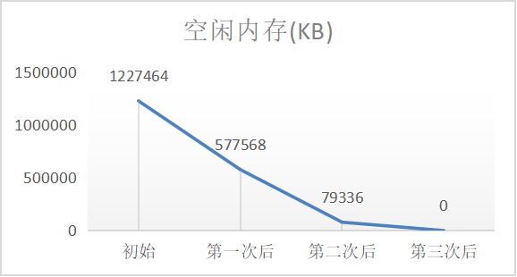
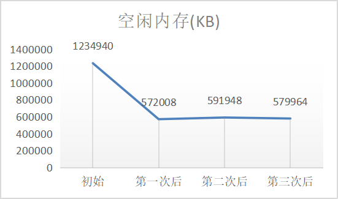
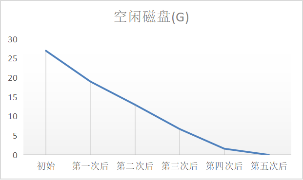
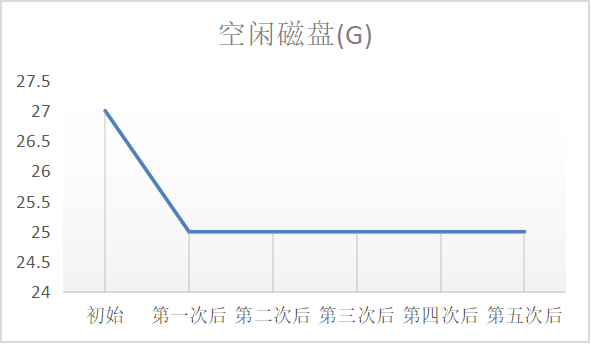

# 性能测试文档

## 测试环境

| 环境指标     | 环境参数                |
| ------------ | ----------------------- |
| Linux发行版  | Debian 9                |
| Linux内核    | 4.11.12                 |
| 机器模式     | 虚拟机                  |
| 内存大小     | 2G                      |
| 硬盘大小     | 50G                     |
| 处理器个数   | 2                       |
| 处理器核数   | 2                       |
| 处理器总核数 | 4                       |
| 机器环境     | boesfs环境 / native环境 |

注：

①native环境是没有安装BoesFS项目的原生态的操作系统环境。

②boesfs环境是安装并运行了BoesFS项目的操作系统环境。

## 法一：filebench

### 概述

filebench是一个用于文件系统测试的工具集，能够通过WML（工作负载模型语言）来生成各种场景的工作负载，具有使用灵活、设置简单、场景丰富、自定义模型、支持多线程等诸多优点。BoesFS项目的性能测试的其中一种方式是采用filebench，对比boesfs环境和native环境下的性能差异。

### 测试方法

基于filebench的fileserver的工作负载模型进行性能测试，修改后的具体工作负载的模型指标为：

| 模型指标         | 具体参数                                               |
| ---------------- | ------------------------------------------------------ |
| 测试目录         | /home/boes/boesfs/Code/test/tmp                        |
| 文件总数         | 10000                                                  |
| 目录宽度         | 20                                                     |
| 单个文件大小均值 | 131072B                                                |
| IO总线程数       | 50                                                     |
| 线程流操作集     | create、open、write、append、read、close、delete、stat |
| IO操作时间       | 60s                                                    |

该工作负载会在项目的./Code/test目录下生成一个大文件集tmp用于性能测试，文件总数是10000，该大文件集的目录宽度设置为20，平均每个文件的大小均值是131072B。发起IO请求的模拟线程为50个，均执行相同的文件操作流，运行60s。该工作负载会模拟一个文件服务器的实际大批量工作请求，每个IO线程会完成如下文件IO操作：①在测试目录中创建一个文件，写该文件，然后关闭该文件。②打开一个文件，追加文件内容，然后关闭该文件。③打开一个文件，读取整个文件，然后关闭该文件。④删除该文件。⑤查看测试目录的文件信息。共5步操作。


在性能指标的选择上，我们考虑如下三个性能测试指标：

| 性能指标                | 选择原因                                                     |
| ----------------------- | ------------------------------------------------------------ |
| 每秒流操作数（ops/s）   | 流操作执行速度体现文件系统请求和处理文件请求的能力           |
| IO总带宽（mb/s）        | IO总带宽体现文件系统和底层设备交互和文件系统请求处理上的能力 |
| 流操作响应时间（ms/op） | 流操作响应时间体现文件系统响应文件请求的能力                 |

在实际测试上，为了尽可能保持native环境和boesfs环境两种测试环境的一致性，我们借助了BoesFS项目设计上的优势，即设计理念上的模块化设计，可以通过动态的insmod 或者 rmmod boesfs.ko内核模块来进入boesfs环境或者回到最原生的native环境。

在初赛阶段，由于BoesFS现阶段性能测试存在内存耗尽和磁盘耗尽的问题，我们在同一个环境下无法连续多次的对BoesFS进行性能测试。我们在初赛阶段的性能测试上采用了一种比较简单的实现方式，即先测native环境，然后再测一次boesfs环境，得到一组结果。对于重复测试，我们采用的是VM虚拟机，会进行快照的恢复，重复上述测试步骤，进行3次测试，得到最终的性能测试结果。

总结BoesFS的性能测试方法为：①保存快照，先对native环境进行性能测试，得到native环境的性能测试结果。②然后insmod boesfs.ko内核模块，并通过BoesFS-Agent进入BoesFS的bash沙盒环境。③再对boesfs环境进行性能测试，得到boesfs环境的性能测试结果。④恢复虚拟机快照，回到测试环境，重复上述步骤3次，得到三组测试平均结果。

### 测试结果

在native环境下，根据上述测试模型和测试方法，得到的3组filebench性能测试结果如下表。native环境下的平均每秒流操作数是7191.683 ops/s，IO总带宽是170.900 mb/s，流操作响应时间是23.333 ms/op。

| native                  | 第1组    | 第2组    | 第3组    | 平均     |
| ----------------------- | -------- | -------- | -------- | -------- |
| 每秒流操作数（ops/s）   | 7218.310 | 7112.462 | 7244.278 | 7191.683 |
| IO总带宽（mb/s）        | 171.600  | 169.000  | 172.100  | 170.900  |
| 流操作响应时间（ms/op） | 23.000   | 23.800   | 23.200   | 23.333   |


在boesfs环境下，根据上述测试模型和测试方法，得到的3组filebench性能测试结果如下表。boesfs环境下的平均每秒流操作数是5782.563  ops/s，IO总带宽是137.000 mb/s，流操作响应时间是28.933 ms/op。

| boesfs                  | 第1组    | 第2组    | 第3组    | 平均     |
| ----------------------- | -------- | -------- | -------- | -------- |
| 每秒流操作数（ops/s）   | 5977.552 | 5605.348 | 5764.789 | 5782.563 |
| IO总带宽（mb/s）        | 141.500  | 132.500  | 137.000  | 137.000  |
| 流操作响应时间（ms/op） | 27.700   | 30.200   | 28.900   | 28.933   |


在不考虑BoesFS初赛阶段存在的内存耗尽和磁盘耗尽的问题下，对比得到的boesfs环境和native环境下得到测试结果的均值，如下表所示。在每秒流操作数上，BoesFS会相对于原始环境带来19.6%的性能开销。在IO总带宽上会带来19.8%的性能开销。在流操作响应时间上，会带来24.0%的性能开销。

综上，现阶段所实现的BoesFS带来的性能开销在20% - 24%以内。值得一提的是，后续阶段我们会解决BoesFS存在的内存耗尽和磁盘耗尽的问题，BoesFS带来的性能开销会比这个数值更为降低。

|                         | native   | boesfs   | compare |
| ----------------------- | -------- | -------- | ------- |
| 每秒流操作数（ops/s）   | 7191.683 | 5782.563 | -19.6%  |
| IO总带宽（mb/s）        | 170.900  | 137.000  | -19.8%  |
| 流操作响应时间（ms/op） | 23.333   | 28.933   | -24.0%  |


与一些其他传统的安全访问控制方法的开销进行对比，以①SCI（基于PTRACE），②用户态沙盒（基于FUSE）为例，可以看到基于eBPF和WrapFS内核态文件系统的方式有很好的性能优势。

| 安全访问控制方式 | 基于的方式                 | 性能开销 |
| ---------------- | -------------------------- | -------- |
| SCI              | PTRACE                     | <50%     |
| 用户态沙盒       | FUSE用户态文件系统         | <80%     |
| BoesFS           | eBPF、WrapFS内核态文件系统 | 19%-24%  |

## 法二：内核源码压缩、解压、编译

### 概述

评估沙盒文件系统的性能情况，打算沿用Mbox、Apiary和Sandfs中使用过的测试数据和测试场景，改进其测试方法，分别测试原始状态下（即没有装载beosfs）和beosfs场景下性能情况。采用此测试方法是为了能和前面所提到的项目进行对比。

### 测试方法

- 测试数据

测试数据采用本项目拟采用的Linux内核4.19.280源码。这也是调研得到目前比较主流的FaaS服务器内核版本。

- 测试场景

测试场景考虑三种大批量的文件处理操作，以衡量沙盒文件系统的性能，包括如下三种场景：

①测试压缩Linux内核4.19.280源码

对应的系统命令是：

```shell
tar -zcvf linux-4.19.280-image.tar.gz linux-4.19.280-image
```

②测试解压Linux内核4.19.280源码压缩包

对应的系统命令是：

```shell
tar -zxvf linux-4.19.280-image.tar.gz
```

③测试tinyconfig编译Linux内核4.19.280

对应的系统命令是：

```shell
make tinyconfig
```

- 测试方法

测试方法上，我们采用运行上面系统命令，并测量执行上述系统命令所需要的时间来实现，测试命令执行的时间采用times命令实现。具体如下：

```shell
time -p tar -zcvf linux-4.19.280-image.tar.gz linux-4.19.280-image
time -p tar -zxvf linux-4.19.280-image.tar.gz
time -p make tinyconfig
```

times输出的格式如下所示，我们选择real作为实际执行的时间。

```shell
real 1.00
user 0.80
sys 0.20
```

考虑cache等因素带来的误差，我们采用的方法是针对每种测试场景（例如压缩内核源码），首先先跑10次，采集到每种场景下的10次测试数据，然后去掉10个测试数据中性能开销最高的2个数据，并对剩下的8个数据取平均值，作每个场景下的最终数据。

我们最终实现的测试脚本为：[perfomance_test.py](../../../Code/test/performance_test/performance_test.py)

### 测试结果

在初赛阶段上，由于BoesFS设计上存在问题，BoesFS虽然实现了预期的访问控制功能，但BoesFS会存在带来内存和磁盘耗尽的问题，导致该测试方法暂时无法顺利通过。我们会在决赛阶段解决BoesFS现阶段遇到的性能问题，并获取该测试方法下的性能结果。

目前采用该方法对sandfs的性能做了测试的复现，参考[sandfs.md](../Note/sandfs.md) 文档的测试部分

## 现阶段存在的问题

初赛阶段的BoesFS项目基于已有的7个API，已经实现了优秀的访问控制能力，但在性能测试上遇到了如下两个问题，使得BoesFS项目目前只能通过简单的性能测试，即上述提到的filebench测试方法。这两个问题分别是：

### 问题1：内存耗尽的问题

考虑如下的测试场景：性能测试采用filebench进行大批量的文件IO操作，filebench会生成一个大批量的文件测试目录tmp。我们运行多次filebench，但每次测试完都删除本次生成的tmp目录，下一次测试重新生成tmp目录。采用 `free`命令来查看每次运行完filebench后的空闲内存。

在boesfs环境下，按照上述测试场景，运行多次filebench，可以得到如下测试结果，可以看到内存急速的衰减，运行第三次就会内存耗尽。

|              | 初始    | 第一次后 | 第二次后 | 第三次后 |
| ------------ | ------- | -------- | -------- | -------- |
| 空闲内存(KB) | 1227464 | 577568   | 79336    | 0        |



在native环境下，按照上述测试场景，运行多次filebench，可以得到如下测试结果，内存并不会受到太大影响。

|              | 初始    | 第一次后 | 第二次后 | 第三次后 |
| ------------ | ------- | -------- | -------- | -------- |
| 空闲内存(KB) | 1234940 | 572008   | 591948   | 579964   |



综上，可以看出，初赛阶段的BoesFS项目，在面对filebench的测试目录的删除和重新创建的情况下，会带来内存的衰减最终耗尽问题。这个问题是决赛阶段需要解决的一个重点目标。

注：详细内容参考遇到的困难文档中的困难10

### 问题2：磁盘耗尽的问题

考虑如下的测试场景：性能测试采用filebench进行大批量的文件IO操作，filebench会生成一个大批量的文件测试目录tmp。我们运行多次filebench，但每次测试完都不去删除本次生成的tmp目录，下一次测试继续沿用，按这样执行多次filebench的测试。采用 `df -h`命令来查看每次运行完filebench后的空闲磁盘。

在boesfs环境下，按照上述测试场景，运行多次filebench，可以得到如下测试结果，可以明显看到，磁盘容量不断减少，最后磁盘完全耗尽。

|             | 初始 | 第一次后 | 第二次后 | 第三次后 | 第四次后 | 第五次后 |
| ----------- | ---- | -------- | -------- | -------- | -------- | -------- |
| 空闲磁盘(G) | 27   | 19       | 13       | 6.7      | 1.6      | 0        |



在native环境下，按照上述的测试场景，运行多次filebench，不会出现磁盘容量不断减少的问题。

|             | 初始 | 第一次后 | 第二次后 | 第三次后 | 第四次后 | 第五次后 |
| ----------- | ---- | -------- | -------- | -------- | -------- | -------- |
| 空闲磁盘(G) | 27   | 25       | 25       | 25       | 25       | 25       |



注：详细内容参考遇到的困难文档中的困难11
