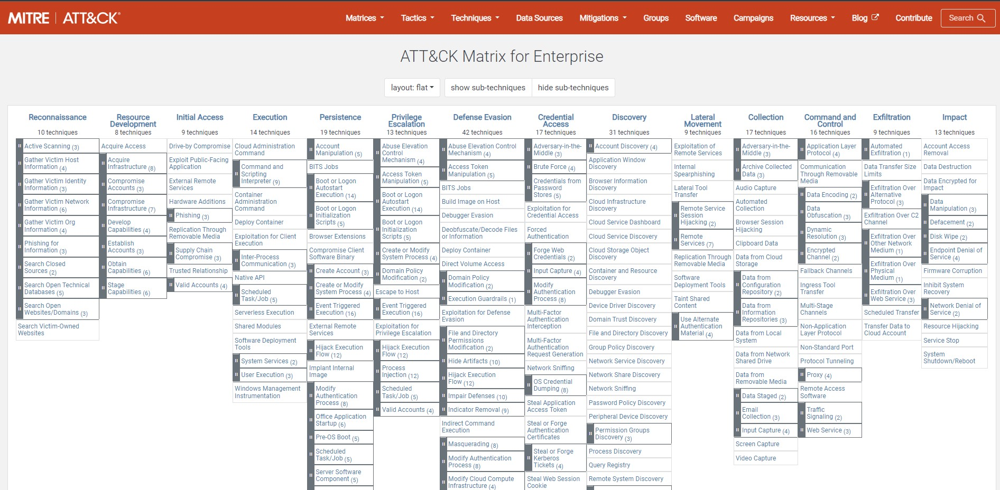

# BoesFS规则能力

本项目聚焦安全行业前沿，以ebpf技术为核心，完成了一个沙盒文件系统框架的搭建。沙盒文件系统给予了用户较高的自由度，用户可以根据实际使用场景，编写自定义的文件系统规则，以实现特质化的安全沙盒系统。与此同时，我们也对此编写了简单的沙盒文件系统规则，对沙盒进行简单、基础的保护。我们主要依托行业主流的ATT&CK模型，针对其中多种类型的攻击，编写对应的检测规则，实现基础的安全功能。

ATT&CK代表"Adversarial Tactics, Techniques, and Common Knowledge"，它是MITRE公司开发的一个框架，用于描述和分类网络攻击者在渗透测试和红队行动中使用的战术、技术和常见知识。ATT&CK矩阵将不同类型的攻击行为组织成矩阵，并根据不同的攻击阶段进行了分类。它包含了各种攻击技术和方法，从最基本的准备阶段到渗透、横向移动和持久化等不同的攻击阶段。我们主要对其中的主机安全部分进行研究，因为这部分涉及到本地的文件访问，是本项目防御的重点，而对于攻击者的网络扫描等前渗透部分，并不是本项目所研究的重点。

在下面的各项介绍中，我们聚焦于ATT&CK模型的各个攻击种类，并对每种类型的恶意攻击提出了一个具体的安全示例，涉及文件读取、修改、添加、删除。介绍了相关规则在保护FaaS沙盒环境安全方面可以实现的效果。实话说来，我们并不能做到沙盒环境的完全安全，但是通过不断细化沙盒文件系统的规则，通过使用者针对当前主机编写的自定义规则，我们可以使其不断变得更加安全。

## 4.Execution

恶意的攻击者程序可能会视图在本机中执行一些恶意代码，这种代码通常会导致主机的信息泄露，或权限泄露等后果。然而，这种行为与一般的用户程序并不是很容易区分开来，在本项目中，我们可以通过一些文件管理手段，来起到一定程度的预防与阻止的作用。

ATT&CK攻击种类举例：T1053 Scheduled Task/Job

crontab是一个用于在 Linux 或类Unix系统上自动执行任务的工具。它允许用户按照预定的时间间隔或特定时间安排执行命令、脚本或程序。crontab 的主要作用在于简化周期性任务的管理和执行，提高系统的自动化程度。

然而，攻击者可能会修改crontab相关文件来执行任务调度，以初始化或定时执行恶意代码。**通过研究本项目的使用场景**，我们认为用户程序并不需要修改这些配置文件，所以我们可以将与crontab相关的文件进行保护。`/var/spool/cron`存放了相关的数据，虽然普通用户并不能直接修改这一文件，但可以通过crontab这个命令来间接进行修改，所以我们对此进行了保护。

防御规则：`p, /var/spool/cron, lookup, dir, deny`

## 5.Persistence

持久性包括攻击者用来在重新启动、更改系统或其他登录凭据和其他可以重建攻击者到受害主机间访问权限的技术。用于持久性的技术包括允许它们在系统上保持立足点的任何访问、操作或配置更改，例如替换或劫持其他合法代码或添加启动代码。

ATT&CK攻击种类举例：T1546.004 Event Triggered Execution: Unix Shell Configuration Modification

`~/.bashrc`是在 Bash 终端中执行的一个脚本文件，它位于用户的家目录下。该文件主要用于配置和自定义用户的个人 Bash 环境。每次用户启动bash终端时，便会执行这个文件，攻击者可能会尝试通过将命令插入到 shell 自动执行的脚本中来建立持久性连接，我们可以通过禁止这类访问来达到预防的效果。

防御规则：
`p, /home/boes/.bashrc, lookup, file, deny`
`p, /home/boes/.bash_profile, lookup, file, deny`

## 6.Privilege Escalation

攻击者通常会试图在系统中尽可能获取更加高级的权限，这种权限提升的途径通常有很多，包括漏洞、弱密码、命令注入等。攻击者通过提升权限，可以执行更多恶意活动，并获取更广泛的系统访问权限。一些攻击者甚至可以从一些很小的权限，慢慢提升到root权限，获取到系统的管理权。

ATT&CK攻击种类举例：T1574 Hijack Execution Flow

攻击者可能会通过劫持操作系统运行程序的方式来执行自己的恶意代码。劫持执行流可以有多种目的以及方法，一个典型的例子就是劫持动态链接库，特别是正在运行的boesfs所使用的动态链接库，我们通过保护这类文件，就可以达到保护FaaS程序的目的。

防御规则：`p, /home/boes/.boesfs/acl/library/libboesfs.so, write, file, deny`

## 7.Defense Evasion

通常来说，各单位的主机上都会安装一些安全防御的软件，而攻击者会通过各种手段绕过或逃避这些防御机制来实现攻击目标。这包括伪装、加密编码、恶意软件功能变异、零日漏洞利用以及应用程序和操作系统漏洞利用等技术和方法。攻击者通过这些手段可以迷惑、规避或禁用安全防护机制，使攻击活动更隐蔽和有效。

ATT&CK攻击种类举例：T1562.001 Impair Defenses: Disable or Modify Tools

攻击者会通过禁用或修改安全工具来削弱系统的防御能力，还可能篡改安全工具部署和使用的配置等文件，来达到阻止安全工具检测其攻击行为的效果。

在本项目中，规则配置文件无疑是非常重要的安全检测配置文件，如果这一文件被修改，再次加载沙盒环境时，攻击者便可以无视系统之前配置的各种规则，在沙盒系统中随意发挥自身的权限，进行文件的修改。所以，对这种文件进行保护是非常有必要的。

防御规则：`p, /home/boes/.boesfs/acl/model/policy.txt, write, file, deny`
## 8.Credential Access

我们并不希望用户程序在沙盒系统中的信息，尤其是一些关键信息。凭证信息就是重点的保护对象，包括了主机登录凭证、主机命令行历史记录、cookies等，通过设置文件访问权限，我们可以较好地保护主机的关键凭证信息不被用户程序获取到。

ATT&CK攻击种类举例：T1552 Unsecured Credentials

`~/.ssh/authorized_keys` 文件是用于存储SSH公钥认证所需的密钥信息的文件。它在Linux系统中扮演着至关重要的角色，用于管理对远程主机的安全访问。该文件中存储的是经过授权的公钥，用于验证远程用户或系统对目标主机的身份认证。当一个用户尝试通过SSH连接到远程主机时，系统会将其提供的公钥与 `~/.ssh/authorized_keys` 文件中的公钥进行匹配。如果匹配成功，则认为该用户是合法的，并允许其访问远程主机；反之，则拒绝其访问。

创建沙盒系统时，我们并不希望将泄露过多主机部分的信息。如果用户程序访问到了这一文件，攻击者可能获取到主机的登录凭证，进而通过一些方式登录主机，获取主机权限，给主机带去风险，通过禁止访问这一文件，我们可以规避一些这种风险。

防御规则：`p, /home/boes/.ssh/authorized_keys, lookup, file, deny`

## 9.Discovery

攻击者可能会尝试获取有关系统和内部网络的相关信息。这些信息可以帮助攻击者更好地理解目标环境，决定下一步应该如何采取行动，并规避检测和防御机制，这些信息同时也会让攻击者更加了解本机器的作用，使本机器作为下一步攻击的跳板或者被攻击者命令去攻击（DDoS）其他企业的主机。

ATT&CK攻击种类举例：T1497.002 Virtualization/Sandbox Evasion: User Activity Based Checks

攻击者在入侵过程中用于发现系统所有者或用户身份的活动。通过获取这些信息，攻击者可以确定目标环境中的潜在攻击目标，了解用户角色和权限，并为后续的攻击行动做准备。其中一种方法便是用户活动监视。攻击者可能会监视系统日志、安全审计日志或其他记录用户活动的文件，以收集用户登录、注销、访问特定资源等相关信息。

其中，`~/.bash_history`文件是一个非常关键的文件，他是一个存储用户使用Bash shell执行过的命令历史记录的文件，当用户在命令行终端中执行命令时，Bash shell会将这些命令及其相关的数据保存到该文件中。该文件的存在对于用户方便管理和重复执行命令非常有用。然而，从安全角度来看，`~/.bash_history`文件也可能成为潜在的安全威胁。因为它可以泄露用户执行过的命令，包括可能包含敏感信息的命令（如密码、敏感文件路径等）。所以我们可以通过规则来限制用户程序对其的访问。

防御规则：`p, /home/boes/.bash_history, read, file, deny`

## 11.Collection

攻击者可能会尝试收集当前主机的各种信息，这些信息与跟踪对手的目标相关。通常，收集数据后的下一个目标是窃取（渗透）数据。常见的目标源包括各种驱动器类型、浏览器、音频、视频和电子邮件。常见的采集方式包括截图和键盘输入。

ATT&CK攻击种类举例：T1005 Data from Local System

攻击者会尝试在本地文件系统中搜集有用的信息。这些敏感信息通常需要用户自定义一些规则，将自己认为重要的文件写进规则里，进行防御，这里为了演示，我们将boesfs的日志文件进行了保护，如果用户认为生产环境中还有其他有用的信息，可以添加一些自定义规则。

防御规则：`p, /home/boes/.boesfs/log, read, dir, deny`

## 12.Command and Control

与C2服务器进行通讯

## 13.Exfiltration

将文件进行导出

## 14.Impact

一些较为极端的攻击者会试图操纵、中断或破坏系统和数据。他们会通过操纵业务和运营流程来破坏可用性或损害完整性。具体来说，主要的手段为破坏或篡改数据。在某些情况下，运行与当前主机上的业务流程可能看起来不错，但可能已经被攻击者暗中篡改，以实现其目的。攻击者也可能会使用这些技术来实现其最终目标或为泄露机密提供掩护。

ATT&CK攻击种类举例：T1490 Inhibit System Recovery

攻击者可能尝试删除系统中的数据，并且关闭系统的备份服务，禁用或删除系统恢复功能，来防止系统恢复，以此来增强数据破坏和数据加密的影响，这通常出现与勒索病毒或者旨在破坏系统的攻击者上。

如果对系统的破坏已经发生，单凭boesfs这个系统可能已经无能为力，但是我们可以尽量对其进行预防。在Linux系统中，备份目录一般在/var目录下，通常有一个名为"backup"或"backups"的子目录，用于存储系统备份文件。我们将这种文件进行保护，以防止攻击者对其进行删除，便于后期系统的恢复。这里以backups文件夹为例。

防御规则：`p, /var/backups, unlink, dir, deny`