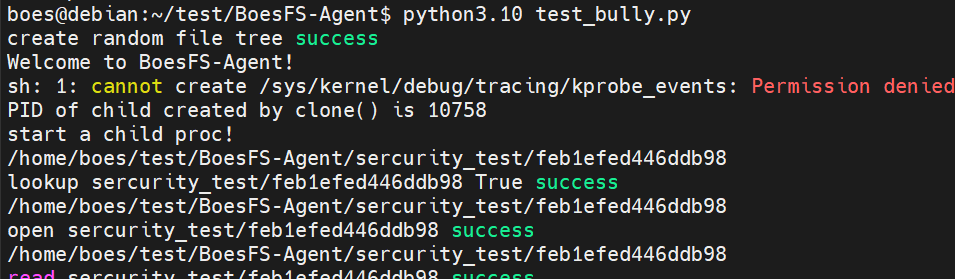
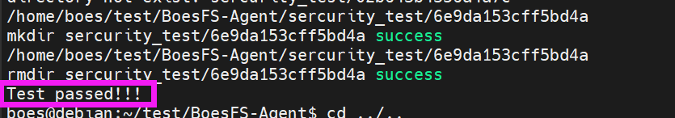
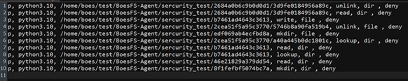
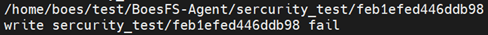
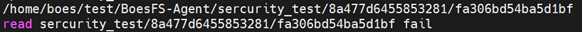

# 访问控制测试文档
## 测试环境
|环境指标|环境参数|
|:-:|:-:|
|Linux发行版|Debian 9|
|Linux内核|4.11.12|
|机器模式|虚拟机|
|内存大小|2G|
|硬盘大小|50G|
|处理器个数|2|
|处理器核数|2|
|机器环境|boesfs环境|
|Python版本|3.10.11（至少为3.6+）|

## 测试方法

### 测试思路
使用python脚本，首先生成随机的目录树，每个目录下会生成一些文件与文件夹，随后对这些文件（夹）随机赋予acl规则，并对各个路径进行各项访问测试，查看其结果是否与规定一致。
由于启动BoesFS-Agent需要现有acl规则，因此需要两个脚本将测试拆解成两部分，前半部分负责目录树和acl规则文件的生成以及BoesFS-Agent的启动，即启动脚本，后半部分负责对进行各项访问测试并检查是否符合随机生成的acl规则，即访问脚本。

### 设计实现
1. 在测试脚本中定义Inode结构体，该结构体使用树状链表简单地模拟文件系统，结构体中记录了文件路径、对应的权限及子目录，方便后续测试。
2. 启动脚本处于外部的namespace，工作流程为首先生成随机的目录树，将所有的目录和文件都用Inode结构体表示，然后根据生成的目录树随机生成acl规则，并在acl规则的生成过程中进行语义解析，修改有关Inode的权限，随后将acl输出为文件，并将所有Inode序列化得写入文件中，以供访问脚本进行读取。
3. 访问脚本用于进行具体的访问控制测试，将启动脚本生成的Inode文件反序列化读取至内存中并进行访问，遍历访问所有的文件及文件夹，对每一个文件依次进行lookup, open, read, write和unlink测试，对每个文件夹依次进行mkdir和rmdir测试。
4. 在进行访问测试时，每次访问测试都先检查测试结果，如果访问成功，且Inode结构体中的权限是允许，那么脚本将打印出“文件操作 路径 success”；如果访问失败，报错为PermissionError，且Inode结构体中的权限是禁止，那么脚本将打印出“文件操作 路径 fail”；在其他情况下，脚本会报AssertionError，说明测试失败。
5. 在进行权限判断时，测试脚本考虑到某些文件操作会有前置操作，因此在判断时会连同前置操作一起判断，比如对一个文件禁用open操作，那么python自然无法write该文件，则尝试write该文件检测到PermissionError时会同时检查Inode结构体的权限中的open权限和write权限。
6. 整体上的运行逻辑为，在命令行使用python运行外部namespace的脚本，该脚本在完成生成工作后调用os库启动Boesfs-Agent，并将另一个脚本的启动命令传递给Boesfs-Agent，以供Boesfs-Agent在创建完新namespace后启动另一个脚本。

### 测试命令
```shell
python3.10 test_bully.py
```
其中该文件中启动Boesfs-Agent的代码为：
```python
os.system("./boesfs -a -d /home/boes -l python3.10 main.py")
```

## 测试结果

测试时需要将测试相关的python文件全部拷贝至BoesFS-Agent目录中，然后再运行测试命令。在多次测试下，每次测试生成的目录树和规则均随机，对BoesFS项目实现的7个API检测全部成功，某次测试过程截图如下：



 
此次测试中生成的acl规则文件如下：


 
测试结果分析：
以两条访问拦截成功的为例：


 
在acl规则文件中的第7行的规则为“p, python3.10, /home/boes/test/BoesFS-Agent/sercurity_test/feb1efed446ddb98, write, file , deny”，也就是说，针对绝对路径为/home/boes/test/BoesFS-Agent/sercurity_test/feb1efed446ddb98的文件，在BoesFS项目的限制下，python3.10对该文件的写操作是禁止的。而测试脚本运行的过程中，打印出了“write sercurity_test/feb1efed446ddb98 fail”的内容，即脚本在开启BoesFS-Agent后，对该文件进行写操作的时候失败了，并且报错类型为PermissionError。由于脚本创建的文件对所有用户可读可写，因此判定是BoesFS文件系统将python3.10对该文件的写操作进行了拦截，与随机生成的acl规则结果一致。


 
在acl规则文件中并没有文件操作为read，且路径为/home/boes/test/BoesFS-Agent/sercurity_test/8a477d6455853281/fa306bd54ba5d1bf的项，但第6行中存在一个也是该路径名的项为“p, python3.10, /home/boes/test/BoesFS-Agent/sercurity_test/8a477d6455853281/fa306bd54ba5d1bf, open, file , deny”，其限制了绝对路径为/home/boes/test/BoesFS-Agent/sercurity_test/feb1efed446ddb98的文件，在BoesFS项目的限制下，python3.10对该文件的open操作是禁止的。既然用户无法open该文件，那么用户应当也不能读该文件。而测试脚本运行的过程中，打印出了“read sercurity_test/8a477d6455853281/fa306bd54ba5d1bf fail”的内容，即脚本在开启BoesFS-Agent后，对该文件进行读操作的时候失败了，并且报错类型为PermissionError。同理可判定是BoesFS文件系统将python3.10对该文件的读操作进行了拦截，与随机生成的acl规则结果一致。

### 结果分析

在访问控制测试中，在随机生成的目录树下，根据随机生成的ACL规则，所有生成文件访问请求都被正确的按照ACL的逻辑进行了放行或者拦截，准确率为100%。初赛阶段的BoesFS已经能够正确的实现进程级别的访问控制粒度的文件请求的ACL的逻辑，拦截ACL所不允许的所有非法文件请求，具备优秀的访问控制能力，达到预期的初赛访问控制能力的要求。

