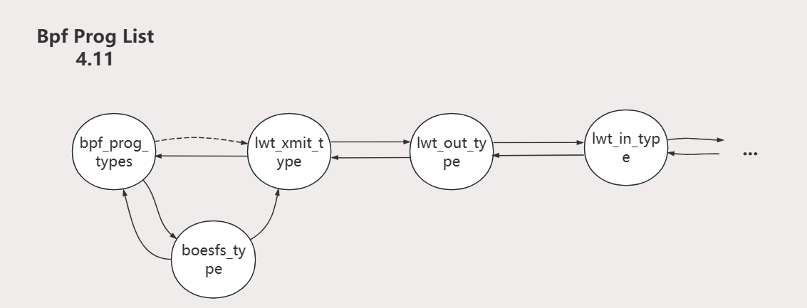

# 项目遇到的困难

## 困难列表

- [X] 困难1：编译Sandfs的整个项目
- [X] 困难2：sandfs 内核模块化问题
- [X] 困难3：不同版本的Linux eBPF机制有了较大变化
- [X] 困难4：memlock的限制和eBPF Map大小
- [X] 困难5：eBPF的栈访问失败
- [X] 困难6：内核写文件的的写阻塞问题
- [X] 困难7：eBPF Map Update失效
- [X] 困难8：nobody无法创建文件
- [X] 困难9：性能测试时大批量文件读写遇到crash问题
- [ ] 困难10：性能测试时遇到内存耗尽和磁盘耗尽的问题

## 困难1：编译Sandfs的整个项目

3.28-4.2，使用20.04编译SandFS-Kernel，遇到gcc版本、i386和x86-64冲突，需要打patch等问题，到4.2日13点基本解决

4.2日13点发现make完后无法install错误，发现需要在/lib/modules/目录下需要存在4.10.0-rc8+目录，由于对Linux内核版本的不了解，寻找了好久对应的头文件，最后更换了16.04虚拟机升级内核版本，耗时约一天，

4.3日20点完全解决16.04的编译安装问题，编译安装完内核，但发现LibSandFS无法编译，重启虚拟机发现无法启动，推测为内核编译出现问题，晚上新建了虚拟机，4.4日忽略SandFS的说明文档，参考其他内核编译文档约17点编译成功

编译内核成功后编译LibSandFS失败，报错提示‘BPF_PROG_DETACH’ undeclared，原因是因为编译时内核头文件未安装，于4.6晚上编译成功

## 困难2：sandfs 内核模块化问题

### 内核符号丢失问题

在模块化编译sandfs的时候，出现了大量的ebpf helper function proto undeclared的问题，原因是内核符号获取失败，后来采用kprobe探测的方式，若获取符号地址失败，则注册相应的kprobe，再获取kallsmy_lookup_name函数地址，从而得到对应的内核符号地址

### bpf prog ops注册失败问题

由于需要模块化编译sandfs，因此在编译内核时并未注册BPF_PROG_TYPE_SANDFS的helper function获取协议和验证函数，因此在装载sandfs模块时必须先注册相应的内容。而内核中本身只提供了用于注册的函数，而没有取消注册的函数，同时由于自己定义的bpf_prog_type_list sandfs_tl使用了初始化后只读机制使其不能取消注册，造成了装载模块时能注册而卸载模块时无法取消注册的情况。而helper function获取协议和验证函数无法在同一个类型上重复注册，因此导致了sandfs模块只能装入一次的问题。最后通过取消sandfs_tl的初始化后只读机制，并通过内核的链表操作函数编写了一个取消注册的函数在卸载模块的函数中调用成功解决问题。

## 困难3：不同版本的Linux eBPF机制有了较大变化

eBPF在Linux内核源码的更新迭代很快，不同版本的部分实现机制有较大差别。以bpf相关的一个文件syscall.c为例，从4.10.17只有1000行左右，到最新的6.2.11已经到了5325行。大体的机制不变，但增加了很多和项目无关的一些机制。此外，Linux eBPF以4.12版本为分界线，往下的支持eBPF prog types list结构，支持动态注册，往上则不再支持，只能在编译内核的时候写死在内核。

高版本的Linux内核将带来很高难度的开发门槛（无关代码太多），和很不友好的开发环境（每修改一点eBPF相关内容就得完全重新编译内核，至少要3h），但我们又希望项目能尽可能面向高版本内核。

于是我们根据以Linux 4.12版本为分水岭，将项目划分为Flexible和Normal版本。Flexible版本是我们理想中的BoesFS项目，也是我们的开发环境，但它的架构只适用于Linux 4.12版本以下，因此我们的开发环境也将是Linux 4.12以下。Normal版本则是Flexible版基础上的移植，这个设计架构能够用于任何版本的Linux内核。

<待补充>4.11的ro_after_init

然而关于如何挂载eBPF prog type节点(该类型在kernel中叫做struct bpf_prog_type_list，下文中该类型对象简称为“节点”），在4.10及以下 和 4.11中的操作方式是不同的，关键原因在于节点是否是__ro_after_init。
首先明确__ro_after_init语义：被其修饰的变量仅在__init time被初始化一次，之后该变量read only，若对其修改则会触发unable to handle kernel paging request at [0xaddr]的kernel bug。
在4.10中，节点为__read_mostly；然而到4.11之后，节点变为__ro_after_init。故4.11中，eBPF prog types list上已有的节点不可被修改，也即我们不能改变已有节点的指针成员的指向。

所以4.10中，我们可以正常的对该双向链表eBPF prog types list进行头插和移除节点，如图（通过list_add()插入，通过list_del()移除节点）

而在4.11中，我们头插和移除节点时，注意不能改变kernel中原有eBPF prog节点的指针指向。所以我们头插时，头节点和新节点互相指向对方，旧节点的prev仍然指向头节点，新节点的next指针指向原先头节点的的next节点。如图

4.11中，我们这样操作后（即便之后又头插了一些新的eBPF prog type节点），kernel通过头节点向后遍历eBPF prog list能够成功找到新节点以及所有原有的eBPF prog type；如果从后向前遍历该链表，则只是不能找到我们新插入的节点，kernel原有的eBPF prog type仍然能够正常获取。而kernel中对于该链表的使用地方不多，且都是通过macro list_for_each_entry正序遍历该链表（见syscall.c），故我们这样修改是正确的。

关于更详细的4.10和4.11的中分别如何注册和卸载eBPF prog type，请见Boesfs-in-Kernel开发文档。

## 困难4：memlock的限制和eBPF Map大小

问题描述：Linux内核对每个进程所能使用的资源做出了限制，memlock即锁定内存区域就是其中一个限制资源。并且只有拥有超级权限的进程，才能扩大资源的硬限制上限。在eBPF的实现机制中，eBPF用户态程序都是必须申请memlock，并将eBPF Map和eBPF字节码加载进去。如果memlock上限不足，或者eBPF字节码太复杂导致太大，或者使用eBPF Map存取的条目太多，这个时候都会遇到eBPF加载失败的问题。

解决办法：我们采取的方式是BoesFS-in-Kernel会提供修改rlimit的功能，超级权限用户root在安装boesfs.ko的时候可以进行memlock rlimit的配置。当然memlock总会有上限，如何尽可能压缩eBPF字节码大小和eBPF Map的大小，也是我们重点考虑的一个问题。我们对于eBPF Map的想法可以通过位图的方式来进行存取。

## 困难5：eBPF的栈访问失败

加载eBPF字节码时，爆出bpf_load_program() err=13，invalid indirect read from stack off - 264 + 0 size 256。由上下文指令可知这是在访问path时出错.
由[eBPF verifier](https://kernel.org/doc/html//v6.2/bpf/verifier.html)可知
如果一个寄存器从来没被写过，那么他不可读。故我们需要在定义采集参数结构体时对path等成员进行初始化

当然，我们遇到的与eBPF字节码加载的bug还有很多。
比如尝试直接将ctx的成员用于map的查询等操作，爆出type=inv expected=fp的错误，原因在于bpf map helper function的key类型应当为指向ebpf stack的指针
比如尝试在字节码实现参数的拷贝，由于涉及到loop，导致爆出 back-edge from insn xx to xx 的错误，故将拷贝逻辑转移至helper function实现。
又比如尝试对ctx进行写操作，也不会通过verifier的is_valid_access的检测
等等等

## 困难6：内核模块写文件的写阻塞问题

问题描述：在实现BoesFS的日志审计功能时，项目采用直接在内核写文件的方式。但在实际实现中，在内核模块直接写文件，会遇到阻塞问题，内核模块就卡死在了这个地方，后续所有的代码逻辑都无法进行下去。查阅资料发现，这是内核实现的问题，开发内核模块普遍遇到此类问题，并且没有很好的解决方法。

解决办法：我们为了避免内核模块主线程的阻塞，采用了每次写审核日志都新开一个内核线程的方式来写文件。经过验证，此方法可行，成功解决了该问题。

## 困难7：eBPF Map Update失效

问题描述：在实现ACL模式读取规则文件时，规则文件中可能对同一路径作出限制。由于目前采取的策略是每读取一条规则就解析一次写入map中，在把规则转换成bitmap前要先尝试读取bpf map是有已有该路径，若有，需要把已有的bitmap和现有的运算结合。但是参考samples里的字节码逻辑，并未成功修改获取到的bitmap。实际上在内核定义中，分别供bpf字节码和用户使用的两个bpf map操作函数虽然名字相同，但内部实现不相同。

解决办法：用户态使用bpf_map_lookup函数得到的返回值与字节码使用的bpf_map_lookup函数返回值不同，用户态从bpf_map_lookup得到的bitmap值也只是临时复制出来的，无法直接修改。用户态必须通过bpf_map_update函数，且把参数置为BPF_ANY才能更新已有的bitmap值。

## 困难8：nobody无法创建文件

问题描述：在C语言使用unshare()创建并进入新的user namespace后，进程的用户和用户组都会自动变为nobody，uid和gid分别为overflowuid和overflowgid（即65535）。此时进程会因为uid和gid过大导致无法创建文件，而同时进程也没有权限修改自己的uid和gid。

解决办法：改为使用clone()创建新的user namespace和子进程，并先让子进程阻塞，此时父进程有权限修改子进程在user namespace中uid和gid映射，修改完毕后再通知子进程继续运行。经过验证，在使用此方法将子进程的根uid和gid映射到外部的用户uid和gid后，子进程的用户名变为root，能够创建文件。

## 困难9：大批量文件读写遇到crash问题

问题描述：在对BoesFS进行大规模文件读写测试时crash，并且项目代码庞大，内核模块开发经验不够，很长一段时间定位不到问题所在。

解决办法：查阅资料，学习内核模块crash分析。通过系统日志打印的crash信息，添加打印语句溯源问题所在。根据strlen非法访问导致内核crash，找到是因为没有深入了解所使用的一个内核函数d_path的底层实现机制，过早的释放了传入的缓冲区，导致后续strlen访问时造成非法访问。

原因：kernel的get_path模块实现有问题，对Linux内核函数和内存分配机制不熟悉，提前释放了内存，导致内核内存非法访问。

## 困难10：性能测试时遇到内存耗尽和磁盘耗尽的问题

问题1：多次运行filebench的时，会出现内存耗尽的问题

下面是具体分析，以跑filebench为例。

最初始的环境下，使用free命令，可以得到空闲内存大小为1227464B。

第一次运行 `filebench -f fileserver.f`，运行过程中，使用free命令，可以得到空闲内存大小为85780B。

运行结束后，使用free命令，可以得到空闲内存大小为577568B。

如果不删除prealloc生成的tmp文件目录树，以后每次运行，空闲内存都是类似如上变化，不限次数。

如果删除tmp目录，重新prealloc，那么该测试后，查看空闲内存为586800B。

再次运行该测试，就会出现内存耗尽的失败，如下所示。

执行系统命令都会失败，如下图所示。

查看空闲内存可以发现，内存已经近乎用尽，为79336B。

如果不使用BoesFS环境，或者不删除和重新生成tmp目录，则不会遇到这种情况。

原因：**待查找**。目前可以看到的是cache变多了。目前感觉像是使用了BoesFS之后，文件的删除操作没有完全删除彻底？或者是使用了BoesFS之后，文件的创建操作（prealloc）,会让buff/cache增大。

下面给出native环境下的对比结果，不会出现以上的问题：

运行前：

第一次运行

第二次运行

第三次运行

问题2：不删除tmp目录情况下，多次重复运行filebench，遇到读写失败的问题

具体描述如下，BoesFS环境下运行多次filebench如下：

测试前，df查看为可用27G：

第一次测试，成功，性能较好，磁盘可用19G，减少8G左右

第二次测试，成功，性能变差一档，磁盘可用13G，减少6G左右。

第三次测试，成功，性能和第二次维持，磁盘可用6.7G，减少6G左右。

第四次测试，成功，性能又变差一档，磁盘可用1.6G，减少5G左右。

第五次测试，读写失败。看起来说是，磁盘空间不够了。

第六次测试，读写失败，同第五次。

使用df查看磁盘使用情况，磁盘使用已经满了。。

下面给出native环境的对比测试

运行前：

第一次运行后：

第二次运行后：

第三次运行后：

第四次运行后：

第五次运行后：

第六次运行后：

