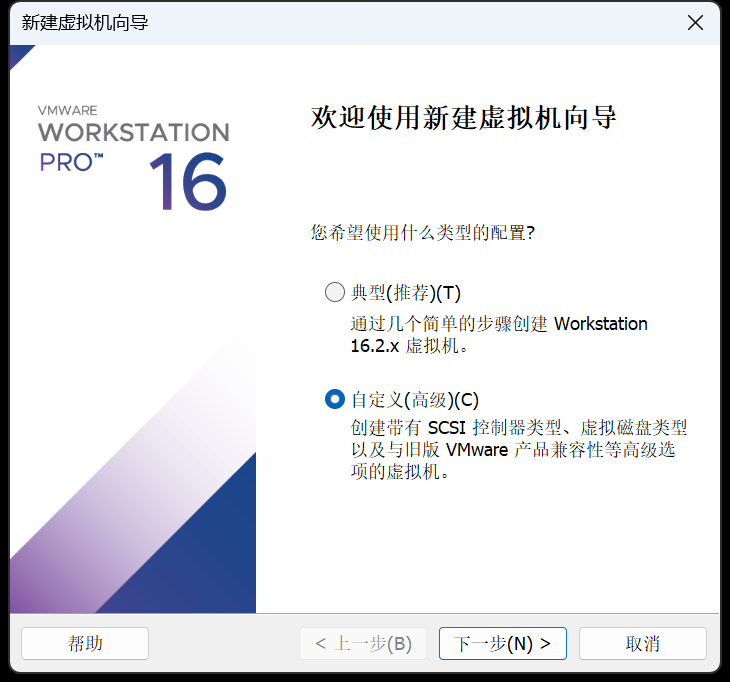
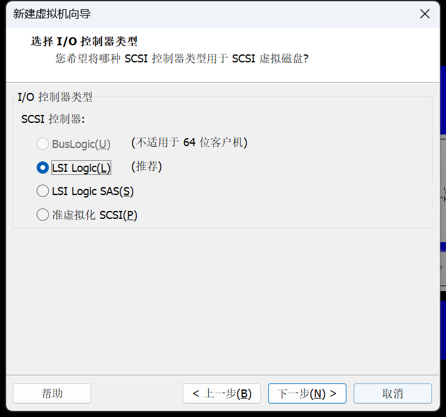
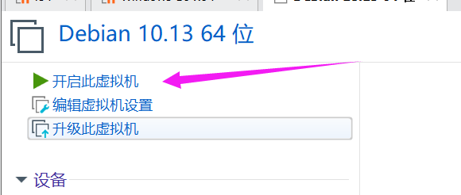
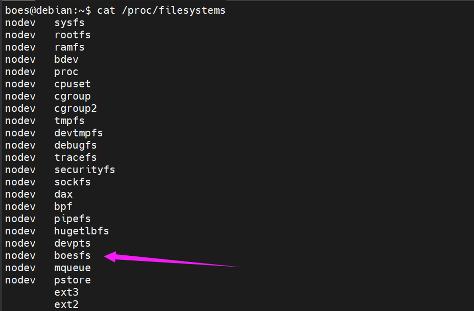

### 环境搭建

**项目环境选择**

由于BoesFS项目需要新增一种ebpf prog类型，因此在选择Linux内核版本的时候，考虑到4.12.0及以上的版本的Linux内核将ebpf prog的各个类型维护为静态数组，而4.11.12及以下的版本将ebpf prog类型维护为双向链表，初赛阶段，即BoesFS项目（Flexible）采用了4.11.12版本的Linux内核。

而在Linux发行版的选择上，考虑到赛题中给出的serverless环境，BoesFS综合主流云服务器商提供的服务器环境和Serverless环境，最终选择了Debian。而降级内核版本可能会引起操作系统的直接崩溃，因此BoesFS项目（Flexible）使用内核版本为4.9.0的Debian 9作为开发环境，BoesFS项目（Normal）预计使用内核版本为5.10.162的Debian 11作为开发环境。

在Wrapfs的选择上，BoesFS项目尽可能使用了最贴近对应版本内核的Wrapfs，BoesFS项目（Flexible）使用版本为4.11的Wrapfs，BoesFS项目（Normal）预计使用版本为5.10的Wrapfs作为开发环境。

**项目环境概述**

| Linux发行版 | Linux内核版本 | Wrapfs版本 | 环境目的                                         |
| ----------- | ------------- | ---------- | ------------------------------------------------ |
| Debian9     | 4.11.12       | 4.11       | BoesFS项目开发环境、BoesFS项目(Flexible)部署环境 |
| Debian11    | 5.10.162      | 5.10       | BoesFS项目(Normal)部署环境                       |

**镜像链接**

https://gitee.com/yang-darong/linux-5.10.162.git

https://gitee.com/yang-darong/linux-4.11.12.git

https://gitee.com/yang-darong/wrapfs.git

#### 1.下载Debian 10镜像并安装

进入[镜像站](https://ftp.acc.umu.se/cdimage/archive/10.13.0-live/amd64/iso-hybrid/)
下载标准版本debian-live-10.13.0-amd64-standard.iso

按照图片新建虚拟机






* 然后开机，一定不能选择第1项
  
  

开启虚拟机后设置语言为英语，时间为香港，keymap为英语


等待设置完毕后开始设置用户
设置本机名称为debian，root密码为root，user名为boes，密码为boes，其他均为默认即可
等待设置完毕后开始设置磁盘，第一页按如下设置

后面的设置均为默认即可，最后选择yes后开始安装操作系统


漫长的等待后选择镜像源

选择China后选择清华源


**下面一定要选择是，并选择sda文件，否则开机无法启动**


#### 2.下载对应Linux内核源码

首先修改sudo文件

```shell
su -  #进入root用户
chmod u+w /etc/sudoers
vi /etc/sudoers
```

在"root ALL=(ALL:ALL) ALL"的行下面添加

```txt
boes    ALL=(ALL:ALL) ALL
```

然后保存退出并撤销权限命令

```shell
chmod u-w /etc/sudoers
```

还是要换清华源

```shell
deb https://mirrors.tuna.tsinghua.edu.cn/debian/ buster main contrib non-free
deb https://mirrors.tuna.tsinghua.edu.cn/debian/ buster-updates main contrib non-free
deb https://mirrors.tuna.tsinghua.edu.cn/debian/ buster-backports main contrib non-free
deb https://mirrors.tuna.tsinghua.edu.cn/debian-security/ buster/updates main contrib non-free

deb-src https://mirrors.tuna.tsinghua.edu.cn/debian/ buster main contrib non-free
deb-src https://mirrors.tuna.tsinghua.edu.cn/debian/ buster-updates main contrib non-free
deb-src https://mirrors.tuna.tsinghua.edu.cn/debian/ buster-backports main contrib non-free
deb-src https://mirrors.tuna.tsinghua.edu.cn/debian-security/ buster/updates main contrib non-free
```

更新源

```shell
sudo apt-get update
```

#### 3-1.构造编译环境

下载Linux4.19源码

```shell
sudo apt-get install linux-source-4.19
mkdir Kernel
sudo mv /usr/src/linux-source-4.19.tar.xz Kernel/linux-source-4.19.tar.xz
cd Kernel
sudo chmod 777 linux-source-4.19.tar.xz
tar -xvf linux-source-4.19.tar.xz -C /home/boes/Kernel
cd linux-source-4.19/fs/
```

直接用MobaXterm的SFTP上传功能上传新的文件系统beosfs

```shell
cd ~/Kernel/linux-source-4.19
cp /boot/config-$(uname -r) .config
sudo apt-get install libncurses5-dev
sudo apt install libelf-dev
sudo apt install libssl-dev
```

#### 3-2.静态编译内核

为后面实现boesfs的内核模块化，拍摄快照

修改fs文件夹里的Makefile，在第86行后增加一行

```make
obj-$(CONFIG_BOES_FS)		+= boesfs/
```

修改fs文件夹里的Kconfig，在第236行后增加一行

```txt
source "fs/boesfs/Kconfig"
```

在boesfs.h的define语句后加上

```c
#define BOESFS_SUPER_MAGIC	0xb550ca20
#define BOESFS_VERSION "0.1"
```

在extern 函数语句后加上

```c
extern int vfs_path_lookup(struct dentry *, struct vfsmount *,
			   const char *, unsigned int, struct path *);
```

修改Documentation/filesystems/00-INDEX，在第147行后增加

```txt
boesfs.txt
	- info on based-on-ebpf-Sandbox stackable file system
```

在Documentation/filesystems增加文件boesfs.txt，内容任意

```txt
boesfs.txt
	- info on based-on-ebpf-Sandbox stackable file system
```

MAINTAINERS暂不修改
执行

```shell
make menuconfig
```

进入并找到->File system ->Miscellaneous filesystems -> Boesfs stackable file system (EXPERIMENTAL) (NEW)
按Y设置为安装，然后退出

修改.config中的CONFIG_SYSTEM_TRUSTED_KEYS改为空值

```shell
CONFIG_SYSTEM_TRUSTED_KEYS=""
```

```shell
make -j4
```

目前boesfs的inode.c（已解决），super.c（已解决），lookup.c（已解决），mmap.c（已解决）存在问题，需要修改代码符合4.19.269版本的vfs函数

编译成功

然后执行命令安装

```shell
sudo make modules_install -j4
make headers_install
sudo make install -j4
sudo update-grub
sudo reboot
```

开机后执行命令

```shell
cat /proc/filesystems
```

得到现在内核中的文件系统


#### 3-3.模块化编译boesfs

修改Makefile为

```Makefile
obj-m += boesfs.o
boesfs-objs := dentry.o file.o inode.o main.o super.o lookup.o mmap.o

all:
	make -C /lib/modules/$(shell uname -r)/build M=$(PWD) modules

clean:
	make -C /lib/modules/$(shell uname -r)/build M=$(PWD) clean
```

在boesfs文件夹中执行

```shell
make
sudo insmod boesfs.ko
```

加载成功


#### 4-1 降级内核：构造编译环境

下载Linux4.11源码

```shell
mkdir Kernel
cd Kernel
```

上传下载的linux-4.11.12.tar.xz源码

```shell
sudo chmod 777 linux-4.11.12.tar.xz
tar -xvf linux-4.11.12.tar.xz -C /home/boes/Kernel
cd linux-4.11.12
cp /boot/config-$(uname -r) .config
sudo apt-get install libncurses5-dev
sudo apt install libelf-dev
sudo apt install libssl-dev
sudo apt install bc
sudo apt install gcc-7
sudo rm /usr/bin/gcc
sudo ln -s /usr/bin/gcc-7 /usr/bin/gcc
make menuconfig
```

直接退出，然后
修改.config中的CONFIG_SYSTEM_TRUSTED_KEYS改为空值，

```shell
CONFIG_SYSTEM_TRUSTED_KEYS=""
```

修改必要的内核源码
（include/uapi/linux/bpf.h和kernel/bpf/syscall.c）
根据[博客](https://git.kernel.org/pub/scm/linux/kernel/git/torvalds/linux.git/commit/?id=b21ebf2fb4cde1618915a97cc773e287ff49173e)修改内核源码

```shell
make -j4
```

```shell
sudo make modules_install -j4
make headers_install
sudo make install -j4
sudo update-grub
sudo reboot
```

开机失败

### debian 11

#### 1.下载安装debian 11

安装流程与debian10基本一致


在换源（上述图片）后，在apt界面立即按ctrl+alt+F2
按回车进入命令行界面，执行以下命令换源

```shell
chroot /target
vi /etc/apt/sources.list
```

换阿里源（已把全部https改为http，否则无法读取）

```txt
deb http://mirrors.aliyun.com/debian/ bullseye main non-free contrib
deb-src http://mirrors.aliyun.com/debian/ bullseye main non-free contrib
deb http://mirrors.aliyun.com/debian-security/ bullseye-security main
deb-src http://mirrors.aliyun.com/debian-security/ bullseye-security main
deb http://mirrors.aliyun.com/debian/ bullseye-updates main non-free contrib
deb-src http://mirrors.aliyun.com/debian/ bullseye-updates main non-free contrib
deb http://mirrors.aliyun.com/debian/ bullseye-backports main non-free contrib
deb-src http://mirrors.aliyun.com/debian/ bullseye-backports main non-free contrib
```

保存退出后按ctrl+alt+F1返回界面
（这步找不到教程，乱按按出来的）

后续安装过程与debian10一致

安装完进入root用户登录，安装配置sudo

```shell
su -  #进入root用户
apt-get install sudo
chmod u+w /etc/sudoers
vi /etc/sudoers
```

在"root ALL=(ALL:ALL) ALL"的行下面添加

```txt
boes    ALL=(ALL:ALL) ALL
```

然后保存退出并撤销权限命令

```shell
chmod u-w /etc/sudoers
apt-get install apt-transport-https ca-certificates
```

#### 2.下载对应Linux内核源码

重新换源

```txt
deb https://mirrors.aliyun.com/debian/ bullseye main non-free contrib
deb-src https://mirrors.aliyun.com/debian/ bullseye main non-free contrib
deb https://mirrors.aliyun.com/debian-security/ bullseye-security main
deb-src https://mirrors.aliyun.com/debian-security/ bullseye-security main
deb https://mirrors.aliyun.com/debian/ bullseye-updates main non-free contrib
deb-src https://mirrors.aliyun.com/debian/ bullseye-updates main non-free contrib
deb https://mirrors.aliyun.com/debian/ bullseye-backports main non-free contrib
deb-src https://mirrors.aliyun.com/debian/ bullseye-backports main non-free contrib
```

更新源

```shell
sudo apt-get update
```

下载Linux5.10源码

```shell
sudo apt-get install linux-source-5.10
mkdir Kernel
sudo mv /usr/src/linux-source-5.10.tar.xz Kernel/linux-source-5.10.tar.xz
cd Kernel
sudo chmod 777 linux-source-5.10.tar.xz
tar -xvf linux-source-5.10.tar.xz -C /home/boes/Kernel
```

直接用MobaXterm的SFTP上传功能上传新的文件系统beosfs

#### 3.构造编译环境

```shell
cd ~/Kernel/linux-source-5.10
cp /boot/config-$(uname -r) .config
sudo apt-get install libncurses5-dev
sudo apt install libelf-dev
sudo apt install libssl-dev
sudo apt install rsync
make menuconfig
```

直接退出，然后
修改.config中的CONFIG_SYSTEM_TRUSTED_KEYS改为空值，并注释掉CONFIG_DEBUG_INFO_BTF

```shell
CONFIG_SYSTEM_TRUSTED_KEYS=""
# CONFIG_DEBUG_INFO_BTF=y
```

修改完毕后即可安装，注意安装后才能模块化编译boesfs

```shell
make -j4
sudo make INSTALL_MOD_STRIP=1 modules_install -j4
make headers_install
sudo make install -j4
sudo update-initramfs -c -k 5.10.162
sudo update-grub
sudo reboot
```

#### 模块化编译boesfs

由于是在wrapfs的基础上开发，之前的版本不适配5.10.0的内核，编译时出现了很多error，故采用wrapfs-5.11版本进行改造
[下载地址](https://github.com/reticenceji/wrapfs/blob/master/5.11)

```shell
mkdir ~/boesfs
cd ~/boesfs
```

将文件上传到该文件夹下方

```shell
sudo apt-get install linux-headers-$(uname -r)
make
```


### debian 9升级内核

#### 1.下载安装debian 9

安装流程与debian11基本一致

debian 9 阿里源

```txt
deb http://mirrors.aliyun.com/debian-archive/debian stretch main contrib non-free
#deb http://mirrors.aliyun.com/debian-archive/debian stretch-proposed-updates main non-free contrib
deb http://mirrors.aliyun.com/debian-archive/debian stretch-backports main non-free contrib
deb http://mirrors.aliyun.com/debian-archive/debian-security stretch/updates main contrib non-free
deb-src http://mirrors.aliyun.com/debian-archive/debian stretch main contrib non-free
#deb-src http://mirrors.aliyun.com/debian-archive/debian stretch-proposed-updates main contrib non-free
deb-src http://mirrors.aliyun.com/debian-archive/debian stretch-backports main contrib non-free
deb-src http://mirrors.aliyun.com/debian-archive/debian-security stretch/updates main contrib non-free
```

#### 2.下载对应Linux内核源码

下载Linux4.11源码

```shell
mkdir Kernel
cd Kernel
```

上传下载的linux-4.11.12.tar.xz源码

```shell
sudo chmod 777 linux-4.11.12.tar.xz
tar -xvf linux-4.11.12.tar.xz -C /home/boes/Kernel
cd linux-4.11.12
cp /boot/config-$(uname -r) .config
sudo apt-get install libncurses5-dev
sudo apt install make
sudo apt install libelf-dev
sudo apt install libssl-dev
sudo apt install gcc
sudo apt install bc
make menuconfig
```

直接退出，然后修改必要的内核源码
（include/uapi/linux/bpf.h和kernel/bpf/syscall.c）

```shell
make -j4
sudo make modules_install -j4
make headers_install
sudo make install -j4
sudo update-grub
sudo reboot
```

开机后发现内核版本已替换成功

#### 模块化编译boesfs

由于是在wrapfs的基础上开发，采用wrapfs-4.11版本进行改造

```shell
mkdir ~/boesfs
cd ~/boesfs
```

将文件上传到该文件夹下方

```shell
make
```

#### 安装ebpf编译依赖

为了下载clang等依赖，debian的http源已经不再维护，需要更换https源，使用https源前需要先执行以下命令

```shell
sudo apt install apt-transport-https ca-certificates
```

然后更换阿里的https源

```txt
deb https://mirrors.aliyun.com/debian-archive/debian stretch main contrib non-free
#deb https://mirrors.aliyun.com/debian-archive/debian stretch-proposed-updates main non-free contrib
deb https://mirrors.aliyun.com/debian-archive/debian stretch-backports main non-free contrib
deb https://mirrors.aliyun.com/debian-archive/debian-security stretch/updates main contrib non-free
deb-src https://mirrors.aliyun.com/debian-archive/debian stretch main contrib non-free
#deb-src https://mirrors.aliyun.com/debian-archive/debian stretch-proposed-updates main contrib non-free
deb-src https://mirrors.aliyun.com/debian-archive/debian stretch-backports main contrib non-free
deb-src https://mirrors.aliyun.com/debian-archive/debian-security stretch/updates main contrib non-free
```

更新后即可安装ebpf依赖

```shell
sudo apt update
sudo apt install clang
sudo apt install llvm
```

另外，为了开发环境，还需要安装依赖

```shell
sudo apt install libcap-dev
```

### 参考链接

[is not in the sudoers file解决方法](https://www.cnblogs.com/cysolo/p/3703047.html)
[debian 10安装后无法启动解决办法](https://blog.csdn.net/weixin_43839871/article/details/129555338)
[debain 10安装教程](https://blog.csdn.net/cheng1a/article/details/127350937)
[debian下载内核源码](https://blog.csdn.net/wenlifu71022/article/details/4279157)
[Linux（debian）内核编译](https://blog.csdn.net/greathuaca/article/details/124847353)
[【kernel学习】内核下载与编译](https://blog.csdn.net/weixin_51055545/article/details/124770903)
[DEBIAN系(包括KALI)安装时无法换源的问题(可能表现为：“安装步骤失败：选择并安装软件”)的解决](https://www.freesion.com/article/7404366050/)
[Debian配置清华源](https://zhuanlan.zhihu.com/p/336933820)
[sudo: command not found 的解决方法](https://blog.csdn.net/hello_1995/article/details/109222650)
[透视Linux内核 神奇的BPF一](https://www.jianshu.com/p/d4dbb8cbd8fa)
[自行编译内核，启动内核卡在“loading initial ramdisk”](https://blog.csdn.net/HandsomeHong/article/details/125157372)
[Linux内核 make: *** /lib/modules/4.xxxx-generic/build: 没有那个文件或目录.](https://blog.csdn.net/SUKI547/article/details/104817280)
[bash: rsync: command not found解决办法以及rsync命令详解](https://blog.csdn.net/miachen520/article/details/98437749)
[切换gcc版本](https://blog.csdn.net/lixindayup/article/details/123693533)
