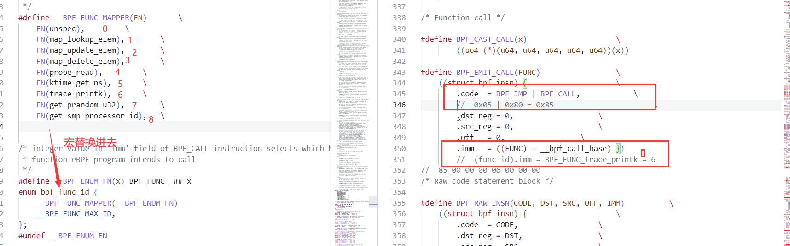
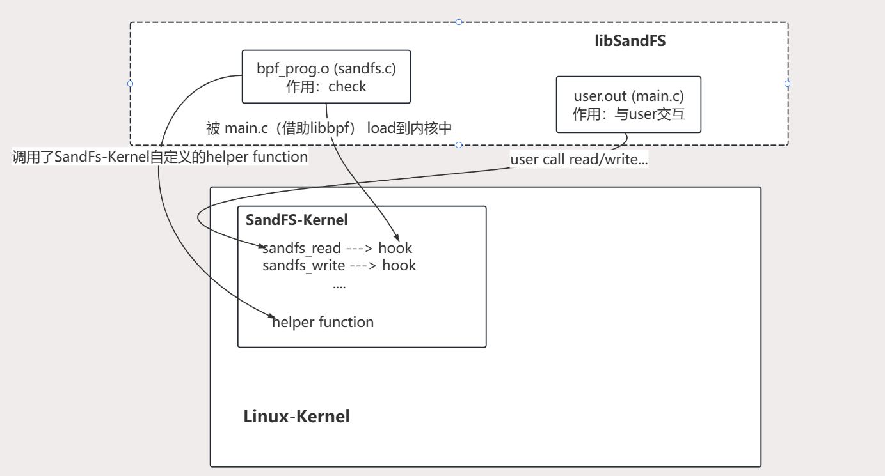

## **关于ebpf**

可以先瞅一眼机翻的ebpfio
目前见到的描述中
BPF和EPBF没啥区别，基本代指同一类技术：追踪内核事件、性能分析、数据包过滤等
也有用BPF代指kernel中用来解释运行BPF程序的虚拟机

### **概述**

- BPF : Berkeley Packet Filter. 一种优化包过滤器的技术. 接收/忽略哪些流量
- eBPF: extended BPF , 扩展了BPF虚拟机（内核内置的字节码虚拟机）功能.不仅可以做数据包过滤，还可以调用栈跟踪、耗时统计、热点分析、追踪内核事件等等高级功能
    - 好处：减少数据量拷贝；不必修改内核代码。
- 用户如何使用eBPF：直观来看，编写bpf prog和user prog，注册bpf prog到kernel运行. bpf prog和user prog通过bmap交互. bpf prog将在内核追踪到的数据写入bmap，user prog将数据从bmap中读出，以可阅读的方式显示给user
- 


下面介绍几种前端工具 : bcc , bpftrace门槛低(基于BCC实现,使用C和awk) , cilium , Calico , Pixie

### **BCC**

- [BCC工具包](https://github.com/iovisor/bcc/blob/master/README.md): BCC实现了将用户态编译、加载、绑定的功能都集成了起来，方便用户使用，对用户的接口更友好。支持 Python 接口以及很多基于 eBPF 实现的分析工具。
- 编写
    - python 中嵌套 C ; python编写user程序，C编写eBPF程序（运行在内核）。
    - 熟悉要追踪的内核函数的特征如参数以及返回值. 熟悉eBPF提供的数据操作方法
- 安装: 目前成功安装版本：bcc 0.24.0 
    ```bash
    Ubuntu 20.04
    1. 依赖安装. 没有llvm再装一下llvm. 我装的llvm12
        sudo apt-get install bpfcc-tools linux-headers-$(uname -r)
        sudo apt-get install bcc-tools libbcc-examples linux-headers-$(uname -r)
        sudo apt-get install clang-10 libclang-dev arping netperf  iperf
    2. 下载bcc
        git clone  https://github.com/iovisor/bcc.git --branch v0.24.0 --depth 1
    3. 修改bcc/cmake/clang_libs.cmake
        list(APPEND clang_libs
        ${libclangParse}
        ${libclangSema}
        ${libclangCodeGen}
        ${libclangAnalysis}
        ${libclangRewrite}
        ${libclangEdit}
        ${libclangAST}
        ${libclangLex}
        ${libclangBasic}
        Polly
        PollyISL)
    4. 编译安装
        cd bcc
        git submodule update --init --recursive 
        mkdir build
        cd build/
        cmake ..
        make -j6
        sudo make install
        cmake -DPYTHON_CMD=python3 .. # build python3 binding
        pushd src/python/
        make
        sudo make install
        popd
    ```

- 没用BCC时
    - 1. 使用 C 语言开发一个 eBPF 程序；
    - 2. 借助 LLVM 把 eBPF 程序编译成 BPF 字节码；
    - 3. 通过 bpf 系统调用，把 BPF 字节码加载到给内核；
    - 4. 内核验证BPF 字节码；JIT将字节码转化为可运行的机器码，然后运行。并把相应的状态保存到 BPF map中；
    - 5. 用户程序通过 BPF map查询 BPF 字节码的运行状态
- 使用BCC后，我们只需要做上述的1、5.

- [使用bcc编写ebpf prog](https://github.com/iovisor/bcc/blob/master/docs/tutorial_bcc_python_developer.md)
- [bcc编写好的tools](https://github.com/iovisor/bcc/blob/master/docs/tutorial.md)
- code：
    - hello_world.py
    ```python
    from bcc import BPF
    BPF(text='int kprobe__sys_clone(void *ctx) { bpf_trace_printk("Hello, World!\\n"); return 0; }').trace_print()
    
    text='...'：这定义了一个内联的 BPF 程序。该程序是用C语言编写的。
    kprobe__sys_clone()：这是通过 kprobes 进行内核动态跟踪的快捷方式。如果 C 函数以 kprobe__ 开头，其余部分将被视为要检测的内核函数名称，在本例中为 sys_clone()。
    void *ctx：ctx 有参数，但由于我们在这里没有使用它们，所以我们将它转​​换为 void *。
    bpf_trace_printk()：用于 printf() 到通用 trace_pipe (/sys/kernel/debug/tracing/trace_pipe) 的简单内核工具。更好的接口是通过 BPF_PERF_OUTPUT().
    trace_print()：读取 trace_pipe 并打印输出的 bcc 例程。
    ```
    - hello_world.py
    ```python
    from bcc import BPF
    
    # define BPF program
    # prog = 这次我们把C程序声明为变量，后面引用它。如果您想根据命令行参数添加一些字符串替换，这将很有用
    prog = """
    int hello(void *ctx) {
        bpf_trace_printk("Hello, World!\\n");
        return 0;
    }
    """
    # hello() : 现在我们只是声明一个 C 函数，而不是 kprobe__ 快捷方式。我们稍后会提到这一点。 BPF 程序中声明的所有 C 函数都应在探测器上执行，因此它们都需要将 pt_reg* ctx 作为第一个参数。如果您需要定义一些不会在探测器上执行的辅助函数，则需要将它们定义为静态内联，以便编译器内联。有时您还需要向其添加 _always_inline 函数属性。


    # load BPF program
    # BPF() : 创建一个BPF prog对象. 外层的Python user prog 和这个 BPF prog进行交互 
    b = BPF(text=prog)
    # 在内核的clone插入一个探针，其将执行hello()
    # 可以多次调用 attach_kprobe()，并将您的 C 函数附加到多个内核函数。
    b.attach_kprobe(event=b.get_syscall_fnname("clone"), fn_name="hello")
    
    # header
    print("%-18s %-16s %-6s %s" % ("TIME(s)", "COMM", "PID", "MESSAGE"))
    
    # format output
    while 1:
        try:
            (task, pid, cpu, flags, ts, msg) = b.trace_fields()     # trace_fields() : 从 trace_pipe返回一组固定的字段。类似于 trace_print()
        except ValueError:
            continue
        print("%-18.9f %-16s %-6d %s" % (ts, task, pid, msg))
    
    lighthouse@VM-8-14-ubuntu:~/OS/examples$ sudo ./tracing/hello_fields.py 
    TIME(s)            COMM             PID    MESSAGE
    5926087.620443000  <...>            3551195 Hello, World!
    5926088.150099000  <...>            3683793 Hello, World!
    5926088.152199000  <...>            3702491 Hello, World!
    5926088.153722000  <...>            3683793 Hello, World!
    ```
    - disksnoop.py:下面是一个非常有趣的程序，如果您能理解所有代码，您就会理解许多重要的基础知识。
    ```c
    [...]
    # 在 Python 程序中定义了一个内核常量，因为我们稍后会在那里使用它
    REQ_WRITE = 1		# from include/linux/blk_types.h
    
    # load BPF program
    b = BPF(text="""
    #include <uapi/linux/ptrace.h>
    #include <linux/blk-mq.h>
    
    # BPF Map   < key : struct request * , value : timestamp >
    BPF_HASH(start, struct request *);
    
    # struct pt_regs *ctx : 用于传递寄存器和 BPF 上下文
    # struct request *req : trace_start函数的实际参数
    # trace_start 插入到 blk_start_request()
    void trace_start(struct pt_regs *ctx, struct request *req) {
        // stash start timestamp by request ptr
        u64 ts = bpf_ktime_get_ns();    # 当前微妙
    
        start.update(&req, &ts);        # 更新k-v的v为ts
        # 使用指向struct request的pointer作为map中的k。
        # 这在跟踪中很常见。指向struct的pointer被证明是很好的k，因为它们是唯一的：两个struct不能有相同的指针地址。
        # 所以我们真正做的是用我们自己的timestamp 描述磁盘 I/O 的请求结构，以便我们可以对其计时。
        # 有两个用于存储timestamp的常用key：指向struct的pointer和PID（用于计时函数入口返回）。
    }
    
    同理
    # struct pt_regs *ctx : 用于传递寄存器和 BPF 上下文
    # struct request *req : trace_start函数的实际参数
    # trace_completion 插入到 blk_account_io_done 中
    void trace_completion(struct pt_regs *ctx, struct request *req) {
        u64 *tsp, delta;
        # 在map中查询req对应的value:timestamp. (发起io的开始时间)
        tsp = start.lookup(&req);
        if (tsp != 0) {
            # 计算io请求时间 print.
            delta = bpf_ktime_get_ns() - *tsp;  
            # req->... : 取出req中的成员,请参阅内核源代码中的定义以了解其中的成员。
            # bcc 实际上将这些表达式重写为一系列 bpf_probe_read_kernel() 调用。有时 bcc 无法处理复杂的解引用，需要直接调用 bpf_probe_read_kernel()
            bpf_trace_printk("%d %x %d\\n", req->__data_len,
                req->cmd_flags, delta / 1000);
            # 删除key. This is currently required because of a kernel bug in .update() (fixed in 4.8.10).
            start.delete(&req);                 
        }
    }
    """)
    if BPF.get_kprobe_functions(b'blk_start_request'):
            b.attach_kprobe(event="blk_start_request", fn_name="trace_start")
    b.attach_kprobe(event="blk_mq_start_request", fn_name="trace_start")
    if BPF.get_kprobe_functions(b'__blk_account_io_done'):
        b.attach_kprobe(event="__blk_account_io_done", fn_name="trace_completion")
    else:
        b.attach_kprobe(event="blk_account_io_done", fn_name="trace_completion")
    [...]
    
    lighthouse@VM-8-14-ubuntu:~/OS/examples$ sudo ./tracing/disksnoop.py 
    TIME(s)            T  BYTES    LAT(ms)
    5927582.436960000  R  0           0.21
    5927582.958471000  W  0           1.16
    5927582.960521000  W  0           1.99
    5927582.960662000  R  0           0.12
    5927582.961465000  W  0           0.79
    ```
    - hello_perf_output.py
    ```c
    打印调用clone的线程
    from bcc import BPF
    # define BPF program
    prog = """
    #include <linux/sched.h>
    
    //  define output data structure in C
    //  用于将数据从kernel传递给user
    struct data_t {
        u32 pid;
        u64 ts;
        char comm[TASK_COMM_LEN];
    };
    //  输出管道命名为events
    BPF_PERF_OUTPUT(events);
    //  kernel获取线程信息，提交给user
    int hello(struct pt_regs *ctx) {
        struct data_t data = {};
        data.pid = bpf_get_current_pid_tgid(); # 线程id
        data.ts = bpf_ktime_get_ns();           # ns
        bpf_get_current_comm(&data.comm, sizeof(data.comm));    # 获取当前proc名
        events.perf_submit(ctx, &data, sizeof(data));   # 将data通过ring buffer提交给用户缓冲区
        return 0;
    }
    """
    
    # load BPF program
    b = BPF(text=prog)
    # 设置探针 kernel在clone()调用hello()
    b.attach_kprobe(event=b.get_syscall_fnname("clone"), fn_name="hello")
    
    # header
    print("%-18s %-16s %-6s %s" % ("TIME(s)", "COMM", "PID", "MESSAGE"))
    
    # process event
    start = 0
    # 该user function负责处理events的读事件
    def print_event(cpu, data, size):
        global start
        event = b["events"].event(data) # 获取BPF Prog中的events管道的data 自动转换为Python Object
        if start == 0:
                start = event.ts
        time_s = (float(event.ts - start)) / 1000000000
        print("%-18.9f %-16s %-6d %s" % (time_s, event.comm, event.pid,
            "Hello, perf_output!"))
    
    # loop with callback to print_event
    # 令print_event函数，处理bpf对象中输出管道events的读事件
    b["events"].open_perf_buffer(print_event)
    # 阻塞监听buffer的事件
    while 1:
        b.perf_buffer_poll()
    
    lighthouse@VM-8-14-ubuntu:~/OS/examples$ sudo ./tracing/hello_perf_output.py 
    TIME(s)            COMM             PID    MESSAGE
    0.000000000        barad_agent      3551195 Hello, perf_output!
    0.001988670        barad_agent      3725926 Hello, perf_output!
    0.004489596        sh               3725927 Hello, perf_output!
    0.004595441        sh               3725927 Hello, perf_output!
    0.004710394        sh               3725927 Hello, perf_output!
    0.540998399        cpuUsage.sh      3725920 Hello, perf_output!
    ```
    - task_switch.c  & task_switch.py : 记录kernel每次的线程切换
    ```c
    #include <uapi/linux/ptrace.h>
    #include <linux/sched.h>
    //  用于将数据从kernel传递给user
    struct key_t {
        u32 prev_pid;
        u32 curr_pid;
    };
    //  BPF Map.
    //  BCC 会依据你如何使用BPF_HASH，来定义相应的BPF Map类型. 就是做了层封装.
    BPF_HASH(stats, struct key_t, u64, 1024);
    int count_sched(struct pt_regs *ctx, struct task_struct *prev) {
        struct key_t key = {};
        u64 zero = 0, *val;
    
        key.curr_pid = bpf_get_current_pid_tgid();  //  线程id
        key.prev_pid = prev->pid;                   //  上一id
    
        // could also use `stats.increment(key);`
        val = stats.lookup_or_try_init(&key, &zero);   
        if (val) {
        (*val)++;
        }
        return 0;
    }
    ```
    ```py
    from bcc import BPF
    from time import sleep
    # bpf prog
    b = BPF(src_file="task_switch.c")
    # 在完成线程切换时 调用count_sched
    b.attach_kprobe(event="finish_task_switch", fn_name="count_sched")
    
    # generate many schedule events
    for i in range(0, 100): sleep(0.01)
    for k, v in b["stats"].items():
        print("task_switch[%5d->%5d]=%u" % (k.prev_pid, k.curr_pid, v.value))
    
    lighthouse@VM-8-14-ubuntu:~/OS/examples$ sudo ./tracing/task_switch.py 
    task_switch[3849740->3849747]=2
    task_switch[583227->    0]=1
    task_switch[    0->3483971]=1
    task_switch[  758->3849959]=1
    task_switch[    0->938796]=1
    task_switch[3846168->3846108]=1
    task_switch[3416147->3849973]=1
    task_switch[3849749->3849740]=2
    task_switch[938796->    0]=2
    task_switch[3849750->    0]=1
    ```


### **libbpf** 

- [API地址](https://libbpf.readthedocs.io/en/latest/libbpf_overview.html)
- 由C/C++编写的库,它提供了优于 BCC 的优势 
    - BPF CO-RE : Complie Once , Run EveryWhere ; 程序体积小 ; 运行时占用内存小
- **位于tools/lib/bpf/下**.


- 示例程序 ：user如何根据name获取map ? 
- LIBBPF_API int bpf_object__find_map_fd_by_name (const struct bpf_object *obj, const char *name)
    - struct bpf_object obj里面需要包含bpf prog信息.
        - bpf_object定义见libbpf.c. .h中只有声明，对用户隐藏定义
    - name : name of the BPF map
    - 返回map fd
- 示例程序 : sockex1_user.c
    ```c
        //  创建map , 加载ebpf prog
        //  obj : 获取到bpf prog信息
        //  prog_fd : ebpf prog在prog_fd[]中的下标
        if (bpf_prog_load(filename, BPF_PROG_TYPE_SOCKET_FILTER,
                &obj, &prog_fd))
            return 1;
        //  libbpf 根据name获取mapfd
        map_fd = bpf_object__find_map_fd_by_name(obj, "my_map");
        //  查询fd对应map
        for{
            bpf_map_lookup_elem(map_fd, &key, &tcp_cnt);
        }
    ```
- 顺便再看一眼sockex_kern.c
    ```c
    //  定义my_map
    struct {
        __uint(type, BPF_MAP_TYPE_ARRAY);
        __type(key, u32);
        __type(value, long);
        __uint(max_entries, 256);
    } my_map SEC(".maps");
    //  map类型 BPF_MAP_TYPE_ARRAY : 它的所有元素都在内存中预先分配并设置为零值。键是数组中的索引，它们的大小必须正好是4个字节。
    //  该类型缺点 : 不能删除map中的元素。如果尝试在array maps上使用map_delete_elem，则调用将失败，errno = EINVAL。
    
    SEC("socket1")
    int bpf_prog1(struct __sk_buff *skb)
    {
        ...
        //  kernel直接通过map指针使用map
        value = bpf_map_lookup_elem(&my_map, &index);
        //  index存在，则++
        if (value)
            __sync_fetch_and_add(value, skb->len);
    }
    char _license[] SEC("license") = "GPL";
    ```

- bpf_perf_event_output例子 . 目的：计算每s发生多少次sys_write
    
    ```c
    polling...
    polling...
    polling...
    recv 212318 events per sec
    100011+0 records in
    100011+0 records out
    51205632 bytes (51 MB, 49 MiB) copied, 0.470474 s, 109 MB/s
    ```

### **BPF C 编写及运行流程**

- 使用bpf syscall / libbpf
- 运行流程
    - 1. 使用 C 开发一个 eBPF prog；
    - 2. 借助 LLVM 把 eBPF 程序编译成 BPF 字节码；
    - 3. 通过 bpf 系统调用，把 BPF 字节码加载到给内核；
    - 4. 内核验证BPF 字节码；JIT将字节码转化为可运行的机器码，然后运行。并把相应的状态保存到 BPF map中；
    - 5. 用户程序通过 BPF map查询 BPF 字节码的运行状态

#### **环境配置**
- 安装依赖
    ```c
    sudo apt install libncurses5-dev flex bison libelf-dev binutils-dev libssl-dev
    sudo apt install clang llvm 
    ```
- [下载对应版本内核源码](http://ftp.sjtu.edu.cn/sites/ftp.kernel.org/pub/linux/kernel/)，将内核源码解压在/usr/src目录下。
    - cd /usr/src/linux-5.4.146
    - make defconfig
    - make modules_prepare 或者 make script
    - make headers_install : 关联内核头文件
    - make M=samples/bpf : 编译samples/bpf下的示例程序  
    - 进入samples/bpf. 运行示例程序
        ```c
        shc@shc-virtual-machine:/usr/src/linux-5.4.146/samples/bpf$ sudo ./sock_example 
        TCP 0 UDP 0 ICMP 0 packets
        TCP 0 UDP 0 ICMP 0 packets
        TCP 0 UDP 0 ICMP 4 packets
        TCP 0 UDP 0 ICMP 8 packets
        TCP 0 UDP 0 ICMP 12 packets
        ```

#### **示例**


在samples/bpf目录下
- hello_kern.c -> hello_kern.o bpf字节码
    ```c
    #include<uapi/linux/bpf.h>
    #include"bpf_helpers.h"
    
    SEC("kprobe/sys_bpf")	//  设定hook点
    //  bpf_helpers.h
    // 		#define SEC(NAME) __attribute__((section(NAME), used))
    //   bpf prog会被编译到名为 kprobe/sys_bpf 的section中. kprobe是hook类型
    //  "used"字段，即便这个定义未被使用过，也不会被编译器移除
    int bpf_prog(void* ctx)
    {
        char msg[] = "hello world!\n";
        bpf_trace_printk(msg,sizeof(msg)); // 写入管道文件
        //  -> BPF_EMIT_CALL(BPF_FUNC_trace_printk) . filter.h
        //  -> bpf字节码
        return 0;
    }
    
    char _licensep[] SEC("license") = "GPL";
    ```

- hello_user.c -> hello_user.o 机器码
    1. 将ebpf prog.o加载到内核中
    2. ebpf prog将数据写入bmap, user prog读出
    ```c
    #include "bpf_load.h"
    
    int main()
    {
        if(load_bpf_file("hello_kern.o")){
            return -1;
        }	
        //  load_bpf_file("bpf字节码.o") -> do_load_bpf_file() -> do_load_bpf_file() -> load_elf_maps_section , parse_relo_and_apply...  
        //  解析map section（如果有的话），通过syscall()创建map
        //  通过bpf syscall() 将hello_kern.o注入到kernel中
        read_trace_pipe();
        return 0;
    }
    ```

- MakeFile修改
    ```MakeFile
    # List of programs to build
    hostprogs-y += hello
    
    # Libbpf dependencies
    hello-objs := bpf_load.o hello_user.o
    
    # Tell kbuild to always build the programs
    always += hello_kern.o
    ```

#### **BPF Prog -> 字节码**

- make后 ，llvm生成的**字节码** ： objdump -s / llvm-objdump -d 查看
    


- ./hello 后 ，JIT翻译成的**机器码**
    

- helper_function实际上是个func id
    
- 最后 一个 struct insn{} 实际上就是 BPF虚拟机指令集的一条指令. 如下，跳转指令+跳转到的函数id
    

- **clang和llvm关系**
    - 之前的make所做的事情实际上就是如下两步 来生成hello_kern.o
    - clang作为llvm的前端，进行词法分析、语法分析、语义分析，最终生成IR文件
        - `sudo clang -O2 -Wall -emit-llvm -S hello_kern.c`
    - llvm接收clang生成的IR文件，生成bpf字节码
        - `llc hello_kern.ll -march=bpf -filetype=obj -o hello_kern.o`
        
    


### **ebpf 成员简介 (TO DO)**

BPF 跟踪支持的各种内核事件包括：kprobes、uprobes、tracepoint 、USDT 和 perf_events：
kprobes：实现内核动态跟踪。 kprobes 可以跟踪到 Linux 内核中的函数入口或返回点，但是不是稳定 ABI 接口，可能会因为内核版本变化导致，导致跟踪失效。
uprobes：用户级别的动态跟踪。与 kprobes 类似，只是跟踪的函数为用户程序中的函数。
tracepoints：内核静态跟踪。tracepoints 是内核开发人员维护的跟踪点，能够提供稳定的 ABI 接口，但是由于是研发人员维护，数量和场景可能受限。
USDT：为用户空间的应用程序提供了静态跟踪点。
perf_events：定时采样和 PMC。

- eBPF 程序并不像常规的线程那样，启动后就一直运行在那里，它需要事件触发后才会执行。这些事件包括系统调用、内核跟踪点、内核函数和用户态函数的调用退出、网络事件，等等。借助于强大的内核态插桩（kprobe）和用户态插桩（uprobe），eBPF 程序几乎可以在内核和应用的任意位置进行插桩。
- BPF 程序可以利用 BPF 映射（map）进行存储，BPF 程序收集内核运行状态存储在映射中，用户程序再从映射中读出这些状态。eBPF 程序栈空间最多只有 512 字节，想要更大的存储，就必须要借助映射存储；
- The bpf() system call
    - 加载BPF程序
    - 操作Map（crud）
- eBPF program types
    - prog的加载参数BPF_PROG_LOAD暗示了如下四件事情：程序可以attach到何处；验证程序将允许调用哪些内核内帮助程序函数；是否可以直接访问网络数据包数据；以及作为第一个参数传递给程序的对象类型。
    - BPF_PROG_TYPE_SOCKET_FILTER: a network packet filter
    - BPF_PROG_TYPE_KPROBE: determine whether a kprobe should fire or not
    - BPF_PROG_TYPE_SCHED_CLS: a network traffic-control classifier
    - BPF_PROG_TYPE_SCHED_ACT: a network traffic-control action
    - ...
- BPF Helper Function
    - eBPF 程序不能随意调用内核函数，只能调用在 API 中定义的辅助函数
    - bpf_map_lookup_elem(map, key) : 在map中查找键值key，并返回它的值(指针)
    - bpf_map_delete_elem(map, key) : 根据key值删除map中对应的元素
    - bpf_ktime_get_ns() : 返回系统启动后的时长，单位ns
    - bpf_trace_printk(fmt, fmt_size, ...) : 向TraceFS的pipe文件中写入调试信息
    - ...
- BPF存储类型 map
    - https://docs.cilium.io/en/stable/bpf/architecture/#maps
    - bcc中的BPF可以使用bcc的BPF_HASH定义,BPF_HASH根据参数类型生成相应的map. BPF_HASH : 宏定义
    - 
    - map是驻留在kernel中的一种高效的k-v存储结构. 他们可以被BPF prog操作，来在各种BPF prog的调用中保持状态. map可以通过user态的fd来使用，并且可以和其他BPF prog或者user 态的prog共享.
        - BPF_MAP_TYPE_HASH 用于哈希表的Map类型：保存key/value对
        - BPF_MAP_TYPE_ARRAY 数组类型
        - BPF_MAP_TYPE_PERF_EVENT_ARRAY 到perf_event环形缓冲区的接口，用于将记录发送到用户空间
        - BPF_MAP_TYPE_PERCPU_HASH 一个基于每CPU单独维护的更快哈希表
        - BPF_MAP_TYPE_PERCPU_ARRAY 一个基于每CPU单独维护的更快数组
        - BPF_MAP_TYPE_STACK_TRACE 调用栈存储，使用栈ID进行索引
        - BPF_MAP_TYPE_STACK 调用栈存储
    - 这些map都通过bpf_map_lookup_elem() and bpf_map_update_elem() 来被user prog和ebpf prog使用. 其中一些map，如socket maps，会和额外的function配合执行特殊任务


### **BPF Map操作**

- bpf_load.c中定义了两个全局变量. user loadfile之后，即可通过下列信息定位到map和ebpf prog. 不过libbpf应该都给封好了.
    ```c
    int map_fd[MAX_MAPS];			//  map fd数组
    int map_data_count;			 	//  最大的map fd
    int prog_fd[MAX_PROGS];			//  ebpf prog数组   
    int prog_cnt;                   //  最大的prog fd
    ```

**bpf syscall()**

- int bpf(int cmd, union bpf_attr *attr, unsigned int size);
    - 执行ebpf相关操作
    - 那些操作map的helper_function底层基本都是该 bpf syscall
- cmd : 要执行的操作
    - BPF_MAP_CREATE: 创建map ; BPF_MAP_LOOKUP_ELEM : 查找元素 ; BPF_MAP_UPDATE_ELEM : 更新kv ; BPF_MAP_DELETE_ELEM ; BPF_MAP_GET_NEXT_KEY ; BPF_PROG_LOAD: 加载ebpf prog ; enum bpf_cmd {....}
- bpf_attr : 提供给syscall的相关信息. /usr/linux/include/bpf.h
    ```c
    union bpf_attr {
        //  BPF_MAP_CREATE 使用
            struct {    
                __u32         map_type;     //  Map类型
                __u32         key_size;    /* size of key in bytes */
                __u32         value_size;  /* size of value in bytes */
                __u32         max_entries; /* maximum number of entries
                                                in a map */
            };
        //  BPF_MAP_*_ELEM 使用
            struct {    
                __u32         map_fd;
                __aligned_u64 key;
                union {
                    __aligned_u64 value;
                    __aligned_u64 next_key;
                };
                __u64         flags;
            };
        //  load ebpf prog 使用
            struct {    
            ...
            };
        //  anonymous struct used by BPF_OBJ_* commands
            struct { /*  */
            };
        //  ....
    } __attribute__((aligned(8)));
    ```

- [关于ebpf prog所使用的helper_function](https://github.com/iovisor/bpf-docs/blob/master/bpf_helpers.rst) : 在include/uapi/linux.bpf.h 也有说明

#### **创建**

- 使用bpf syscall()创建map
    ```c
    union bpf_attr my_map_attr {
        .map_type = BPF_MAP_TYPE_ARRAY,
        .key_size = sizeof(int),
        .value_size = sizeof(int),
        .max_entries = 1024,
        .map_flags = BPF_F_NO_PREALLOC,
    };
    
    int fd = bpf(BPF_MAP_CREATE, &my_map_attr, sizeof(my_map_attr));
    ```

- 简化版1：helper function(基于syscall())
    ```c
    /tools/lib/bpf/bpf.h
    int fd;
    fd = bpf_create_map(BPF_MAP_TYPE_HASH, sizeof(int), sizeof(int), 100,BPF_F_NO_PREALOC);
    ```

- 简化版2：bpf_load.c加载ebpf prog时，解析到maps section，调用bpf syscall(),创建maps.
    ```c
    struct bpf_map_def SEC("maps") my_bpf_map = {
        .type      = BPF_MAP_TYPE_HASH,     //  map类型
        .key_size  = sizeof(int),
        .value_size  = sizeof(int),
        .max_entries = 100,
        .map_flags  = BPF_F_NO_PREALLOC,
    };
    ```

#### **更新**

- 对于BPF Map的操作 如 bpf_map_update_elem
    - ebpf prog使用的是tools/testing/selftests/bpf/bpf_helpers.h
        - kenrel直接使用map的指针
    - user prog使用的是tools/lib/bpf/bpf.h
        - user通过fd访问map

- kernel
    ```c
    static int (*bpf_map_update_elem)(void *map, const void *key, const void *value, unsigned long long flags) 
    = (void *) BPF_FUNC_map_update_elem; (整数，代表func id)
    ```
    - map : map的指针 
    - flags 
        - BPF_ANY : 如果元素存在，则要更新该元素；如果元素不存在，则要在map中创建该元素
        - BPF_NOEXIST : 仅在元素不存在时创建该元素
        - BPF_EXIST : 只在元素存在时更新

- user
    ```c
    LIBBPF_API int bpf_map_update_elem(int fd, const void *key, const void *value, __u64 flags);
    ```
    - fd : mapfd
    - flags : 同上


#### **读取**

- kernel
    ```c
    static void *(*bpf_map_lookup_elem)(void *map, const void *key) 
    = (void *) BPF_FUNC_map_lookup_elem;
    ```
    - map : map的指针 
- user
    ```c
    LIBBPF_API int bpf_map_lookup_elem(int fd, const void *key, void *value);
    ```
    - fd : mapfd
    - value : 存读取到的value

#### **删除**

- kernel
    ```c
    static int (*bpf_map_delete_elem)(void *map, const void *key) =
        (void *) BPF_FUNC_map_delete_elem
    ```
- user
    ```c
    LIBBPF_API int bpf_map_delete_elem(int fd, const void *key);
    ```

#### **遍历**

- user
    ```c
    LIBBPF_API int bpf_map_get_next_key(int fd, const void *key, void *next_key);
    ```
    - fd : map fd
    - key : 传入查找的key
    - next_key : 获取相邻的下一个key
- 示例
    ```c
    sockex2_user.c
    while (bpf_map_get_next_key(map_fd, &key, &next_key) == 0) {
        bpf_map_lookup_elem(map_fd, &next_key, &value);
        printf("ip %s bytes %lld packets %lld\n",
                inet_ntoa((struct in_addr){htonl(next_key)}),
                value.bytes, value.packets);
        key = next_key;
    }
    ```
- kenrel没有相应API


#### **查找并删除**

- user
    ```c
    LIBBPF_API int bpf_map_lookup_and_delete_elem(int fd, const void *key,void *value);
    ```
- kernel无相应API

#### **锁**
- 自旋锁
    ```c
    struct bpf_spin_lock {
        __u32	val;
    };
    ```
- kernel 
    ```c
    static void (*bpf_spin_lock)(struct bpf_spin_lock *lock) =
        (void *) BPF_FUNC_spin_lock;
    static void (*bpf_spin_unlock)(struct bpf_spin_lock *lock) =
        (void *) BPF_FUNC_spin_unlock;
    ````

- user
    ```c
    bpf_map_update_elem and bpf_map_lookup_elem 的 flags参数
    添加 BPF_F_LOCK 
    ```

- rcu锁
    是一种优于自旋锁的Linux机制，并没有真正使用锁，但实现了读写同步的功能。
    **原理** Read Copy Update

    **读(Read)**：读者不需要获得任何锁就可访问RCU保护的临界区；

    **拷贝(Copy)**：写者在访问临界区时，写者“自己”将先拷贝一个临界区副本，然后对副本进行修改；

    **更新(Update)**：RCU机制将在在适当时机使用一个回调函数把指向原来临界区的指针重新指向新的被修改的临界区，锁机制中的垃圾收集器负责回调函数的调用。(时机：所有引用该共享临界区的CPU都退出对临界区的操作。即没有CPU再去操作这段被RCU保护的临界区后，这段临界区即可回收了，此时回调函数即被调用)
    >此机制在操作bpf map时可能会用到 [参考链接](https://blog.csdn.net/qq_35399548/article/details/122846896)

# **sandfs-kernel相关**

## **2个调用路径 (SYSCALL 与 BPF_CALL)**


以下仅是我的认识,应该会帮助到xdm

- **bpf prog和user prog发起的操作(如对于map的操作)可以分为两个调用路径.** 
    - **bpf prog 通过 helper function (BPF_CALL)**.
    - **usr prog 通过 bpf syscall(cmd) (SYSCALL_DEFINE3)** (一般通过libbpf.h提供的封装函数进行操作)
    - 在这里梳理下，不然这两种调用缠在一起云里雾里.
    - 感觉可以说是：SYSCALL_DEFINE是linux kernel提供的syscall，BPF_CALL是bpf虚拟机提供的syscall

### **BPF_CALL_X**

- **BPF_CALL_X作用：给bpf prog提供helper function的实现. 注意是给bpf prog** 
    - 也就是bpf_map_update_elem这样的helper function，实际上会走到BPF_CALL_X()
    ```c
        /* If kernel subsystem is allowing eBPF programs to call this function,
        *  inside its own verifier_ops->get_func_proto() callback it should return
        *  bpf_map_lookup_elem_proto, so that verifier can properly check the arguments
        */
        //在kernel/bpf/helper.c中定义了很多BPF_CALL
        BPF_CALL_2(bpf_map_lookup_elem, struct bpf_map *, map, void *, key)
        {
        //  不同的map实现将依赖于映射方法 lookup / update / delete中的 rcu，因此如果允许程序访问map，eBPF 程序必须在 rcu 锁定下运行，因此，请在所有三个功能中检查rcu_read_lock_held
            WARN_ON_ONCE(!rcu_read_lock_held());
            return map->ops->map_update_elem(map, key, value, flags);
        }
    ```
    - 对于不同的map类型，其会有不同的函数实现. 定义在kernel/bpf下。如
    ```
        const struct bpf_map_ops cpu_map_ops = {
            .map_alloc		= cpu_map_alloc,
            .map_free		= cpu_map_free,
            .map_delete_elem	= cpu_map_delete_elem,
            .map_update_elem	= cpu_map_update_elem,
            .map_lookup_elem	= cpu_map_lookup_elem,
            .map_get_next_key	= cpu_map_get_next_key,
            .map_check_btf		= map_check_no_btf,
        };
    ```

- 顺带一提**struct bpf_verifier_ops作用之一：获取该类型的bpf prog所对应的helper function**
    - 不同类型的bpf prog 具有不同类型的struct bpf_verifier_ops，其中包含callback：get_func_proto。
    - get_func_proto的作用就是在load_file中，fixup_bpf()时，根据func_id获取到正确的helper_function_proto。
    - helper_function_proto中的 .func 就是helper function的实现，也即BPF_CALL_X(...)
    - kernel中例子如下。这也就是为什么sandfs-kernel中要定义sandfs_prog_ops,sandfs_prog_func_proto,bpf_sandfs_write_args_proto等结构体
    ```c
        //  struct bpf_verifier_ops
        const struct bpf_verifier_ops kprobe_verifier_ops = {
            .get_func_proto  = kprobe_prog_func_proto,
            .is_valid_access = kprobe_prog_is_valid_access,
        };

        //  根据id返回
        static const struct bpf_func_proto *
        kprobe_prog_func_proto(enum bpf_func_id func_id, const struct bpf_prog *prog)
        {
            switch (func_id) {
            case BPF_FUNC_perf_event_output:
                return &bpf_perf_event_output_proto;
            case BPF_FUNC_get_stackid:
                return &bpf_get_stackid_proto;
            ...
            default:
                return tracing_func_proto(func_id, prog);
            }
        }

        //  对于map->ops->map_update_elem, 不同bpf map类型有不同的实现，
        const struct bpf_func_proto bpf_map_update_elem_proto = {
            .func           = bpf_map_update_elem,
            .gpl_only       = false,
            .ret_type       = RET_INTEGER,
            .arg1_type      = ARG_CONST_MAP_PTR,
            .arg2_type      = ARG_PTR_TO_MAP_KEY,
            .arg3_type      = ARG_PTR_TO_MAP_VALUE,
            .arg4_type      = ARG_ANYTHING,
        };
    ```


- 我们来看**bpf prog的一条调用路径: bpf prog调用helper function** 如 map_lookup_elem
    - **ebpf prog ---> map_x_elem ---(user load时fixup)--> BPF_CALL_X(...) ---> map->ops->map_x_elem**
    - 经过BPF_CALL_X但并没经过SYSCALL_DEFINEX
    - 解释如下
    - map_lookup_elem (实际上就是个int func id = 0) (见bpf_helpers.h)
    - 一系列宏替换如BPF_EMIT_CALL，最终替换成了一个结构体struct insn{}。这实际上就是 BPF虚拟机指令集的一条指令. 如下，跳转指令+跳转到的函数id。（见/include/uapi/linux/bpf.h）
        
    - 经clang和llvm编译后的字节码 : bpf_prog.o，其函数调用指令的目的地址是func id, 需要进行fix，fix时机为user prog加载bpf_prog.o时调用的**fixup_bpf_calls()**. (加载bpf_prog流程稍后再说)
        - load_bpf_file ->...-> fixup_bpf_calls()
        - 利用bpf_verifier_ops和funcid，将地址修正为BPF_CALL_2(bpf_map_lookup_elem)
    -**BPF_CALL_2(bpf_map_lookup_elem)，又调用了 map->ops->map_update_elem**(map, key, value, flags)，这里，实际上就是最后真正执行任务的函数。（我之前还误以为这里又是一个bpf syscall，不是这样的，那个bpf syscall是另一条执行路径了）

- 顺带再一提，所以，当我们添加一个 map_*_* 给外界，我们需要添加的是:BPF_CALL,func_id, 修改verifier等
    [相关文章](https://maao.cloud/2021/03/01/%E7%AC%94%E8%AE%B0-BPF-and-XDP-Reference-Guide-cilium/#%E6%8C%87%E4%BB%A4%E9%9B%86)
    [相关文章](https://docs.cilium.io/en/stable/bpf/architecture/#helper-functions)
    [相关文章](http://www.manongjc.com/detail/62-bmrogkrmriwhfjf.html)

### **SYSCALL**

- **user prog --> bpf(cmd) -> SYSCALL_DEFINE3(cmd) -> map->ops->map_lookup_elem**
    - 这就没啥好说的了 user prog调用 kernel提供的bpf syscall
    - 最后执行任务的仍然是map->ops->lookup_elem

- 不过user prog基本都是在libbpf的封装之上进行操作.
    - 也即，**user prog --> libbpf.a ---> bpf(cmd)  ---> SYSCALL_DEFINE3(cmd) -> map->ops->map_lookup_elem**
    - 如 libbpf提供的
    ```c
    int bpf_map_update_elem(int fd, const void *key, const void *value,
                __u64 flags)
    {
        union bpf_attr attr;
        memset(&attr, 0, sizeof(attr));
        attr.map_fd = fd;
        attr.key = ptr_to_u64(key);
        attr.value = ptr_to_u64(value);
        attr.flags = flags;
        return sys_bpf(BPF_MAP_UPDATE_ELEM, &attr, sizeof(attr));
    }
    ```
- 注意下libbpf的内容不只有libbpf.c , 还有bpf.c啥的。tools/lib/bpf下的都是。


## **load_bpf_file 加载流程注意及问题**

- 注意是user调用load_bpf_file，那么自然可能会用到libbpf，最后也一定会落到bpf syscall()上。当然sandfs里用到libbpf了。
- 大致作用xdm都清楚
    > 解析map section，并通过bpf系统调用创建map

    > 解析elf relocation sections。将其作用的重定向段中的insn的imm存储着map的fd，并将该insn标记为BPF_PSEUDO_MAP_FD。
    
    > 通过bpf系统调用，加载eBPF程序
- 介于调用流程过长，函数名又都太像，所以这里写一下sandfs中的load_bpf_file涉及到的函数，避免混淆.
    ```c
    load_bpf_file(path of kern.o) (bpf_load.c) ---->
        (1)  map_create() 
        (2)  load_and_attach() (bpf_load.c) --->
                A. bpf_load_program() (tools/lib/bpf/bpf.c) ----> ... --->  sys_bpf (tools/lib/bpf/bpf.c)---->
                syscall()  ---->  
                SYSCALL_DEFINE3(bpf) --->
                bpf_prog_load() --->
                    (1) fixup_bpf_calls()  (core.c)      : 上文所说的修正函数地址
                    (2) bpf_prog_select_runtime (core.c) : 决定是JIT讲字节码编译成机器码，还是放入BPF虚拟机运行
                bpf_prog_load之后，bpf prog就算是被加载到内核了，但是还没运行（当然不会运行），给上层返回prog的fd.
                B. sys_perf_event_open()
                C. ioctl()
                B 和 C作用未明确
    ```


- 这里顺带提一句 **bpf_prog_select_runtime**。作用是决定bpf prog执行方式。
    - JIT : 转化成机器码然后执行
    - eBPF解释字节码：__bpf_prog_run()实现ebpf虚拟机
        - eBPF 虚拟机的运行环境只有 1 个 512KB 的栈和 11 个寄存器（还有一个 PC 寄存器，用于指向当前正在执行的 eBPF 字节码）。
    - linux5.4.146里面，居然JIT是个空，只能放入BPF虚拟机里跑hhh。不知道别的版本如何。估计没差。盲猜x86的不为空，x64的为空。
    ```c
    //  当内核没有开启 JIT 功能时，将会使用 __bpf_prog_run() 函数来执行 eBPF 字节码。
    //  而当内核开启了 JIT 功能时，内核首先会将 eBPF 字节码编译成本地机器码，然后直接执行机器码即可。这样就加速了 eBPF 程序的执行效率。
    struct bpf_prog *bpf_prog_select_runtime(struct bpf_prog *fp, int *err)
    {
        //  设置 fp->bpf_func = __bpf_prog_run() (ebpf虚拟机，用于执行字节码)
        bpf_prog_select_func(fp);	
        ....
        //  bpf_int_jit_compile（） 必须始终返回有效的程序，在这种情况下根本不会被 JITed，但回退到解释器。
            //  判断是否需要将 eBPF 字节码编译成机器码. 并将fp->bpf_func指向编译成的机器码
            fp = bpf_int_jit_compile(fp);
        ....
        return fp;
    }

    struct bpf_prog * __weak bpf_int_jit_compile(struct bpf_prog *prog)
    {
        return prog;
    }
    ```


- 所以load_bpf_file之后，bpf prog并没有运行，只是将字节码加载到kernel了而已，那么到底是什么时候运行的呢？又是通过什么函数运行的呢？
    - 什么时候运行：kernel运行到相应hook点时调用Bpf prog字节码
    - 如何调用
        - 如果开启JIT，则是机器直接执行
        - 没开启JIT，则是eBPF虚拟机翻译执行. 见下eBPF虚拟机

## **eBPF虚拟机 及 执行点**

- **300多行，该eBPF虚拟机的功能只有一个：解释字节码并执行**
    ```c
    //  ___bpf_prog_run 实现 eBPF虚拟机. 执行 eBPF 字节码
    static u64 ___bpf_prog_run(u64 *regs, const struct bpf_insn *insn, u64 *stack)
    {
        ...
    }
    ```

- 如何调用到这里的？**kernel在hook点通过BPF_PROG_RUN()这个宏来调用**.
    ```c
    filter.h
    #define BPF_PROG_RUN(prog, ctx)	({				\
        u32 ret;						\
        cant_sleep();						\
        if (static_branch_unlikely(&bpf_stats_enabled_key)) {	\
            struct bpf_prog_stats *stats;			\
            u64 start = sched_clock();			\
            ret = (*(prog)->bpf_func)(ctx, (prog)->insnsi);	\		
            stats = this_cpu_ptr(prog->aux->stats);		\
            u64_stats_update_begin(&stats->syncp);		\
            stats->cnt++;					\
            stats->nsecs += sched_clock() - start;		\
            u64_stats_update_end(&stats->syncp);		\
        } else {						\
            ret = (*(prog)->bpf_func)(ctx, (prog)->insnsi);	\	//  这个bpf_func就是__bpf_prog_run()
        }							\
        ret; })
    ```
    - 这也解释了**为什么sandfs-kernel里面调用BPF_PROG_RUN**
        - 实际上就是在hook点调用注册的bpf prog。作用是检测参数是否合法。bpf prog由libSandFs文件夹下编写，是sandfs.c

- eBPF 虚拟机的规范：
    - 寄存器 r1-r5：作为函数调用参数使用。在 eBPF 程序启动时，寄存器 r1 包含 "上下文" 参数指针。
    - 寄存器 r0：存储函数的返回值，包括函数调用和当前程序退出。
    - 寄存器 r10：eBPF程序的栈指针。


## **小结 & 问题**

- **项目结构大致如图**
    

- **user prog和bpf prog调用路径如图**
    

- **关于bpf.c的目前认知**
- **1. bpf.c给sandfs-kernel的操作提供了如下几个函数调用**，其中sandfs_request_bpf_op是为了让sandfs-kernel的操作中(如read、write...)(即hook点)运行bpf prog
    - sandfs_clear_bpf_ops，
    - sandfs_set_bpf_ops，
    - sandfs_request_bpf_op
- **2. bpf.c和bpf_load.c , syscall.c 那些文件配合定义了一个新的bpg prog类型：SANDFS**。使得libSandFS可以定义SANDFS类型的bpf prog
- **3. bpf.c还在kernel中实现了如下helper function**
    - bpf_sandfs_write_args: 根据type(你要读取哪个参数)和size(你要读取的参数的大小)，用src中的数据，改写p(sandfs_args)中的参数
    - bpf_sandfs_read_args : 根据type(你要读取哪个参数)和size(你要读取的参数的大小)，正确的从p(sandfs_args)中读出数据，填入dst. 成功则返回0
    - bpf_perf_event_output1,__bpf_perf_event_output
    - bpf_probe_read1
    - bpf_probe_read_str1

- **问题更新**：
    - **bpf prog只用到了bpf_sandfs_read_args**
        - 后4个helper function根本没被调用过.
        - 我能理解sandfs_write的目的：该写参数。但我不知道是否存在这种需求，以及是否能采集到这个参数.
        - 后3个helper function还没理解.
    - 我还不知道上层的sandfs_read到底能**采集到什么参数**给bpf prog
    - sandfs目前只是在lookup对禁止访问列表进行检查，然而如果是仅仅对访问列表进行检查的话，感觉其他方法也无需对map进行检查。所以我目前不知道该怎么改。


### **没解决的函数**

- 其他问题。感觉对我们没影响。
    - 我还没搞懂：sys_perf_event_open的作用。这是kernel在load_and_attach时调用的。
    - 我还没搞懂是如何默认，就将SANDFS类型的bpf prog，加到了hook点中。（也即如何做到kernel在hook点拿到的bpf prog就是 sandfs bpf prog）。[可阅读文章：xdp的attach](https://switch-router.gitee.io/blog/bpf-3/)
        - ebpf 程序指令是如何被运行到的？
            - eBPF 程序指令都是在内核的特定 Hook 点执行，不同类型的程序有不同的钩子，有不同的上下文
            - 将指令 load 到内核时，内核会创建 bpf_prog 存储指令，但只是第一步，成功运行这些指令还需要完成以下两个步骤：
            - 将 bpf_prog 与内核中的特定 Hook 点关联起来，也就是将程序挂到钩子上。
            - 在 Hook 点被访问到时，取出 bpf_prog，执行这些指令。


我没理解这些函数，所以只能记录下kernel的这些函数本身的描述。和sandfs-kernel提供的函数的比对在bpf.c中有。

- linux kernel原生的：BPF_CALL_5(bpf_perf_event_output, struct pt_regs *, regs, struct bpf_map *, map, u64, flags, void *, data, u64, size)
    - 作用：向类型为BPF_MAP_TYPE_PERF_EVENT_ARRAY 的map写入data
    - regs : 在kernel原生的bpf_perf_output()中，是作为prog的上下文传入，要传递给helper function
    - map : 类型为BPF_MAP_TYPE_PERF_EVENT_ARRAY
    - flags :  用于指示map中的放置value的index，掩码是BPF_F_INDEX_MASK ；或者，flags可以设置BPF_F_CURRENT_CPU , 来指示应使用当前CPU的index
    - data : 要写入map的数据 ? 
    - size :  The value to write, of size, is passed through eBPF stack and pointed by data。。。size通过ebpf stack传递，并且由value指向?
    - 在用户态，一个prog要想read value，需要在perf event上调用perf_event_open()，并且将该fd存储到map中. 这必须在ebpf prog可以向其中send data之前完成. samples中有示例代码
    - bpf_perf_event_output() 在和user共享data的方面 取得了比bpf_trace_printk()更好的性能, 并且更适合来自ebpf prog的流式数据
    - success : return 0
    - sandfs-kernel中的bpf_perf_event_output1整体作用感觉差不多？我没看懂他为啥要做那一点修改.


- `long __weak probe_kernel_read(void *dst, const void *src, size_t size) __attribute__((alias(“__probe_kernel_read”)));`
    
    - 作用：通过__probe_kernel_read( )安全地尝试将用户空间src的大小为size的数据块拷贝到内核空间dst
    - 头文件：<linux/uaccess.h> ; 定义：mm/maccess.c
    - src：用户地址
    - dst：内核地址
    - size：指从src到dst要拷贝的数据块大小。
    - success : return >= 0
    


- 网站
    - [eBPFio](https://ebpf.io/applications/)
    - [BCC](https://github.com/iovisor)
    - [BPF syscall](https://www.kernel.org/doc/html/latest/bpf/index.html)
    - [BPF原始论文](bcc-ebpf-%E5%AE%89%E8%A3%85%E5%8F%8A%E7%A4%BA%E4%BE%8B/)
    - 《bpf性能之巅》
    - [blog](https://ch3chohch3.github.io/2023/03/10/eBPF_summary/#kprobes-%E5%92%8C-tracepoint)
    - [ebpf加载流程](https://blog.csdn.net/sinat_38816924/article/details/117300530)
    - [概念](https://forsworns.github.io/zh/blogs/20210329/#%E5%85%B6%E4%BB%96%E7%9A%84-bpf-%E7%9B%B8%E5%85%B3%E6%A6%82%E5%BF%B5)
    - [libbpf](https://libbpf.readthedocs.io/en/latest/libbpf_overview.html)
    - [ebpf虚拟机](http://www.manongjc.com/detail/62-bmrogkrmriwhfjf.html)
    - [ebpf指令集](https://blog.csdn.net/sinat_38816924/article/details/118971866)
    - [ebpf与cpu调度](https://maao.cloud/2023/03/15/eBPF%E5%9C%A8CPU%E8%B0%83%E5%BA%A6%E4%B8%8A%E7%9A%84%E5%BA%94%E7%94%A8)
    - [hook位置和程序类型](http://arthurchiao.art/blog/bpf-advanced-notes-1-zh/#1-bpf_prog_type_socket_filter)
    - [JIT](https://mp.weixin.qq.com/s?__biz=MzA3NzYzODg1OA==&mid=2648466680&idx=1&sn=3f973a2f20522b65c5efa042cf98b8c1&chksm=8766395db011b04bafbf49c93b470ff1e1242ffa095d46801acc031b5c3eac3a0599a4ebbad9&scene=27&key=dc3a73448ca11ae5b9d51b07a638e6c254f97420f38254ad9d4a20e10019b1bd25cbfdabdf3705921869e313c040e51015d674d7f39950ec007095bc53a9b92e0a2314d02e07256c8fd59093c92335b3a9c10e275608999ad056ed093a7a0ff9bc3db0460ad15472f98bc9d6ce9320e2ba3ca875e940cd3f23df6b501fffdc8d&ascene=0&uin=MTI4MDk1NDIxNA%3D%3D&devicetype=Windows+10+x64&version=63090217&lang=zh_CN&countrycode=CN&exportkey=n_ChQIAhIQuvHssHhDCypHF40eJVchUxLgAQIE97dBBAEAAAAAAHTtNdnwEx0AAAAOpnltbLcz9gKNyK89dVj0If%2F22ekPJobVHCSzKVkKNLqW6%2BX3D9hKibTLWTvcB2Y%2BEA9sodm%2FaYaPY6%2FPKK5gJZOQioTk6OEBkwL5%2FFXmKbpDxTiFuQNt6PBfDr%2B%2FO68RNcq0IQJKzgGnZafdHCkjiA7gcEvTLLtbEU6a%2B3URBsg4Uv9VcUSIIooH6vtYxDsj94%2FmL%2FC9wP%2BU10B6UixjFrU7LMK8QhggSZj2DoqCZFq463jh3vC8DISu5KhVPqNd0rKxl2hgjqDg&acctmode=0&pass_ticket=z0IYmkzrj2noqUTb24sOpxoFLb20ic%2BaHAa%2FsClbJG19ZWEmiyl5FZCcu7VCx5vFpg72LfVlvFcTWH%2B4c8DCtw%3D%3D&wx_header=1&fontgear=2)
    - [hook点](https://switch-router.gitee.io/blog/bpf-3/)
    - 补充：[bpf_tail_call相关](https://asphaltt.github.io/post/ebpf-tailcall-intro/)


- ebpf快速入门 看这个几个
    - https://forsworns.github.io/zh/blogs/20210329/
    - https://switch-router.gitee.io/blog/bpf-1/
    - http://www.manongjc.com/detail/62-bmrogkrmriwhfjf.html
    - https://yxj-books.readthedocs.io/zh_CN/latest/linux/%E6%9E%81%E5%AE%A2ebpf/%E5%9F%BA%E7%A1%80.html#id15

## 调试

### kernel程序加日志

- [printk介绍](https://www.kernel.org/doc/html/latest/translations/zh_CN/core-api/printk-basics.html)
- printk(log_level "Message: %s\n", arg);
	- log_level: 重要性级别。越小，重要性越高
	- 默认打印到内核日志缓冲区：/dev/kmsg。读取它的通常方法是使用 dmesg 
	- 若要所有消息打印在终端：echo 8 > /proc/sys/kernel/printk
		- 原理：日志的log_level 高于 console_loglevel，才会显示在终端。
- 替代方案：pr_*()
	- pr_info("Info message no. %d\n", msg_num);


- 如果log_level高于 console_loglevel，但终端上没仍没有显示日志，那么只能从缓冲区/dev/kmsg查看 ：sudo cat /dev/kmsg

### user prog 加日志

- printf即可

### ebpf prog里加日志

- 打印日志：bpf_printk
    ```c
    tools/lib/bpf/bpf_helpers.h
    bpf_printk("tcp_v4_connect latency_us: %u", latency_us);
    /* Helper macro to print out debug messages */
    #define bpf_printk(fmt, ...)                \
    ({                            \
        char ____fmt[] = fmt;                \
        bpf_trace_printk(____fmt, sizeof(____fmt),    \
                ##__VA_ARGS__);        \
    })
    ```
- 查看日志： sudo cat /sys/kernel/debug/tracing/trace_pipe


# verifier相关

- [关于verifier对eBPF prog检测时的相关说明](https://kernel.org/doc/html//v6.2/bpf/verifier.html)
- eBPF verifier 是一个位于kernel的校验器，用于验证 eBPF 程序的安全性，保证 eBPF 程序不会破坏内核，导致内核崩溃。
- eBPF prog的安全性验证分为两步
    - **第一步是检测prog是否存在有向无环图**
        - 禁止循环
        - 指令数超过上限
    - **第二步**是从第一条指令开始，下降到所有路径. 这一步模拟了每一条指令的执行，并且观察register和stack的状态变化
        - 在prog的开始，R1 拥有指向context的指针. 
            - 如果verifier发现指令做出R2=R1的行为，那么R2此时就也是PTR_TO_CTX，并且可以被用在表达式的右侧. 
            - 如果R1是PTR_TO_CTX，且指令是R2 = R1+R2，因为两个有效指针相加得到无效指针，那么R2的类型变成SCALAR_VALUE（在“安全”模式下，验证程序将拒绝任何类型的指针算法，以确保内核地址不会泄漏给非特权用户）
        - 如果一个寄存器从来没被写过，那么他不可读. 如下指令会被拒绝，因为R2一开始是不可读的
            ```c
            bpf_mov R0 = R2
            bpf_exit
            ```
        - 在kernel function call之后，R1-R5被重新设置为不可读，并且R0拥有function的返回类型；由于R6-R9是被调用者保存寄存器，他们的状态在整个调用过程中可以被保留. 如下指令会被接受. 如果使用的是R1而非R6，那么就会被拒绝.
            ```c
            bpf_mov R6 = 1
            bpf_call foo
            bpf_mov R0 = R6
            bpf_exit
            ```
        - **load 和 store指令，仅仅当reg中持有有效类型时才被允许, 这些类型是 PTR_TO_CTX , PTR_TO_STACK , PTR_TO_MAP. 这些指令会被检查边界和对其方式(They are bounds and alignment checked). 如下指令会被拒绝，因为当执行bpf+xadd时，R1并不是一个有效的指针**.
            ```c
            bpf_mov R1 = 1
            bpf_mov R2 = 2
            bpf_xadd *(u32 *)(R1 + 3) += R2
            bpf_exit
            ```
        - 开始时，R1的类型是PTR_TO_CTX. 会有一个callback被用来自定义verifier（对于不同类型的eBPF prog，会有不同的callback)，来限制eBPF prog只能接触到ctx结构中具有指定大小和对齐方式的某些字段。
            ```c
            bpf_ld R0 = *(u32 *)(R6 + 8)
            ```
            - 如上意图从R6+8中取出地址，并且存入R0. 
            - 如果R6是**PTR_TO_CTX**类型，那么**verifier通过is_valid_access()进行判断**，得知在R6偏移8字节字节处，读取4字节的内容是允许的，若is_valid_access不允许则会拒绝该prog.
            - 如果R6是**PTR_TO_STACK**，那么对于R6的操作就应对齐且在**stack范围内**，这个范围(应该就是操作时的offset)是**[-MAX_BPF_STACK,0)**. 在这个example中offset是8，所以检测失败，因为超出了范围.
        - verifier允许eBPF prog从stack中读出数据，仅当eBPF prog向其中写入数据后. 经典的BPF verifier 对 M[0-15]的内存插槽也做了类似的检测.(Classic BPF verifier does similar check with M[0-15] memory slots.) 
            - 如下是一个无效程序. 即使R10是一个只读的，并且类型为PTR_TO_STACK，且R10-4在stack范围内，但该位置没有存储.(也即没写过)
            ```c
            bpf_ld R0 = *(u32 *)(R10 - 4)
            bpf_exit
            ```
        - 指针寄存器溢出/填充也被跟踪，由于4个被调用者(R6-R9)保存的寄存器不一定够用.
        - 通过bpf_verifier_ops->get_func_proto()来自定义函数调用. eBPF verifier会检测register是否符合参数约束. 并且R0会被设置成function返回值
        - **function calls 是 拓展eBPF程序功能的一个主要机制**. 比如 Socket filter允许程序调用一系列function，而traceing filter则是另一套完全不同的function set. (这也是我们为什么要定义一个boesfs的原因之一)
        - 如果一个功能可供eBPF程序访问，则需要从安全的角度进行思考。verifier将保证使用有效参数调用函数。
        - Seccomp filter 与 socket filter 对经典 BPF 具有不同的安全限制。Seccomp 通过两阶段verifier来解决这个问题：classic BPF verifier 后跟 seccomp verifier。对于 eBPF，所有用例都会共享一个可配置的verifier。
        - See details of eBPF verifier in kernel/bpf/verifier.c

- **types of values stored in eBPF registers**
    - PTR_TO_CTX : 指向struct bpf_context的指针. struct bpf_context就是kernel传给bpf prog的上下文，也即那个void *ctx.
    - SCALAR_VALUE : 无效指针
    - PTR_TO_STACK : frame_pointer + offset
    - CONST_PTR_TO_MAP : Pointer to struct bpf_map. “Const” because arithmetic on these pointers is forbidden.
    - PTR_TO_MAP_VALUE : Pointer to the value stored in a map element.
    - PTR_TO_MAP_VALUE_OR_NULL : Either a pointer to a map value, or NULL; map accesses (see BPF maps) return this type, which becomes a PTR_TO_MAP_VALUE when checked != NULL. Arithmetic on these pointers is forbidden.
    - PTR_TO_PACKET : skb->data.
    - PTR_TO_PACKET_END : skb->data + headlen; arithmetic forbidden.
    - PTR_TO_SOCKET : Pointer to struct bpf_sock_ops, implicitly refcounted.
    - PTR_TO_SOCKET_OR_NULL : Either a pointer to a socket, or NULL; socket lookup returns this type, which becomes a PTR_TO_SOCKET when checked != NULL. PTR_TO_SOCKET is reference-counted, so programs must release the reference through the socket release function before the end of the program. Arithmetic on these pointers is forbidden.

## eBPF prog没通过verifier的实例

- map helper func的key应当在eBPF 的 stack上而非ctx中
    - 情景 : 我尝试在bpf prog直接用ctx中的path作为map_lookup的key
    ```c
    155: (85) call bpf_map_lookup_elem#1
    R2 type=inv expected=fp
    invalid prog_fd[0]=0 and map_fd[0]=6
    Failed to load bpf prog!
    ```
- 有循环：
    - 情景:我在bpf prog尝试写strcpy. 
    ```c
    back-edge from insn 177 to 173
    invalid prog_fd[0] = 0 and map_fd[0] = 6
    Failed to load bpf prog!
    ```


## 使用经验

https://blog.csdn.net/VE_Edge/article/details/122310936

eBPF map 位于在内核的内存中，eBPF 程序在执行时是直接访问内存的，一般来说我们通过 helper function 来访问 map，比如查询 map 是通过 bpf_map_lookup_elem。不同类型的 map 查询、更新、删除的实现都是不同的，性能也是差别很大，针对不同场景使用不同类型的 map，以及了解不同 map 性能差异对于 eBPF 编程来说相当重要。

这里给出经过测试验证的结论及建议：

一般来说 eBPF 程序作为数据面更多是查询，常用的 map 的查询性能：array > percpu array > hash > percpu hash > lru hash > lpm。map 查询对 eBPF 性能有不少的影响，比如：lpm 类型 map 的查询在我们测试发现最大影响 20% 整体性能、lru hash 类型 map 查询影响 10%。

特别注意，array 的查询性能比 percpu array 更好，hash 的查询性能也比 percpu hash 更好，这是由于 array 和 hash 的 lookup helper 层面在内核有更多的优化。对于数据面读多写少情况下，使用 array 比 percpu array 更优（hash、percpu hash 同理），而对于需要数据面写数据的情况使用 percpu 更优，比如统计计数。

尽可能在一个 map 中查询到更多的数据，减少 map 查询次数。

尽可能使用 array map，在控制面实现更复杂的逻辑，如分配一个 index，将一些 hash map 查询转换为 array map 查询。

eBPF map 也可以指定 numa 创建，另外不同类型的 map 也会有一些额外的 flags 可以用来调整特性，比如：lru hash map 有 no_common_lru 选项来优化写入性能。