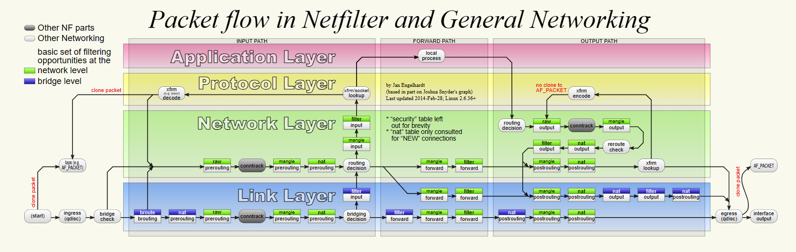
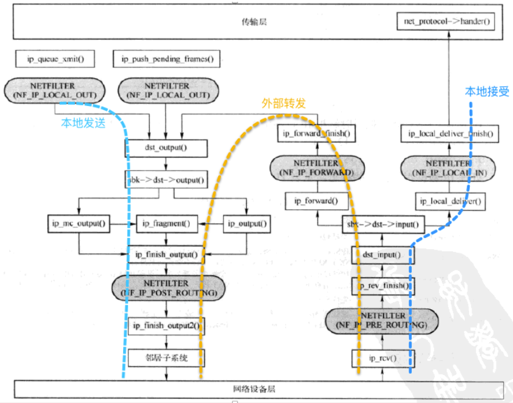
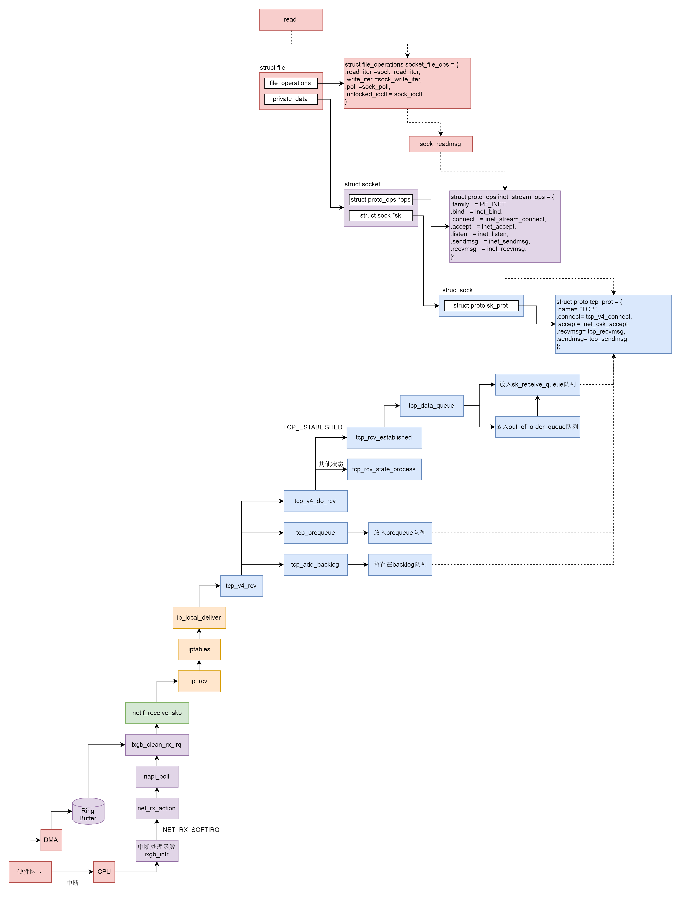
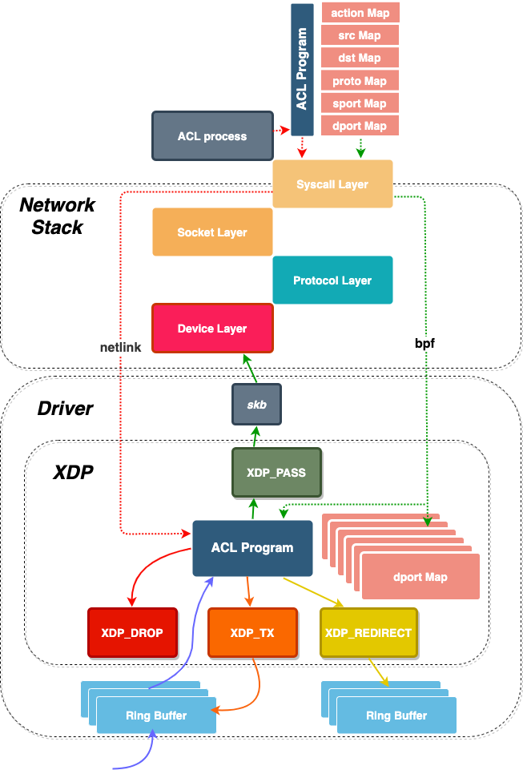
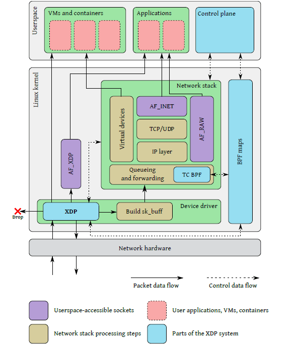

## 文件类型

- 文件类型
    - b : 块设备，是一些提供系统存取数据的接口设备，例如硬盘。
        - 一个 block 通常为 4KB 的大小，也就是说每次可以存取 4096（或其整数倍） 个字节的数据
    - c	: 字符设备，是一些串行端口的接口设备，例如键盘、鼠标、打印机、tty终端。
        - 字符设备文件是以文件流的方式进行访问的，因此可以顺序读取，但通常不支持随机存取
    - d	: 目录。
        - 限制访问权限：确保目录的权限设置只允许必要的用户或组进行访问，并避免向不相关的用户授予访问权限。
        - 控制子目录权限：对于包含敏感信息的子目录，需要进一步限制其访问权限，并严格控制谁能读取、写入或执行其中的文件。
        - 防止删除误操作：对于关键目录，使用chattr命令设置“只追加”属性，防止意外删除或修改。
    - p : 命名管道
        - 命名管道(named pipe)又被称为先进先出队列(FIFO)，
    - l	: 链接文件
        - 软链接
        - 限制符号链接的创建权限：确保只有授权用户或进程才能创建符号链接。
        - 验证符号链接的目标：在使用符号链接时，始终检查目标文件的安全性和合法性，以防止潜在的攻击。
    - s	: 套接字文件（socket），用于进程之间的通信。
    - \-	: 普通文件，分纯文本文件（ASCII）和二进制文件（binary）
        - 设置正确的权限：使用chmod命令设置适当的权限，确保只有需要访问该文件的用户具有相应的权限。
        - 加密敏感文件：对包含敏感信息的文件进行加密，以防止未经授权的访问。
        - 定期备份：定期备份重要的普通文件，以防止数据丢失或损坏。

## socket

- socket
    - 本地socket : 存放在 /tmp 或者 /usr/tmp. 用于同一台计算机上运行的进程之间的通信
    - 网络socket : netstat -an 命令来显示当前活动的网络套接字连接。

- socket保护
    - 权限控制：设置适当的权限来限制对套接字文件的访问。确保只有需要访问套接字的用户或进程具有合适的权限。使用文件系统的权限机制，如chmod和chown命令，来控制套接字文件的所有权和权限。
        - 用户
    - 输入验证：对于网络套接字，输入验证是非常重要的。确保任何通过套接字发送到服务器的数据都经过验证和过滤，以防止恶意代码注入或其他攻击。根据应用程序的需求，可以实现输入验证的机制，例如使用正则表达式、限制输入长度、过滤特殊字符等。
        - 使用socket的应用程序自己检查
    - 加密通信：对于网络套接字，使用加密协议（例如TLS/SSL）来保护数据的传输。加密通信可以防止窃听者窃取敏感信息。确保服务器和客户端之间的通信通过安全的加密通道进行。
        - 协议
    - 防火墙规则：针对网络套接字，配置防火墙规则以限制对套接字的访问。仅允许受信任的IP地址或网络访问套接字，可以通过防火墙软件（如iptables）设置适当的规则。
        - netfilter
    - 日志记录与监控：启用日志记录并监控套接字活动，以及相关的应用程序行为。这有助于检测异常活动和潜在的攻击，并提供对事件的审计和调查能力。
        - 日志
    - 位于协议栈各个位置的以及网卡上的eBPF程序：如XDP等.
        - 跟socket和网络相关的eBPF类型基本都可以用于过滤和流量控制


- netfilter介绍
    - 位于网络层的hook点
        - NF IP PRE ROUTING：刚刚进入网络层而没有进行路由之前的网络数据会通过此点（进行完版本号、校验和等检测）
        - NF_IP_FORWARD：在接收到的网络数据向另一个网卡进行转发之前通过此点
        - NF_IP_POST_ROUTING：任何马上要通过网络设备出去的包通过此检测点，这是 netfilter 的最后一个设置检测的点，内置的目的地址转换功能（包括地址伪装）在此点进行
        - NF_IP_LOCAL_IN：在接收到的报文做路由，确定是本机接收的报文之后
        - NF_IP_LOCAL_OUT：在本地报文做发送路由之前
    - 图:
    - 使用示例：
        - http://wiki.dreamrunner.org/public_html/Linux/Networks/netfilter.html;    
        - https://linuxkamarada.com/en/2019/11/24/protect-yourself-with-the-iptables-firewall/
        - https://github.com/BEIWO778/netfilter-firewall
        
        

- socket调用流程以及结构 : https://zhuanlan.zhihu.com/p/527041690
    - 


- XDP介绍:
    - http://arthurchiao.art/blog/xdp-paper-acm-2018-zh/
    - http://vger.kernel.org/lpc_net2018_talks/ebpf-firewall-paper-LPC.pdf
    - XDP允许数据包在进入Linux协议栈之前就能受到判决,从而不用上升到netfilter层面
    
    

- Linux 系统调用流程: ENTRY(entry_SYSCALL_64) -> do_syscall_64 -> call sys_call_table[%rax] -> syscall(sys_read) -> ksys_read -> vfs_read() ->
(这就是file_operations上挂载的函数)file->f_op->read()/read_iter()(socket就是sock_read_iter) -> sock_recvmsg() -> sock->ops->recvmsg()(struct proto_ops inet_stream_ops) (可以视为套接口层) -> (传输层具体实现)sock->sk_prot->...
    - sys_read即SYSCALL_DEFINE3(read, unsigned int, fd, char __user *, buf, size_t, count)
    - sys_call_table结构
    ```c
    const sys_call_ptr_t sys_call_table[__NR_syscall_max+1] = {
        ...
        [0] = sys_read,
        [1] = sys_write,
        ...
    };
    ```
    - 有些书上说的socket的syscall入口是socketcall():
        - On x86-32, socketcall() was historically the only entry point for the sockets API.  However, starting in Linux 4.3, direct system calls are provided on x86-32 for the sockets API.  This facilitates the creation of seccomp(2) filters that filter sockets system calls (for new user-space binaries that arecompiled to use the new entry points) and also provides a (very) small performance improvement.
    - 所以由上述可知，boesfs是对vfs的封装
    ```c
    boesfs_read(struct file *file, char __user *buf, size_t count, loff_t *ppos)
    {
        vfs_read(lower_file, buf, count, ppos);     //  调用原先file_operations的vfs函数，进而执行底层函数
    }
    ```

- 所以由上述流程可知，除开正常的本地文件系统，对于socket的读写，也会经过boesfs的沙盒层，然后才会走到sock->sk_prot传输层实现。
    - 设想一下，理论上boesfs可以通过对buf的内容进行判断，来决定是否讲该字段向下交付给传输层。
    - **但是boesfs并没有实现相应的沙盒层函数，经测试，对socket的读写不会走到字节码，推测原因是没有实现相应的沙盒层函数 @老杨 看看**
    - 并且，**即便是实现了，也没什么意义**，原因见下：
        - 针对网络进行防护应该是对于接收到的有危害的packet进行判断，从而预防攻击如ddos等。**所以无论从效率，还是实现功能上来讲**，设置防火墙的位置应该尽可能靠近底层。所以不如netfilter，也不如eBPF中的XDP等类型。
        - **boesfs都快到应用层了，拿到的buf里的数据都是应用层的数据。**
    - **总结：boesfs目前没有，也不适合进行网络防护.**

- 测试用的sock.py
    ```py
    import requests
    def main():
        url = "https://www.bilibili.com/"
        headers = {
            "User-Agent": "Mozilla/5.0 (Windows NT 10.0; Win64; x64) AppleWebKit/537.36 (KHTML, like Gecko) Chrome/58.0.3029.110 Safari/537.3"}

        for i in range(10):
            try:
                response = requests.get(url, headers=headers)

                # 打印原始响应内容
                print("第 {} 次请求:".format(i+1))
                print(response.text)

                # 然后尝试将其解析为 JSON
                print(response)
            except requests.exceptions.RequestException as e:
                print("第 {} 次请求发生异常：{}".format(i+1, str(e)))

    if __name__ == "__main__":
        main()
    ```

## dev

- 设备文件 : 均位于 /dev 目录下
    ```c
    shc@DESKTOP-TVUERHD:/dev$ ls -alh
    total 4.0K
    drwxr-xr-x  8 root root     2.7K Aug  1 10:47 .
    drwxr-xr-x 19 root root     4.0K Aug  1 10:47 ..
    crw-r--r--  1 root root  10, 235 Aug  1 10:47 autofs
    crw-------  1 root root  10, 234 Aug  1 10:47 btrfs-control
    crw-------  1 root root   5,   1 Aug  1 10:47 console
    ```

- 对设备文件的保护
    - 权限控制：设置正确的权限来限制对设备文件的访问。只有需要访问设备文件的用户或进程具有适当的权限。使用chmod和chown等命令来设置设备文件的所有权和权限。
    - 用户和组管理：将设备文件分配给特定的用户和组，确保只有这些用户和组可以访问设备文件。避免将设备文件分配给过多的用户，以减少潜在的安全风险。
    - 系统日志记录：启用适当的系统日志记录机制，并监控设备文件的访问和使用情况。通过审计日志记录并检查异常行为，及时发现潜在的安全威胁。
    - 文件完整性检查：通过定期检查设备文件的完整性来确保其未被篡改或损坏。比较文件的哈希值或使用工具来验证文件的完整性。
    - 最小特权原则：确保只有必要的用户或进程拥有对设备文件的访问权限。不要向不需要设备文件访问权限的用户授予访问权限，以减少潜在的攻击面。
    - 更新和修复：及时应用设备文件相关的安全补丁和更新。保持操作系统和设备驱动程序的最新版本，以修复已知漏洞和安全问题。
    - 物理访问控制：对于物理设备文件，确保物理访问受到限制。将设备文件放置在适当的位置，并设置适当的物理访问控制措施，如锁定机柜或使用安全设备存储解决方案。
    - 定期审核和评估：定期审查和评估设备文件的安全性。检查并调整权限设置，确保符合系统安全策略和最佳实践。

- **usb攻击类型：https://zhuanlan.zhihu.com/p/34617409**
    - 1）Rubber Ducky - - 2010年发布的商业击键注入攻击平台。一旦连接到主机，Rubber Ducky 就像一个键盘，并注入预先加载的按键序列。
    - 2）PHUKD / URFUKED 攻击平台 - 类似于Rubber Ducky，但允许攻击者选择注入恶意击键的时间
    - 3）USBdriveby - 通过仿真USB键盘和鼠标，在几秒钟内通过USB在未锁定的OS X主机上提供后门的快速秘密安装和覆盖DNS设置。
    - ...


- usb攻击
    - 应用层：与boesfs相关
        - 代码注入：USB存储已被多个恶意软件利用。Duqu病毒使用应用层rootkit来隐藏USB存储设备上的恶意文件。Conficker、Flame病毒则使用了0day攻击和恶意autorun。当U盘连接到主机时，inf文件自动执行恶意软件。尽管自动运行功能在成为Windows平台的主要威胁之一后受到了限制，但由于操作系统的漏洞（Bad-USB等），类似的功能仍然可用。
            - 然而boesfs无法识别执行动作。
        - 数据过滤：由于USB设备通常不会对主机上正在通信的应用程序进行身份验证，因此应用程序可能会对USB设备写入或者读取数据。例如，网络摄像头本地的数据的存储，USB设备本地日志的保存、usb应用层存在的各种安全漏洞都可能会成为关键的因素。
            - 感觉boesfs相关，但是我没找到例子。
    - 传输层：与boesfs无关
        - usb协议漏洞
        - usb协议伪造
    - 物理层：与boesfs无关
        - 物理窃听
        - 侧信道攻击


- 插入并挂载usb
    - sudo dmesg  : 查看usb名字
    - mkdir ~/usb_test : 创建挂载目录
    - sudo mount /dev/sdb ./usb_test/ : 挂载
    - df -hT查看挂载是否成功
    ```c
    Filesystem     Type      Size  Used Avail Use% Mounted on
    udev           devtmpfs  1.9G     0  1.9G   0% /dev
    /dev/sda1      ext4       47G   24G   21G  54% /
    ...
    tmpfs          tmpfs     2.0G     0  2.0G   0% /sys/fs/cgroup
    /dev/sdb       vfat      125G  929M  125G   1% /home/boes/usb_test
    ```
    - sudo umount + 挂载目录：取消挂载


- 下文尝试对usb设备进行mount boesfs
    - **尝试mount boesfs，不可行。目前感觉是和agent设置的mount namespace的原因。@qi葱@柏居 大家看看。boesfs有可能解决吗？?**
        - 在/home/boesfs下进行ls
        ```c
        root@debian:~# ls
        ls: cannot access 'usb_test': Invalid cross-device link
        ```

- **总结：目前boesfs不能对device（如插入的usb）进行保护**


- **usbguard**: 
    - https://www.redhat.com/en/blog/usbguard-improvements-red-hat-enterprise-linux-83
    - https://www.howtogeek.com/864896/how-to-protect-your-linux-computer-from-rogue-usb-drives/

- **badusb**: 
    - BadUSB 是利用 USB 固件中固有的漏洞的攻击。这种攻击重新编程USB设备，使其充当人机交互设备。一旦重新设计，USB 设备将用于在受害者的计算机上谨慎执行命令或运行恶意程序。
    - 需要开发板
    - https://lzy-wi.github.io/2018/06/12/badusb
    - https://blog.csdn.net/Ghost_system/article/details/126383082


## 参考

- https://blog.csdn.net/dog250/article/details/77993218
- https://asphaltt.github.io/post/iptables-bpf-acl/
- https://mbertrone.github.io/documents/21-Securing_Linux_with_a_Faster_and_Scalable_Iptables.pdf
- http://arthurchiao.art/blog/xdp-paper-acm-2018-zh/

