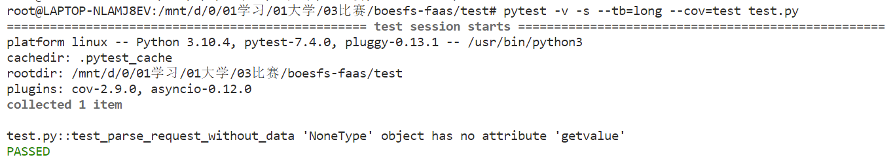
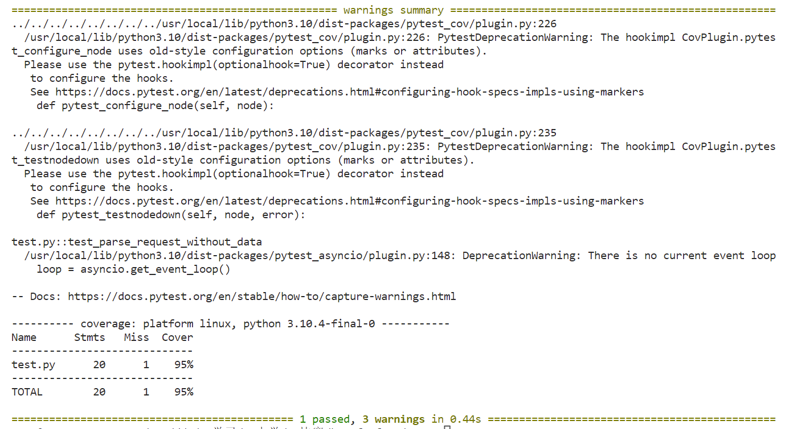

# Fnproject项目分析

## cli仓库分析

### **Fn的命令实现解析**

看起来和容器无关

init

list

create

**看起来和容器有关**

cli和容器相关的部分：1. fn start时，通过docker跑起了fnserver；2. fn deploy时，build了每个函数运行所需的docker。

cli那部分，没有和启动client容器相关的东西。

cli的deploy命令是部署函数，部署函数最后build了执行函数的容器。

cli的invoke命令是运行函数，但它只是模拟了一个curl，并接受结果。

应该是fnserver监听那个api_url后，获得一个post请求，然后以某种方式run了执行函数的docker。

#### start

`cli/commands/inspect.go`中，定义了start命令，对应的Action为start方法。

```go
// StartCommand returns start server cli.command
func StartCommand() cli.Command {
	return cli.Command{
		Name:        "start",
		...
		Action:      start,
		...
}
```

同文件，定义了start方法，最终是通过执行docker run启动了一个容器来跑fnserver。

```go
func start(c *cli.Context) error {
	...
    args := []string{"run", "--rm", "-i",
		"--name", "fnserver",
		"-v", fmt.Sprintf("%s/iofs:/iofs", fnDir),
		"-e", fmt.Sprintf("FN_IOFS_DOCKER_PATH=%s/iofs", fnDir),
		"-e", "FN_IOFS_PATH=/iofs",
		"-v", fmt.Sprintf("%s/data:/app/data", fnDir),
		"-v", "/var/run/docker.sock:/var/run/docker.sock",
		"--privileged",
		"-p", fmt.Sprintf("%d:8080", c.Int("port")),
		"--entrypoint", "./fnserver",
	}
    ...
	cmd := exec.Command("docker", args...)
	...
}
```


#### deploy

`cli/commands/deploy.go`中，定义了deploy命令，对应的Action为deploy方法。

```go
// DeployCommand returns deploy cli.command
func DeployCommand() cli.Command {
	cmd := deploycmd{}
	...
	return cli.Command{
		Name:    "deploy",
		...
		Action:      cmd.deploy,
	}
}
```

同文件，定义了deploy方法，主要逻辑注释如下。可以知道，最后调用了deploySingle函数。

```go
func (p *deploycmd) deploy(c *cli.Context) error {

	appName := ""
    // 部署函数项目路径
	dir := common.GetDir(c)

    // 加载函数文件
	appf, err := common.LoadAppfile(dir)
	
    ...
    
    // 需要提供对应app
	...

	if appName == "" {
		return errors.New("App name must be provided, try `--app APP_NAME`")
	}
    // app相关操作
    
	// 部署函数
	if p.all {
		return p.deployAll(c, app)
	}
	return p.deploySingle(c, app)
}
```

同文件，定义了deploySingle方法。解析函数文件，后调用部署函数。

```go
func (p *deploycmd) deploySingle(c *cli.Context, app *models.App) error {
	...
    // 判断目录

    // 函数文件解析
	fpath, ff, err := common.FindAndParseFuncFileV20180708(dir)
	...
    // 调用部署函数
	return p.deployFuncV20180708(c, app, fpath, ff)
}
```

同文件，定义了deployFuncV20180708方法，

```go
func (p *deploycmd) deployFuncV20180708(c *cli.Context, app *models.App, funcfilePath string, funcfile *common.FuncFileV20180708) error {
	if funcfile.Name == "" {
		funcfile.Name = filepath.Base(filepath.Dir(funcfilePath)) // todo: should probably make a copy of ff before changing it
	}

	// oracleProvider相关，貌似判断是否可以创建？
    ...
	// bump一下函数的版本
	...
	// shape架构相关的处理
	...
	
    // build所需要的函数容器
	_, err := common.BuildFuncV20180708(common.IsVerbose(), funcfilePath, funcfile, buildArgs, p.noCache, shape)
	
	...

	if err := p.signImage(funcfile); err != nil {
		return err
	}
	return p.updateFunction(c, app.ID, funcfile)
}
```

`cli/commands/common.go`，定义了BuildFuncV20180708方法。

```go
// BuildFunc bumps version and builds function.
func BuildFuncV20180708(verbose bool, fpath string, funcfile *FuncFileV20180708, buildArg []string, noCache bool, shape string) (*FuncFileV20180708, error) {
	var err error

	// 处理空的file Version

    // 做runtime语言检查？
	funcfile, err = imageStampFuncFileV20180708(fpath, funcfile)
	...

    // 逐个执行funcfile.Build
	if err := localBuild(fpath, funcfile.Build); err != nil {
		return nil, err
	}

	// build docker镜像
	if err := containerEngineBuildV20180708(verbose, fpath, funcfile, buildArg, noCache, shape); err != nil {
		return nil, err
	}

	return funcfile, nil
}
```

同文件，定义了containerEngineBuildV20180708方法。

```go
func containerEngineBuildV20180708(verbose bool, fpath string, ff *FuncFileV20180708, buildArgs []string, noCache bool, shape string) error {
    // 获取container类型
	containerEngineType, err := GetContainerEngineType()
	...

	// 检查container版本
	err = containerEngineVersionCheck(containerEngineType)
	...

	// Dockerfile相关
    
    // RunBuild
	err = RunBuild(verbose, dir, ff.ImageNameV20180708(), dockerfile, buildArgs, noCache, containerEngineType, shape)

    ...
	return nil
}
```

同文件，定义了RunBuild方法。

```go
// RunBuild runs function from func.yaml/json/yml.
func RunBuild(verbose bool, dir, imageName, dockerfile string, buildArgs []string, noCache bool, containerEngineType string, shape string) error {
	...

		// 执行docker build ...命令
		cmd := exec.Command(containerEngineType, dockerBuildCmdArgs...)
		
	...

}
```

 综上，需要去取消docker build，只需要将`cli/commands/common.go`定义的BuildFuncV20180708方法，按如下方式注释。

```go
func BuildFuncV20180708(verbose bool, fpath string, funcfile *FuncFileV20180708, buildArg []string, noCache bool, shape string) (*FuncFileV20180708, error) {
	...
	// if err := containerEngineBuildV20180708(verbose, fpath, funcfile, buildArg, noCache, shape); err != nil {
	// 	return nil, err
	// }

	...
}
```

#### invoke

该命令用来本地触发和运行某个FaaS函数。

`cli/commands/invoke.go`中，定义了invoke命令，定义的Action为Invoke方法。

```go
func InvokeCommand() cli.Command {
	cl := invokeCmd{}
	return cli.Command{
		Name:    "invoke",
		...
		Action:      cl.Invoke,
		...
	}
}
```

同文件，定义了Invoke方法。

```go
func (cl *invokeCmd) Invoke(c *cli.Context) error {
	var contentType string
    
    // endpoint可以直接指定url
	invokeURL := c.String("endpoint")

    // url为空，则先通过fn和app向fnserver获取
	if invokeURL == "" {
		...
	}
    
    // 填充content（标准输入）和conten的Type
	content := stdin()
	wd := common.GetWd()

	if c.String("content-type") != "" {
		contentType = c.String("content-type")
	} else {
		...
	}

    // 调用client的Invoke方法，得到应答
	resp, err := client.Invoke(cl.provider,
		client.InvokeRequest{
			URL:         invokeURL,
			Content:     content,
			Env:         c.StringSlice("e"),
			ContentType: contentType,
		},
	)
	
    // 应答的输出

	return nil
}
```

`cli/client/invoke.go`中，定义了Invoke函数。

```go
// Invoke calls the fn invoke API
func Invoke(provider provider.Provider, ireq InvokeRequest) (*http.Response, error) {
	invokeURL := ireq.URL
	content := ireq.Content
	env := ireq.Env
	contentType := ireq.ContentType
	method := "POST"
	...
    // 构造一个POST请求
	req, err := http.NewRequest(method, invokeURL, &buffer)
    ...
	transport := provider.WrapCallTransport(http.DefaultTransport)
	httpClient := http.Client{Transport: transport}
	...
    // 向server发送POST
	resp, err := httpClient.Do(req)
	...
    // 返回应答
	return resp, nil
}
```

综上，invoke命令其实也是向func_url发送了一个post请求，等价于curl func_url。


#### inspect

该命令用于查看一些app，context、function、trigger的情况，由四个子命令组成。

`cli/commands/inspect.go`中，定义了inspect命令，cli.Command没有定义Action，而是定义了Subcommands，具体的Action在四个子命令定义。

```go
func InspectCommand() cli.Command {
	return cli.Command{
		Name:         "inspect",
		...
		Subcommands:  GetCommands(InspectCmds),
		...
	}
}
```

`cli/commands/commands.go`中定义了GetCommands()函数，及其四个子命令。

```go
var InspectCmds = Cmd{
	"apps":      app.Inspect(),
	"context":   context.Inspect(),
	"functions": fn.Inspect(),
	"triggers":  trigger.Inspect(),
}

// GetCommands returns a list of cli.commands
func GetCommands(commands map[string]cli.Command) []cli.Command {
	cmds := []cli.Command{}
	for _, cmd := range commands {
		cmds = append(cmds, cmd)
	}

	sort.Sort(cli.CommandsByName(cmds))
	return cmds
}
```

`cli/objects/app/commands.go`中定义了app对象的Inspect子命令，这里具体实现了inspect关于app的子命令方法。

```go
func Inspect() cli.Command {
	a := appsCmd{}
	return cli.Command{
		Name:        "app",
		...
		Action:    a.inspect,
		...
	}
}
```

`cli/objects/app/apps.go`中实现了app对象的子命令方法inspect方法。

```go
func (a *appsCmd) inspect(c *cli.Context) error {
	if c.Args().Get(0) == "" {
		return errors.New("Missing app name after the inspect command")
	}

	appName := c.Args().First()
	prop := c.Args().Get(1)
	
    // 该函数通过client向server发送POST/GET，得到server返回的结果
	app, err := GetAppByName(a.client, appName)
    
	...

    // 如果prop为空，直接输出整个app模型
	if prop == "" {
		enc.Encode(app)
		return nil
	}

	// 否则输出模型prop对应的那部分
	...
	field, err := jq.Interface(strings.Split(prop, ".")...)
	...
	enc.Encode(field)

	return nil
}
```

**cli几大对象**

app

context

fn

server

trigger

## fn仓库分析

注：fn仓库分析从略，后续继续整理补充

**Fn的组件**

fnserver

cli

docker -> boes

agent

fdk

## fn_go仓库分析

### fn_go项目结构

- clientv2目录
- modelsv2目录
- provider目录
- fn_go.go

### 项目分析

#### clientv2目录

##### fn_client.go文件

在`fn_go/clientv2/fn_client.go`文件中定义了Fn client的创建，涉及三个重要的结构体：① TransportConfig，② ClientTransport，③ Fn。

TransportConfig为：

```go
type TransportConfig struct {
	Host     string
	BasePath string
	Schemes  []string
}

// 默认值
const (
	DefaultHost string = "127.0.0.1:8080"
	DefaultBasePath string = "/v2"
)
var DefaultSchemes = []string{"http", "https"}
```

ClientTransport为TransportConfig封装起来的结构体，值得一提，这个默认transport应该对应着8080端口的fnserver。

```go
func NewHTTPClientWithConfig(formats strfmt.Registry, cfg *TransportConfig) *Fn {
	... // transport runtime.ClientTranspor
    // create transport and client
	transport := httptransport.New(cfg.Host, cfg.BasePath, cfg.Schemes)
	return New(transport, formats)
}
```

Fn为包含了apps、fns、trigger三种类型的ClinetService和一个ClientTransport的结构体。

```go
// Fn is a client for fn
type Fn struct {
	Apps apps.ClientService

	Fns fns.ClientService

	Triggers triggers.ClientService

	Transport runtime.ClientTransport
}

// New creates a new fn client
func New(transport runtime.ClientTransport, formats strfmt.Registry) *Fn {
	...
	cli := new(Fn)
	cli.Transport = transport
	cli.Apps = apps.New(transport, formats)
	cli.Fns = fns.New(transport, formats)
	cli.Triggers = triggers.New(transport, formats)
	return cli
}
```

##### apps目录

###### apps_client.go文件

在`fn_go/clientv2/apps/apps_client.go`文件主要定义了Apps类型的ClientService的所有接口及其具体实现，包括Apps类型的创建、删除、获取、列表、更新、设置transport的接口。

```go
// ClientService is the interface for Client methods
type ClientService interface {
	CreateApp(params *CreateAppParams) (*CreateAppOK, error)

	DeleteApp(params *DeleteAppParams) (*DeleteAppNoContent, error)

	GetApp(params *GetAppParams) (*GetAppOK, error)

	ListApps(params *ListAppsParams) (*ListAppsOK, error)

	UpdateApp(params *UpdateAppParams) (*UpdateAppOK, error)

	SetTransport(transport runtime.ClientTransport)
}
```

上述方法的具体实现，是往transport所在的对应路径发送GET或者POST请求，例如create方法的实现，则是往127.0.0.1:8080/apps处发送POST请求。

```go
func (a *Client) CreateApp(params *CreateAppParams) (*CreateAppOK, error) {
	...
	result, err := a.transport.Submit(&runtime.ClientOperation{
		ID:                 "CreateApp",
		Method:             "POST",
		PathPattern:        "/apps",
		ProducesMediaTypes: []string{"application/json"},
		ConsumesMediaTypes: []string{"application/json"},
		Schemes:            []string{"http", "https"},
		Params:             params,
		Reader:             &CreateAppReader{formats: a.formats},
		Context:            params.Context,
		Client:             params.HTTPClient,
	})
	...
}
```


#### modelsv2目录

在`fn_go/modelsv2/app.go`文件中定义了App类型的模型描述，以及一些验证有效性的方法。

```go
type App struct {
	// 描述
	Annotations map[string]interface{} `json:"annotations,omitempty"`
	// 配置
	Config map[string]string `json:"config,omitempty"`
	// 创建时间
	CreatedAt strfmt.DateTime `json:"created_at,omitempty"`
	// ID
	ID string `json:"id,omitempty"`
	// 名字
	Name string `json:"name,omitempty"`
	// 平台
	Shape string `json:"shape,omitempty"`
	// 日志路径
	SyslogURL *string `json:"syslog_url,omitempty"`
	// 更新时间
	UpdatedAt strfmt.DateTime `json:"updated_at,omitempty"`
}
```

其他一些有效性确认方法，暂略。

参考`fn inspect app pyapp`命令的输出：

```json
{
        "created_at": "2023-07-21T18:11:30.310+08:00",   
        "id": "01H5VYXQC6NG9G6ERZJ0000001",
        "name": "pyapp",
        "updated_at": "2023-07-21T18:11:30.310+08:00"    
}
```


#### provider目录

在`fn_go/provider/provider.go`文件中定义了provider类型，用于为API客户端提供需要获取必需信息的接口。

接口如下：

```go
type Provider interface {
	// 用于获取Fn client的fn结构体（看起来更像是新建了一个结构体）
	APIClientv2() *clientv2.Fn
	// 用于获取可以访问该Fn client的url
	APIURL() *url.URL
	// 返回该provider不再支持的资源类型（app，function和trigger中的几种）
	UnavailableResources() []FnResourceType
	// 用于获取Fn client的version.Client结构体（看起来更像是新建）
	VersionClient() *version.Client
	// 用于获取Fn client的http.RoundTripper（http.Client 的中间件）
	WrapCallTransport(http.RoundTripper) http.RoundTripper
}
```

在`fn_go\provider\defaultprovider\default_provider.go`文件和`\fn_go\provider\oracle\oracle_common.go`文件均实现了接口，以`default_provider.go`为例，其APIClientv2()实现为：

```go
func (dp *Provider) APIClientv2() *clientv2.Fn {
	transport := openapi.New(dp.FnApiUrl.Host, path.Join(dp.FnApiUrl.Path, clientv2.DefaultBasePath), []string{dp.FnApiUrl.Scheme})
	if dp.Token != "" {
		transport.DefaultAuthentication = openapi.BearerToken(dp.Token)
	}

	return clientv2.New(transport, strfmt.Default)
}
```

虽然作用是获取中间件（结构体），但实现上比较像用部分已知信息去创建一个新的能够正常使用的中间件

## fdk仓库分析

### **fdk-python**

#### debian9 python3.10 安装fdk

Python3.10.11安装

```shell
cd ~
wget https://www.python.org/ftp/python/3.10.11/Python-3.10.11.tgz --no-check-certificate
tar  -xf   Python-3.10.11.tgz
cd Python-3.10.11/
./configure --prefix=/usr/local/python3
make -j4
sudo make install
```

由于python3.10需要的openssl版本需要不低于于1.1.1，而1.1.1版本将在今年11月停止维护，因此首先要将当前1.1.0版本的openssl升级到3.1.1版本

首先下载并解压源码

```shell
cd ~
wget https://www.openssl.org/source/openssl-3.1.1.tar.gz --no-check-certificate
tar -zxvf openssl-3.1.1.tar.gz
```

调整配置，编译源码并安装

```shell
cd openssl-3.1.1/
./config --prefix=/usr/local/ssl --openssldir=/usr/local/ssl shared zlib
make -j4
sudo make install
```

配置安装好的openssl

```shell
sudo su
echo "/usr/local/ssl/lib64" > /etc/ld.so.conf.d/openssl.conf
ldconfig
cp /usr/local/ssl/bin/openssl /usr/bin/openssl
ldconfig -v
openssl version  # 检查是否安装成功
# 返回普通用户
```

安装完openssl，还需要重新安装Python3.10，因为Python3在安装时是默认不安装ssl模块的，因此要修改Python3的配置文件，从而安装带有ssl的Python3.10

首先修改Python3.10的安装配置文件

```shell
# 进入到Python3.10的源码目录
# 打开Modules/Setup文件，将从207行开始的配置修改为
_socket socketmodule.c

# Socket module helper for SSL support; you must comment out the other
# socket line above, and edit the OPENSSL variable:
OPENSSL=/usr/local/ssl
 _ssl _ssl.c \
     -I$(OPENSSL)/include -L$(OPENSSL)/lib64 \
     -lssl -lcrypto
_hashlib _hashopenssl.c \
     -I$(OPENSSL)/include -L$(OPENSSL)/lib64 \
     -lcrypto
```

然后重新生成Makefile文件并重新编译安装即可

```shell
./configure --prefix=/usr/local/python3
./configure --with-ssl
sudo make clean
make -j4
sudo make install
```

重新安装完Python3.10后即可安装fdk

```shell
pip3 install fdk
```

#### fdk-python用法

一般情况的用法：

```shell
fdk <path-to-a-function-module> [module-entrypoint]
# fdk <带运行的函数模块> <模块的入口函数>
# eg: fdk func.py handler
```

非容器下使用：

运行FaaS函数，需要设置`FN_FORMAT`和`FN_LISTENER`两个环境变量

```shell
env FDK_DEBUG=1 FN_FORMAT=http-stream FN_LISTENER=unix://tmp/func.sock fdk <path-to-a-function-module> [module-entrypoint]
```

获取FaaS结果

```shell
curl -v --unix-socket /tmp/func.sock -H "Fn-Call-Id: 0000000000000000" -H "Fn-Deadline: 2030-01-01T00:00:00.000Z" -XPOST http://function/call -d '{"name":"Tubbs"}'
```

待进一步分析fdk-python，看源码

#### **使用pytest**

安装pytest

```shell
pip3 install pytest
pip3 install pytest-cov
```

使用pytest

```shell
pytest -v -s --tb=long --cov=func func.py
```

生成结果示例





### **fdk-ruby**

fdk用法

在函数中的关键部分类似于

```ruby
require 'fdk'
# ...
def myfunction(context:, input:)
    # Do some work here
    return output
end
FDK.handle(target: :myfunction)
```

一般情况的用法：

```shell
cd <dir>
# cd <函数所在的目录>
fn create app <examples>
fn deploy --app <examples>
# 在函数所在的目录下
# fn create app <创建的app名字>
# fn deploy -app <函数要添加到的app>
# eg:
# fn create app examples
# fn deploy --app examples
```

非容器下使用：

无

本地容器下使用：

运行FaaS函数

```shell
cd <dir>
# cd <函数所在的目录>
fn create app <examples>
fn deploy --app <examples> --local
# 在函数所在的目录下
# fn create app <创建的app名字>
# fn deploy -app <函数要添加到的app> --local
# eg:
# fn create app examples
# fn deploy --app examples --local
```

获取FaaS结果

```shell
fn invoke examples hello

echo '{"name":"Joe"}' | fn invoke examples hello --content-type 'application/json'
```

### **fdk-node**

创建一个js函数并安装fdk

```shell
fn init --runtime node <path>
cd <path>
# <path> 为路径
```

fdk用法

在函数中的关键部分类似于

```javascript
const fdk=require('@fnproject/fdk');
function myfunction(input,ctx){
    // ... 
}
fdk.handle(myfunction, ...)
```

使用函数的方法与fdk-ruby类似

一般情况的用法：

```shell
fn create app <examples>
fn deploy --app <examples>
# 在函数所在的目录下
# fn create app <创建的app名字>
# fn deploy -app <函数要添加到的app>
# eg:
# fn create app fdkdemo 
# fn deploy --app fdkdemo 
```

非容器下使用：

无

本地容器下使用：

运行FaaS函数

```shell
fn create app <examples>
fn deploy --app <examples> --local
# 在函数所在的目录下
# fn create app <创建的app名字>
# fn deploy -app <函数要添加到的app> --local
# eg:
# fn create app fdkdemo
# fn deploy --local --app fdkdemo
```

获取FaaS结果

```shell
fn invoke fdkdemo nodefunc 

echo -n '{"name": "Tom"}' | fn invoke fdkdemo nodefunc
```

### **fdk-java**

创建一个java函数并安装fdk

```shell
fn init --runtime=java --name <path>
# ​fn init --runtime=java --name <路径>
```

fdk用法

一般情况的用法：

```shell
fn build
fn run
# 在函数所在的目录下
```

以http为例：

```shell
#在另一终端
fn start
#在原终端
fn build
fn create app <examples>
fn deploy --app <examples>
# 在函数所在的目录下
# fn create app <创建的app名字>
# fn deploy -app <函数要添加到的app>
# eg:
# fn create app java-app
# fn deploy --app java-app 
```

非容器下使用：

无

本地容器下使用：

运行FaaS函数（以http为例）

```shell
#在另一终端
fn start
#在原终端
fn create app <examples>
fn deploy --app <examples> --local
# 在函数所在的目录下
# fn create app <创建的app名字>
# fn deploy -app <函数要添加到的app> --local
# eg:
# fn create app java-app
# fn deploy --app java-app --local
```

获取FaaS结果

```shell
fn call java-app /hello-java-function 

curl http://localhost:8080/r/java-app/hello-java-function
```

### **fdk-go**

创建一个go函数并安装fdk

```shell
fn init --runtime go <path>
cd <path>
# <path> 为路径
```

fdk用法

在函数中的关键部分类似于

```go
package main

import (
	"context"
	"encoding/json"
	"fmt"
	"io"
	fdk "github.com/fnproject/fdk-go"
)

func main() {
	fdk.Handle(fdk.HandlerFunc(myHandler))
}

// ...

func myHandler(ctx context.Context, in io.Reader, out io.Writer) {
	// ...
}
```

使用函数的方法与fdk-ruby类似

一般情况的用法：

```shell
fn create app <examples>
fn deploy --app <examples>
# 在函数所在的目录下
# fn create app <创建的app名字>
# fn deploy -app <函数要添加到的app>
# eg:
# fn create app goapp
# fn deploy --app goapp 
```

非容器下使用：

无

本地容器下使用：

运行FaaS函数（以http为例）

```shell
fn create app <examples>
fn deploy [--verbose] --app <examples> --local
# 在函数所在的目录下
# fn create app <创建的app名字>
# fn [--verbose] deploy -app <函数要添加到的app> --local
# eg:
# fn create app goapp
# fn deploy --app goapp --local
```

获取FaaS结果

```shell
fn invoke goapp gofn

echo -n '{"name":"Bob"}' | fn invoke goapp gofn --content-type application/json

curl -X "POST" -H "Content-Type: application/json" http://localhost:8080/invoke/01DJZQXW47NG8G00GZJ0000014

curl -X "POST" -H "Content-Type: application/json" -d '{"name":"Bob"}' http://localhost:8080/invoke/01DJZQXW47NG8G00GZJ0000014
```

## Fn

Fnproject是一款轻量级的serverless服务库。

### fn安装

```shell
# Debian9 安装docker
sudo apt install apt-transport-https ca-certificates curl software-properties-common gnupg2
curl -fsSL https://download.docker.com/linux/debian/gpg | sudo apt-key add -
sudo add-apt-repository "deb [arch=amd64] https://download.docker.com/linux/debian $(lsb_release -cs) stable"
sudo apt updatesudo apt install docker-ce
sudo usermod -aG docker $USER # 允许非特权用户使用docker，需要重新登录账户

# fn自动安装
curl -LSs https://raw.githubusercontent.com/fnproject/cli/master/install | sh
```

### 启动与部署

启动fn服务

```shell
fn start # 启动FaaS服务
# 可以指定端口，默认8080
fn start -p 9080
export FN_API_URL=http://127.0.0.1:9080
```

为每个FaaS函数生成一个fn项目结构

```shell
fn init --runtime python pyTest
```

检查上下文

```shell
fn list contexts
```


创建应用，在上述函数的项目结构下执行

```shell
fn create app pyapp
```

部署当前函数到上述pyapp应用中

```shell
fn --verbose deploy --app pyapp --local
```

查看部署情况

```shell
fn list apps
fn list functions pyapp
```


### 访问FaaS服务

访问部署的FaaS函数有如下两种方式

- CLI命令行

fn提供invoke命令直接调用对应应用的对应函数

```shell
# 不传递参数
fn invoke pyapp pytest

# 传递data参数，使用管道
echo -n '{"name":"Felix"}' | fn invoke pyapp pytest --content-type application/json
```


- 访问API接口

查看API接口

```python
fn inspect function pyapp pytest
```


使用POST请求访问该API接口

本地访问

```shell
curl -X "POST" -H "Content-Type: application/json" -d '{"name":"Felix"}' http://localhost:8080/invoke/01H3M2MVDHNG8G00GZJ0000002
```


远程访问

```shell
curl -X "POST" -H "Content-Type: application/json" -d '{"name":"Felix"}' http://192.168.177.203:8080/invoke/01H3M2MVDHNG8G00GZJ0000002
```


### *fn项目结构

fn项目结构为:

```shell
.
├── func.py # FaaS函数的文件，代码逻辑
├── func.yaml # 函数的配置文件
└── requirements.txt # FaaS函数的依赖
```

- func.py文件

该示例函数实现传入数据data的json解析，获得键name对应的值，并返回一个应答消息。

```python
import io
import json
import logging

from fdk import response


def handler(ctx, data: io.BytesIO = None):
    name = "World"
    try:
        body = json.loads(data.getvalue())
        name = body.get("name")
    except (Exception, ValueError) as ex:
        logging.getLogger().info('error parsing json payload: ' + str(ex))

    logging.getLogger().info("Inside Python Hello World function")
    return response.Response(
        ctx, response_data=json.dumps(
            {"message": "Hello {0}".format(name)}),
        headers={"Content-Type": "application/json"}
    )

```

- func.yaml文件

```yaml
schema_version: 20180708
name: pytest
version: 0.0.1
runtime: python
build_image: fnproject/python:3.9-dev
run_image: fnproject/python:3.9
entrypoint: /python/bin/fdk /function/func.py handler
memory: 256
```

| 字段           | 解释                             |
| -------------- | -------------------------------- |
| schema_version | 标识该服务的架构版本             |
| name           | 函数的名称，即项目名称           |
| version        | 服务的函数版本，从0.0.1 自动开始 |
| runtime        | 函数的语言信息                   |
| build_image    | 打包的docker镜像                 |
| run_image      | 运行的docker镜像                 |
| entrypoint     | docker执行该函数的命令           |
| memory         | 函数的最大内存大小               |

- requirements.txt

  ```python
  fdk>=0.1.58
  ```

### *容器使用情况

当执行`fn start`后，会建立一个fnserver的容器


当对FaaS函数进行触发，像API发送POST请求，会动态创建和销毁FaaS函数对应的容器


### *fn启动耗时分析

在函数第一次启动的时候，耗时较高，后续耗时较低。


### 