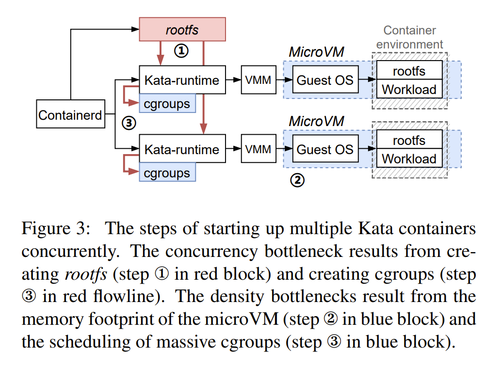
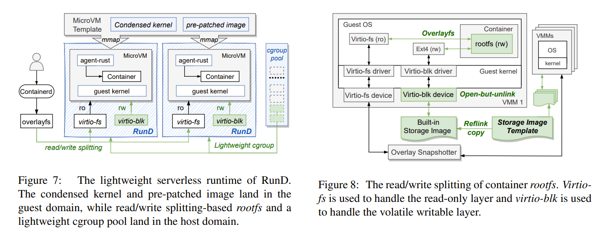
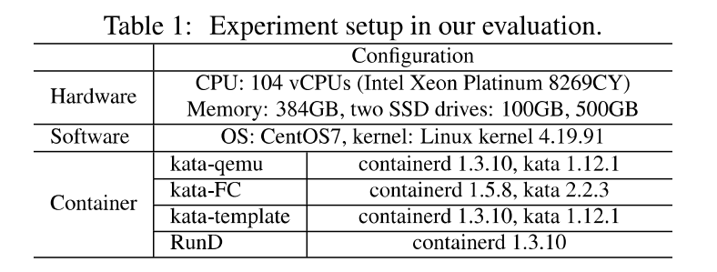
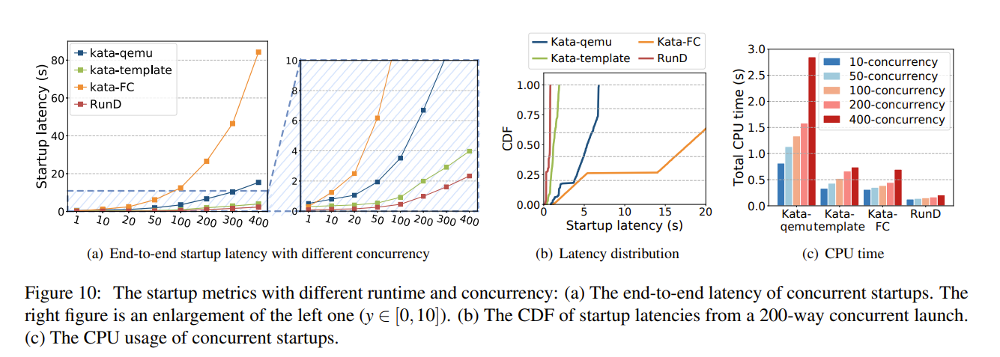
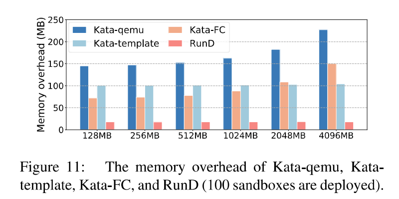
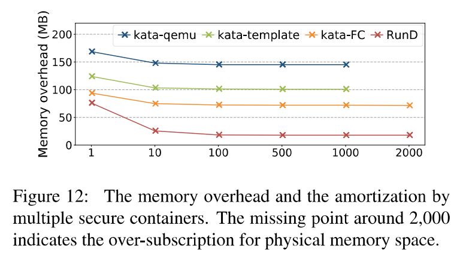
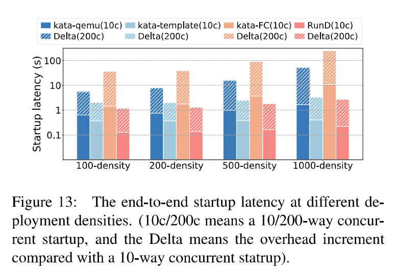

# RunD

[论文原版](../../../Reference/serverless/RunD A Lightweight Secure Container Runtime for High-density Deployment and High-concurrency Startup in Serverless Computing.pdf)

## RunD实现概述

RunD是一个基于容器化FaaS的优化方案。RunD基于LightVM Sandbox和Kata-Container，对安全容器的三个瓶颈进行优化，满足Serverless场景中高密度部署以及高并发启动的需求。

### Serverless 场景下的需求

**高速**。创建速度要快，E2E 启动时间达到百毫秒级。同时还需要保证启动时延的鲁棒性，使得其不会明显受到运行时干扰，比如当前并发数和部署密度的影响。

**高频**。上百万的实例创建量，上亿次的函数调用。当负载爆发时，需要创建大量的容器。支持高并发启动的能力至关重要。

**高密**。大量容器共存于工作节点中，为保证极致弹性和资源利用率，需要考虑内存和 CPU 资源占用问题。如果没有特别的优化，安全容器会明显降低无服务器计算中的部署密度。在相同的基础设施下，增加部署密度可以极大地提高资源利用率和多租户服务效率。

### 安全容器的瓶颈分析

- 容器的 rootfs 的高时空开销

- 单 MicroVM 的高内存空间开销
- cgroup 的高 CPU 时间开销

### RunD解决方案

- 高效 rootfs 读写分离
- 内核精简和代码自修改补丁
- 轻量级 cgroup 和池化

## RunD测试

### 结果概要

#### 并发性能

RunD 能够在 88ms 内启动一个单独沙盒，并具备在 1 秒内同时启动 200 个沙箱的并发能力，与现有技术相比，具有最小的延迟波动和 CPU 开销

#### 高密部署

RunD 支持在内存为 384GB 的节点上部署超过 2500 个 128MB 内存规格的沙盒。且每个沙盒的平均内存占用小于 20MB

#### 高密下高并发

RunD 在支持高并发创建方面表现出了更好的性能和稳定性。

### 对比对象

①kata-qemu

②kata-FC

③kata-template

### 测试环境

注：

1.上述环境广泛运用在实际云产品中

2.100GB磁盘用于根文件系统，500GB磁盘用于存储安全容器

3.RunD使用Alibaba Cloud Linux2，其他对比对象使用Alpine Linux

### 测试方法

1.为符合cri规范，通过`crictl`创建一个内部没有其他容器的pod沙盒

2.容器的内存实际占用通过`smem`命令收集。内存规范可以自定义。

3.考虑FaaS的常见做法，RunD在没有用户代码情况下也启动了空的安全容器。这些结果体现的是RunD实际工作负载下的性能。

### 并发启动测量

#### 关注的指标

和用户体验相关的三个指标

1.同时启动大量沙盒所需要的时间

2.沙盒启动的延时分布情况

3.主机上的CPU开销

第一个指标体现启动沙盒的吞吐量，第二个指标体现每个沙盒情况

#### 测量结果

图10-a，x轴表示并发启动沙盒的数量，y轴表示总时延。RunD能用最短的时间并发启动大量的容器。在并发启动200沙盒时，kata-FC、kata-qemu、kata-template、RunD的时间分别为47.6s、6.85s、2.98s、1s。在并发启动400个沙盒时，RunD也比最近的基线kata-template高出近40%。

图10-b，在启动200个沙盒的情况下，x轴表示启动时延，y轴表示分布概率。RunD能带来更好的用户体验。

图10-c，表示不同并发度，不同对象下的CPU使用时间。在并发启动200个沙盒情况下，RunD比kata-FC、kata-qemu、kata-template分别减少了89.3%，74.5%和62.1%的CPU开销。同时随着并发数量的提高，RunD带来的CPU使用时间开销增加并不显著。

总结，RunD 能够在 88ms 内启动一个单独沙盒，并具备在 1 秒内同时启动 200 个沙箱的并发能力，与现有技术相比，具有最小的延迟波动和 CPU 开销

### 高密部署测量

在函数计算场景中，对于高密度部署，cpu占用时间影响较少，主要取决于容器平均的内存的占用开销。

图11，表示了在100个容器条件下，x轴表示每个容器的内存规范，y轴表示每个容器实际的平均内存开销。RunD带来的平均内存开销在20MB以内。在128MB条件下，RunD比kata-qemu、kata-template、kata-FC分别减少了54.9%，27.2%和18.9%的内存开销。kata-template和RunD的内存开销不会随内存规范增加而增加，相反kata-FC和kata-qemu则会显著增加。

图12，x轴表示部署容器的密度，y轴表示平均的内存开销。在部署1000个沙盒的条件下，RunD比kata-qemu、kata-template、kata-FC分别减少了87.7%，82.4%和75.1%的内存开销。

总结，RunD 支持在内存为 384GB 的节点上部署超过 2500 个 128MB 内存规格的沙盒。且每个沙盒的平均内存占用小于 20MB

### 高密部署对高并发的影响

当节点已经部署了一些沙盒情况下，并发启动沙盒的性能可能会受到影响。

图13，x轴表示节点已经部署的容器数量，y轴表示启动10个和200个容器的延时。在部署了1000个容器情况下，kata-FC、kata-qemu、kata-template、RunD启动10个容器相对于没有部署增加了10.8s、1.69s、0.41s、0.22s。此外，随着部署密度的增加，并发的时间开销也会增加。

总结，RunD 在支持高并发创建方面表现出了更好的性能和稳定性。