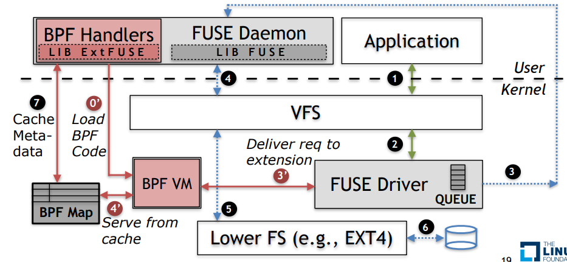
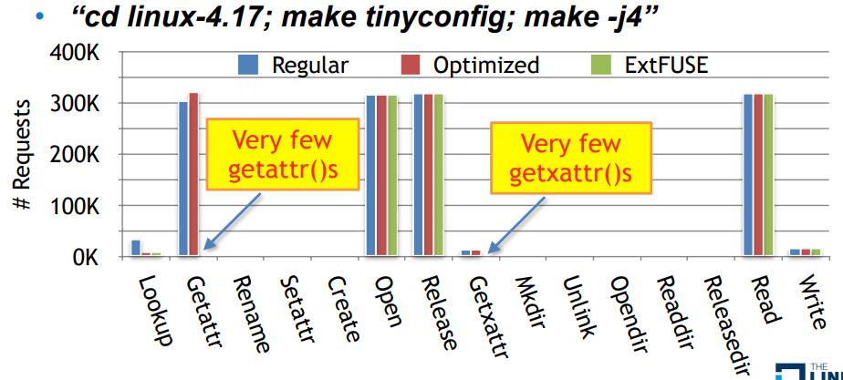
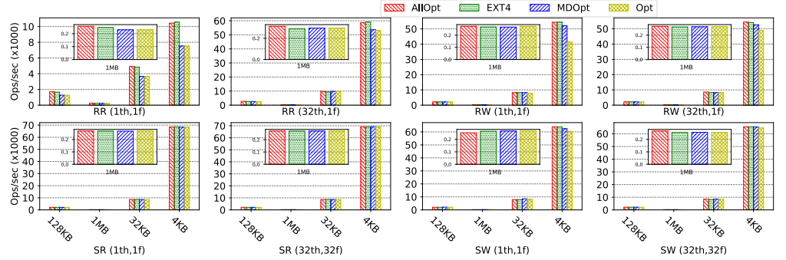
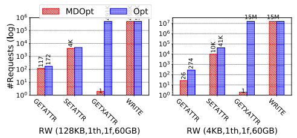
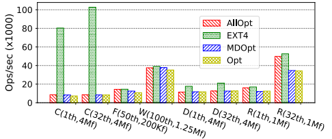
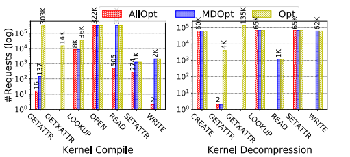

# extfuse

[论文原版](../../../Reference/extfuse/Extension Framework for File Systems in User space.pdf)

## 关于ExtFUSE

ExtFUSE在普通的FUSE的基础上增加了一层框架，结构与sandfs类似

[源码地址](https://github.com/extfuse/extfuse)
该项目仅通过bpf map将元数据访问进行了优化，并没有涉及内存拷贝的部分，因此优化的结果主要作用于getattr和getxattr
根据源码，主要用bpf map给inode设计了一个cache，使文件系统能快速访问
优化结果：

要优化open，release，read，write等操作，需要优化内存拷贝的部分

## 测试方法

### 测试部分翻译

#### 评估

为了评估EXTFUSE，我们回答以下问题：
**基准性能**。与内核和FUSE实现相比，文件系统的EXTFUSE实现是如何执行的？
**用例**。什么样的现有FUSE文件系统可以从EXTFUSE中受益？它们可以期待什么样的性能改进？

#### 性能

为了测量EXTFUSE的基准性能，我们采用了名为Stackfs[50]的简单无操作（null）可堆叠FUSE文件系统。此用户空间守护进程通过将所有请求转发到主机（较低）文件系统来为其提供服务。它包括所有最近的FUSE优化。我们在表5中列出的所有可能的EXTFUSE配置下评估Stackfs。每个配置都代表了可能实现的特定性能级别，例如，通过在内核中缓存元数据或通过主机文件系统直接传递读/写请求来实现堆叠功能。为了把我们的结果放在上下文中，我们将我们的结果与EXT4和Stackfs（Opt）的优化FUSE实现进行了比较。

**测试环境**。我们使用与[50]中相同的实验和设置。特别地，我们使用EXT4，因为EXT4作为主机文件系统很受欢迎，并运行基准进行评估。然而，由于FUSE性能问题在更快的存储介质中更为突出，因此我们只对SSD进行了实验。我们使用了三星850 EVO 250GB SSD，安装在华硕机器上，搭载英特尔四核i5-3550 3.3 GHz和16GB RAM，运行Ubuntu 16.04.3。此外，为了最大限度地减少任何可变性，我们在每次实验前格式化了SSD，并禁用了EXT4懒惰索引节点初始化。为了评估实现xattr操作以处理安全标签的文件系统（例如，在Android中），我们的Opt实现支持xattr，因此与中的实现不同。

**工作负载**。我们的工作负载由Filebench[48]微观和综合宏观基准测试组成，用于在各种I/O大小和并行度设置中使用元数据和数据密集型操作测试每个配置。我们测量低级别吞吐量（ops/sec）。我们的宏基准测试由合成文件服务器和web服务器组成。

**微观结果**。图6显示了表5中列出的不同配置下的微工作负载的结果。

表5：
|配置|文件系统|优化|
|-|-|-|
|Opt|FUSE|128K写入、拼接、WBCache、MltTrd|
|MDOpt|EXTFUSE|Opt+缓存查找、属性、xattrs|
|AllOpt|EXTFUSE|MDOpt+通过主机FS通过R/W请求|

（图6：EXT4和FUSE/EXTFUSE Stackfs（w/xattr）文件系统在不同配置下的吞吐量（ops/sec）（表5），通过IO大小在4KB-1MB之间的随机读取（RR）/写入（RW）、顺序读取（SR）/写（SW）Filebench[48]数据微工作负载和设置Nth:N个线程、Nf:N个文件来测量。）

**读取**。由于FUSE默认的128KB预读功能，对于所有I/O大小和所有Stackfs配置，使用单个线程对单个文件的顺序读取吞吐量保持不变。针对Sequential读取基准测试，改进了32个线程和32个文件的多线程。每个线程只生成一个用于查找和getattr操作的请求。因此，MDOpt中的元数据缓存无效。由于FUSE-Opt的性能已经与EXT4相当，因此AllOpt中没有使用直通功能。

与顺序读取不同，小型随机读取无法利用FUSE的预读功能。此外，4KB读取不会拼接，并且会导致跨用户内核边界的数据复制。在单个文件上操作32个线程的情况下，由于Opt中的多线程，吞吐量有所提高。然而，4KB的读取会导致性能下降。AllOpt通过EXT4传递所有读取，因此提供接近本地的直通put。在某些情况下，性能略好于EXT4。我们认为，这种微小的改进是由于VFS层的双重缓存。由于每个线程只有一个元数据操作请求，EXTFUSE元数据缓存没有任何改进。

**写入**。在顺序写入期间，Opt中的128K大写入和回写缓存允许FUSE驱动程序在页面缓存中批量处理小写入（高达128KB），以提供更高的吞吐量。然而，随机写入不是成批的。因此，更多的写入请求被传递到用户空间，这对吞吐量产生了负面影响。单个文件上的多个线程在拼接时对大于4KB的请求表现更好。在使用EXTFUSE的AllOpt配置时，所有写入都通过EXT4文件系统传递，以提高性能。

对于支持扩展属性的FUSE文件系统，写入吞吐量会严重下降，因为VFS在每次写入之前都会发出getxattr请求。小型I/O请求的性能较差，因为它们需要更多的写入，从而生成更多的getxattr请求。与4KB写入相比，Opt随机写入生成的128KB getxattr请求减少了30倍，导致4KB写入的吞吐量降低了23%。

相比之下，MDOpt在第一次调用时将getxattr回复缓存在内核中，并在不引起到用户空间的进一步转换的情况下为后续的getxaattr请求提供服务。图7比较了Opt和MDOpt中用户空间守护进程接收的请求数。缓存回复将4KB工作负载的开销降低到5%以下。在顺序写入和随机写入中都观察到了类似的行为。

（图7：在图6中的工作负载下，FUSE/EXTFUSEStackfs（w/xattr）中的守护进程接收到的文件系统请求数，其中只显示了一些相关的请求类型。）

**宏观结果**。图8显示了在各种配置下使用Filebench模拟的宏工作负载和综合服务工作负载的结果。在创建和删除工作负载下，EXTFUSE配置都没有提供对FUSE-Opt的改进，因为这些元数据繁重的工作负载分别创建和删除了许多文件。这是因为MDOpt无法使用任何元数据缓存。类似地，AllOpt没有使用直通写入，因为4KB文件是在用户空间中创建和关闭的。相比之下，EXTFUSE下的File和Web服务器工作负载同时利用了元数据缓存和直通访问功能，并提高了性能。当配置为为每种类型的请求缓存高达64K时，对MDOpt用户空间的查找、getattr和getattr请求分别下降了47%、89%和100%。AllOpt进一步启用了直通读/写请求，为宏读取和服务器工作负载提供接近本机的吞吐量。

（图8：根据Filebench4KB文件上的创建（C）、删除（D）、读取（R）元数据微工作负载和FileServer（F）、WebServer（w）宏工作负载（设置为Nth:N个线程，Nf:N个文件）测量的不同配置（表5）下EXT4和FUSE/EXTFUSE堆栈的吞吐量（Ops/sec）（w/xattr）。）

**真实工作负载**。我们还用两个真实工作负载评估了EXTFUSE，即对4.18.0 Linux内核的解压缩和编译。我们创建了三个单独的缓存，用于托管查找、getattr和getxattr回复。每个缓存最多可容纳64K个条目，从而在完全填充时分配总计50MB的内存。

内核编译在我们的测试机上进行`make tinyconfig; make -j4`的实验，报告显示得到了5.2%的编译时间下降，从FUSE-Opt下的39.74秒下降到EXTFUSE-MDOpt下的37.68秒，而EXT4下的编译时间为30.91秒。这是由于对用户空间的lookup、getattr和getxattr请求分别减少了75%、99%和100%（图9）。getxattr回复在处理打开的请求时被主动缓存；因此，对于服务xattr请求，没有观察到用户空间的转换。使用EXTFUSEAllOpt，由于对用户空间的读写请求减少了100%，编译时间进一步降至33.64秒。

（图9：Linux内核4.18.0 untar（解压缩）以及在FUSE和EXTFUSE设置下使用StackFS所花费的编译时间，EXTFUSE减少了元数据和I/O请求的数量。）

相比之下，内核解压缩`tar -xf`实验报告得到的完成时间下降了6.35%，从FUSE-Opt下的11.02秒下降到EXTFUSE-MDOpt下的10.32秒，而EXT4下的完成时间为5.27秒。使用EXTFUSEAllOpt，由于对用户空间的读写请求减少了100%，解压缩时间进一步降至8.67秒，如图9所示。然而，由于对用户空间的getattr请求增加了3555个，将元数据请求的缓存条目数量减少到4K导致解压缩时间为10.87秒（增加了25.3%）。这表明开发人员必须有效地管理缓存。

#### 用例

我们将四个真实世界的可堆叠FUSE文件系统，即`LoggedFS`、`Android sdcard daemon`、`MergerFS`和`BindFS`移植到EXTFUSE，并启用了元数据缓存§5.1和直通I/O§5.2优化。

由于EXTFUSE允许文件系统保留其现有的FUSE守护进程代码作为默认的慢路径，因此在现实世界的文件系统中采用EXTFUSE是很容易的。平均而言，我们对现有的FUSE代码进行了不到100行的更改，以调用EXTFUSE辅助库函数来管理内核扩展，包括映射。我们添加了内核扩展以支持元数据缓存和I/O直通。总的来说，它在内核表6中只需要不到1000行的新代码。现在，我们将对Android SD卡守护进程和LoggedFS进行详细评估，以提出预期性能改进的想法。

> 后面都在讲述如何把Android SD卡守护进程和LoggedFS的FUSE改造成EXTFUSE，与测试方法无关，不再翻译

### 测试方法总结

论文一共提到了4点：
> ①采用和[50]一样的实验和环境（[50]见下方）
> ②采用filebench里的功能，包括模拟的微观和综合宏观基准测试
> ③采用对4.18.0 Linux内核的解压缩和编译两个真实工作负荷
> ④对比对象均为EXT4

[50]的测试内容与论文中一致，内容大致如下（可以用filebench实现？）：
|工作负载名字|描述|
|-|-|
|seq-rd-Nth-1f|N（1或32）个线程从一个60GB文件顺序读取|
|seq-rd-32th-32f|32个线程顺序读取32个2GB文件，一个线程对应一个文件|
|rnd-rd-Nth-1f|N（1或32）个线程从一个60GB文件随机读取|
|seq-wr-1th-1f|1个线程创建并顺序写一个60GB文件|
|seq-wr-32th-32f|32个线程创建并顺序写32个2GB文件，一个线程对应一个文件|
|rnd-wr-Nth-1f|N（1或32）个线程创建并随机写一个60GB文件|
|files-cr-Nth|N（1或32）个线程在大量目录下创建四百万个4KB文件|
|files-rd-Nth|N（1或32）个线程在大量目录下读取一百万个4KB文件|
|files-del-Nth|N（1或32）个线程在大量目录下删除四百万个4KB文件|
|file-server|Filebench模拟的文件服务器工作负载，最高到二十万个文件|
|web-server|Filebench模拟的Web服务器工作负载，最高到一百二十五万个文件|
|mail-server|Filebench模拟的邮件服务器工作负载，最高到一百五十万个文件（ExtFUSE测试没使用）|

[50]Bharath Kumar Reddy Vangoor, Vasily Tarasov, and Erez Zadok. To FUSE or Not to FUSE: Performance of User-Space File Systems. In 15th USENIX Conference on File and Storage Technologies (FAST) (FAST 17), Santa Clara, CA, February 2017.