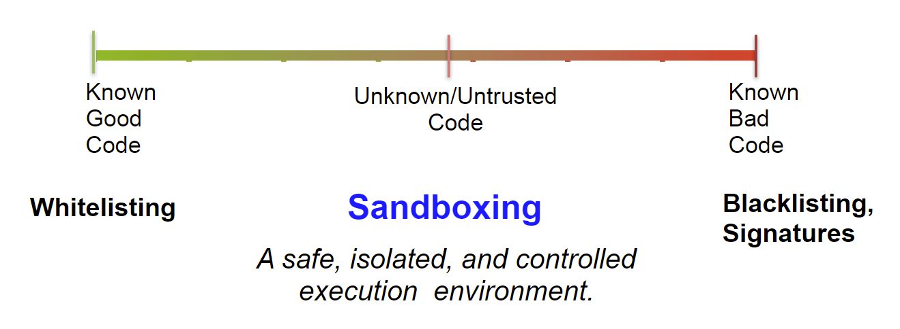
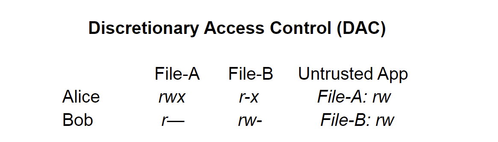
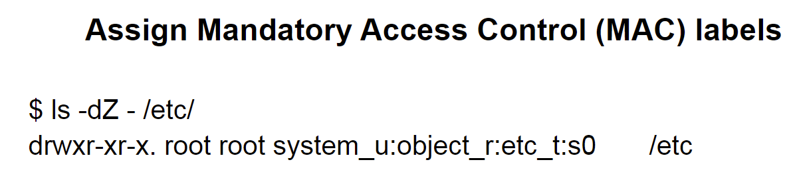
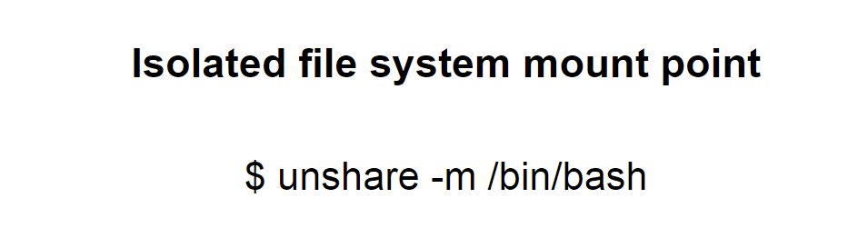
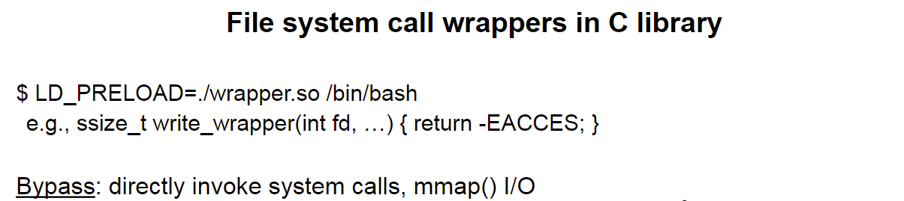
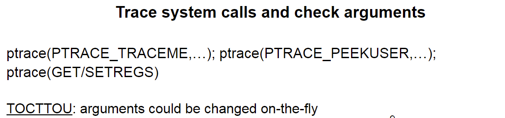
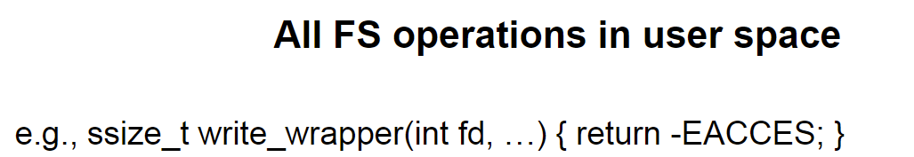
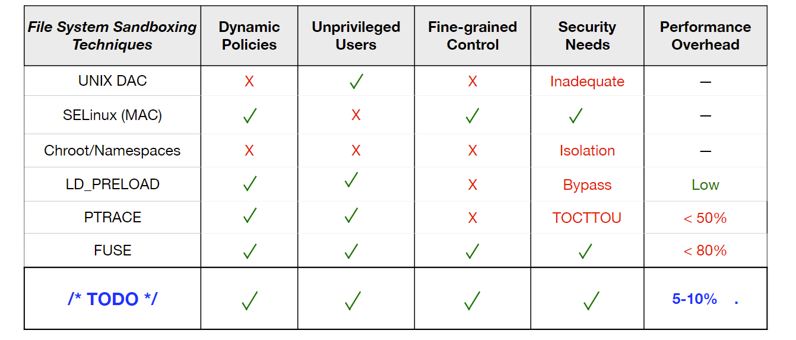
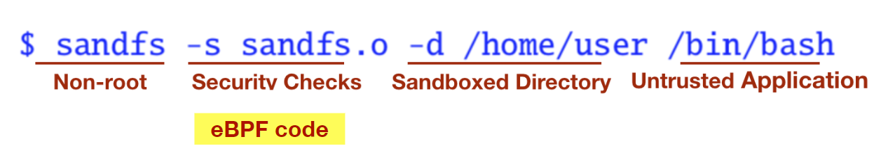
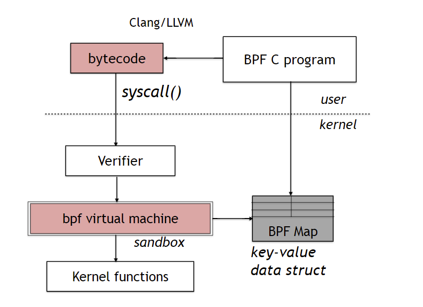

# sandfs报告

[报告原版](../../../Reference/sandfs/OSSEUSandFS.pdf)

仅补充和论文中没出现的部分。

## **1 目标**

以一种安全的方式运行不信任的第三方代码。

举例：web浏览器第三方插件、评估机器学习模型

## **2 三种类型代码和对应安全策略**

①已知的安全的代码。策略：添加白名单

②未知的不可信的代码。策略：沙盒技术

③已知的不安全的代码。策略：添加黑名单

沙盒技术是一种安全、被隔离和受控制的执行环境



## **3 文件系统和沙盒**

当执行不可信的二进制文件时，限制对敏感数据的访问.

- 强制安全策略
  例如：不允许访问~/.ssh/id_rsa*
- 遵循最小权限原则
  例如：只允许pdf阅读器打开pdf文件

## **4 已有的技术**

①DAC



②MAC



参考：MAC补充资料（请ctrl f搜索）

③chroot/namespace



参考：namespace补充资料（请ctrl f搜索）

④LD_PRELOAD



⑤ptrace



⑥FUSE



对比



## 5 sandfs

特点同论文。

使用命令解释：



## 6 eBPF

**eBPF框架**

- 拓展插件（要在内核中运行的BPF程序）使用C编写
- 然后会通过Clang和LLVM编译为字节码
- 字节码会被验证并加载到内核中
- 字节码最终在内核虚拟机中执行
- 在内核执行的字节码会和在用户态的主程序通过BPF Maps进行数据交互



**Maps使用示例**

```c
struct bpf_map_def map = {
	.type = BPF_MAP_TYPE_ARRAY,
	.key_size = sizeof(u32),
	.value_size = sizeof(u64),
	.max_entries = 1, // single element
	};

// tracepoint/syscalls/sys_enter_open
int count_open(struct syscall *args) {
    u32 key = 0;
    u64 *val = bpf_map_lookup_elem(map, &key); // key=0的val的指针
    if (val) __sync_fetch_and_add(val, 1);
}
```

## 7 其他

架构、实现、工作流程、性能评估、使用场景部分同论文
