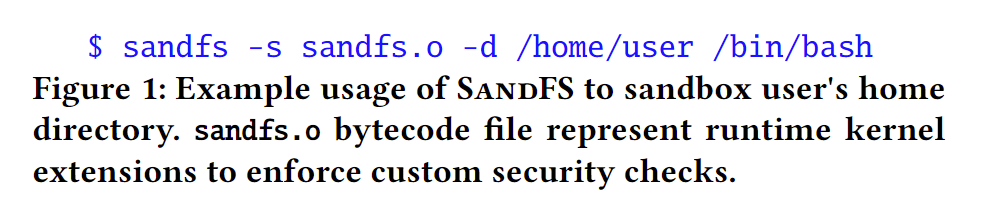
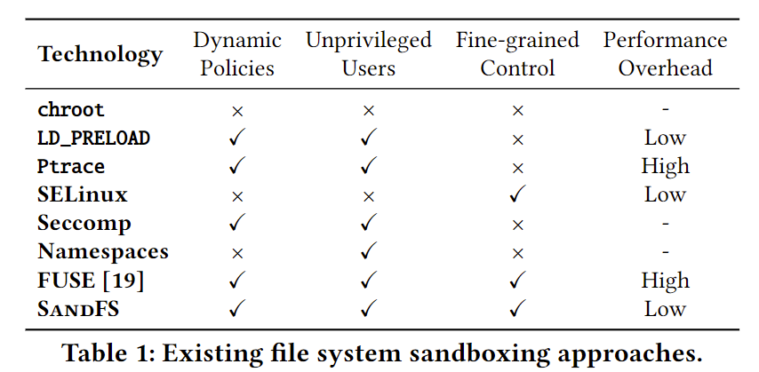
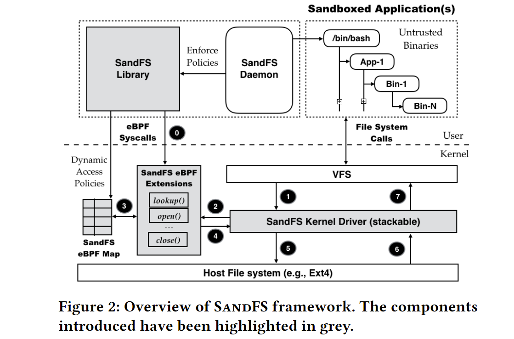
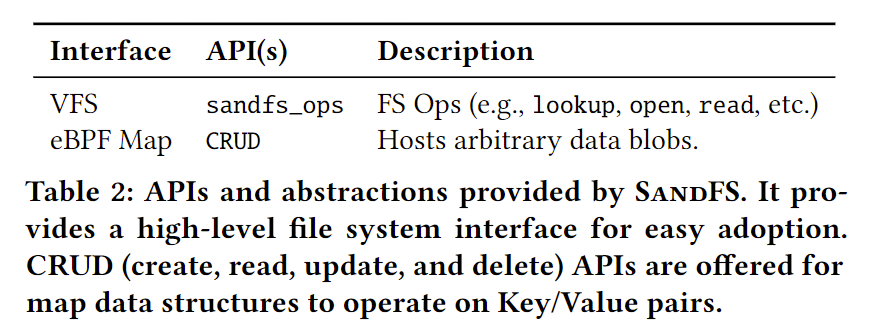
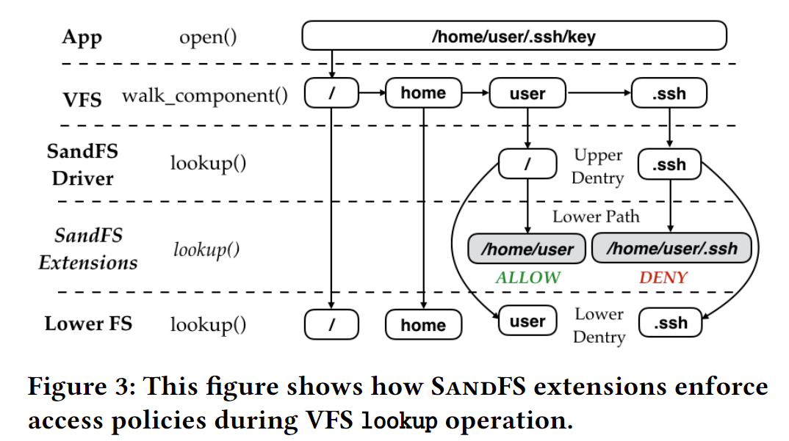
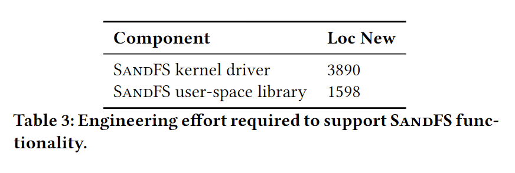
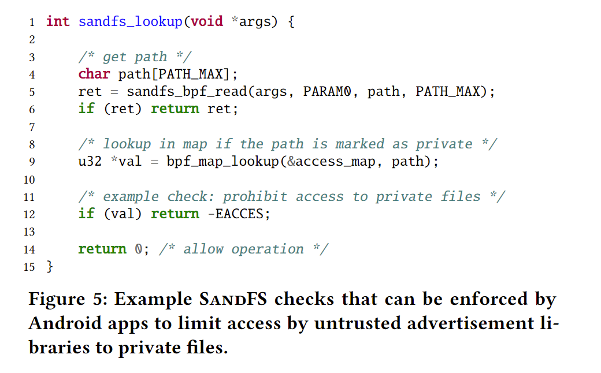
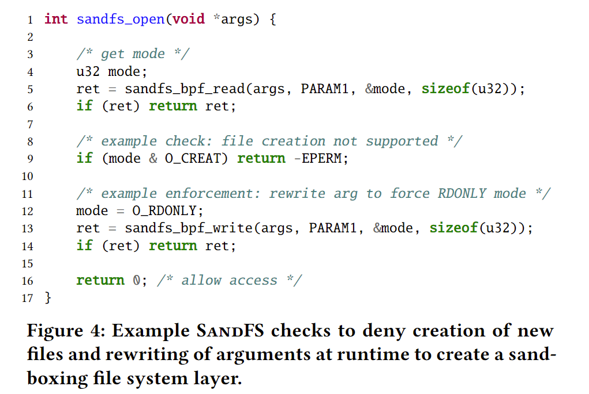
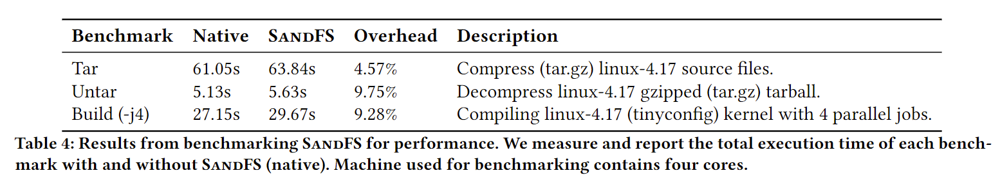

# sandfs论文

[论文原版](../../../Reference/sandfs/A Lightweight and Fine-grained File System Sandboxing Framework.pdf)

注：所有疑问用中文问号标注：？请ctrl + f搜索查找。

## Part1 介绍

**已有的方式和sandfs对比**

已有的沙盒方式：不提供细粒度、需要高级权限、高性能开销。

sandfs：细粒度、非特权用户、轻量级。

**sandfs一些特点**

sandfs可堆叠，高层执行策略，提供底层的受限视图

**现有方法的缺点**

①DAC：设置权限，基于用户标识符放行。但其仅能提供用户级粒度，无法抵制不信任的ELF，以及不信任的第三方插件。

②MAC：提供细粒度的沙盒机制。但需要特权用户，并且需要对每个ELF做分析和不同的规则制定。

③SCI：系统调用插入，依赖ptrace带来性能开销。非原子性，提供的参数没有路径操作可能性?，容易收到 TOCTTOU攻击。并非全部文件系统操作都通过系统调用，例如mmap I/O，因此无法提供细粒度访问控制支持。

**解决方案sandfs的优势**

类unix os上，sandfs克服基于SCI方式的缺点，面向非特权用户，限制了恶意elf的攻击面。

优势如下：

- 细粒度访问控制
- 低性能开销
- 高级语言定义检查规则
- 可堆叠，以达到分层保护？
- 运行时动态检查

**应用场景**

1. 运行不信任ELF（即不用检查ELF代码）时的隐私文件（如密钥）保护
2. 应用可以堆叠sandfs来以防第三方插件的危险

**概述**

1. 可拓展的内核文件系统，用户空间是可以在内核插入自定义安全检查的，这些检查作用于上层文件系统（如VFS）发出的请求
2. 补充了基于MAC（如SELinux）的沙盒机制
3. 三部分构成：①导出底层的文件系统API的内核驱动，即封装API，wrapfs，sandfs-kernel；②一个存在于用户空间、允许用户通过C语言子集来定制检查规则的library库，libsandfs；③一个内核虚拟机来运行检测规则，提供接近原始性能的访问保护，eBPF虚拟机
4. 安全功能是在一些文件系统接口上实现的（导出到应用程序的API和抽象对象），应用端只需要注册这些接口上的回调函数，就能实现安全功能

**本文贡献**

- 面向非特权用户、轻量级、细粒度的文件系统沙盒框架
- sandfs设计架构和使用模型
- sandfs的实际工作环境下的性能

## Part2 已有的方法

本部分总结其他提供安全文件系统的方法，并和sandfs对比。（实现安全文件系统的方式总的说来有三种：隔离、沙盒、用户态）

1. 隔离

   为不信任的应用创建隔离的文件系统，如chroot、namespace、虚拟化。但sandfs没有提供隔离文件系统，而是在同一文件系统环境下，限制不信任应用对共享文件的操作。sandfs对隔离技术做了补充，提供多一层保护
2. 沙盒

   （下面对比几种沙盒实现的方式：基于SCI、seccomp-bpf、Capsicum、MAC、LD_PRELOAD和sandfs的区别）

   SCI介绍参考同Part1 **现有方法的缺点** ③SCI。**基于SCI的工具**需要**拷贝内核文件系统状态**（例如需要在用户态维护一份内核中fd到文件名的映射，会带来同步问题）。但sandfs没有检查系统调用参数，以可堆叠的文件系统层设计方式，**直接对最低级的内核对象（如dentry）进行检查**，可以避免TOCTOU和不用复制文件系统状态。

   **seccomp-bpf框架**也能允许用户在运行时定义和安装他们的过滤规则，但需要**手撸BPF过滤程序**，同时**一旦安装无法卸载**。而sandfs**提供一个库libsandfs**，该库导出一些文件系统接口，使得用户可以**在这些接口上使用类C语言定制检查**，而不是受限于具体架构的系统调用。

   **secomp-bpf框架**只能**对原生的系统调用参数做检查**，不能对用户提供的参数做检查（例如只能对open传入的指针检查，而不能对指针具体内容检查），因此**仅依靠seccomp-bpf无法很好执行自定义检查规则**。MBox仅将seccomp-bpf作为辅助工具，过滤不必要的系统调用，留下待插入的少量几个，以此减少ptrace的开销。OpenBSD使用的pledge，和seccomp类似，也允许过滤掉一些预定的系统调用集。但无论pledge还是seccomp-bpf，都会面临TOCTOU的威胁。

   **Capsicum**允许对某个系统资源（例如文件描述符）做访问控制，避免了通过系统调用的局限性，**但需要修改应用程序**，（是不透明的）。但sandfs对应用程序是**透明的**。同时sandfs和Capsicum一样，开发者可以给应用程序分区，每个分区都是一个**独立沙箱**，从而实现**细粒度沙箱**？

   **Capsicum**和**MAC机制**策略（如SELinux和AppArmor）已经应用与一些商业操作系统来实现针对不可信ELF的细粒度文件系统沙盒了，但它们都需要**超级权限**。而sandfs是面向无特权用户、轻量级的文件系统沙盒框架，它补充了现有基于MAC的沙盒机制。

   **LD_PRELOAD机制**是一种**轻量级技术**，可以**重载C库函数**，拦截用户对文件系统的请求并进行自定义的检查。但这种方式，恶意ELF**很容易绕过**C库函数，直接访问原始系统调用。

## Part3 设计和架构

1. 威胁模型

   Unix DAC策略下，**某个运行的ELF继承该用户全部权限（威胁模型1）**，对该用户所在环境有完全访问权限。DAC无法保证该用户的私有数据不收恶意程序的影响。

   现在应用程序（如web浏览器），常通过第三方插件拓展功能，**这些不可信的第三方二进制文件会继承可信的主程序的权限**，**从而窃取敏感数据**。**（威胁模型2）**

   sandfs是面向无特权用户、轻量级的、类Unix上的、以限制恶意ELF攻击的文件系统沙盒框架。
2. 实现目标

   为了克服基于SCI方式的局限性，提出以下四个目标：

   **细粒度访问强制执行。** sandfs要以一种细粒度访问控制的方式对所有文件操作执行自定义安全策略。

   **可堆叠的沙盒层。** sandfs允许多个沙盒层堆叠，每个沙盒层执行独自的安全策略。

   **避免TOCTOU风险和避免文件系统状态复制。** 相对于基于SCI方式的改进之处。

   **低性能开销。**
3. 面临的挑战和解决办法

   为了完成上述目标，sandfs设计为了**可拓展的文件系统框架**。它**对于用户空间**看来是一个**文件系统**，挂载到宿主文件系统上后，可以**透明的拦截和检查**来自**其他应用且通往宿主文件系统的请求**。它的功能可以在**运行时被安全拓展**，通过**用户空间插入安全检查（插件）到内核**，来对拦截的文件系统请求执行强制自定义访问策略。虽然这允许sandfs**直接对低级的对象（如dentry）** 设置细粒度检查策略，但这带来的诸多挑战：

   **安全性（挑战1）。**sandfs在kernel的运行时部分能够用于支持自定义的安全检查。但**（安全检查）插件必须不能随意访问内存和泄露指针值到用户态**。sandfs依赖eBPF框架，通过严格限制（安全检查）插件**只能使用一些定义好的helper fuction**，以提供必须的安全保证
   **隔离性（挑战2）**。应用程序的**第三方插件可能利用其环境权限来对沙盒（程序）的数据结构**。因此sandfs**只允许主线程创建或者修改数据结构**。为了减少攻击面，sandfs通过命令空间限制文件系统的沙盒过的视图给**主进程及其子进程**（进程级别的沙盒，而不是程序级别）。
4. 总体架构

   图2介绍了sandfs架构。

   

   它包含三个核心组件：内核驱动、内核运行时虚拟机VM、一个用户态工具库。（上图灰色标出的三部分）。

   第一是**内核驱动层**。内核驱动层将自己**注册成一个文件系统**，和VFS的操作相接，并且从当一个**轻量级的、可堆叠的插入层**。这意思是当挂载在宿主文件系统上，它**既不处理IO**，**也不自己实现任何功能**，而是**直接前递/转发**来自上层（如VFS）的请求到下层（如EXT4）。

   第二个是**VM**。VM允许**非特权用户和程序**在运行时**安全的拓展内核驱动层的功能**，通过直接集成它们自定义的**检测规则（插件）**到文件系统在内核虚拟地址空间中的栈中。因此和基于SCI的方式检查用户提供的参数不一样，sandfs在**很底层的内核对象上**工作，不容易收到TOCTOU威胁。

   第三个是**用户态工具库**。用户态工具库提供了一组Unix系统**常见的文件系统API和抽象（对象）**，用户空间可以**注册一些或者全部API**，通过**C语言的子集实现安全检查**。这些检查会被**编译为VM字节码**，并**作为插件加载到内核**中，交由更靠近底层文件系统的内核驱动层**通过运行时VM来执行**。
5. eBPF

   **BPF**是一种用于包过滤的伪机器架构。而**eBPF**是BPF的拓展，加入了对64位支持，更丰富的编程结构，如call、load、store和条件跳转。eBPF是一个通用的内核运行时框架。但它目前只用在了网络和系统评测子系统上。对于上述提到的运行时VM，我们**采用了eBPF框架**。原因有多个方面：

   **高级语言的支持（方面1）。** eBPF是的代码能够用C语言的子集编写以获得更强的表达能力，同时还安全小巧。我们利用eBPF的这个特点，将文件系统常见的接口导出到用户空间，以使用高级语言做检查。最后C代码会被clang编译器编译为BPF字节码并加载到内核。

   **运行时安全（方面2）。**eBPF提供了安全的字节码执行环境。被插入的字节码会被做**静态检查**，检查**是否有死循环或者非法内存访问**。即使BPF字节码被载入了内核，**但它也不能随意访问内核内存区域**。相反，这个框架**需要一组内核helper funtions的白名单**。例如，标准的一个helper funtion bpf_get_current_uid_gid，能允许字节码获得当前进程的uid和gid。为了让eBPF适应sandfs，**我们添加了一组内核helper functions**来帮助实现可堆叠的安全功能。具体实现是，我们添加了**sandfs_bpf_read和sandfs_bpf_write**以提供支持，以让其能**读取和修改来自内核驱动层的参数**（例如sandfs_open API的读取path参数或者修改mode参数）。eBPF框架提供的这种安全保证，使得sandfs能够被非特权用户或不信任的应用使用，避免接触较大攻击面。这个检查过的代码通过JIT编译后能提供原始性能。

   **Maps结构（方面3）。** eBPF框架允许用户空间根据需要创建不透明（？）的键值对结构，称为Maps，用于记录（bookkeeping？）。Maps通过bpf_map_create系统调用来创建。一旦创建，**用户空间可以使用文件描述符来使用它们。**eBPF还提供了一组系统调用API来查找、更新和删除Maps条目。**在内核中的eBPF字节码同样可以访问这个Maps结构。**这因此**提供了一个位于内核的字节码和用户空间共享执行状态和数据的桥梁**。Maps中映射的条目**可以是任何数据类型**，取决于用户空间和eBPF字节码对数据类型的定义。
6. sandfs的API和抽象对象

   sandfs提供了一组API和对象来使得开发者简单的实现安全检查拓展，避免了复杂的细节。表2列出了API细节。

   

   第一部分是**sandfs_ops接口**。sandfs_ops接口**导出了全部VFS的API**（如用于建立inode和path映射的lookup）**来对内核抽象对象（如dentry）来做细粒度访问控制。** 值得一提，**很多API不用一定实现**。例如对元数据API施加了安全检查（open）后，用于数据读写的API（read/write）就可以为空。

   第二部分是**Map接口**。为了运行时能在用户空间配置内核（安全检查）插件和部署新的或修改原有的安全检查规则，**sandfs library采取了能装任何数据类型的eBPF HashMap的数据结构**。但是因为sandfs的目标是非特权用户和应用程序，**这个hashmap只能通过创建sandfs的线程来访问**。这个设计禁止了对map的随意访问，同时保护其不受企图禁用检查规则或者破坏sandfs状态的恶意软件的影响。sandfs库进一步抽象了底层的实现细节，**提供高级的API（CRUD）**来**创建、读取、更新和删除map条目**。
7. 工作流程

   （对照图2）

   

   step 0：在挂载sandfs之前，**用户空间需要装载包含安全检查插件的eBPF程序到内核中**，**并向sandfs内核驱动层注册它们**。这是通过**bpf_load_prog系统调用**实现的，它会调用在**内核中的BPF验证器**来对该插件的完整性做检查。检查不通过会丢弃该插件，并向用户空间报告错误。检查通过且JIT引擎开启，这些插件处理程序将会被JIT处理以生成能够执行的机器指令集代码。

   step 1：**（应用通过）上层文件系统（如VFS）向内核驱动层发出请求**。

   step 2：**每一个请求都会先被传递到对应的插件处理程序来执行强制安全策略。**

   step 3：这些处理程序**可能会引用eBPF Maps里面维护的数据**。

   step 4：然后得到**允许或拒绝这个请求**，甚至**可能按需修改一些参数**（例如修改open的mode参数），**处理程序检查的结果会返回给驱动层**。

   step 7：**拒绝的请求最终也会传递回用户空间**，并带有对应的**错误码**。

   step 5：**如果允许的请求则会传递/转发到底层文件系统**。值得指出，sandfs只是在底层文件系统和用户空间注册的安全检查插件之间扮演了轻量级的插入层。因为如此，它不会执行任何的IO操作或者企图自己处理这些请求。

   step 6：**底层文件系统返回请求的操作结果**。

   step 7：**结果最后传递回用户空间**。

   为了理解sandfs如何在内核强制执行用户定义的安全策略同时避免TOCTTOU的威胁，我们将以lookup操作举例，如图3。

   

   （对照图3）

   lookup操作是VFS内部用于**建立inode和path映射**的最常见的文件系统操作。在执行一些系统调用（如mkdir，open）时，在RCU锁下（？）为每个路径部分（解析）执行一次。

   当sandfs被**挂载在/home/usr路径**来沙盒用户的工作环境，（该路径下）①每个lookup操作都会**先传递到sandfs内核驱动层**的lookup接口实现。②内核驱动层的lookup函数**首先会调用底层文件系统**，以获得发出请求的部分（如.ssh）的**底层dentry和底层inode**。③还会调用dentry_path()来**获得完整的路径**，这个过程中符号链接、特殊名字（如.或..或/）都会被解析为完整的路径。④最后完整的路径会**作为一个参数传递给sandfs_lookup来执行安全检查**。⑤如果检查插件成功返回允许，sandfs驱动层才会**创建一个该路径部分的一个sandfs inode并将其返回给VFS**。

   现有基于SCI的文件系统沙盒方式，企图在系统调用边界，即用户提供的参数（如path）还没有被解析为对应的底层对象时，就进行强制安全检查策略。sandfs则不同，sandfs安全检查插件是直接在VFS的底层被调用的，并直接在底层文件系统的dentry和path部分进行工作，这能避免TOCTTOU攻击（？）

## Part4 实现

1. 已经在**Linux 4.10版本**上实现了。
2. sandfs驱动依赖于wrapfs实现，**wrapfs是一个可堆叠，不实现任何操作的文件系统**。这也就是说这个文件系统的处理函数不会执行任何IO操作，它简单的调用所依赖的底层文件系统的处理函数。
3. 作为一个可堆叠的文件系统，**恶意软件可以通过超多次堆叠sandfs文件系统，来达到内核栈溢出**。为了避免这种攻击，**我们限制了同一个挂载点下sandfs可以堆叠的次数**。具体实现是，我们依赖于**超级块中的一个域s_stack_depth**来记录当前sandfs堆叠的层数，并检查它是否超过FILESYSTEM_MAX_STACK_DEPTH（定为2）。
4. 表3展示了sandfs的代码量。

## Part5 使用示例

下面展示三个sandfs比现有方法更优的实际应用场景的示例：

1. 隐藏私人的用户数据

   许多应用程序通常要访问home目录，但与此同时，一些恶意软件可以**窃取用户的隐私数据**，例如HOME/.ssh的密钥。

   在sandfs框架下，**非特权用户在执行非信任的应用时，可以构建一个沙盒来保护隐私文件**。例如，通过在HOME目录下挂载sandfs，用户可以强制自定义检查，通过在工作区隐藏隐私的目录和文件，执行不可信二进制文件时只允许访问绝对必要的少数文件。
2. 设计安全的应用程序

   需要借助**不可信的第三方插件**来拓展功能的应用程序可以借助sandfs框架来保护它们的隐私数据。例如web浏览器通常将第三方插件**作为一个独立的进程运行以达到内存隔离**。web浏览器可以使用sandfs定义和强制细粒度的自定义安全访问控制，来保护敏感数据不受恶意第三方插件影响。然而这些插件通常会长久存储（在计算机上）（？），浏览器可以使用eBPF Maps来限制不信任插件对隐私数据的访问，但为这些插件对它们在运行时创建的文件提供完全访问。图5是使用eBPF Maps的示例。

   
3. 硬容器

   容器封装了很多相互依赖的应用和它们的库来实现所需要的功能。每个应用程序都提出自己的一组安全需求。sandfs可以用于硬容器，通过为每个应用堆叠sandfs不同的层。图4展示了一个创建新文件的请求如何被拒绝。

   

## Part6 评估

1. 为了测试sandfs性能，我们在sandfs的沙盒环境下运行了在Mbox和Apiary中使用过的相同的现实场景下的工作负载，并和它同原始性能做了对比。
2. 测试环境包括：Ubuntu 16.04.3、IntelQuad-Core i5-3550 3.3GHz、16GB RAM、EXT4、Samsung 850 EVO 250GB SSD。
3. 结果如表4所示，sandfs带来的开销小于10%。

   

## Part7 总结

我们提出了一个轻量级的沙盒文件系统框架叫做sandfs，它被设计为可以为非特权用户和应用提供强制安全检查，以保护隐私数据不受不可信或者恶意的二进制文件影响的一个可堆叠文件系统。

这个文件系统带来的性能开销不超过10%，源码可以在github上找到。
