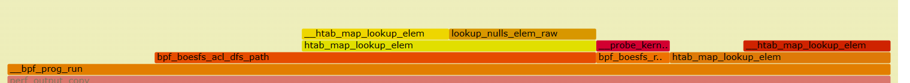
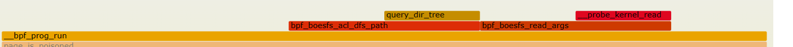

## 编译&安装

- perf 编译&安装
    ```c
    cd /usr/src/linux-4.11.12/tools/perf
    make
    make install
    ```
- 然后运行perf即可。
- 如果报出E: linux-perf-4.11 is not installed，那么perf可能被安装在了~/bin下

- 如果上述不可以的话，尝试自己解决一下，我也忘了我当时咋解决的；或者直接用我的虚拟机镜像，已经发到群里。

## 使用

- 简单使用： 
    - perf record : 运行命令并保存profile到perf.data
    - perf report : 从perf.data中读取并显示profile

- 分析boesfs：
    - 自己写个脚本然后mount boesfs，进行读写；
    - 在另一个终端进入~/bin目录，然后sudo ./perf record -g -p pid.
    - 脚本运行结束时，perf record会自己结束；也可以自己ctrl+c中断perf record. 结束后会在当前目录下生成perf.data
    - 然后./perf report即可对perf.data进行分析.
    - 推荐使用report命令：sudo ./perf report --show-total-period --children
        - --children是为了让
        ```bash
            When the --children option is enabled, the self overhead values of child functions (i.e. foo and bar) are added to the
            parents to calculate the children overhead. In this case the report could be displayed as:

                .ft C
                Children      Self  Symbol
                ........  ........  ....................
                    100.00%     0.00%  __libc_start_main
                            |
                            --- __libc_start_main

                    100.00%     0.00%  main
                            |
                            --- main
                                __libc_start_main

                    100.00%    40.00%  bar
                            |
                            --- bar
                                main
                                __libc_start_main

                    60.00%    60.00%  foo
                            |
                            --- foo
                                bar
                                main
                                __libc_start_main
                .ft

            In the above output, the self overhead of foo (60%) was add to the children overhead of bar, main and __libc_start_main.
            Likewise, the self overhead of bar (40%) was added to the children overhead of main and \_\_libc_start_main.

            So \_\_libc_start_main and main are shown first since they have same (100%) children overhead (even though they have zero
            self overhead) and they are the parents of foo and bar.

            Since v3.16 the children overhead is shown by default and the output is sorted by its values. The children overhead is
            disabled by specifying --no-children option on the command line or by adding report.children = false or top.children = false
            in the perf config file.
        ```


- **在perf report的时候可能会遇到的问题：**
    - no symbols found in /bin/cat, maybe install a debug package?
        - 原因：/bin/cat 编译的时候没带 -g（因为在脚本里使用了cat）。
        - 解决：这我们没法解决也不用解决。当然也不影响我们对内核模块的分析
    - report出来的表中没有boesfs的函数符号，并且report时报出：[boesfs] with build id b0a75a79559fc8d484fe291a5976cc9be76e4d80 not found, continuing without symbol
        - 原因：编译的时候没加-g
        - 解决：
            - kernel module编译的时候带上 KBUILD_CFLAGS_MODULE += -g
            - cp boesfs.ko 到 /lib/modules/`name -r`/extra
            - 重新perf report


- 生成火焰图：
    ```c
    $ git clone https://github.com/brendangregg/FlameGraph
    $ cd FlameGraph
    $ perf script -i ./perf.data | ./stackcollapse-perf.pl --all | ./flamegraph.pl > show.svg
    ```

- 初赛：递归查询占据字节码时间占比较大
    选取一次字节码运行截图
    

- 决赛：递归查询时间占据字节码时间占比减少
    选取一次字节码运行截图
    

- **我不知道boesfs沙盒层的时间该怎么算，因为我不知道哪些函数是boesfs的函数，我也不知道从哪个函数开始就是原生的函数的时间，大家谁懂或者有时间的话算一下吧。**
