# sandfs

## sandfs概述

SandFS是一个可扩展的文件系统沙盒框架，从内核深处调用。
优势：

> 对内核对象的细粒度访问控制
> 低性能开销
> 高级语言支持定义检测
> 可堆叠（分层）保护
> 强制动态运行

三个核心组件：

> 1）将低级文件系统API导出到应用程序的可堆叠文件系统内核驱动程序
> 2）允许应用程序使用C语言的子集定义自定义安全检查的用户空间帮助程序库
> 3）内核内虚拟机，其在运行时安全地执行内核中的检查以提供接近本机性能的访问保护。

sandfs通过使用ebpf技术来实现高级语言支持和运行环境安全，发布的源码中，内核驱动程序是Linux4.10以wrapfs作为堆叠的文件系统，共3890行代码，用户空间帮助程序库共1598行代码，均对ebpf编程的要求较高
sandfs结构
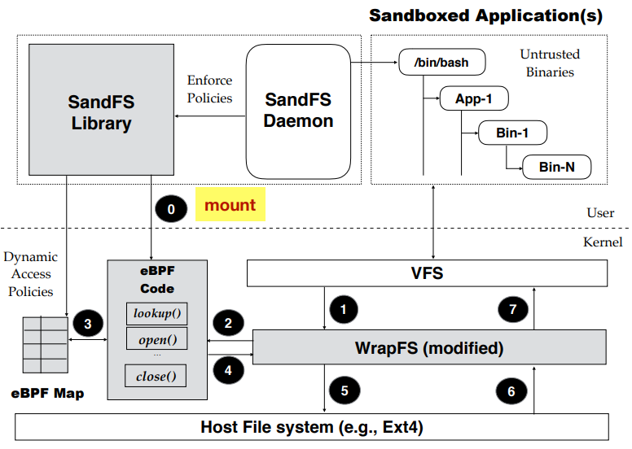

图中的[SandFS Library](https://github.com/sandfs/LibSandFS)
图中的[Kernel Driver(内核中的部分)](https://github.com/sandfs/SandFS-Kernel)

## sandfs论文分析/自译

参考[sandfs论文阅读](./paper/sandfs论文阅读.md)

## sandfs报告分析

参考[sandfs报告阅读](./paper/sandfs报告阅读.md)

## sandfs项目的编译安装

**请使用32位（推荐i386）ubuntu16.04安装**

安装完毕的环境[SandFS环境虚拟机](https://www.aliyundrive.com/s/cJF6oYoSo82)

### step0 合理换源

1.修改/etc/apt/sources.list如下

####**16.04**

```shell
deb https://mirrors.aliyun.com/ubuntu/ xenial main
deb-src https://mirrors.aliyun.com/ubuntu/ xenial main

deb https://mirrors.aliyun.com/ubuntu/ xenial-updates main
deb-src https://mirrors.aliyun.com/ubuntu/ xenial-updates main

deb https://mirrors.aliyun.com/ubuntu/ xenial universe
deb-src https://mirrors.aliyun.com/ubuntu/ xenial universe
deb https://mirrors.aliyun.com/ubuntu/ xenial-updates universe
deb-src https://mirrors.aliyun.com/ubuntu/ xenial-updates universe

deb https://mirrors.aliyun.com/ubuntu/ xenial-security main
deb-src https://mirrors.aliyun.com/ubuntu/ xenial-security main
deb https://mirrors.aliyun.com/ubuntu/ xenial-security universe
deb-src https://mirrors.aliyun.com/ubuntu/ xenial-security universe
```

2.更新

```shell
sudo apt-get update
```

> 注：建议开始下面步骤之前先安装openssh-server，然后用MobaXterm，方便文件的上传和命令的复制粘贴

### step1 安装相关依赖

ncurses5（menuconfig依赖）

```shell
sudo apt-get install libncurses5-dev
```

确保有gcc、make和openssl等，没有请使用

```shell
sudo apt install gcc-5 make libssl-dev build-essential bc

```

若已有gcc且版本大于等于8，参考[这篇](https://blog.csdn.net/lixindayup/article/details/123693533)来修改

#### 关于16.04升级至4.10.0-rc8

在[该网站](https://kernel.ubuntu.com/~kernel-ppa/mainline/v4.10-rc8/)下载对应架构的全部文件并传入虚拟机中，并放入同一个文件夹
进入该目录下，运行命令：

```shell
sudo dpkg -i *.deb
sudo update-grub
```

然后重启即可

### step2 下载Kernel源码、配置并编译

```shell
sudo apt install git
git clone https://gitee.com/yang-darong/sandfs-img.git
cd ~/sandfs-img/SandFS-Kernel
cp /boot/config-$(uname -r) .config
make menuconfig # 注意File systems中勾上Sandfs
# sandfs选项的路径位于：->File system ->Miscellaneous filesystems -> Sandfs sandboxing file system (EXPERIMENTAL) (NEW)。
# 然后exit
```

```shell
make -j4    #至此，到这步已经没有问题
```

编译完后再运行一次该命令，得到如下画面说明成功
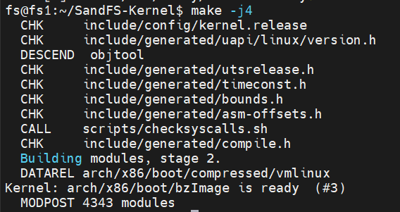

然后执行命令安装

```shell
sudo make modules_install -j4
make headers_install
sudo make install -j4
sudo update-initramfs -c -k 4.10.0-rc8
sudo update-grub
```

> 注：如果执行命令出现的版本号最高并非4.10.0-rc8，请参考[Linux 内核切换 grub (Ubuntu)](https://blog.csdn.net/Losk_0/article/details/87928072)来启动

重启虚拟机即可

### step3 下载libSandFS源码、编译并验证

#### 安装依赖

```shell
sudo apt install libcap-dev
sudo apt install libelf-dev
sudo apt install llvm
sudo apt install clang
```

#### 下载源码并编译

```shell
cd ~/sandfs-img/LibSandFS
cp ~/sandfs-img/SandFS-Kernel/tools/perf/perf-sys.h include/perf-sys.h
sudo cp ~/sandfs-img/SandFS-Kernel/include/linux/compiler.h /usr/include/linux/compiler.h
sudo mkdir /usr/include/asm
sudo cp ~/sandfs-img/SandFS-Kernel/include/asm-generic/barrier.h /usr/include/asm/barrier.h
sudo cp ~/sandfs-img/SandFS-Kernel/tools/lib/bpf/bpf.h /usr/include/linux/bpf.h
LLC=llc CLANG=clang make
```

运行结果
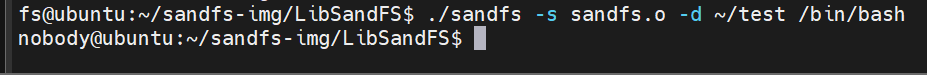

### 报错处理参考资料

1.遇到依赖包的问题导致没成功，记得在/etc/apt/sources.list加上下面这行
   [参考资料：Linux下libncurses5-dev安装报错解决方法_凍結-有你的世界的博客-CSDN博客](https://blog.csdn.net/weixin_42721128/article/details/124207877)

2.编译内核参考[链接](https://linuxhint.com/compile-and-install-kernel-ubuntu/)

3.[关于fatal error: sys/capability.h: No such file or directory](https://blog.csdn.net/songyuequan/article/details/101527281)

4.[fatal error: libelf.h: No such file or directory 解决方案](https://blog.csdn.net/qq_42000667/article/details/125205105)

5.[编译运行Linux内核源码中的eBPF示例代码](https://cloudnative.to/blog/compile-bpf-examples/)

## libSandFS

### 主要功能

#### src目录

实现了任一用户都能执行的命令SandFS，使用方法如下：

```sandfs
#eg:
./sandfs -d /root/sandfs -s sandfs.o /bin/bash
#此命令将整个文件系统挂载到/root/sandfs下，并以sandfs.o中bpf规则作为沙箱层，并运行bash
```

-d 后的参数为挂载点
-s 后的参数为bpf二级制代码（elf文件）路径
-v 为打印运行状态信息

#### bpf目录

用户自定义的规则文件
识别到read，write，lookup操作时使用bpf_sandfs_read_args()函数检测路径

### 实现逻辑

#### bpf目录

实现了函数处理检查，在lookup，read和write中使用了bpf_sandfs_read_args()对路径参数进行了检查
bpf_sandfs_read_args()对应sandfs-kernel中bpf.c中的定义的bpf帮助函数
此外struct sandfs_args定义位于sandfs-kernel的include目录中的sandfs.h
具体分析在分析完bpf.c后再完善

#### src目录

ebpf.c文件实现了将bpf二进制代码通过bpf系统调用，加载到内核中（ebpf_init()）
通过使用了load_bpf_file函数和prod_fd、map_fd两个全局变量
除此之外，还写了加载失败处理（ebpf_fini()）和对一些bpf函数进行了封装：
ebpf_ctrl_update()：更新文件系统操作对应的bpf检测代码
ebpf_ctrl_delete()：删除文件系统操作对应的bpf检测代码ebpf_data_next
ebpf_data_next()：获取字典中下一个数据对应的索引
ebpf_data_lookup()：根据索引在字典中查找数据
ebpf_data_update()：根据索引在字典中更新数据
ebpf_data_delete()：根据索引在字典中删除数据

utils.c文件中均为工具函数，包括:
修改进程的uid和gid（setgroups_control()、update_map()、update_uid_map()、update_gid_map()）
重置capability（reset_caps(void)）
打印信息（display_creds_and_caps()，print_mount_points()，stats()）

main.c文件实现命令的主逻辑
主逻辑包括：
1）检测参数
2）使用ebpf_init()加载ebpf程序给内核
3）创建新的mount namespace和user namespace
4）用mount()将该用户的根目录挂载点转换为从站挂载点
5）将命令中地址所有内容再次挂载到挂载点，但从该文件系统执行程序时，不会设置进程的uid，gid和文件的capability权限，也不允许访问此文件系统上的设备（特殊文件）
6）使用clone()创建该子进程
6.5）这是它注释掉的部分，将子进程的uid和gid映射为特权用户（失败了所以注释了）
7）重置子进程capability权限
8）子进程执行命令（由于7，则所有命令无capability权限）

#### include目录

utils.h文件中仅声明了utils.c中的函数，不再赘述

ebpf.h文件中除了声明ebpf.c中的函数，还定义了3个结构体：
struct ebpf_context：记录bpf程序和所用字典的文件描述符
struct ebpf_ctrl_key：只有一个变量，文件操作类型
struct ebpf_handler：只有一个变量，bpf的文件描述符

### 相关补充

#### load_bpf_file()

其一共做了3个工作：

> 1)解析map section，并通过bpf系统调用创建map
> 2)解析elf relocation sections。将其作用的重定向段中的insn的imm存储着map的fd，并将该insn标记为BPF_PSEUDO_MAP_FD。
> 3)通过bpf系统调用，加载eBPF程序

[bpf的加载流程分析](https://blog.csdn.net/sinat_38816924/article/details/117300530)

#### prod_fd[]、map_fd[]

它们都是定义在bpf_load.c的全局变量：prog_fd是一个数组，在加载内核空间BPF程序时，一旦fd生成后，就添加到这个数组中去；map_fd也是一个数组，一旦完成创建BPF Map系统调用生成fd后，同样会添加到这个数组中去

也就是说，在执行完load_bpf_file()后，两个数组都不为空，因此用来检测是否加载完

#### clone()

用于创造一个新的namespace
未完全理解，先放个链接
[Linux的Clone函数](https://www.ngui.cc/el/893270.html?action=onClick)

#### Linux capability机制

同样未理解，放两个链接
[介绍-Linux capability机制](https://blog.csdn.net/ty3219/article/details/123303114)
[Linux Capabilities机制](https://blog.csdn.net/qq_34231329/article/details/125522429)

## SandFS-Kernel

#### sandfs-kernel和wrapfs对比（待补充）

| 文件     | 行数                  | 对应函数                                                  |
| -------- | --------------------- | --------------------------------------------------------- |
| bpf.c    | 1-423                 | 很多                                                      |
| dentry.c | 25-55                 | sandfs_d_revalidate                                       |
| file.c   | 20-50、69-99、114-164 | sandfs_read、sandfs_write、sandfs_read_dirent等但没用上？ |
| inode.c  | 一致                  | 无                                                        |
| lookup.c | 256-265               | __sandfs_lookup                                           |
| main.c   | 18-83、106-121        | 写了一些工具函数、sandfs_read_super                       |
| mmap.c   | 一致                  | 无                                                        |
| super.c  | 一致                  | 无                                                        |
| sandfs.h | 一致                  | 无                                                        |

分析：sandfs-kernel在wrapfs的基础上，添加了bpf.c文件（423行），并修改dentry.c、file.c、lookup.c和main.c四个文件的sandfs_read、sandfs_write、__sandfs_lookup和sandfs_read_super四个函数（189行），总计612行。仍有很多的VFS函数没有修改，不知道是否能够对其他VFS函数进行完善。

#### sandfs-kernel代码分析

##### fs/sandfs/file.c

sandfs_read和sandfs_write实现逻辑类似。下面以sandfs_write为例，分析其实现内容。

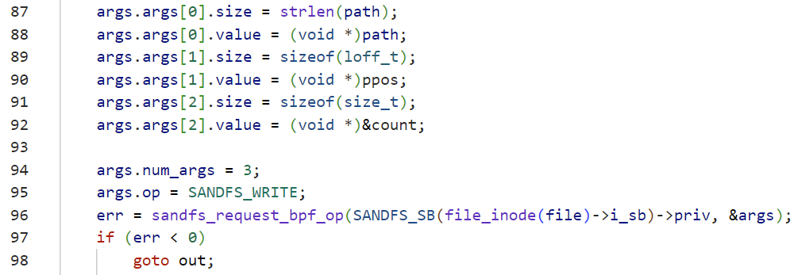

sandfs_write实现思路：

①获取vfs函数的参数。获取write的全部参数信息到struct sandfs_args args结构体中，并标记参数类型是SANDFS_WRITE。

②参数检查。将参数传入bpf程序sandfs_request_bpf_op做规则检查，这里建立和bpf的桥梁。

③检查通过则放行，否则会返回报错。

sandfs_read类似。

##### fs/sandfs/lookup.c

sandfs_lookup则是对待查找的dentry的路径名path做了采集。思路同上。

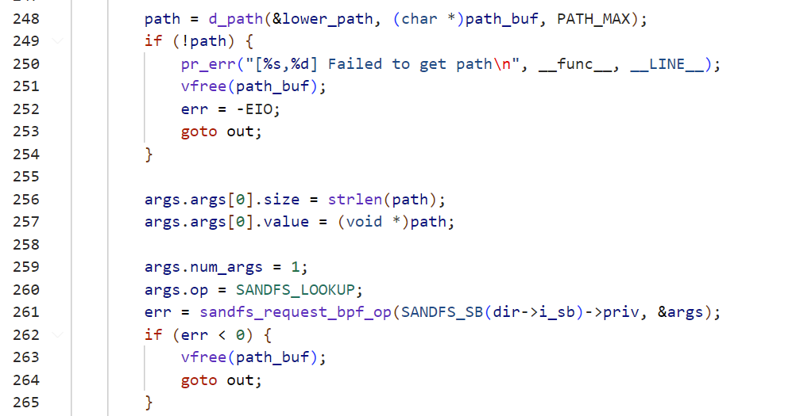

##### kernel/bpf/syscall.c


此处的作用是使得sandfs类型的bpf程序，让非特权权限的用户也可以调用。

参考：

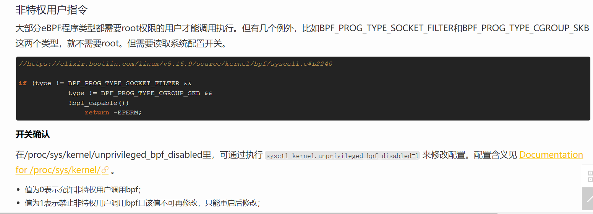

[参考资料：Linux中基于eBPF的恶意利用与检测机制 - 美团技术团队 (meituan.com)](https://tech.meituan.com/2022/04/07/how-to-detect-bad-ebpf-used-in-linux.html)


## sandfs性能测试

采用的测试方法同sandfs作者的论文：基于压缩、解压、编译内核源码三种测试方式，测试系统负载和文件系统的性能，对比没有sandfs和有sandfs下的环境。

本次测试复现基于以下基本环境：ubuntu16.04、内核4.10-rc8、处理器2个，每个1核、内存4G。分别测试有sandfs和无sandfs下的性能。

测试脚本见：

[perfomance_test.py](../../../Code/test/performance_test.py)

测试结果如下：

①native

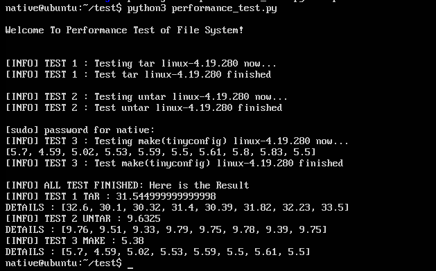

②有sandfs

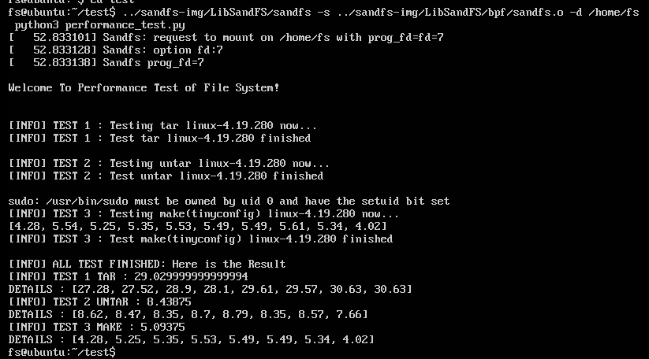

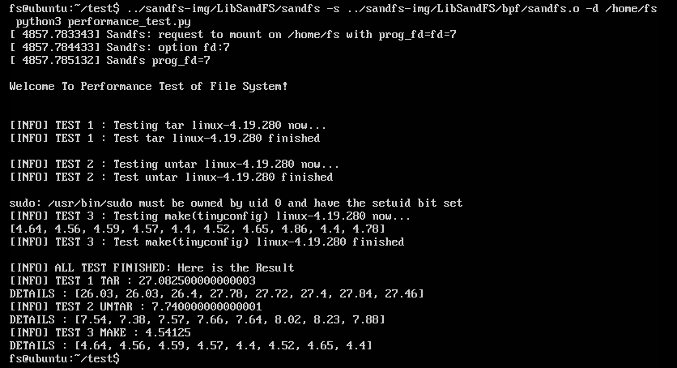

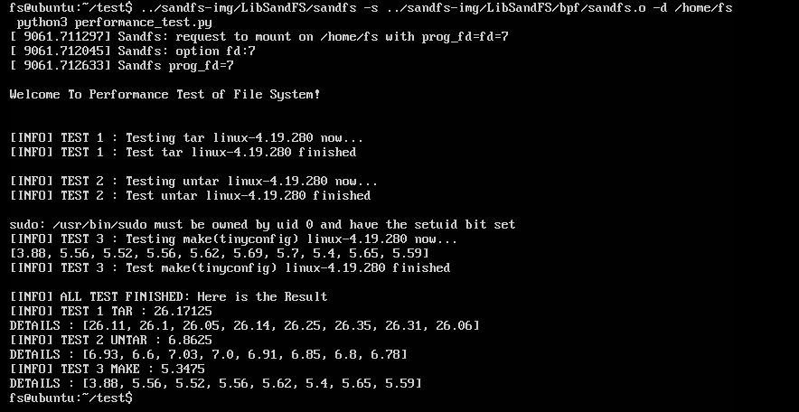

③nosandfs

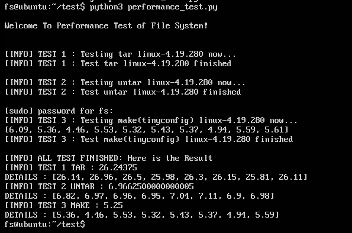

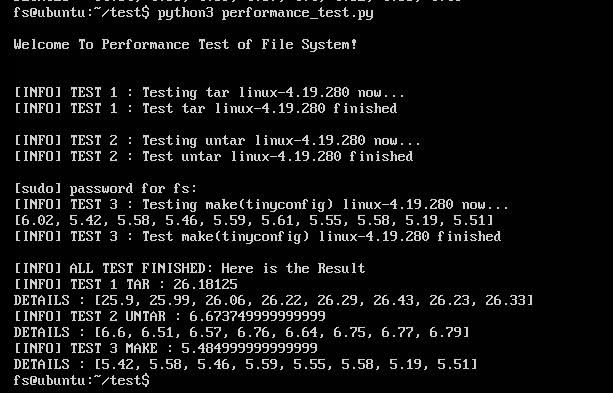

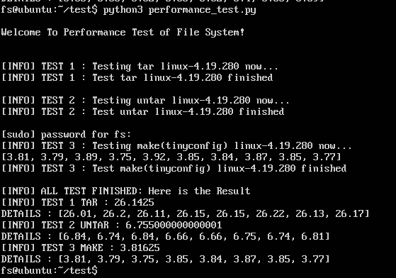

总结如下表格（单位:s）：

| 环境       | tar    | untar | make  |
| ---------- | ------ | ----- | ----- |
| native     | 31.545 | 9.633 | 5.38  |
| sandfs 1   | 29.030 | 8.439 | 5.094 |
| nosandfs 1 | 26.244 | 6.966 | 5.250 |
| sandfs 2   | 27.083 | 7.740 | 4.541 |
| nosandfs 2 | 26.181 | 6.674 | 5.485 |
| sandfs 3   | 26.171 | 6.863 | 5.348 |
| nosandfs 3 | 26.143 | 6.755 | 3.816 |

关注到几个点：

①native环境下的性能明显低于另一台机器，暂时原因未知，也许是测试环境的差异。

②sandfs和nosandfs的对比，tar和untar的两种测试，均能体现sandfs的开销。但make的测试比较反常。

## Sandfs项目存在的问题

sandfs提供的ebpf和内核文件系统结合的思路和架构特别有用，且比较简单直白。简述为：封装VFS接口（内核文件系统可堆叠层）并插入hook判断点，触发eBPF字节码执行规则判断（用户态载入），deny拒绝/allow允许往底层走。理论上，由于基于内核文件系统，其能实现原始性能。

但我们认为，它也存在如下问题：

* **sandfs-kernel已实现内容特别简陋，仅实现了3个vfs函数接口，无法支持完善自定义检查**

  仅实现lookup、read、write，这使得sandfs其实接近于不可用。若要使其真正得以运用来自定义安全检查策略，需要对sandfs-kernel提供的API进行拓展。

  考虑应该至少支持如下函数接口：

  read、write、lookup、open、link、unlink、symlink、readlink、mkdir、rmdir、create、mknod、rename、link、setattr、getattr、llseek、iterate、d_revalidate、d_release、put_super、statfs、remountfs
  
* **libsandfs只对lookup接口进行封装，并且封装混乱，无法支持自定义检查**

  libsandfs中的main只创建了一个Map，这是因为它只想对一个lookup接口封装，实现特别简单。用户如果想对read、write来写自定义控制规则，需要重构整个libsandfs，这需要很大的代码量并且需要很扎实的eBPF功底。更别说要想使用sandfs-kernel不支持的函数接口来做自定义检查。此外它基于的libbpf很不完善。
  
* **要运行某个untrust程序前，一次确定好全部规则，这样也使得其所用的eBPF Maps名存实亡**

  sandfs运行每次某个程序后，在运行过程中，无法再动态修改关于规则任何东西。sandfs想要利用eBPF的Maps来从用户态向位于内核态的字节码传递数据，然而这是一次写死的，Maps是静态确定的，完全可以直接把列表名单写到字节码文件中，而不用Maps。因为写死的值，一旦想修改，需要修改LibSandFS的main函数，并且重新编译整个LibSandFS，然后重新运行整个进程。

  不成熟的想法：

  Welcome to boesfs-envrionment
  1.load check rules. # 加载规则

  2.reload check rules. # 重新加载规则
  3.run untrusted elf. # 运行某个二进制文件（输入文件名，可重复运行，后台计算，FaaS）
  4.load allow/deny file list. # 加载文件列表
  5.reload allow/deny file list. # 重新加载文件列表
  6.dump result. # 将函数运算的结果导出
  
* **缺乏自定义访问控制验证和测试数据的支撑，更没有结合实际应用场景，仅简单测试了性能**

  sandfs实际上并不能提供很好的自定义访问控制，因此它在自定义访问控制的测试和验证上几乎没有下文章。但其实上，它也近乎不可用。此外，他论文中描述了3种可应用的场景，但由于sandfs没有提供很好的自定义访问控制，在实际应用场景的结合下更是没有或者说无法实现的。

  如果需要改进，我们需要在完善其其定义访问控制的基础上，验证其访问控制的能力，并结合具体的场景（如题目的FaaS）进行测试验证。
  
* **对内核原生源码进行了很大幅度的改动，这让sandfs的落地运用难上加难**

  首先，sandfs整个驱动层写死在了内核，不支持动态插入模块，这带来约4000行的代码内核源码修改。此外sandfs为了方便，如自定义一些无关紧要的helper function，添加了一些本可以不用添加在内核的宏在内核中，带来了源码的大量修改。源码越大幅度的修改，带来的是运用于实际场景可能性的降低，和系统可靠性的降低。

  我们的一个出发点是尽可能小的改动原生内核源码，更多的以一种内核模块动态载入的方式，支持boesfs模块的动态插入或删除，实现更灵活、更可靠、运用于实际场景可能性更大的沙盒文件系统。

* **具体的一些问题**

  **1. sandfs最多运行4次，第5次就会error**

  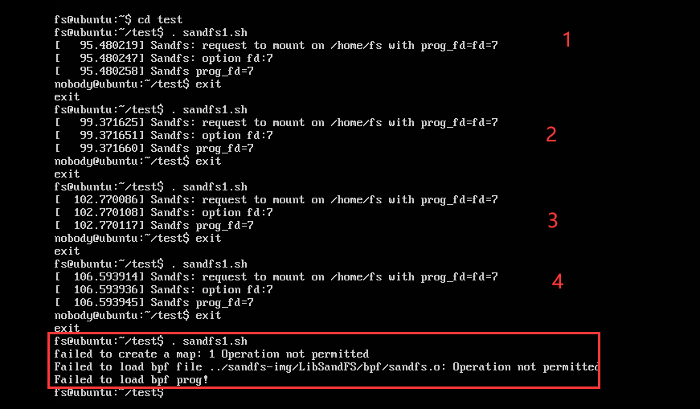

  **2. sandfs一定条件下的隐藏文件功能时失效，原因暂不明，这个条件有待分析**

  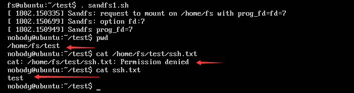

  从下图看起来需要切换一次文件夹，才能生效。

  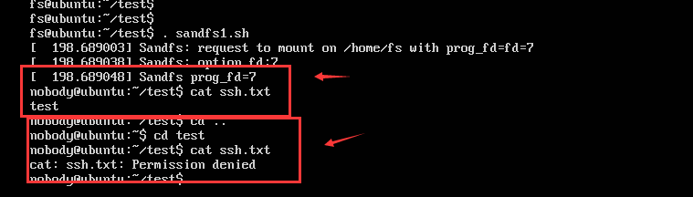

**3. sandfs下应用程序有时不能正常执行功能，原因暂不明**

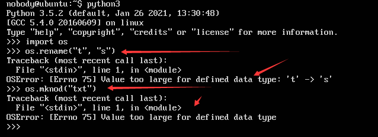

## 补充资料

1 MAC补充资料：

MAC安全上下文由4部分构成：身份标识(user)：角色(role)：类型(type) : 级别(level)。

①身份标识(User):
system_u：系统服务进程/系统服务创建的文件
unconfined_u ：不受管制进程/文件

②角色(Role)：
object_r：文件资源
system_r：系统服务进程

③类型(Type):
默认targeted中，主要对安全上下文的类型进行匹配。
对于主体，它的类型称为domain（域）。
对于客体，它的类型称为Type（类型）。
只有domain和Type搭配，主体才可以对客体进行访问。

④级别(Level):
仅在MLS策略下生效，默认为S0。

MAC targeted策略下，主客体间是否可以进行读写，主要在于Type的类型是否匹配。

[ SELinux MAC安全机制简介_林多的博客-CSDN博客](https://blog.csdn.net/zxc024000/article/details/88389657)

2 namespace补充资料

[user_namespace介绍](https://www.onitroad.com/jc/linux/man-pages/linux/man7/user_namespaces.7.html)
[unshare命令介绍](https://www.onitroad.com/jc/linux/man-pages/linux/man2/unshare.2.html)

[perfomance_test.py]: ../../../../Code/test/perfomance_test.py
