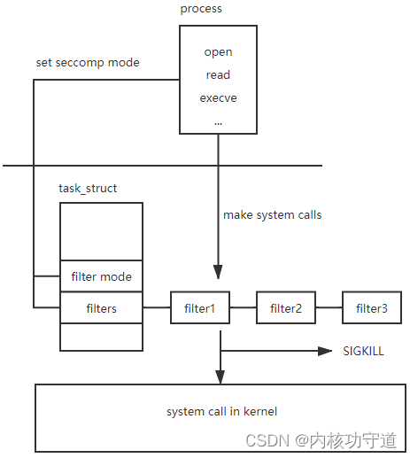
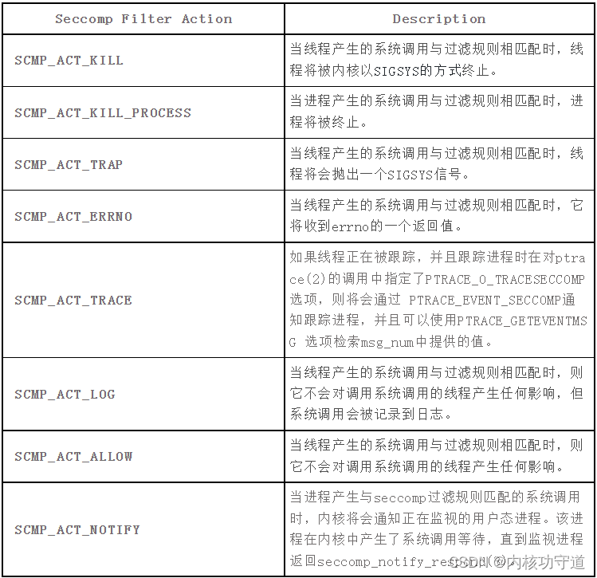
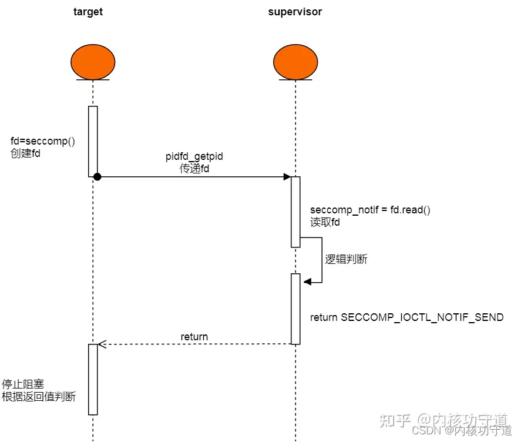
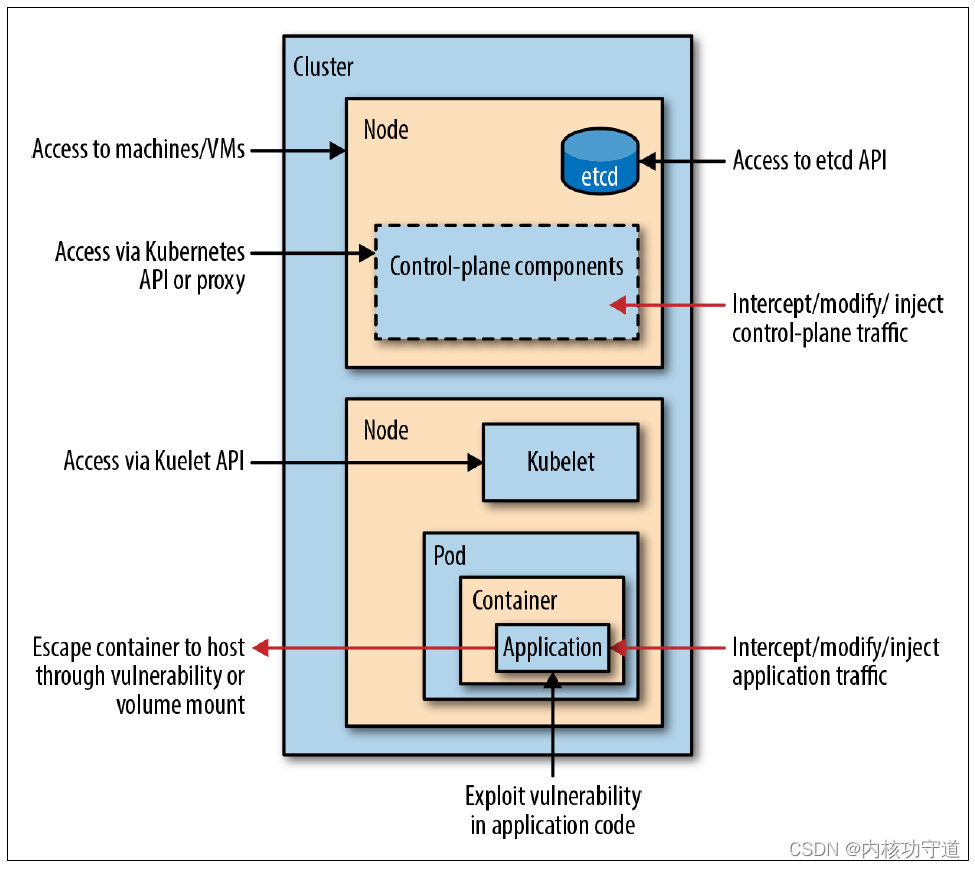
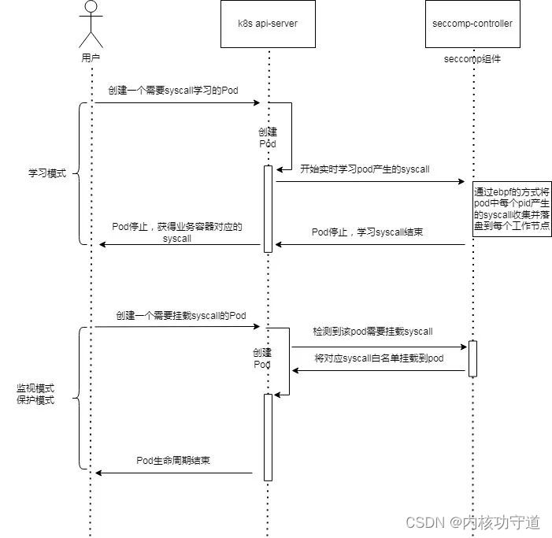

## sandbox

新技术可以和系统结合在一起，实现一些功能，但是并不是很安全，可能有一些漏洞
那么就考虑将其分离出来，或者使用沙盒，来把其危害降低
虚拟内存也可以看作一种原始的沙盒方式

最开始，浏览器上的程序拥有用户的全部权限，如Java Applet，Adobe Flash ...
最开始只是打补丁，减少攻击面。
但是黑客会转移到其他区域
于是兴起了沙盒：不可信的代码和数据都应该在进程中以基本为0的权限运行

1个有权限的父进程
1个被沙盒的，没有权限的子进程
当子进程想要执行一些特权操作时，需要询问父进程


沙盒工作效果如何？很好。


## seccomp概述

- seccomp ：Secure computing mode. 代表安全计算模式.
- seccomp 本质上是Linux的系统调用防火墙
- 现代沙盒通过使用内核级沙盒机制：seccomp，来严格限制允许的系统调用。
- seccomp 允许开发人员编写复杂的规则来：
    - 允许某些系统调用
    - 禁止某些系统调用
    - 基于参数变量过滤允许和不允许的系统调用seccomp规则可以由子进程继承
    - 甚至能限制root用户运行的进程
- 这些规则可能非常复杂（请参阅 http:/an7org/inux/manpages/man3/seccomp.rule.add.3.html

- seccomp如何工作?
    - seccomp 使用内核的eBPF机制
    - 可以使用seccomp()来为进程添加syscall过滤器
        - 通过seccomp库调用，来生成eBPF字节码

- docker , chrome都依赖于seccomp

### 例子

- 不使用库，直接使用prtcl syscall
    ```c
    #include <stdio.h>
    #include <signal.h>
    #include <unistd.h>
    #include <time.h>
    #include <string.h>
    #include <stdlib.h>
    #include <malloc.h>
    #include <sys/prctl.h>
    #include <seccomp.h>
    #include <linux/seccomp.h>
    #include <linux/filter.h>

    int main() {
        //  编写字节码时可用的头文件:
            //  #include <linux/bpf_common.h>
            //  https://outflux.net/teach-seccomp/step-3/seccomp-bpf.h
        struct sock_filter filter[] = {
            BPF_STMT(BPF_LD+BPF_W+BPF_ABS,4),           //前面两步用于检查arch
            BPF_JUMP(BPF_JMP+BPF_JEQ,0xc000003e,0,2),
            BPF_STMT(BPF_LD+BPF_W+BPF_ABS,0),            //将帧的偏移0处，取4个字节数据，也就是系统调用号的值载入累加器
            BPF_JUMP(BPF_JMP+BPF_JEQ,0,0,1),               //当A == 63时，顺序执行下一条规则，否则跳过下一条规则，这里的63就是x64的read系统调用
            BPF_STMT(BPF_RET+BPF_K,SECCOMP_RET_KILL),   //  返回KILL
            BPF_STMT(BPF_RET+BPF_K,SECCOMP_RET_ALLOW),  //  返回ALLOW
        };
        struct sock_fprog prog = {
            .len = (unsigned short)(sizeof(filter)/sizeof(filter[0])),       /* Number of filter blocks */
            .filter = filter,        /* Number of filter blocks */
        };
    // int prctl(int option, unsigned long arg2, unsigned long arg3,unsigned long arg4, unsigned long arg5);
    // 为了保证安全性，需要将PR_SET_NO_NEW_PRIVSW位设置位1。这个操作能保证seccomp对所有用户都能起作用，并且会使子进程即execve后的进程依然受控，意思就是即使执行execve这个系统调用替换了整个binary权限不会变化，而且正如其名它设置以后就不能再改了，即使可以调用ptctl也不能再把它禁用掉。
        prctl(PR_SET_NO_NEW_PRIVS,1,0,0,0);
        prctl(PR_SET_SECCOMP,SECCOMP_MODE_FILTER,&prog);
    // PR_SET_SECCOMP指明我们正在为进程设置seccomp；
    // SECCOMP_MODE_FILTER将seccomp的过滤规则指向&prog；
    // &prog就是我们定义的过滤规则

        execl("/bin/cat","cat","./seccomp-bpf-01.c",NULL);
            // prctl(PR_SET_NO_NEW_PRIVS, 1, 0, 0, 0)  = 0
            // prctl(PR_SET_SECCOMP, SECCOMP_MODE_FILTER, {len=6, filter=0x7ffecfc03010}) = 0
            // execve("/bin/cat", ["cat", "./seccomp-bpf-01.c"], [/* 28 vars */]) = 0
            // brk(NULL)                               = 0x9abb29b000
            // access("/etc/ld.so.nohwcap", F_OK)      = -1 ENOENT (No such file or directory)
            // access("/etc/ld.so.preload", R_OK)      = -1 ENOENT (No such file or directory)
            // open("/etc/ld.so.cache", O_RDONLY|O_CLOEXEC) = 3
            // fstat(3, {st_mode=S_IFREG|0644, st_size=23147, ...}) = 0
            // mmap(NULL, 23147, PROT_READ, MAP_PRIVATE, 3, 0) = 0x7fdbd66bd000
            // close(3)                                = 0
            // access("/etc/ld.so.nohwcap", F_OK)      = -1 ENOENT (No such file or directory)
            // open("/lib/x86_64-linux-gnu/libc.so.6", O_RDONLY|O_CLOEXEC) = 3
            // read(3,  <unfinished ...>)              = ?
            // +++ killed by SIGSYS +++
            // Bad system call
        return 0;
    }
    ```

- 使用seccomp库
    编译的时候要在最后面加 -lseccomp
    ```c
    #include <unistd.h>
    #include <seccomp.h>
    #include <linux/seccomp.h>

    int main(void){ 
        // scmp_filter_ctx ctx;     过滤器的结构体
        // ctx = seccomp_init(SCMP_ACT_ALLOW);      结构体进行初始化，若参数为SCMP_ACT_ALLOW，则过滤为黑名单模式；若为SCMP_ACT_KILL，则为白名单模式，即没有匹配到规则的系统调用都会杀死进程，默认不允许所有的syscall。
        // seccomp_rule_add(ctx, SCMP_ACT_KILL, SCMP_SYS(execve), 0);   arg_cnt为0,表示我们直接限制execve,不管参数是什么，如果arg_cnt不为0,那arg_cnt表示后面限制的参数的个数,也就是只有调用execve,且参数满足要求时,才会拦截
        // seccomp_load(ctx);   加载
            // prctl(PR_SET_NO_NEW_PRIVS, 1, 0, 0, 0)  = 0
            // seccomp(SECCOMP_SET_MODE_STRICT, 1, NULL) = -1 EINVAL (Invalid argument)
            // seccomp(SECCOMP_SET_MODE_FILTER, 0, {len=7, filter=0x1c6b67a930}) = 0
            // write(1, "hello world\n", 12hello world
            // )           = 12
            // execve("/bin/sh", NULL, NULL)           = ?
            // +++ killed by SIGSYS +++
            // Bad system call
        // char * str = "/bin/sh";
        // write(1,"hello world\n",12);
        // syscall(59,str,NULL,NULL);  //  execve  bad system call. 被SIGSYS信号终止
        
        
        scmp_filter_ctx ctx;
        ctx = seccomp_init(SCMP_ACT_ALLOW);
        seccomp_rule_add(ctx, SCMP_ACT_KILL, SCMP_SYS(read), 0);
        seccomp_load(ctx);
        execl("/bin/cat","cat","/flag",NULL);
            // prctl(PR_SET_NO_NEW_PRIVS, 1, 0, 0, 0)  = 0
            // seccomp(SECCOMP_SET_MODE_STRICT, 1, NULL) = -1 EINVAL (Invalid argument)
            // seccomp(SECCOMP_SET_MODE_FILTER, 0, {len=7, filter=0xf0baee6930}) = 0
            // execve("/bin/cat", ["cat", "/flag"], [/* 28 vars */]) = 0
            // brk(NULL)                               = 0xf67a7ca000
            // access("/etc/ld.so.nohwcap", F_OK)      = -1 ENOENT (No such file or directory)
            // access("/etc/ld.so.preload", R_OK)      = -1 ENOENT (No such file or directory)
            // open("/etc/ld.so.cache", O_RDONLY|O_CLOEXEC) = 3
            // fstat(3, {st_mode=S_IFREG|0644, st_size=23147, ...}) = 0
            // mmap(NULL, 23147, PROT_READ, MAP_PRIVATE, 3, 0) = 0x7ff63415f000
            // close(3)                                = 0
            // access("/etc/ld.so.nohwcap", F_OK)      = -1 ENOENT (No such file or directory)
            // open("/lib/x86_64-linux-gnu/libc.so.6", O_RDONLY|O_CLOEXEC) = 3
            // read(3,  <unfinished ...>)              = ?      cat try to read
        return 0;
    }
    ```

## 逃逸

机翻https://www.bilibili.com/video/BV1vg4y1p7yd?t=40.6
- 逃逸
    - 通常，要执行任何有用的操作，沙盒进程需要能够与特权进程通信。
    - 通常，这意味着允许沙盒进程使用某些系统调用。这打开了一些攻击媒介：
        - permissive policies
            - 系统调用很复杂，而且有很多
            - 开发人员可能允许一些错误来避免破坏功能。
            - 众所周知的例子：根据系统配置，允许 ptrace（） 系统调用可以让沙盒进程“傀儡”非沙盒进程。
            - 一些鲜为人知的效果：
                - sendmsg（） 可以在进程之间传输文件描述符 .
                - prct1（） 具有奇怪的可能效果
                - process_vm writev（） 允许直接访问其他进程的内存
        - Syscall Confusion
            - 许多64位架构向后兼容32位
            - 在一些system上（包括amd64），你可以在同一进程中，在32bit和64bit之间转换.
            - 有趣的是，system call number在不同结构之间是不同的，即便是同一个架构的32bit和64bit
            - Example : exit() syscal number = 60 on amd64 , 但是 (mov eax ,1 ; int 0x80) on x86
        - kernel vulnerabilities in the syscall handlers
            - 如果seccomp沙盒被正确配置，那么attacker做不了什么有用的事情
            - 但是他们仍然可以和被允许的syscall交互，那么这就允许他们使用kernel中的vulnerablities
            - Powerful! Over 30 Chrome sandbox escapes in 2019 alone:https://qithub.com/allpaca/chrome-sbx-db


## **实现**




- 所以由如下代码可以看到，seccomp-bpf似乎也并不是特别高深的原理，目前来看，也就是每次刚进入syscall的入口时(do_syscall_64)，运行process上挂载的seccomp-bpf prog，进行检测。
- 原理和boesfs类似，boesfs是在vfs向下的时候调用BPF_PROG_RUN()进行检测

### 结构

- seccomp_filter : 用于装载eBPF prog. 被挂到task_struct上
    ```c
    /**
    * struct seccomp_filter - container for seccomp BPF programs
    *
    * @usage: reference count to manage the object lifetime.
    *         get/put helpers should be used when accessing an instance
    *         outside of a lifetime-guarded section.  In general, this
    *         is only needed for handling filters shared across tasks.
    * @log: true if all actions except for SECCOMP_RET_ALLOW should be logged
    * @prev: points to a previously installed, or inherited, filter
    * @prog: the BPF program to evaluate
    * @notif: the struct that holds all notification related information
    * @notify_lock: A lock for all notification-related accesses.
    *
    * seccomp_filter objects are organized in a tree linked via the @prev
    * pointer.  For any task, it appears to be a singly-linked list starting
    * with current->seccomp.filter, the most recently attached or inherited filter.
    * However, multiple filters may share a @prev node, by way of fork(), which
    * results in a unidirectional tree existing in memory.  This is similar to
    * how namespaces work.
    *
    * seccomp_filter objects should never be modified after being attached
    * to a task_struct (other than @usage).
    */
    struct seccomp_filter {
        refcount_t usage;
        bool log;
        struct seccomp_filter *prev;
        struct bpf_prog *prog;
        struct notification *notif;
        struct mutex notify_lock;
    };
    ```

- seccomp_data : 运行seccomp_filter字节码时，字节码内所能获取的上下文结构体。并且这上下文结构体里的参数，追根溯源，其实就是用户调研syscall传入的参数
    ```c
    /**
    * struct seccomp_data - the format the BPF program executes over.
    * @nr: the system call number
    * @arch: indicates system call convention as an AUDIT_ARCH_* value
    *        as defined in <linux/audit.h>.
    * @instruction_pointer: at the time of the system call.
    * @args: up to 6 system call arguments always stored as 64-bit values
    *        regardless of the architecture.
    */
    struct seccomp_data {
        int nr;
        __u32 arch;
        __u64 instruction_pointer;
        __u64 args[6];
    };

    static long syscall_trace_enter(struct pt_regs *regs)
    {
    #ifdef CONFIG_SECCOMP
            struct seccomp_data sd;
            sd.arch = arch;
            sd.nr = regs->orig_ax;
            sd.instruction_pointer = regs->ip;
            sd.args[0] = regs->di;
            sd.args[1] = regs->si;
            sd.args[2] = regs->dx;
            sd.args[3] = regs->r10;
            sd.args[4] = regs->r8;
            sd.args[5] = regs->r9;
            ret = __secure_computing(&sd);
            if (ret == -1)
                return ret;
        }
    #endif
        return ret ?: regs->orig_ax;
    }
    ```


### 安装

- prctl -> seccomp_attach_filter
    ```c
    /**
    * seccomp_attach_filter: validate and attach filter
    * @flags:  flags to change filter behavior
    * @filter: seccomp filter to add to the current process
    *
    * Caller must be holding current->sighand->siglock lock.
    *
    * Returns 0 on success, -ve on error, or
    *   - in TSYNC mode: the pid of a thread which was either not in the correct
    *     seccomp mode or did not have an ancestral seccomp filter
    *   - in NEW_LISTENER mode: the fd of the new listener
    */
    static long seccomp_attach_filter(unsigned int flags,
                    struct seccomp_filter *filter)
    {
        ...
        filter->prev = current->seccomp.filter;
        current->seccomp.filter = filter;
        ...
        return 0;
    }
    ```


### 调用

- do_syscall_64 -> syscall_trace_enter -> __secure_computing -> __seccomp_filter -> seccomp_run_filters -> BPF_PROG_RUN(&prog)
    ```c
    /arch/x86/entry/common.c
    __visible void do_syscall_64(unsigned long nr, struct pt_regs *regs)
    {
        ....
        nr = syscall_trace_enter(regs);
        ....
        syscall_return_slowpath(regs);
        ....
    }

    static long syscall_trace_enter(struct pt_regs *regs)
    {
        ....
    #ifdef CONFIG_SECCOMP
        ret = __secure_computing(&sd);
        if (ret == -1)
            return ret;
    #endif
        ....
        return ret ?: regs->orig_ax;
    }
    ```

    ```c
    /kernel/seccomp.c
    int __secure_computing(const struct seccomp_data *sd)
    {
        int mode = current->seccomp.mode;
        ...
        switch (mode) {
        case SECCOMP_MODE_STRICT:
            __secure_computing_strict(this_syscall);  /* may call do_exit */
            return 0;
        case SECCOMP_MODE_FILTER:
            return __seccomp_filter(this_syscall, sd, false);
        }
    }

    static int __seccomp_filter(int this_syscall, const struct seccomp_data *sd,
                    const bool recheck_after_trace)
    {
        u32 filter_ret, action;
        struct seccomp_filter *match = NULL;
        int data;
        struct seccomp_data sd_local;

        filter_ret = seccomp_run_filters(sd, &match);
        data = filter_ret & SECCOMP_RET_DATA;
        action = filter_ret & SECCOMP_RET_ACTION_FULL;

        switch (action) {
        case SECCOMP_RET_ERRNO:

            syscall_set_return_value(current, task_pt_regs(current),
                        -data, 0);
            goto skip;

        case SECCOMP_RET_TRAP:
            /* Show the handler the original registers. */
            syscall_rollback(current, task_pt_regs(current));
            /* Let the filter pass back 16 bits of data. */
            seccomp_send_sigsys(this_syscall, data);
            goto skip;

        case SECCOMP_RET_TRACE:
            ...
            /* Allow the BPF to provide the event message */
            ptrace_event(PTRACE_EVENT_SECCOMP, data);
            ...
            return 0;

        case SECCOMP_RET_USER_NOTIF:
            seccomp_do_user_notification(this_syscall, match, sd);
            goto skip;

        case SECCOMP_RET_LOG:
            seccomp_log(this_syscall, 0, action, true);
            return 0;

        case SECCOMP_RET_ALLOW:
            /*
            * Note that the "match" filter will always be NULL for
            * this action since SECCOMP_RET_ALLOW is the starting
            * state in seccomp_run_filters().
            */
            return 0;

        case SECCOMP_RET_KILL_THREAD:
        case SECCOMP_RET_KILL_PROCESS:
        default:
            seccomp_log(this_syscall, SIGSYS, action, true);
            ...
        }
    skip:
        seccomp_log(this_syscall, 0, action, match ? match->log : false);
        return -1;
    }

    /**
    * seccomp_run_filters - evaluates all seccomp filters against @sd
    * @sd: optional seccomp data to be passed to filters
    * @match: stores struct seccomp_filter that resulted in the return value,
    *         unless filter returned SECCOMP_RET_ALLOW, in which case it will
    *         be unchanged.
    *
    * Returns valid seccomp BPF response codes.
    */
    #define ACTION_ONLY(ret) ((s32)((ret) & (SECCOMP_RET_ACTION_FULL)))
    static u32 seccomp_run_filters(const struct seccomp_data *sd,
                    struct seccomp_filter **match)
    {
        u32 ret = SECCOMP_RET_ALLOW;
        /* Make sure cross-thread synced filter points somewhere sane. */
        //  task_struct上的filter链表. 遍历链表，执行BPF_PROG_RUN(字节码)
        //  可以看出，一个process可以挂载多个seccomp-bpf prog
        struct seccomp_filter *f =
                READ_ONCE(current->seccomp.filter);

        /* Ensure unexpected behavior doesn't result in failing open. */
        if (WARN_ON(f == NULL))
            return SECCOMP_RET_KILL_PROCESS;

        /*
        * All filters in the list are evaluated and the lowest BPF return
        * value always takes priority (ignoring the DATA).
        */
        preempt_disable();
        for (; f; f = f->prev) {
            u32 cur_ret = BPF_PROG_RUN(f->prog, sd);

            if (ACTION_ONLY(cur_ret) < ACTION_ONLY(ret)) {
                ret = cur_ret;
                *match = f;
            }
        }
        preempt_enable();
        return ret;
    }
    #endif /* CONFIG_SECCOMP_FILTER */
    ```

### 过滤结果

- seccomp bpf filter 过滤返回的结果
    ```c
    /include/uapi/linux/seccomp.h
    /*
    * All BPF programs must return a 32-bit value.
    * The bottom 16-bits are for optional return data.
    * The upper 16-bits are ordered from least permissive values to most,
    * as a signed value (so 0x8000000 is negative).
    *
    * The ordering ensures that a min_t() over composed return values always
    * selects the least permissive choice.
    */
    #define SECCOMP_RET_KILL_PROCESS 0x80000000U /* kill the process */
    #define SECCOMP_RET_KILL_THREAD	 0x00000000U /* kill the thread */
    #define SECCOMP_RET_KILL	 SECCOMP_RET_KILL_THREAD
    #define SECCOMP_RET_TRAP	 0x00030000U /* disallow and force a SIGSYS */
    #define SECCOMP_RET_ERRNO	 0x00050000U /* returns an errno */
    #define SECCOMP_RET_USER_NOTIF	 0x7fc00000U /* notifies userspace */
    #define SECCOMP_RET_TRACE	 0x7ff00000U /* pass to a tracer or disallow */
    #define SECCOMP_RET_LOG		 0x7ffc0000U /* allow after logging */
    #define SECCOMP_RET_ALLOW	 0x7fff0000U /* allow */
    ```

- 这些return value就对应于docker的seccomp profile的default action
    ```profile
    {
        "defaultAction": "SCMP_ACT_ERRNO",
        "architectures": [
        "SCMP_ARCH_X86_64",
        "SCMP_ARCH_X86",
        "SCMP_ARCH_X32"
        ],
        "syscalls": [
            {
                "names": [
                    "write",
                    "mmap"
                    ...
                ],
                "action": "SCMP_ACT_ALLOW",
                "args": [],
                "comment": "",
                "includes": {},
                "excludes": {}
            }
        ]
    }
    ```
    - 可以设置的default action如下
    

#### nofity

- **重点介绍一下Notify**
    - 传统的seccomp-bpf 存在一个致命的缺陷，其对应的生效方式不适合动态的场景。具体来说，无论 syscall 最后是成功还是失败，一旦一个 Seccomp filter 成功加载到内核后，对应 syscall 的规则也就固定下来了。接下来不管在什么场景下，用户都无法再次根据具体的情况，去修改对应的 syscall 规则。这就意味着用户从一开始，就需要确定好对应进程所有的系统调用权限，一旦出现偏差，就需要重新修改、编译代码，这其实无形中增加了用户的试错成本。
    - 在 5.0版本内核引入 seccomp - notify 机制。相较于传统seccomp-bpf 模式下，seccomp-notify 可以将对于syscall的放行/拦截与否等操作**转移到用户态程序**。
    - 为了方便理解，接下来将需要加载 Seccomp filter 程序的进程叫做 target，接收到 target 通知的进程叫做 supervisor。
    - 在nofity模式下，**supervisor 不仅可以对是否允许系统调用做出判断，它还可以替代 target 进程去执行这个系统调用的行为。这无疑再一次扩展了 Seccomp 的使用范围。**
    

- code:
    - target process
        - 首先定义了一个 socket filter, 这个 filter 允许除了 mkdir 之外的所有系统调用
        - mkdir 需要通过 Seccomp Notify 的方式由 supervisor 去判决是否允许执行。
        - 接着，通过 Seccomp系统调用的方式来加载 filter，将对应的 tid 和 fd 打印出来。最后执行 mkdir 命令，触发 mkdir 系统调用，进程进入阻塞状态，等待内核返回。
        ```c
        int main(int argc, char **argv)
        {
            ...
            //  创建filter
            struct sock_filter filter[] = {
                BPF_STMT(BPF_LD+BPF_W+BPF_ABS, (offsetof(struct seccomp_data, nr))),
                ...
                BPF_JUMP(BPF_JMP+BPF_JEQ+BPF_K, __NR_mkdir, 0, 1),
                BPF_STMT(BPF_RET+BPF_K, SECCOMP_RET_USER_NOTIF),
                BPF_STMT(BPF_RET+BPF_K, SECCOMP_RET_ALLOW),
            };
            ...
            //  初始化notify fd
            notifyfd = syscall(__NR_seccomp, SECCOMP_SET_MODE_FILTER,
                    SECCOMP_FILTER_FLAG_NEW_LISTENER, &prog);
            if (notifyfd < 0) {
                printf("fail to create seccomp: %s\n", strerror(errno));
                exit(-1);
            }
            printf("tid: %d, notify fd: %d\n", syscall(SYS_gettid), notifyfd);
            //  触发mkdir
            fd = mkdir(argv[1], O_CREAT|O_RDWR);
            ...
            return 0;
        }
        ```
    - supervisor process
        - 通过 pidfd_getpid 获取到 target 进程的 seccomp fd，并且从 fd 中不断轮询 target 内的 seccomp notify 事件。
        - 然后再从 /proc/{pid}/mem 文件内获取 mkdir 系统调用所引用的参数，也就是创建的文件夹名称。
        - supervisor 规定，如果创建文件夹的名称为 add，则会自动将该文件夹名称修改成 change，并且将结果返回给内核，从而达到约束 target 进程的目的。
        ```c
        static void supervisor_process_notifications(int notifyfd)
        {
            ...
            //  创建seccomp
            syscall(SYS_seccomp, SECCOMP_GET_NOTIF_SIZES, 0, &sizes)
            ...
            //  从notify df中轮询事件
            ioctl(notifyfd, SECCOMP_IOCTL_NOTIF_RECV, req)
            //  执行规则：判断mkdir的参数是否是 add
            if (strlen(path) == strlen("add") &&
                strncmp(path, "add", strlen("add")) == 0)
            {
                    printf("change name for add dir\n");
                    if (access("change", 0) == -1){
                        mkdir(path, O_CREAT|O_RDWR);
                }
            }
            resp->error = 0;
            resp->flags = SECCOMP_USER_NOTIF_FLAG_CONTINUE;
            resp->id = req->id;
            //  发送结果给内核
            ioctl(notifyfd, SECCOMP_IOCTL_NOTIF_SEND, resp)
        }

        int main(int argc, char **argv)
        {
            ...
            pid = atoi(argv[1]);
            targetfd = atoi(argv[2]);
            printf("PID: %d, TARGET FD: %d\n", pid, targetfd);
            //  获取target fd对应的pid fd
            pidfd = syscall(SYS_pidfd_open, pid, 0);
            assert(pidfd >= 0);
            printf("PIDFD: %d\n", pidfd);
            //  根据target fd获取监听的notify fd
            notifyfd = syscall(SYS_pidfd_getpid, pidfd, targetfd, 0);
            assert(notifyfd >= 0);
            printf("NOTIFY FD: %d\n", notifyfd);
            //  监视target进程
            supervisor_process_notifications(notifyfd);
            return 0;
        }
        ```


## seccomp-bpf**应用**

- Kubernetes 攻击面：
    
- 为了保证集群以及容器应用的安全，Kubernetes 提供了多种安全机制，限制容器的行为，减少容器和集群的攻击面，保证整个系统的安全性。本文主要介绍 Kubernetes 中的 Seccomp 功能。
    - Kubernetes 可以自动将 Seccomp profile 加载到pod 和容器所在的节点。
        - 加载方式: pod层面,container层面 略...
    - 从而对pod进行syscall级别的防护

- 云原生场景下，业务一般是通过微服务的方式对外提供服务，一般每个微服务的行为相比与主机业务行为会更为单一。
- 因此可以通过一系列的测试手段激发出服务所需的全部syscall从而生成syscall 白名单，然后通过 syscall 白名单限制服务系统调用，从而在 syscall 维度保证服务安全。
    - 当有攻击通过服务漏洞进入到服务对应的 Pod 中，进行一些操作时，由于这些操作对应的 syscall 不在白名单内，此时攻击失败。
- 我们将 syscall 白名单的生成与使用分为三个阶段：学习阶段，监视阶段，保护阶段. 流程如下图
    
    - **学习阶段**：
        - seccomp controller 组件为 crd 资源，它可以实现对 k8s 集群内指定 pod 进行 syscall 采集并且将采集得到的 syscall 列表落盘到每个工作节点。seccomp controller 的 syscall 学习功能是通过 ebpf 实现的，通过 ebpf 可以获取工作节点每个进程产生的系统调用，进而获取到指定 pod 对应的系统调用。通过 ebpf 的方式，将集群中每个容器产生的 syscall 调用进行收集，生成 syscall 白名单。
    - **监视阶段**：
        - 使用 SCMP_ACT_LOG 过滤方式，可以将不在白名单的系统调用，以日志的形式打印出来，此时测试人员和安全运维人员可以对系统调用进行判断，确定业务是否需要该 syscall，如果需要则加入到 syscall 白名单中。在监视阶段可以完成 syscall 白名单的收敛，进而得到与业务完全匹配的 syscall 白名单。
            - SCMP_ACT_LOG阶段的seccomp profile，打印不在白名单的syscall
            ```c
            {
                "defaultAction": "SCMP_ACT_LOG",
                "architectures": [
                    "SCMP_ARCH_X86_64",
                    "SCMP_ARCH_X86",
                    "SCMP_ARCH_X32"
                ],
                "syscalls": [
                    {
                        "names": [
                            "madvise",
                            "epoll_ctl",
                            "getsockname",
                            "setsockopt",
                            "vfork",
                            "mmap",
                            "read",
                            "write",
                            "close",
                            "arch_prctl"
                        ],
                "action": "SCMP_ACT_ALLOW"
                    }
                ]
            }
            ```
    - **保护阶段**：
        - 使用 SCMP_ACT_ERRNO 过滤方式，对每个业务容器进行 syscall 级别的保护。一旦业务容器中存在异常系统调用，对其进行拦截。SCMP_ACT_ERRNO 对 syscall 拦截发生在内核态，所以不用担心 seccomp profile 安全防护的效率问题。
            - 保护阶段的seccomp profile
            ```c
            {
                "defaultAction": "SCMP_ACT_ERRNO",
                "architectures": [
                    "SCMP_ARCH_X86_64",
                    "SCMP_ARCH_X86",
                    "SCMP_ARCH_X32"
                ],
                "syscalls": [
                    {
                        "names": [
                            "madvise",
                            "epoll_ctl",
                            "getsockname",
                            "setsockopt",
                            "vfork",
                            "mmap",
                            "read",
                            "write",
                            "close",
                            "arch_prctl"
                        ],
                        "action": "SCMP_ACT_ALLOW"
                    }
                ] 
            }
            ```

## 对比分析


seccomp-bpf

- 如上所属，boesfs和seccomp-bpf的原理类似
    - seccomp-bpf 在每次刚进入syscall的入口时(do_syscall_64)，运行process上挂载的seccomp-bpf prog，进行检测。
    - boesfs是在vfs向下的时候调用BPF_PROG_RUN()进行检测
    - 易知如果同样发生拦截，那么seccomp-bpf比boesfs更快

- boesfs的使用可以仿照上述的seccomp-bpf的学习、监视、保护阶段思路

- boesfs提供的default action比seccomp-bpf少
    - boesfs 与 seccomp-bpf的类似之处：提供了加载prog，然后执行黑白名单的模式；也提供了终止线程的模式
    - 但是seccomp-bpf提供的action还是比boesfs多出几个.(上文中的default-action):trace,notify,trap,log,notify
    - 决赛前可以实现、boesfs也应该再提供的action：LOG（仅仅日志而不进行字节码运行）。其他action有时间再探究. 
    - 如果有可能，最好应该再提供nofity选项（seccomp-bpf于2019增加的机制），应该可以作为一个亮点。不过需要kernel user一起改，且需要调试。
        - notify机制可以达成动态，并且扩大操作能力。（因为转移到用户态了）
    - 并且认为应当与seccomp-bpf的实现与使用类似，这些action可以同黑白名单一起作为同一个[action]选项写在policy文件。（正如docker使用seccomp-bpf时的profile）


- seccomp 可以使得子进程继承父进程的过滤规则
    - 通过 prctl(PR_SET_NO_NEW_PRIVS, 1, 0, 0, 0) 实现
    - 设置了 PR_SET_NO_NEW_PRIVS 后，子进程将不会拥有比父进程更大的权限，并且 PR_SET_NO_NEW_PRIVS 的设定将会被使用 fork 与 clone 创建的子进程继承，并且在 execve 时也会保留。

- boesfs 天然实现子进程继承父进程的规则 ?
    - 子进程和父进程同处于同一Mount-NameSpace
    - 且boesfs会限制子进程不能再自己进行mount-namespace？？
    - 看qi葱怎么说，是这样吗？？


- seccomp可以实现：限制几乎所有的系统调用。  
    - 因为seccomp的原理，就是在syscall的入口，去调用seccomp-bpf字节码。那么大家就可以在字节码中检测syscall number，从而进行操作.
    - syscall number 见 /include/uapi/asm-generic/unistd.h
    ```c
        略...
    ```
- 而易知，boesfs只能限制vfs相关的文件操作
    ```c
    #define BOESFS_DESTROY 	1
    #define BOESFS_READ 	2
    #define BOESFS_WRITE 	3
    #define BOESFS_LOOKUP	4
    #define BOESFS_OPEN		5
    #define BOESFS_MKDIR	6
    #define BOESFS_UNLINK	7
    #define BOESFS_RMDIR	8
    #define BOESFS_MKNOD	9
    #define BOESFS_CREATE	10
    #define BOESFS_LINK		11
    #define BOESFS_SYMLINK	12
    #define BOESFS_RENAME	13
    #define BOESFS_SETATTR	14
    #define BOESFS_GETATTR	15
    #define BOESFS_LLSEEK	16
    #define BOESFS_ITERATE	17
    #define BOESFS_MMAP		18
    #define BOESFS_LOOKUP2	19
    #define BOESFS_STATFS	20
    #define BOESFS_FSYNC	21
    ```
    - read/pread64 系统调用 -> vfs_read -> read
    - write/pwrite64系统调用 -> vfs_write -> write
    - open/openat系统调用 -> do_sys_open -> do_filp_open -> path_openat -> do_o_path -> vfs_open -> do_dentry_open -> open
    - lseek/llseek系统调用 -> vfs_llseek -> llseek
    - getdents/getdents64/old_readdir -> iterate_dir -> iterate
    - mmap_pgoff系统调用 -> vm_mmap_pgoff -> do_mmap_pgoff -> do_mmap -> mmap_region -> call_mmap -> mmap
    - fsync/fdatasync系统调用 -> do_fsync -> vfs_fsync -> vfs_fsync_range -> call_fsync -> fsync
    - vfs_path_lookup -> filename_lookup -> path_lookupat -> link_path_walk -> walk_component -> lookup_slow -> lookup
    - unlink/unlinkat系统调用 -> do_unlinkat -> vfs_unlink -> unlink
    - mkdir/mkdirat系统调用 -> vfs_mkdir -> mkdir
    - unlinkat/rmdir系统调用 -> do_rmdir -> vfs_rmdir -> rmdir
    - mknod系统调用 -> mknodat系统调用 -> vfs_mknod -> mknod
    - open/openat系统调用 -> do_sys_open -> do_filp_open -> path_openat -> do_last -> lookup_open -> create
    - renameat/rename系统调用 -> renameat2系统调用 -> vfs_rename -> rename
    - link系统调用 -> linkat系统调用 -> vfs_link -> link
    - symlink系统调用 -> symlinkat系统调用 -> vfs_symlink -> symlink
    - fchown系统调用 -> fchownat系统调用 -> chown_common -> notify_change -> setattr
    - stat/stat64/newstat系统调用 -> vfs_stat -> vfs_statx -> vfs_getattr -> vfs_getattr_nosec -> getattr
    - lstat/lstat64/newlstat系统调用 -> vfs_lstat -> vfs_statx -> vfs_getattr -> vfs_getattr_nosec -> getattr
    - newfstatat系统调用 -> vfs_fstatat -> vfs_statx -> vfs_getattr -> vfs_getattr_nosec -> getattr
    - vfs_path_lookup -> filename_lookup -> path_lookupat -> link_path_walk -> lookup_fast/lookup_slow -> d_revalidate -> d_revalidate


- 如前文所述，seccomp-bpf只能获取有限的kernel上下文 : seccomp_data. 包括6个用户传入的参数寄存器、指令、syscall number
- Boesfs可以更容易的获取更多的上下文 如更多的文件元信息，如读取read/open时的offset，以及mode , uid等.
    - 不过这些参数，感觉在seccomp-bpf里也可以获得...只不过有点麻烦

- 一种seccomp-bpf发生沙盒逃逸的情况:
    - 在一些system上（包括amd64），你可以在同一进程中，在32bit和64bit之间转换. 且system call number在不同结构(即便是同一个架构的32bit和64bit)之间是不同的.
    - 所以如果编写者没有根据情况即使修改filter程序，则会导致对syscall的限制失败.
- boesfs应该不会有. 因为都是在vfs转发下来的.

- seccomp-bpf通过库/syscall编写
- boesfs可以快速扩充文件相关的规则（通过policy和model文件）

- 参考资料 
    - https://pwn.college/
    - https://www.anquanke.com/post/id/208364#h3-5
    - https://cloud.tencent.com/developer/article/1801887
    - https://zhuanlan.zhihu.com/p/363174561
    - https://kernel-security.blog.csdn.net/article/details/127573363
    - https://www.outflux.net/teach-seccomp/
    - https://www.bilibili.com/video/BV1vg4y1p7yd?t=846.4
    - https://developer.aliyun.com/article/1205038
    - https://brauner.io/2020/07/23/seccomp-notify.html
    - https://blog.csdn.net/weixin_72742917/article/details/127573363?spm=1001.2014.3001.5501
    - https://zhuanlan.zhihu.com/p/580777000
    - https://kubernetes.io/zh-cn/docs/tutorials/security/seccomp/
    - https://blog.csdn.net/Longyu_wlz/article/details/112135901
    - https://bbs.kanxue.com/thread-275511.htm

