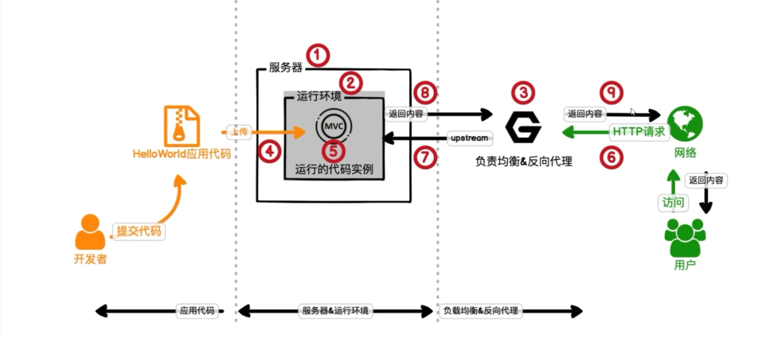
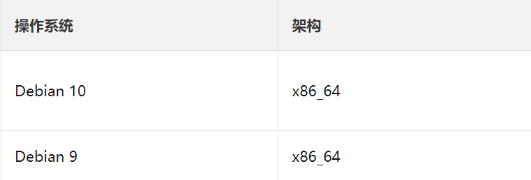
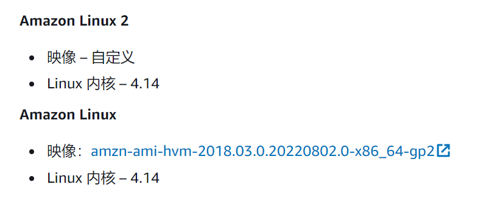

### FaaS介绍

FaaS，Function as a Service，函数即服务，是一种Serverless无服务器架构模式（不是不需要服务器，而是无需关注服务器）。FaaS使得使用者只需要关注将业务要求通过函数的方式表达，托管平台会自动在事件到来时触发运行，使用者无需关注运行其函数的服务器的具体细节。这些业务要求通常是一些短时的工作，如数据处理，文件管理等等。FaaS最后部署的基本单元就是一个个具备触发条件的函数。FaaS的函数环境在函数运行完就会动态的销毁。

FaaS使用的场景：

- 事件驱动型程序

  某些事件发生时，对应的处理函数

- 批处理型程序

- 轻量级任务

  无需使用服务器，浪费太多资源，简单的静态网站等等

- 无服务器程序

- 实时数据流处理

### 各FaaS平台使用的Linux环境

* 阿里云函数计算FC

Debian 10的Linux内核版本为4.19

* Amazon Lambda

* 华为云 FunctionGraph
仅知道为x86架构

* 微软Microsoft Azure
* 谷歌Google Cloud Functions
* IBM Bluemix/OpenWhisk
* 腾讯云 云函数SCF
> 未找到资料

### severless论文

#### 简介

许多云提供商提供FaaS作为使用驱动、无状态（无服务器）后端服务的接口，FaaS为开发基于云的应用程序提供了一个直观的、基于事件的界面。
> 与传统的云接口相比，在FaaS中，用户不会明确地获得虚拟机或容器，也不会为他们不使用的资源付费。

* 用户只需将其功能的代码上传到云端，函数在被事件“触发”或“调用”时执行，例如收到消息（例如HTTP请求）或计时器结束。
* 服务端需要使用最少的资源向用户提供最高的性能，然后根据用户函数的实际运行进行收费。

要使函数要达到高性能，低开销需要考虑的3个方面：
> * 函数的代码和需要的库被装载在内存中（热启动）显然快于未装载（冷启动）
> * 所有函数需要的资源都被装入内存的代价高昂，尤其是有的函数很短而不频繁运行，预期局面是：
看起来所有函数都能热启动，但花费的资源却是所有函数冷启动的资源
> * 函数需要的资源和被调用的频率会变化（比如HTTP请求可能是动态变化的）

调查发现：
* 大多数函数被调用得很少，但被调用得最多的函数比被调用得最少的函数要多调用8个数量级
* 函数的调用方式多种多样，导致难以预测其调用频率
* 函数内存使用范围为4倍，50%的函数在不到1秒的时间内运行

函数冷启动政策：
* AWS和Azure的固定策略：在函数被调用后的10-20分钟内保持函数能热启动，但是效果不好
* 论文中维护了一个柱状图（？）记录最近函数被调用的次数，从而知道函数应该被保持热启动多久和什么时候提前预热
* 在Apache OpenWhisk FaaS平台上，论文的策略比固定策略的冷启动数量和花费资源都要少

#### 背景
以Azure为例

1.Azure函数被调用的7种情况（触发器类型、函数类型）：HTTP, Event, Queue, Timer, Orchestration, Storage, 其他
> HTTP：用于处理HTTP请求
> Event：用于离散或串行事件，并进行单独或批量处理。
> Queue：在消息处理队列中发生消息插入时触发
> Timer：根据计时器定时响应
> Orchestration：未明确描述，在创建本地的、复杂的函数链和“或装箱”（未找到该单词目前定义）的时候使用（？）
> Storage：底层数据（数据库和文件系统）改变时触发
> 其他：剩下的所有触发情况

2.Azure函数被不同的应用所集中

3.如果函数被触发但其所在的应用不是热启动状态，需要冷启动整个应用然后再调用相应的函数

4.如果应用承载能力达到巅峰，则需要新分配实例再启动函数，但因为出现这种情况较少，不做考虑

5.固定策略未考虑到不同应用的多种表现，因此其既浪费资源又有许多冷启动。此外，还有外部用户频繁使用应用程序来保持其热启动，非常浪费资源。

#### FaaS 工作过程

### 参考链接

[阿里云函数计算FC 产品文档](https://help.aliyun.com/document_detail/132044.html?spm=a2c4g.132042.0.0.aee63f83EGVS8f)
[AWS Lambda 开发人员指南](https://docs.aws.amazon.com/zh_cn/lambda/latest/dg/lambda-runtimes.html)

[10分钟！FAAS！_哔哩哔哩_bilibili](https://www.bilibili.com/video/BV1tg4y1u7DR/?vd_source=ab32fbac61c958a8816cc8ed84cb6438)

[Debian9安装docker - 杰尔克 - 博客园 (cnblogs.com)](https://www.cnblogs.com/jokerxtr/p/15387425.html)

[动手搭建ServerLess服务 - 知乎 (zhihu.com)](https://zhuanlan.zhihu.com/p/413246974)

[GitHub - fnproject/fn: The container native, cloud agnostic serverless platform.](https://github.com/fnproject/fn#top)

[Fn Project - The Container Native Serverless Framework](https://fnproject.io/)

[Introduction to Fn with Python (fnproject.io)](https://fnproject.io/tutorials/python/intro/)

