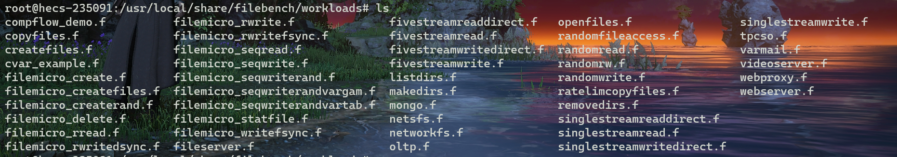

## FileBench

### filebench简介

filebench是一个文件系统和存储的基准测试，可以用来生成各种工作负载。它具有如下优势：

- 很灵活，允许通过工作负载模型语言（WML）来指定I/O行为
- 可以重头完全描述，也可以在一些工作负载上修改
- 适用于宏观和微观测试，设置速度快，使用容易

filebench的功能介绍如下：

- 支持40多个可用的微和宏工作负载（例如，Web服务器，文件服务器，邮件服务器等）
- 允许通过工作负载模型语言（WML）来指定I/O行为，自定义工作负载属性
- 支持多进程和多线程工作负载
- 适用于任何符合POSIX的操作系统（Linux、FreeBSD、Solaris）
- （可以通过设置目录的深度、宽度、文件大小然后以统计分布的方式配置得到目录层次结构）
- （支持异步IO和进程同步的原语）
- （可以测量吞吐量和分布延迟）

### filebench安装

step1 下载并解压

filebench-1.5-alpha3.tar.gz的release包

[Release filebench-1.5-alpha3 · filebench/filebench (github.com)](https://github.com/filebench/filebench/releases/tag/1.5-alpha3)

step2 安装依赖

```c
sudo apt-get install -y flex bison automake
```

step3 编译安装

```c
./configure
make
make install
```

### filebench两种使用模式

- 通过WML描述并生成工作负载属性

    工作负载的属性通过.f文件进行保存。

    filebench主要的四个实体是：fileset、process、thread以及flowop。

| 实体    | 含义                                                                             |
| ------- | -------------------------------------------------------------------------------- |
| fileset | 文件集。可以指定单个文件大小、文件的数量，文件集位于的目录，以及文件集的预操作等 |
| process | 进程集。用于执行流操作。                                                         |
| thread  | 线程集。用于执行流操作。                                                         |
| flowop  | 流操作。每个流操作都是一个文件操作。                                             |

    如下面这个例子，①定义了一个文件集"testF"，位于/tmp目录下，由10000个16k大小的文件组成，在执行实际的工作负载前会进行preallo操作。②定义了2个相同进程，每个进程包含3个相同线程，每个线程都在循环的重复定义在线程中的流操作。③每个线程定义了由："open"文件集的某个文件，然后"read"整个文件，然后"close"该文件三个流操作组成的流操作集合。④`run 60`指定运行工作负载60s。

```shell
01  define fileset name="testF",entries=10000,filesize=16k,prealloc,path="/tmp"
02
03  define process name="readerP",instances=2 {
04    thread name="readerT",instances=3 {
05      flowop openfile name="openOP",filesetname="testF"
06      flowop readwholefile name="readOP",filesetname="testF"
07      flowop closefile name="closeOP"
08    }
09  }
10
11  run 60
```

    这只是很简单的一个例子，更复杂的工作负载属性定义中，可以定义任意数量的文件集，多个不同的进程和线程，使用各种流操作和其他属性等等。

- 修改预定义的工作负载来使用

    filebench本身附带了一些可用的微和宏工作负载（例如，Web服务器，文件服务器，邮件服务器等）。这些工作负载也有WML的描述，位于源码的`workloads`目录下或者安装filebench后的机器的 `/usr/local/share/filebench/workloads/`目录下。但注意，这些工作负载描述只是模板，他们的参数（如数据集大小等）特定于具体的系统，并不能直接使用，需要对其做一些参数的修改才能使用。因此建议将其拷贝出来，修改以适应测试。预设的工作负载属性如下：



    例如，查看fileserver.f的属性配置如下，我们可以根据实际需求修改其中的参数，一般就修改dir, nfiles, filesize, nthreads等主要参数

```shell
set $dir=/tmp # 文件集位于的路径
set $nfiles=10000 # 文件集大小
set $meandirwidth=20 # 目录宽度
set $filesize=cvar(type=cvar-gamma,parameters=mean:131072;gamma:1.5) # 单个文件大小
set $nthreads=50 # 单个进程开多少线程
set $iosize=1m
set $meanappendsize=16k

define fileset name=bigfileset,path=$dir,size=$filesize,entries=$nfiles,dirwidth=$meandirwidth,prealloc=80

define process name=filereader,instances=1
{
  thread name=filereaderthread,memsize=10m,instances=$nthreads
  {
    flowop createfile name=createfile1,filesetname=bigfileset,fd=1
    flowop writewholefile name=wrtfile1,srcfd=1,fd=1,iosize=$iosize
    flowop closefile name=closefile1,fd=1
    flowop openfile name=openfile1,filesetname=bigfileset,fd=1
    flowop appendfilerand name=appendfilerand1,iosize=$meanappendsize,fd=1
    flowop closefile name=closefile2,fd=1
    flowop openfile name=openfile2,filesetname=bigfileset,fd=1
    flowop readwholefile name=readfile1,fd=1,iosize=$iosize
    flowop closefile name=closefile3,fd=1
    flowop deletefile name=deletefile1,filesetname=bigfileset
    flowop statfile name=statfile1,filesetname=bigfileset
  }
}

echo  "File-server Version 3.0 personality successfully loaded"

run 60
```

### filebench运行和结果

定制完工作负载后可以通过运行以下的命令来生成相应的工作负载，假设定制完的工作负载为webserver.f。

```shell
echo 0 > /proc/sys/kernel/randomize_va_space
filebench -f webserver.f
```

得到的运行结果，如下图所示：


解释如下：

①每种流操作结果

定义的流操作 | 流操作总共执行次数 | **每秒执行多少次流操作** | **读或写的带宽** | **每个操作的响应时间** | [**最快响应时间** - **最慢响应时间**]

②汇总操作结果（IO Summary）

全部流操作次数 | **每秒执行多少次流操作** | 读流操作执行次数/写流操作执行次数 | **IO带宽** | **每个操作的响应时间**

### 其他待补充

运行脚本

[filebench负载测试文件系统性能手册](https://blog.csdn.net/wenj12/article/details/117259674)

负载选择参考

[Predefined personalities · filebench/filebench Wiki (github.com)](https://github.com/filebench/filebench/wiki/Predefined-personalities)

收集的指标

[Collected metrics · filebench/filebench Wiki (github.com)](https://github.com/filebench/filebench/wiki/Collected-metrics)

WSL语言和可支持操作和字段

[Workload model language · filebench/filebench Wiki (github.com)](https://github.com/filebench/filebench/wiki/Workload-model-language)

## 参考链接

[Filebench Github仓库](https://github.com/filebench/filebench)

[Filebench Wiki ](https://github.com/filebench/filebench/wiki)

[filebench负载测试文件系统性能手册](https://blog.csdn.net/wenj12/article/details/117259674)

ExtFUSE使用的工具 [源码](https://github.com/Workeryuan/filebench)
