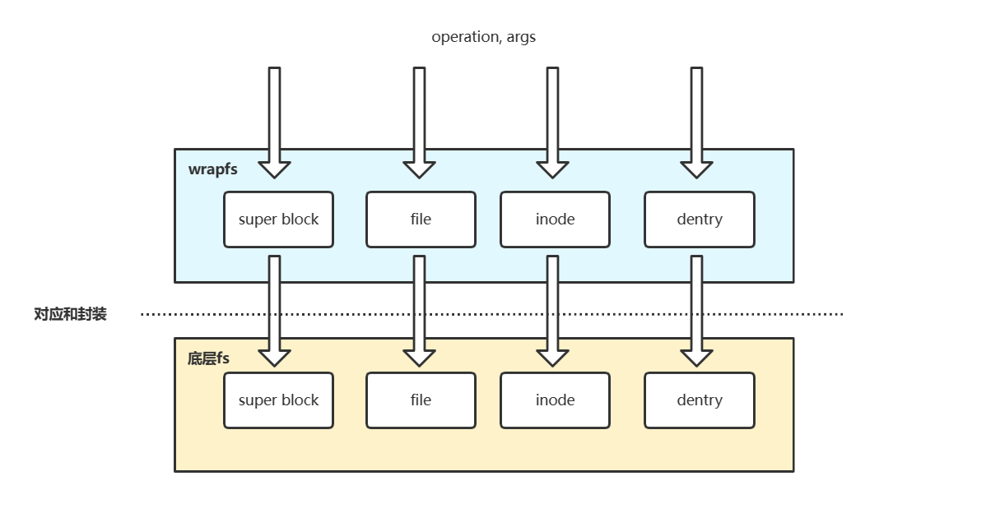
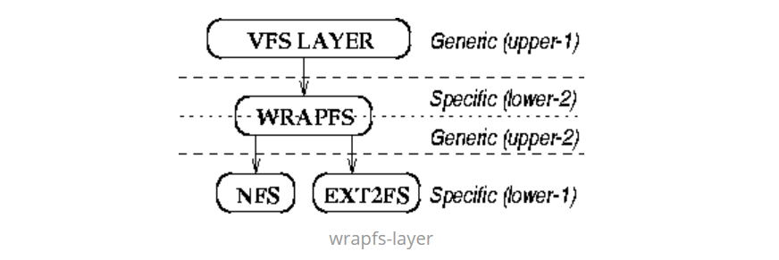

#  wrapfs

## 1.特点概述

- 堆栈式文件系统，参数和操作传递？，wrapfs和底层fs的对象一一对应
- 只考虑内存部分，不考虑IO实现，IO实现依赖底层文件系统
- 小，代码2000行左右，上手容易
- 性能好，是内核文件系统，不会面临fuse的性能问题
- 继承底层文件系统，增加类成员，重写VFS方法，可拓展和定制新功能
- 挂载方法

```shell
mount -t wrapfs [底层文件系统的路径] [挂载点的路径]
```





（补充图片，maybe还要看论文）

## 2.wrapfs代码分析

### **wrapfs.h**

1.1-64行头文件、宏定义和extern其他文件实现的函数

2.四种info结构

接下来66-87行，为file、inode、dentry、super block四种对象维护了info结构体

| 对象类型    | info信息                                                     |
| ----------- | ------------------------------------------------------------ |
| file        | ①对应的底层fs的file对象。②底层fs的vma操作的函数的保留        |
| inode       | ①对应的底层fs的inode对象。②wrapfs中的inode对象               |
| dentry      | ①对应的底层fs的dentry的path对象（里面包含了底层fs的dentry对象）。②保存前者的锁 |
| super block | ①对应的底层fs的super block对象                               |

3.获取info结构体的宏

接下来96-108行，实现给定一个wrapfs的file、inode、dentry、super block对象，返回其info结构体的宏。其中：

①对file、dentry、super block对象，则是将info结构体存入它们的“冗余数据区”，file对象->private_data、dentry对象->d_fsdata、super block对象->s_fs_info。

②对inode对象没有“冗余数据区”，则将利用contain of，得到对应的info结构体。（这就是为什么要把wrapfs的inode对象放进info结构体的原因！）

4.和info结构体维护有关的函数

接下来109-209行：

| 函数                        | 作用                                                                   |
| --------------------------- | ---------------------------------------------------------------------- |
| wrapfs_lower_file           | 获取wrapfs的file对象对应的底层fs的file对象                             |
| wrapfs_set_lower_file       | 为wrapfs的file对象设置对应的底层fs的file对象                           |
| wrapfs_lower_inode          | 获取wrapfs的inode对象对应的底层fs的inode对象                           |
| wrapfs_set_lower_inode      | 为wrapfs的inode对象设置对应的底层fs的inode对象                         |
| wrapfs_lower_super          | 获取wrapfs的sb对象对应的底层fs的sb对象                                 |
| wrapfs_set_lower_super      | 为wrapfs的sb对象设置对应的底层fs的sb对象                               |
| pathcpy                     | 完成path对象的拷贝                                                     |
| wrapfs_get_lower_path       | 获取wrapfs的dentry对象对应的底层fs的path对象，增加对应dentry的引用计数 |
| wrapfs_put_lower_path       | 减少传入的path对象对应的dentry的引用计数                               |
| wrapfs_set_lower_path       | 为wrapfs的dentry对象设置对应的底层fs的path对象                         |
| wrapfs_reset_lower_path     | 将wrapfs的dentry对象对应的底层fs的path对象清空                         |
| wrapfs_put_reset_lower_path | 将wrapfs的dentry对象对应的底层fs的path对象清空并减少dentry的引用计数   |
| lock_parent                 | 传入一个dentry，将父目录的inode锁上，并返回父目录的dentry              |
| unlock_dir                  | 传入一个dentry，将其inode解锁，并将dentry的引用数减一                  |

### **lookup.c**

一些其他工具函数和....的补充。

| 函数                            | 作用                                                         |
| ------------------------------- | ------------------------------------------------------------ |
| wrapfs_init_dentry_cache        | 申请一个dentry cache                                         |
| wrapfs_destroy_dentry_cache     | 销毁一个dentry cache                                         |
| wrapfs_free_dentry_private_data | 在dentry cache中释放dentry的数据fsdata，并置空指针           |
| wrapfs_new_dentry_private_data  | 为dentry的info结构体在dentry cache中申请一段内存，并将指针绑定到dentry的d_fsdata中 |
| wrapfs_inode_test               | 比较wrapfs的inode和底层的inode是否是对应关系                 |
| wrapfs_iget                     | 给定底层fs的inode，找到在wrapfs中对应的inode。①判断底层inode有效性并上锁。②在wrapfs的inode cache中查找和底层inode对应的inode。③不是新建的直接返回。④新建的是上锁的，进行ino、info、i_version、iop、fop、aop、time、size和其他属性设置。⑤unlock并返回inode。 |
| __wrapfs_interpose              | 将传入的底层path对应的wrapfs inode和传入的dentry进行关联，传入超级块进行越界判断。 |
| wrapfs_interpose                | 封装了__wrapfs_interpose。同。                               |
| __wrapfs_lookup                 | 在底层父目录下查找一个是否存在某个dentry。①如果有则绑定inode和low path并返回。②如果没有则生成一个NULL dentry和一个low path绑定。③注：传入的dentry只有filename属性，inode和low path为空。 |
| wrapfs_lookup                   | 封装了__wrapfs_lookup。大致同。                              |

### **dentry.c**

本文件（0-50行）主要是实现操作dentry对象的函数集合struct dentry_operations对象wrapfs_dops。

对于struct dentry_operations对象（参内核函数和结构补充）：

| 重要成员变量             | 解释                             |
| ------------------------ | -------------------------------- |
| int (*d_revalidate)(...) | 用于检查dcache中的dentry是否有效 |
| void (*d_release)(...)   | 用于释放dentry                   |

wrapfs对应的自定义函数如下：

| 函数                | 作用                                                                                        |
| ------------------- | ------------------------------------------------------------------------------------------- |
| wrapfs_d_revalidate | 检查wrapfs的某个dentry是否有效，取决于底层fs的dentry是否有效,调用底层的d_revalidate方法判断 |
| wrapfs_d_release    | 释放wrapfs的dentry（底层fs置空path + 减少引用），释放数据fsdata，置空指针                   |

### ***inode.c**

本文件主要是实现操作inode对象的函数集合struct inode_operations对象。

| 函数          | 作用                                                   |
| ------------- | ------------------------------------------------------ |
| wrapfs_create | 分别完成底层和wrapfs层的inode创建、dentry和inode的绑定 |
|               |                                                        |
|               |                                                        |
|               |                                                        |
|               |                                                        |
|               |                                                        |

### **file.c**

本文件主要是实现操作file对象的函数集合struct file_operations。

wrapfs的struct file_operations的实现基本是：通过wrapfs的结构，然后获取绑定的底层fs的结构，然后调用VFS提供的API或者底层fs的struct file_operations方法，做了一层封装。

注意，调用VFS提供的API，例如vfs_read(struct file *file,...)，其最终还是借助file->f_op->read()实现。调用vfs_read()时，由于传入的是底层file，因此间接的是调用了底层fs的struct file_operations方法。

这里暂时不做全部函数的详细分析，仅列举几个重要的函数，其他函数后续项目hook时有用到再做进一步研究。

| 函数                | 作用                                                         |
| ------------------- | ------------------------------------------------------------ |
| wrapfs_read         | wrapfs读取file数据的方法。①获取底层file。②调用vfs_read读底层file。③更新wrapfs file对应inode的atime。 |
| wrapfs_write        | wrapfs写file的方法。①获取底层file。②调用vfs_write写底层file。③更新wrapfs file对应inode的size和所有time属性。 |
| wrapfs_mmap         | wrapsfs的mmap。①异常处理。②调用底层file的mmap。③设置wrapfs file的aop，同时vma_op被替换为wrapfs的，原先底层fs的被save到wrapfs file info。 |
| wrapfs_open         | 打开文件时，wrapfs file的初始化操作。①异常处理：文件被删了，底层fs没对应。②通过low path打开文件，获取low file。③将low file和wrapfs file绑定即是初始化wrapfs file。④最后复制一下inode属性 |
| wrapfs_file_release | 关闭文件时，wrapfs file的释放操作。①取消wrapfs file和lower file绑定。②减少low file引用。③释放file info。 |

### **super.c**

本文件主要是实现操作super block对象的函数集合struct super_operations对象wrapfs_sops，和为了支持NFS而实现的struct export_operations对象wrapfs_export_ops。具体结构参考kernel.md。

| 函数                       | 作用                                                                                                               |
| -------------------------- | ------------------------------------------------------------------------------------------------------------------ |
| wrapfs_put_super           | 释放wrapfs sb，和底层sb剥离开。①置空wrapfs sb的info。②减少底层sb引用。③释放wrapfs sb的数据区并置空              |
| wrapfs_statfs              | 获取文件系统统计信息。①wrapfs dentry获得底层fs的path。②根据底层fs的path借助vfs_statfs实现返回到buf中。           |
| wrapfs_remount_fs          | wrapfs不支持remount                                                                                                |
| wrapfs_evict_inode         | inode引用计数为0时执行的清空、删除inode操作。①清空删除wrapfs的inode。②和底层inode进行剥离，减少底层引用计数。    |
| wrapfs_alloc_inode         | 申请一个wrapfs inode。①从wrapfs的inode cahce中申请一个内存对象。②设置wrapfs inode的i_version为1并返回。          |
| wrapfs_destroy_inode       | 删除一个wrapfs inode。直接在inode cache中释放该内存对象                                                            |
| wrapfs_umount_begin        | 获取底层sb，调用其umount_begin，NFS用到                                                                            |
| init_once                  | kmem_cache的对象构造器，对申请的每个对象的vfs_inode都进行inode初始化                                               |
| wrapfs_init_inode_cache    | 申请一个inode cache                                                                                                |
| wrapfs_destroy_inode_cache | 销毁一个inode cache                                                                                                |
| wrapfs_nfs_get_inode       | wrapfs根据ino和igen查找inode的方法。①获取底层sb。②由ino和底层sb获取底层inode。③由底层inode得到wrapfs对应inode。 |
| wrapfs_fh_to_dentry        | 解析fh得到自己的dentry。调用通用的解析方法                                                                         |
| wrapfs_fh_to_parent        | 解析fh得到parent的dentry。调用通用的解析方法                                                                       |

### **mmap.c**

本文件主要是实现操作虚拟内存区域(vm)的函数集合struct vm_operations_struct对象wrapfs_vm_ops，和实现操作address_space对象的struct address_space_operations对象wrapfs_aops。（参考VFS接口）

在本文件中，主要函数如下：

| 函数                | 解释                                                                                |
| ------------------- | ----------------------------------------------------------------------------------- |
| wrapfs_fault        | wrapfs的fault方法，获取底层fs的vm、file、vm_op，通过底层fs的fault实现               |
| wrapfs_page_mkwrite | wrapfs的page_mkwrite方法，获取底层fs的vm、file、vm_op，通过底层fs的page_mkwrite实现 |

### **main.c**

main.c是wrapfs的主函数逻辑，是一个内核模块。

声明了一个文件系统对象。（详细看内核函数和结构补充）

| 重要成员变量                 | 解释                                           |
| ---------------------------- | ---------------------------------------------- |
| const char *name             | 文件系统的名称，例如"wrapfs"                   |
| fs_flags                     | 文件系统的标识，例如FS_REQUIRES_DEV等          |
| struct module *owner         | 文件系统所属的内核模块，通常为THIS_MODULE      |
| struct dentry *(*mount)(...) | 文件系统挂载函数的指针，在mount -t ...时会调用 |
| void (*kill_sb)(...)         | 关闭文件系统实例时，释放超级块函数的指针       |

主要的函数如下：

| 函数              | 作用                                                                                                                                                                                                                                                                                                                                                                                                                                                       |
| ----------------- | ---------------------------------------------------------------------------------------------------------------------------------------------------------------------------------------------------------------------------------------------------------------------------------------------------------------------------------------------------------------------------------------------------------------------------------------------------------- |
| wrapfs_read_super | 需要向mount_nodev函数提供的填充超级块的回调函数。**①**底层fs的路径名通过传参传入。**②**以此获得底层fs的path对象、超级块对象，并绑定到wrapfs的sb info结构体中且增加该超级块对象的引用计数。**③**设置wrapfs的sb对象的参数。文件最大大小、时间粒度、超级块op、拓展属性和导出op。**④**设置root_dentry。申请inode，设置为root inode，绑定得到root dentry，设置root dentry的dentry op集合，将wrapfs的root dentry和底层fs的path绑定。 |
| wrapfs_mount      | 文件系统对象的mount函数。借助mount_nodev的方式实现。                                                                                                                                                                                                                                                                                                                                                                                                       |
| init_wrapfs_fs    | 内核模块的init函数。①申请inode cache。②申请dentry cache。③注册wrapfs文件系统。                                                                                                                                                                                                                                                                                                                                                                          |
| exit_wrapfs_fs    | 内核模块的exit函数。①销毁inode cache。②销毁dentry cache。③注销wrapfs文件系统。                                                                                                                                                                                                                                                                                                                                                                          |

## 3.待解决

超级块的拓展属性

大头：inode.c
