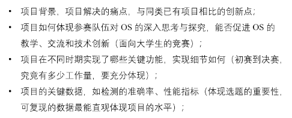

# 2023-2-25-功能赛道分享会

### 于伯淳：
> 赛前互相沟通，规划好时间\
> 可以去调研别人的一些想法\
> 最好统一工作环境\
> 选题要参考老师意见\
> 预留时间进行测试\
> 关于文档答辩：\

### 李诗逸老师：
> 1.需要至少1个创新点\
> 2.前面进度抓紧一点，提交不要踩点\
> 3.队长统筹好全局，队员处理好模块的接口等\
> 4.和本校老师、出题者（企业）进行沟通，确认清楚题目内容\
> 5.平时多写一点文档\
> 研究方向偏向于可靠性\
> 决赛要和初赛有不一样的地方

### 黄浩学长：
> 明确赛题细节，选老师熟悉的赛题\
> 设置阶段性ddl\
> 初赛注重于文档，决赛注重于答辩和文档\
> 留下过程产出\
> 不要全部人一起调研，可分出人搭环境等\
> 多进行存档

### 关于ebpf
> 做一些与系统相关的内容\
> 做一些有深度的东西，不建议做一些没什么深度的内容（比如扩展ebpf库）